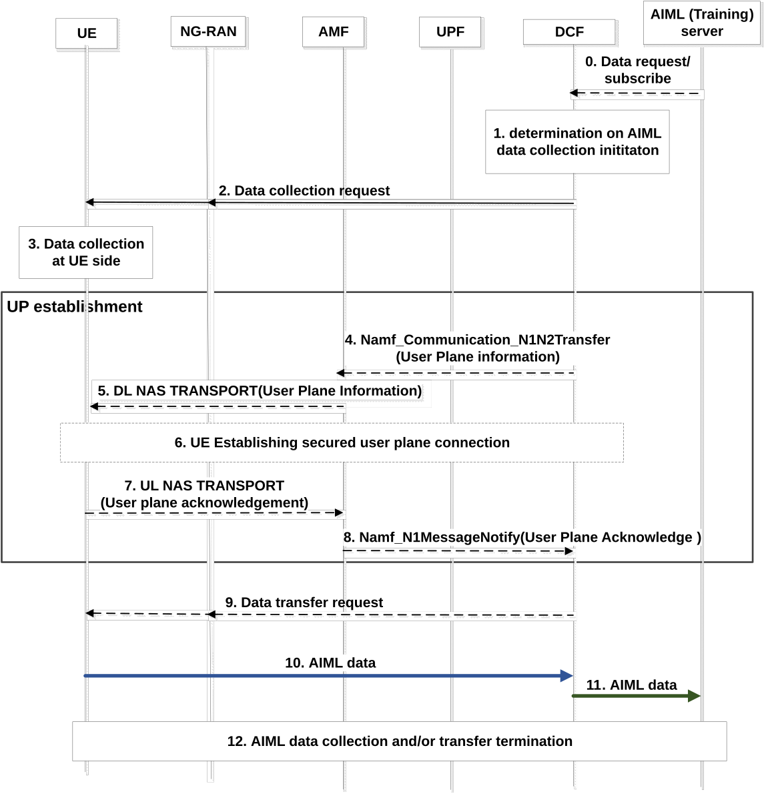
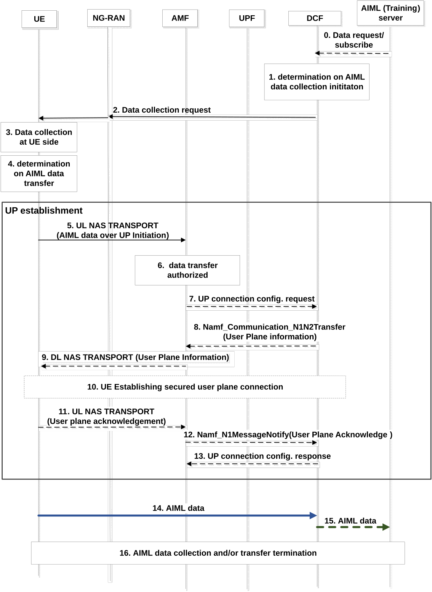

# 6.16 Solution \#16: Support of standardized data over UP for NR air interface operation with UE-side model training

## 6.16.1 High level principles

This contribution provides end-to-end solution to support the standardized data over UP for UE-side model training.

\- A new 5GC NF, DCF (data collection function), is introduced to support UE-side data transfer to AIML model training.

\- The data collection at UE side might be triggered by AIML training server or DCF's internal logic.

\- UP connection between UE and DCF might be established due to the trigger from either DCF or the UE that is to transfer the AIML data.

\- The UPF routes the AIML data to DCF and differentiate from other UE regular traffic in the 5GC based on the (destination) IP address of the AIML data packets via UP connection.

\- The DCF may exposure part of AIML data to the AIML server that requires the UE-side AIML for model training, e.g. based on user consent and privacy.

## 6.16.2 Description

This solution aims to address the issues in WT#1: whether and how to support the standardized transfer of standardized data over UP for UE data collection to meet requirements for AI/ML for NR air interface operation with UE-side model training.

As requested by RAN, SA WG2 is expected to study the transfer of data over UP for Option 2. The data transfer path of Option 2: UE-\> CN -\> Server for data collection for UE-side model training/OTT server. In general, the UP data is transferred from the UE to the target DN or application via UPF. To support Option 2, this solution proposes to transfer AIML data from UE to the 5GC NF that hosts the AIML data collection management functionality (e.g. DCF, Data Collection Function) via UP connection; then the DCF notifies/transfers the data to the AIML server for model training. This solution can provide AIML data visibility and controllability as required by RAN. The UPF may detect or differentiate AIML data from other regular UE traffic based on the DCF address carried by the AIML data packet.

NOTE: further coordination with RAN WGs is needed to check the required visibility level of AIML data, e.g. fully or partial visibility.

## 6.16.3 Procedures

### 6.16.3.1 Procedures of DCF initiated UP connection for data transfer

Figure 6.16.3.1-1: UE side AIML date transfer via a User Plane Connection between UE and DCF initiated by DCF

The DCF (data collection function) may trigger the user plane connection establishment for UE side AIML data transfer, e.g. after receiving AIML data collection request from AIML (training) server or based its internal logic, if target the UE does not have user plane connection with the corresponding DCF. The DCF may subscribe to the AMF for the status of the user plane connection for the target UE.

Figure 6.16.2.1-1 shows the procedures of DCF initiated UP connection for AIML UE side data transfer for AIML model training.

0\. \[Optional\] The UE model training entity server may determine to request UE side data for AIML model training by sending request to or subscribe to DCF, optionally with a list of target UEs.

1\. The DCF determines to request the UE side data for AIML model training purpose. This step might be triggered by the request from AIML server or DCF internal logic. The DCF checks the user consent to determine whether the data collection request can be complied or not.

2\. DCF triggers data collection request towards the target UEs, e.g. the DCF sends data collection request via AMF, the AMF forwards the request to UE and/or NG-RAN.

NOTE 1: The interaction between RAN node and UE for radio measurement configuration and action is in RAN scope.

3\. UE performs data collection for AIML model training based on the request and configuration from network.

4\. \[Conditional\] If there is no established secure user plane connection between the UE and DCF, the DCF invokes Namf_communication_N1N2MessageTransfer service operation to send its user plane information to AMF in a NAS container to indicate UE to utilize user plane for AIML data transfer.

The user plane information includes the user plane address of DCF (e.g. IP address or FQDN).

DCF may also may allocate an AIML data collection binding/correlation ID to associate the user plane connection to be established with the target UE identify (SUPI and/or GPSI). The DCF may include this ID in the user plane information.

The target UE identify (SUPI and/or GPSI) might be indicated to the AMF by DCF in step 2.

5\. \[Conditional\] When AMF receives the user plane information, AMF sends it to the target UE via a DL NAS TRANSPORT message by including the information in step 5.

6\. \[Conditional\] If there is no established applicable PDU session for the user plane AIML data transfer, the UE uses the URSP as defined in TS 23.503 \[4\] which includes user plane AIML data transfer related PDU session parameters, e.g. a dedicated DNN, time window, S-NSSAI, location, etc. to establish the PDU session for user plane AIML data transfer. Existing URSP is reused to establish dedicated PDU session, e.g. by using specific Traffic Descriptor for the application and Route Selection Descriptor for UE AIML data transfer.

7-8. \[Conditional\] UE sends an acknowledgement to the DCF through AMF to indicate a success of user plane connection establishment for AIML data transfer via UP or a failure to utilize the user plane connection.

9\. \[Optional\] Data transfer request to target UE(s). If the UE data transfer is triggered towards gNB, the gNB may initiated UE data transfer request to UE based on the information indicated by DCF, e.g. the time window for AIML data transfer.

NOTE 2: How the gNB initiates data transfer towards UEs is in RAN scope.

Alternatively, the DCF may trigger the data transfer towards UE via the UP connection. Then the UE may interact with gNB for radio configuration.

NOTE 3: The interaction between RAN node and UE is in RAN scope.

10\. AIML UE side data transfer for AIML model training from UE to DCF via the established UP connection with the assigned AIML data collection binding/correlation ID.

The UPF detects or differentiates the AIML data from other regular UE data based on the source/destination IP address of the data packets, by reusing the traffic detection mechanism defined in TS 23.501 \[2\]. The destination IP address of the AIML data packets is the IP address of the DCF. Different charging policies might be applied to the AIML data.

11\. DCF notifies the AIML UE side data for AIML model training to the AIML server.

The DCF may filtered the data to be transferred to the AIML server based on user consent and subject to operators' policies.

The DCF may determine to store the UE data in ADRF.

12\. Data collection and/or transfer termination. The termination might be decided by the AIML server, the target UE or DCF.

### 6.16.3.2 Procedures of UE initiated UP connection for data transfer

Figure 6.16.3.2-1: UE side AIML date transfer via a User Plane Connection between UE and DCF initiated by UE

UE may trigger the user plane connection establishment for UE side AIML data transfer, if the UE does not have user plane connection with DCF. Figure 6.16.3.2-1 shows the procedure of UE side AIML date transfer via a User Plane Connection between UE and DCF initiated by UE.

0\. \[Optional\] The AIML (model training) server may determine to request UE side data for AIML model training by sending request to or subscribe to DCF.

1\. The DCF determines to request the UE side data for AIML model training purpose. This step might be triggered by the request from AIML server or DCF internal logic. The DCF checks the user consent to determine whether the data collection request can be complied or not.

2\. DCF sends data collection request to the target UE, e.g. via AMF or NG-RAN. The DCF may optionally indicate its user plane information to the UE.

3\. The target UE performs data collection for AIML model training based on the request from network.

4\. The UE may determine to trigger data transfer based on network configuration, e.g. UE logged data is full, configured data transfer time is reached, etc.

5\. UE sends a user plane connection establishment request to AMF via NAS Message with the indication of AIML data transfer via UP, if there is no established secure user plane connection between the UE and DCF.

6\. \[Conditional\] if the UE is authorized based on UE Subscription to use the user plane AIML data transfer, AMF to establish a user plane session for the UE.

If the DCF indicate its address in step 2, the UE may indicate the DCF address to AMF in step 6.

7\. Establishment of UP connection for AIML data transfer.

8\. \[Conditional\] If DCF accepts to utilize user plane for AIML data transfer and there is no established secure user plane connection between the UE and DCF, DCF sends a user plane information to AMF to indicate the UE request is accepted.

The user plane information includes the user plane address of DCF (e.g. IP address or FQDN).

DCF may also may allocate an AIML data collection binding/correlation ID to associate the user plane connection to be established with the target UE identify (SUPI and/or GPSI). The DCF may include this ID in the user plane information.

9\. \[Conditional\] When AMF receives the user plane information from DCF, AMF forwards it to UE via a DL NAS TRANSPORT message by including the information in step 8.

10\. \[Conditional\] If there is no established applicable PDU session for the user plane AIML data transfer, the UE uses the URSP as defined in TS 23.503 \[4\] which includes user plane AIML data transfer related PDU session parameters, e.g. a dedicated DNN, time window, S-NSSAI, location, etc. to establish the PDU session for user plane AIML data transfer.

11 - 12. UE sends an acknowledgement to the DCF through AMF to indicate a success of user plane connection establishment for AIML data transfer via UP or a failure to utilize the user plane connection.

13\. DCF responds to AMF that user plane connection between the UE and DCF has been established.

Steps 14 - 17 are the same as steps 10 -12 in Figure 6.16.3.1-1.

## 6.16.4 Impacts on services, entities and interfaces

**DCF (data collection function):**

\- Support UE side data collection for AIML model training, including initiating and termination the data collection and transfer, establishing and configuring the UP connection, notifying the AIML data to AIML server.

**AMF:**

\- Establish UP connection between UE and DCF for AIML data transfer.

**UPF:**

\- Detect, or differentiate, AIML data from other regular UE traffic.

**UDM:**

\- Store UE subscription data used for authorizing UE-collected AIML data transfer over UP.
