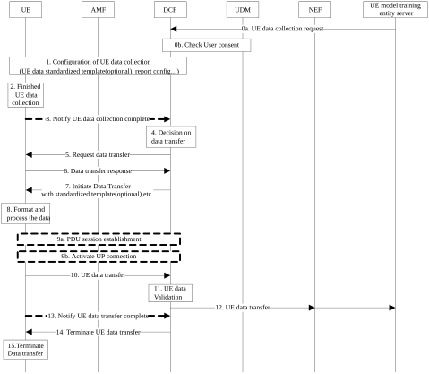

# 6.17 Solution \#17: Data transfer over UP connection for UE data collection

## 6.17.1 High level principles

The high level principles of the proposed solution are as follows:

\- The proposed solution focuses on UE data transfer rather than UE data collection.

\- A dedicated Data Collection Function standardizes the data to be transferred to UE model training entity server and fully controls the whole transferring process.

\- It can be UE side or NF side to trigger the request of UE data transfer.

\- User consent information should be stored in the UDM for the NF to check whether the UE data transfer is permitted.

\- Dedicated UP session is needed for UE data transfer for the sake of differentiation from normal UP data.

## 6.17.2 Description

This solution addresses Key Issue#1.

The proposed solution focuses on UE training data transfer procedure and introduces the new Data Collection Function (DCF). To standardize the data to be transfer, a data standardized template can be provided to the UE from the DCF or locally configured at the UE. DCF fully controls the initiation and termination of the data transfer (ie. When to initiate and terminate the data transfer), though the request to initiate and terminate the UE data transfer can be triggered either by the UE or by the network. A dedicated UP session will be established or activated based on the existing PDU session for the UE data transfer.

There can be related parameters and data format in the standardized template from DCF. With the data standardized template, UE may further format and process the collected data before transfer to DCF.

## 6.17.3 Procedures

Figure 6.17.3-1: Data transfer over UP connection for UE data collection

Editor's note: The protocol between the DCF and UE for the UE data collection is FFS and may need to be cooperated with CT WG1.

**Preconditions:**

0a. The UE model training entity server assumed outside of core network requests UE data collection to DCF through NEF by invoking Nnef_EventExposure service operation with dedicated eventID. The request may include target UE(s), AoI, etc.

The steps of figure 6.17.3-1 are described as follows:

0b. DCF may resolve from AMF the target UE(s) into a list of SUPI and request UDM for user consent information using Nudm_SDM_Get based on UE's subscription for each SUPI.

1\. The DCF sends the configuration information for UE data collection towards AMF by invoking Namf_Communication_N1N2Transfer service operation. The AMF forwards the configuration information to the UE via DL NAS message. The configuration information might include UE data standardized template (e.g. request data parameters) that can instruct the UE how to format process the collected data to be transferred, report config indicates the UE whether to report the completement of data collection and data transfer, and DCF’s address (e.g. IP address or FQDN).

2\. The UE receives the request of data collection from DCF and performs the UE data collection.

Based on the configuration of UE data collection, the UE data transfer can be triggered by the UE or by core network.

For UE trigger case, step 3 is executed, for network trigger case, step 4 is executed.

3\. After UE finishes the data collection, to notify DCF that the UE data collection is completed, the UE sends UE DATA COLLECTION COMPLETE message via UL NAS TRANSPORT message to the AMF, the AMF forwards it to DCF using Namf_Communication_N1MessageNotify service operation.

4\. DCF makes the decision on data transfer based on the configuration of step 1, UE subscription and operator's policy.

5\. DCF sends the UE the request of UE data transfer through AMF by invoking Namf_Communication_N1N2Transfer service operation.

6\. The UE responds the request of UE data transfer based on its status (e.g. whether the UE is ready for data transfer).

7\. If it is the UE to trigger the data transfer, or the UE is ready to perform the data transfer, DCF initiates the UE data transfer with UE data standardized template optionally.

8\. There can be request parameters of UE collected data in the configuration information received from DCF. The UE can format or process the UE collected data as per the request parameters.

9a. If there is no existing dedicated PDU session can be used to transfer the collected data, the UE performs PDU session establishment. The UE can use the address information received in the configuration information from DCF to find the target DCF and perform PDU session establishment.

9b. If the existing PDU session with UP connection deactivated can be reused to transfer the collected data, the UE activates the UP connection with DCF.

10\. The UE transfer the standardized UE data via UP connection to DCF.

11\. DCF validates the received UE data as per the request parameters in the configuration message.

12\. DCF further forwards the UE data to UE model training entity server via NEF.

13\. \[Optional\] Based on the configuration of UE data collection, if the UE has forward DCF all the collected data, the UE may notify DCF that the data transfer is complete with UE DATA TRANSFER COMPLETE message via UL NAS TRANSPORT message to the AMF, the AMF forwards it to DCF using Namf_Communication_N1MessageNotify service operation.

14\. If DCF finds that the received data is enough for model training, or it is not appropriate to transfer the data due to bad network status received from NWDAF via Nnwdaf_AnalyticsInfo service operation, or DCF receives the notification from the UE in step 13, DCF sends UE the request to terminate data transfer.

15\. The UE terminates the data transfer and deletes the collected data stored in the UE. The UP connection between the UE and DCF might be deactivated.

## 6.17.4 Impacts on services, entities and interfaces

**DCF:**

\- Provides standardized UE data template to the UE.

\- Checks user consent before initiates the data transfer.

\- Initiates and terminates UE data transfer.

\- Validates the received UE training data based on the standardized UE data template.

\- Forwards the received UE data to UE model training entity server.

**UE:**

\- Establishes a new dedicated session with DCF or activates the UP connection of the existing session with DCF.

\- Notifies DCF the completion of UE data collection based on the configuration of data collection.

\- Standardizes the collected data and transfer the standardized UE data contents to DCF.
