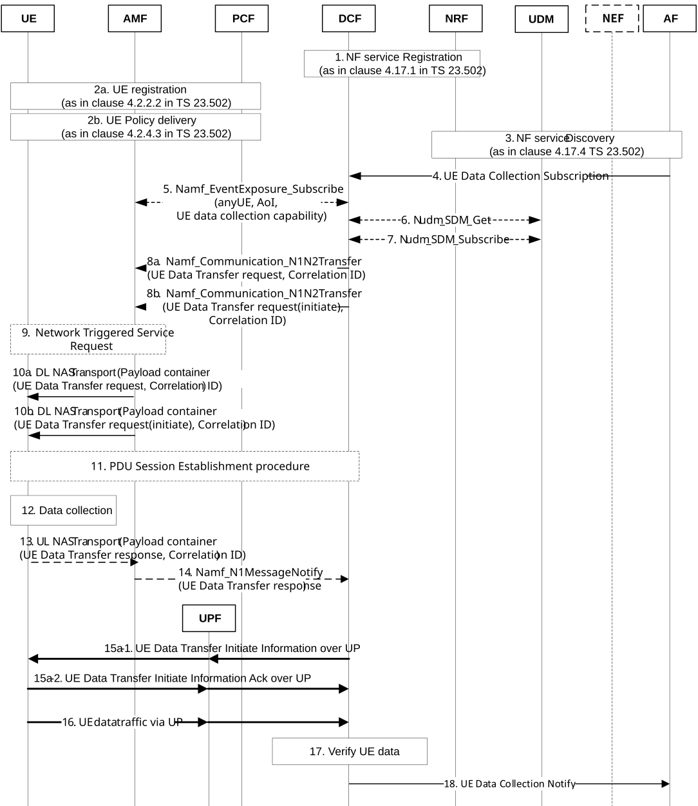
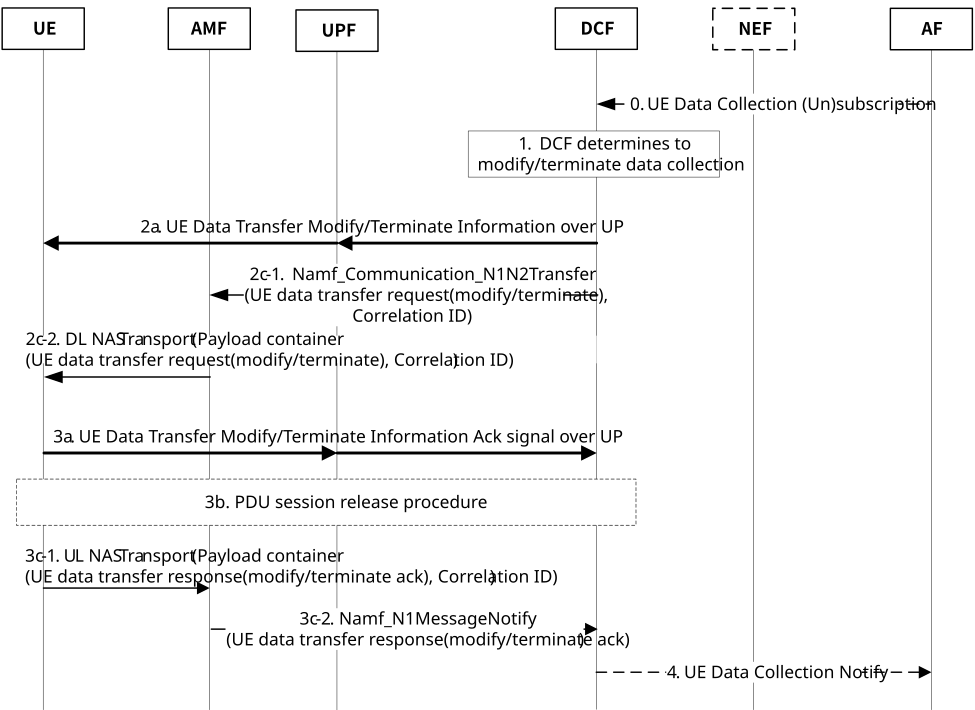

# 6.18 Solution \#18: General Framework for UE Data Collection over UP

## 6.18.1 High level principles

High level principles of the solution are:

\- Data Collection Function (DCF) controls and manages standardized UE data collection for UE-side model training. It performs the following functions:

\- Registers to NRF with 'UE Data Exposure' service.

\- Provides the UE with 'UE Data Transfer' request via NAS signalling. The 'UE Data Transfer' request contains UP information and data collection parameters.

\- Collects standardized UE data over the user plane (UP).

\- Receives UE data subscription request from the AF, i.e. UE model training entity server. The UE data subscription request contains data exposure parameters.

\- Verifies and transfers the collected data to the AF, i.e. UE model training entity server.

\- The URSP is used to configure how to select the route for standardized UE data collection, such as determining the associated DNN, S-NSSAI and/or PDU Session type to be used for 'UE Data Collection' traffic.

\- The UE registers with the 'UE Data Collection' capability, allowing the AMF to identify UEs with this capability satisfying filter info (e.g. in a specified Area of Interest (AoI)).

\- The UE establishes a PDU Session to the specified DNN and S-NSSAI that can be used for standardized UE data collection

\- The destination address of the 'UE Data Collection' traffic is the DCF address.

\- The NRF is used for the discovery of the DCF that provides 'UE Data Exposure' service.

## 6.18.2 Description

This solution is for Key Issue#1 for UE data collection over UP.

The following terminologies are used specifically in the context of this solution.

\- UE model training entity *server* is a trusted AF or untrusted AF that performs UE-side model training using *'UE Data Collection' data*.

\- *'UE Data Exposure' service* is a 5G core network service provided to the AF, i.e. the UE model training entity server.

\- *'UE Data Collection' data* refers to data collected at the UE and provided to the AF, i.e. the UE model training entity server. This data is received by the DCF and may be verified and aggregated before being delivered to the AF, i.e. the UE model training entity server.

\- *Data Collection Function (DCF)* is a 5GC network function (NF) that controls and manages UE data collection for UE-side model training.

Editor's note: Whether the DCF is a new NF or the existing one (e.g. NWDAF) is FFS.

\- *'UE Data* Transfer*' messages* are exchanged between the UE and the DCF to manage data collection over the User Plane. These include the *'UE Data* Transfer*' request* and *'UE Data* Transfer*' response* messages.

\- *The 'UE Data* Transfer*' request* is a message sent by the DCF to the UE, over NAS or UP signalling, to initiate, terminate or modify data transfer for UE-side model training. It may include *UP information, and/or information to initiate, modify or terminate the data transfer,* and/or *data collection parameters.*

\- *The 'UE Data* Transfer*' response* is a message sent by the UE to the DCF to acknowledge the corresponding request.

\- The *Correlation ID* is a unique identifier used for routing 'UE Data Transfer' messages across the UE, AMF and DCF. It is used by the AMF to route these messages appropriately. The Correlation ID consists of a DCF ID and a connection ID, allowing support for multiple DCFs. The correlation ID is allocated by the DCF.

\- *'UE Data Collection' traffic* refers to one or more data packets transmitted from the UE, which are intended to be used for UE-side model training.

\- *'UE Data Collection' capability* indicates that the UE is capable of collecting and transmitting 'UE Data Collection' traffic. It may be included in the registration request message. 'UE Data Collection' capability may be specified for each Data context ID.

\- *UP information* is used by the UE to generate and transmit 'UE Data Collection' traffic packets. It includes port number and the IP address or FQDN of the DCF.

\- *Data collection parameters* define the data to be collected and transmitted as 'UE Data Collection' traffic by the UE. The *data collection parameters* include Service type (e.g. AI/ML for NR air interface operation), Data context ID(s), number of data samples and/or time window and optional Sub case info. The Data context ID identifies the use case for which the required data is used for, e.g. Beam management, CSI prediction, Positioning. The Sub case info identifies the specified sub-case for a specific Data Context ID, e.g. when Data context ID is Positioning, the Sub case info can be AI-assisted/direct positioning. Data context ID and optional Sub case info are used to determine what data should be collected.

\- *Data exposure parameters* define the UE data to be exposed to the AF. The *data exposure parameters* include Data context ID(s), optional Sub case Info, Target of Data Collection (a list of UEs, or Group IDs, any UE, or TAC(s)), Filter info (e.g. AoI(s)), number of data samples and/or time window.

This solution refers to the user plane connection establishment described in clause 6.18.1 of TS 23.273 \[6\] and in clause 6.2.1 of TS 24.572 \[7\].

The following behaviours are described in this Solution.

\- The DCF controls and manages UE data collection for UE-side model training.

\- The DCF registers to NRF with 'UE Data Exposure' service.

\- The DCF is provisioned by the AF with target UEs and the data collection parameters. The target UE may be a specific UE, a list of UEs, or any UEs located in one or more Areas of Interest (AoIs). The data collection parameters include Data context ID(s), optional Sub case Info, Target of Data Collection (a list of UEs, or Group IDs, any UE, or TAC(s)), Filter info (e.g. AoI(s)), number of data samples and/or time window.

\- The DCF may resolve the list of UEs by querying the AMF to obtain UEs with the 'UE Data Collection' capability satisfying the filter info in *data exposure parameters* (e.g. located in the specified AoIs).

\- The DCF checks user consent, with the assistance of the UDM, for the provision of 'UE data collection' data to UE model training entity server.

\- The DCF provides the UE with UP information and data collection parameters over NAS signalling. The UP information includes the DCF's address or FQDN for receiving 'UE Data Collection' traffic and the data collection parameters include Data context ID(s), optional Sub case info, number of data samples and/or time window.

\- The UE registers with the 'UE Data Collection' capability and the AMF manages UEs that support this capability.

\- The PCF provides the UE with URSP rules that include route selection descriptors for 'UE Data Collection' traffic towards the DCF.

\- The UE establishes a PDU Session that can be used for standardized UE data collection.

\- The destination address of the UE Data Collection packet corresponds to the DCF address as provided in the UP information.

\- The UPF forwards the UE Data Collection packet from the UE to the DCF.

\- The UDM stores the user's consent regarding UE data collection for UE-side model training.

\- The DCF checks the integrity of data received from the UE and verifies it before sending a notification to the AF, i.e. the UE model training entity server. If required, the DCF may aggregate one or more 'UE Data Collection' packets received from the UE for efficient delivery of notification to the AF.

\- The verification shall include, but is not limited to, checking the Data Context ID, the number of data samples, the timestamps and the sequence numbers.

\- If the verification fails, the received data shall be considered invalid. The handling of invalid data is operator-configurable (e.g. the DCF may discard the data, request re-transmission, or store it for offline analysis).

\- UEs that repeatedly provide invalid data may, as per operator policy, be added to a list of UEs barred from UE Data Collection Transfer, maintained by the DCF. The DCF may exclude UEs on this list when selecting UEs for UE Data Collection Transfer.

The 'UE Data Collection' traffic can be differentiated from the regular UE traffic by the UPF:

\- If the URSP specifies a dedicated DNN or S-NSSAI for 'UE Data Collection' traffic, the traffic is carried in a specific PDU Session designated for 'UE Data Collection'.

\- If the URSP does not specify a dedicated DNN or S-NSSAI, the 'UE Data Collection' traffic can be detected by the UPF using a Packet Detection Rule (PDR) that matches the destination address corresponding to the DCF.

## 6.18.3 Procedures

### 6.18.3.1 Initiation of UE data collection transfer

Figure 6.18.3.1-1: Initiation of UE Data Collection over the User Plane

1\. The DCF registers 'UE Data Exposure service with the NRF as described in clause 4.17.1 of TS 23.502 \[3\].

2a. The UE follows the registration procedure defined in clause 4.2.2.2 of TS 23.502 \[3\], indicating support for the 'UE Data Collection' capability. 'UE Data Collection' capability may be specified for each Data context ID.

2b. The PCF provides the UE with URSP rules that include route selection descriptors, such as DNN, S-NSSAI and/or PDU session type, for 'UE Data Collection' traffic as described in clause 4.2.4.3 of TS 23.502 \[3\].

3\. Trusted AF, i.e. a UE model training entity server, discovers the DCF that provides 'UE Data Exposure' service as described in clause 4.17.4 of TS 23.502 \[3\]. For an untrusted AF's request for 'UE Data Exposure' service, the request is authorized by the NEF, which then discovers the DCF.

4\. The AF or NEF requests subscription to the 'UE Data Exposure' service, which may include input parameters such as Data context ID(s), optional Sub case Info, Target of Data Collection (a list of UEs, or Group IDs, any UE, or TAC(s)), Filter info (e.g. AoI(s)), number of data samples and/or time window. If DCF doesn’t have the required UE data, it may trigger UE data collection procedure as following steps show. Otherwise, step 5-16 can be skipped, and DCF can provide the required UE data immediately.

5\. Optional, if no UE list is provided in step 4, DCF determines the UE list for data collection with assistance of the UDM and AMF. The DCF may retrieve a list of UEs satisfying the filter info received in step 4 (e.g. retrieve a list of UE located in the specified AoI(s), if one or more AoIs are provided in step 4, retrieve a list of UE corresponding to the TAC(s) from UDM). If the AoIs span multiple AMFs, the DCF may retrieve the UE lists with 'UE Data Collection' capability from each corresponding AMF. The DCF may provide event ID of "UEs in/out area of interest" with corresponding filters, such as "UE Data Collection Capability", "PEI " or "TAC", "UE CM State", "number of UEs", etc. The AMF may also check other requirements for selected UE, e.g. ensuring that the selected UEs do not have an established PDU session for emergency service.

6\. The DCF may check user consent by retrieving subscription data from the UDM.

7\. The DCF may subscribe to notifications about changes in user consent for consented UE.

8\. The DCF may decide the number of UEs based on the data collection requirements, e.g. the number of samples, Data context ID(s), time window. If multiple AMFs are involved, the DCF may decide the number of UEs per AMF based on, e.g. the proportion of AoIs served by the AMF.

The DCF sends a 'UE Data Transfer' request with initiation to the UE along with a correlation ID, which is allocated by the DCF. The request may include UP information and data collection parameters. The UP information may contain the port number and IP address or FQDN of the DCF to be used by the UE for data transfer over User Plane. Data collection parameters may include Data context ID(s), optional Sub case Info, number of data samples and/or time window. The AMF stores the correlation ID for subsequent routing of 'UE Data Transfer' messages.

If AMF determines that the required UE is not suitable for UE data collection, e.g. the UE has an established PDU session for emergency services, AMF may exclude the UE from UE list for UE data collection.

8a. (Alternative to step 8b) This is the case where the initiation information is sent later in step 15a-1.

8b. (Alternative to step 8a) This is the case where the initiation information is sent over NAS.

9\. The AMF may trigger a Service Request procedure for a UE in CM-IDLE state.

Editor's note: Whether data collection from UEs in idle state is required would need to be checked with RAN

10\. The AMF forwards the 'UE Data Transfer' request and the correlation ID via DL NAS Transport message.

10a. (Alternative to step 10b) This is the case where the initiation information is sent later in step 15a-1.

10b. (Alternative to step 10a) This is the case where the initiation information is sent over NAS.

11\. The UE may establish a PDU Session if no UP connection is available for 'UE Data Collection'. The UE may use the URSP rules to determine the parameters for PDU Session establishment. The SMF configures Forwarding Action Rules (FARs) for the PDU Session.

12\. The UE starts collecting data according to the request from the DCF.

13\. The UE may send 'UE Data Transfer' response and the correlation ID via UL NAS Transport message.

14\. The AMF may forward the 'UE Data Transfer' response to the DCF.

15a-1. The DCF sends 'UE Data Transfer' initiation information to UE over the UP. The 'UE Data Transfer' initiation information may include data collection parameters if it is not sent in step 8. Data collection parameters may include the Service type, Data context ID(s), number of data samples and/or time window.

15a-2. The UE sends ack to 'UE Data Transfer' initiation information to DCF over UP.

16\. The UE sends the collected data over the UP connection to the target DCF address. The UPF forwards the data traffic from the UE to the DCF based on the configured FARs.

17\. The DCF checks the integrity of data received from the UE and verifies that it conforms to the parameters, e.g. Data context ID, specified in the request. If required, the DCF may aggregate one or more 'UE Data Collection' packets received from UE.

18\. The DCF sends a notification to the AF, i.e. the UE model training entity server, containing the collected data. In the case of an untrusted AF, i.e. a UE model training entity server, the DCF provides the collected data to the UE model training entity server (i.e. the untrusted AF) through the NEF.

### 6.18.3.2 Modification and Termination of UE data collection transfer

Figure 6.18.3.2-1: Termination of UE Data Collection over the User Plane

0\. The AF or NEF may request (un)subscription to the 'UE Data Transfer' service.

1\. The DCF may determine that the 'UE data transfer' needs to be modified or terminated with or without the (un)subscription request from the AF or NEF. It may modify the 'UE Data Transfer' request to change the time window if requested by the AF or NEF. Additionally, the DCF may trigger termination of the 'UE Data Transfer' from the UE, such as when the number of received data samples exceeds the originally specified amount or when the revocation of the user's consent is notified by the UDM.

2a. (Alternative to step 2c) The DCF sends a 'UE Data Transfer' request with a modification or termination information to the UE over the UP. The request may include data collection parameters to be modified, such as Service type, Data contextID(s), number of data samples and/or time window. When step 2a is used, step 2c shall not be performed.

2c-1. The DCF sends a 'UE Data Transfer' request with a modification or termination information to the UE, along with a correlation ID, which is allocated by the DCF. The request may include data collection parameters to be modified, such as Service type, Data contextID(s), number of data samples and/or time window.

2c-2. The AMF forwards the 'UE Data Transfer' request and the correlation ID to the UE via a DL NAS Transport message. If the UE is in CM-IDLE state, the AMF may trigger a Service Request procedure before sending the DL NAS Transport message.

3a. (Alternative to step 3c) The UE sends a 'UE Data Transfer' response and over the UP. When step 3a is used, step 3c shall not be performed.

3b. The UE may release the PDU Session if the UP connection is no longer required.

3c-1. The UE sends a 'UE Data Transfer' response and the correlation ID via an UL NAS Transport message.

3c-2. The AMF forwards the 'UE Data Transfer' response to the DCF.

4\. The DCF may send a notification to the AF, i.e. the UE model training entity server, indicating a failure, e.g. due to the revocation of user consent.

## 6.18.4 Impacts on services, entities and interfaces

**UE:**

\- Handles the sending and receiving of a new payload type related to 'UE Data Collection' in NAS signalling.

\- Handles the sending and receiving of a new payload type related to 'UE Data Collection' over the UP.

\- Gathers the data specified in the 'UE Data Transfer' request.

\- Transfers the gathered data to the DCF over the UP.

**DCF:**

\- Registers 'UE Data Transfer' service to the NRF.

\- Handles the 'UE Data Collection' subscription request from the NEF or the AF, i.e. the UE model training entity server.

\- Obtains a list of UEs with 'UE Data Collection' capability for the specified AoIs.

\- Checks the user consent of the UE.

\- Handles the sending and receiving of 'UE Data Transfer' messages.

\- Allocates a correlation ID for the UP connection used for 'UE Data Collection'.

\- Handles the reception, verification and processing of 'UE Data Collection' traffic.

\- Notifies the NEF or the AF, i.e. the UE model training entity server, with the collected 'UE Data Collection' data.

**UE model training entity server:**

\- Subscribes to 'UE Data Collection' data from the NEF or the DCF for UE-side model training.

**NEF:**

\- Supports 'UE Data Collection' exposure of 5GC to the UE model training entity server.

**NRF:**

\- Supports DCF registration and discovery service for 'UE Data Transfer' service.

**AMF:**

\- Supports routing of 'UE Data Transfer' messages using correlation ID.

\- Supports forwarding of 'UE Data Transfer' messages between NAS signalling and SBI.

\- Introduces a new payload type used for 'UE Data Transfer' messages in NAS signalling.

\- Exposes the UE list with UE data collection capability with satisfying filter info (e.g. in the specified AoI(s)).

**PCF:**

\- Provides the UE with URSP rules that include Route Selection Descriptors for 'UE Data Collection' traffic.

**UDM:**

\- Supports user consent for the provision of 'UE Data Collection' data to UE model training entity server.
