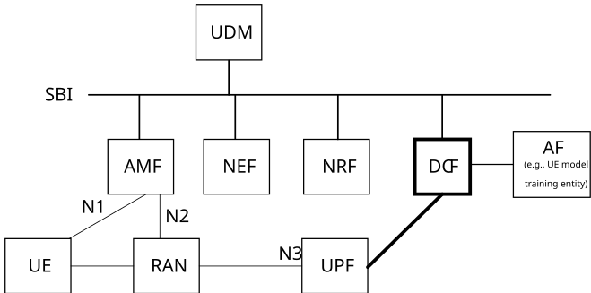

# 6.19.2 Description

The solution introduces new 5GS capabilities for supporting the standardized transfer of standardized data over UP for UE-side data collection to meet requirements for AI/ML for NR air interface operation with UE-side model training, including, initiating, terminating and fully managing data transfer.

To this end, we propose a new Data Collection Server Function (DCF), which is located within the MNO domain. The DCF sits in the path of collected data transfer to an AI/ML model training termination entity or (e.g. a UE-model training entity). Figure 6.19.2-1 illustrates the proposed architecture providing further details of how the DCF fits within the existing 5GC architecture.

Figure 6.19.2-1: Data Collection and Data Transfer Architecture

The DCF is responsible for the management of data collection configuration and actual data collection process using a Data Collection Profile (DCP) which describes the types of data and format to be collected and their handling with respect to user consent, user data privacy control, data collection scope.

The DCP information is generated based on input from the AF (e.g. UE-model training entity Server), operator local UE subscription data and operator local policy. The DCF interacts with AF (e.g. UE-model training entity) directly, if trusted, or via NEF if untrusted. The DCP information is used at least in the UEs, DCF and gNBs. The DCF is responsible for the data collection configuration in the UE (e.g. via AMF/gNB) and gNB (e.g. via AMF) based on DCP information.

The DCF receives collected data from the UEs via the UPF (e.g. through an UP tunnel). The DCF is responsible for verifying whether the collected data may satisfy the requirements from AF (e.g. UE-model training entity) and applying any data processing needed on collected data (e.g. anonymization) before the final data transfer to the AF (e.g. UE-model training entity).

The services offered by the NRF may allow DCF discovery by other network functions and application functions. Since there may be several instances of DCF within a mobile operator network, the selection of a DCF (e.g. by AMF) may be based on the UE's Routing Indicator or based on local configuration.

## 6.19.2.1 Data Collection Profile

The Data Collection Profile (DCP) describes the standardized data content that is collected and meta data related to specific handling of the data content. The DCP is configured and used in the UE and network nodes (RAN, CN) as part of the data collection process. The DCP is used to transfer different types of data content, depending on the use case of model to be trained (e.g. CSI, Beam Forming or Positioning). The DCP is used on the UE on the condition that a specific user consent permission (e.g. as part of subscription data as defined in TS 33.501 \[13\]) indicates that the user consents to executing UE side data collection for AI/ML model training in this UE.

The user consent for data collection be part of a Data Collection Privacy or Consent profile (e.g. part of the subscriber record in the UDM/UDR) which identifies the AF(s) (i.e. a UE-model training entity) that are allowed to collect UE data for AI/ML model training. The network provides via NEF to an external AF (e.g. a UE-model training entity)assistance for selection of UEs to participate in the data collection process. E.g. using a mechanism based on the member UE selection assistance functionality described in clause 5.46.2 of TS 23.501 \[2\].

NOTE : User consent aspects are to be defined in coordination with SA WG3

A Data Collection Profile (DCP) may include, based on what entities are being configured, the following:

**Configured and used on UE and network side (DCF/RAN):**

\- A DCP identifier uniquely identifies a Data Collection Profile as different DCPs may be used to transfer data content to a given AF (e.g. UE-model training entity).

\- Standardized parameters: one or more standardized parameter types along with format (e.g. Target CSI for CSI compression in float32 format). The UE determines which parameters to report and in which format based on the DCP indication.

\- Visibility/privacy handling scope for standardized data which indicates on per parameter level whether the value of the parameter may be exposed to an external party.

\- A data collection session identifier that indicates an association between the DCP and a data collection session. The data collection session identifier is used to uniquely identify an instance of data collection at a UE triggered by an AF (e.g. UE-model training entity).

**Configured and used on network side only (DCF/RAN):**

\- Data collection handling policy may include a duration (e.g. time window) for the data collection to be completed, the frequency of data reporting, data volume (per UE, total across UEs), the number of UEs required for the data collection (e.g. minimum required, maximum allowed). The policy may indicate whether the UE should perform logging of data locally before transmitting the data (e.g. in bulk), or how long the data can be stored by the UE before the UE can discard the logged data.

\- An Indication for user consent control: may indicate whether user consent check is required, per data collection or per parameter. For example, a user may consent to any data collection while another user may consent to a certain type of data collection identified by the Data Collection Privacy profile. Certain parameters such as UE location information may require specific consent before being exposed to an external party.

\- An Indication for privacy control indicating that privacy control/anonymization is required for applicable parameter(s). For example, a UE unique identifier may be marked as under privacy control and requires privacy protection, before a possible transfer to an external party (e.g. a UE-model training entity).

\- A UE-model training entity identifier, e.g. an FQDN which identifies the external entity (e.g. AF) in charge of AI/ML training using data input based on this DCP.
