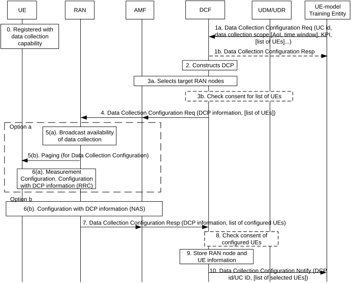

# 6.19.3.1 MNO Controlled Procedures for configuration of UE-side Data Collection

The DCF is responsible for creating and maintaining Data Collection Profiles which are used by the network to control the data collection process across the UE, RAN and CN. The DCF constructs the DCP upon a data collection configuration request from an AF (e.g. UE-model training entity) and it allocates a DCP identifier that uniquely identifies the DCP in the network, this identifier is used during the data collection process to associate collected data received from the UE with the DCP.

When AF (e.g. UE-model training entity) requests a data collection configuration, it may include list of UEs, a requested data type and formats and additional data collection requirement (e.g. data collection reporting period, location, required statistical characteristics of the collected data).

The DCF receives a list of input parameters and data collection requirements. The list of parameters may include the standardized parameters.

The DCF uses the DCP to configure the applicable UE(s) (e.g. via AMF, gNB) for the data collection. The DCF performs the selection of the data collecting UE(s) based on conditions, such as user consent, UE UE-model training entity selection (if any) or local configuration.

The DCF selects the RAN nodes with AMF assistance that complies with the data collection scope for example in terms of location area or selected UEs. The DCF sends a message to the selected gNB (e.g. via AMF) providing DCP information, indicating the list of candidate UEs selected for the data collection. The gNB stores the DCP information and configure the relevant UEs accordingly. The DCF sends the DCP information to relevant UEs for example using a NAS UE Configuration Procedure via the AMF. The DCF may receive a confirmation from AMF of successful configuration of UEs for the data collection process.

The DCF may send a response to the UE-model training entity with acceptance of data collection configuration. The response may include an identifier of the DCP and/or AI/ML model for which Data Collection has been configured. The DCF verifies whether the UE(s) included in the UE-model training entity request, may support the requested data collection input and requirements and it may reject the request from the AF (e.g. UE-model training entity) based on the verification.

The procedure is illustrated in Figure 6.19.3.1-1 below:

Figure 6.19.3.1-1: Data Collection Transfer Configuration procedure

0\. The UE is registered with the network and has indicated its data collection capabilities.

1\. The DCF receives a Data Collection Configuration request from an AF (e.g. UE-model training entity). The request includes any of the following parameters:

\- An AIML functionality Identifier/Use Case Identifier for which AIML models may be trained, based on input from the requested data collection.

\- A list of input parameters used for ML models according to the UC ID/Functionality ID provided in the Data Collection Configuration request, including their respective expected format

\- Urgency level: It indicates the urgency level of data request, e.g. "High"/"Low". This parameter may influence UE selection at the DCF.

\- Indication to report errors in data collection process e.g. due to lack of UE memory for data collection, or low power in the device

\- In the case of multiple data collection requests submitted at once, which data should be reported first as the UE-model training entity may prefer to receive data for a certain use cases/functionalities before others

\- Data collection requirements, e.g. a target area e.g. AoI or list of Tracking Areas or cells, time window, KPI such a time to complete the data collection, or data volume (e.g. per UE, total), or number of unique data collecting UEs required (e.g. minimum or average number per cell or in total for the data collection), required statistical characteristics (e.g. distribution, handling outliers).

\- A list of UE candidates identified by an external id (e.g. GPSI) may be provided by the AF (e.g. UE-model training entity). The UEs may be selected based on prior network assistance (e.g. member UE selection) procedure.

The DCF verifies that the AF (e.g. UE-model training entity) is authorized for the operation and sends a Data Collection Configuration response as an acknowledgment to the AF (e.g. UE-model training entity).

2\. The DCF determines a DCP based on the AF (e.g. UE-model training entity) input and operator local policy. The DCF determines privacy and user consent control based on the input parameter types. E.g. certain standardized parameters are determined to be as subject to post processing (e.g. privacy control, user consent check) by DCF before being transferred to the AF (e.g. UE-model training entity).

3\. The DCF may select relevant RAN nodes corresponding to the data collection scope (e.g. mapped to a list of tracking area or cells). If a list of UEs is provided, the DCF may check with UDM/UDR whether the user consent allows for the UE to perform data collection. If no list of UEs is provided by the UE-side model training entity, UE consent check is conducted in step 8. Further aspects of UE selection for data collection by Core Network (e.g. the DCF) or RAN are described below.

4\. The DCF sends a Data Collection Configuration Request to the target RAN nodes via the AMF including DCP information and the address of DCF (e.g., IP address or FQDN). The request may include a list of candidate UEs identified for the data collection. The DCF sends a request for configuration of each individual known candidate UEs.

Two options are considered to deliver data transfer configuration information to relevant UEs, either using RAN mechanism (option 5a/b) or CN mechanisms (option 6a/b). Furthermore, these options may deliver data collection transfer configuration information to UEs that are either in CM_IDLE or CM_CONNECTED state.

When using a RAN-based option (5a/b) data collection transfer configuration provisioning may be delivered to UEs that connect to the RAN based on data collection information that is broadcast by the RAN or the RAN may decide to page UEs, to bring them to CM_CONNECTED mode and deliver configuration information via RRC signalling. The RAN node selects UEs based on either the list of UEs provided by the DCF or based on internal RAN configuration. When using a CN option, as described in step 6(b), data collection transfer configuration may be delivered using NAS signalling (e.g., over DL NAS Transport message).

5\. (5b) The RAN node decides to broadcast an indication in the cell informing the UEs that data collection is allowed to take place in that cell. UEs that are capable to perform data collection, can connect to the network for data collection transfer configuration, as specified in step 6. Alternatively (5b), for UEs that are in CM_IDLE state, the RAN may page each individual UE so that the UE connects for data collection configuration as specified in step 6. Furthermore, for UEs that are in CM_CONNECTED mode and RRC CONNECTED state, the RAN can send measurement configuration, based on the information contained in the Data Collection Configuration request received in step 4.

6\. Based on the required data parameters for data collection as specified in the DCP and the list of UEs provided by the DCF (if any), the gNB determines to send the appropriate measurement configuration to the UE adapted for the data collection (e.g. if the UE is not already properly configured). The gNB sends DCP related configuration (for the required measurements) to the UE. In addition, the DCF may determine to send DCP information to UE via AMF in a NAS message.

For UEs that are in CM_CONNECTED mode, (6b) the AMF delivers the configuration information to the UE e.g. in a DL NAS Transport message, or for UEs that are in CM_IDLE mode, the AMF triggers a NW Initiated Service Request procedure to bring up the NAS signalling connection and enable the AMF to deliver the DL NAS Transport message. The configuration information includes DCP and the DCF address (e.g., IP address or FQDN).

Editor's note: Impacts to RAN need to be coordinated with RAN groups.

Editor's note: Whether or not support for UE-Side Data Collection for UEs in IDLE mode, should be coordinated with RAN.

NOTE: The two editor's notes described above will be addressed based on the pending response from RAN WGs.

7\. The RAN node sends Data Collection Configuration Response confirming the configuration of one or more UEs with the indicated DCP identifier providing the list of UEs that had been successfully configured.

8\. \[Conditional\] If DCF receives data collection transfer configuration confirmation for UEs that weren't included in the list of UEs provided in the Data Collection Configuration Request provided by the DCF, or UEs that were selected by the RAN node, DCF may check with UDM/UDR whether user consent for each of these UEs allows for the UE to be configured to perform data collection transfer.

9\. The DCF stores information about the RAN node(s) and UE(s) that are available for data collection

10\. The DCF sends a notification message to the AF (e.g. UE-model training entity). The message indicates that UEs are now available for data collection. A list of confirmed selected UEs may be provided.
