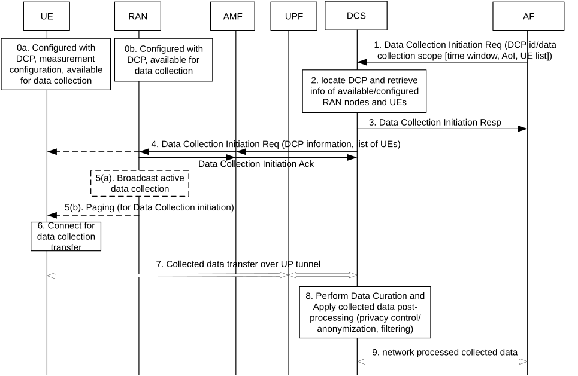

# 6.19.3.2 Procedures for MNO Controlled UE-side Data Collection

The DCF is responsible for initiating the data collection process, based on UE or network trigger or a request from AF (e.g. UE-model training entity). The request from AF (e.g. UE-model training entity) includes the DCP identifier. The request from UE-model training entity may indicate data collection KPI(s) (e.g. a time of completion for the data collection). The DCF checks whether the data collection KPI requirements can be satisfied for example in terms of time, number of participants UE available for the data collection session.

The DCF may be informed by RAN about the UEs that are configured with the measurement's configuration appropriate for the data collection. The DCF, with AMF assistance, may select the RAN nodes that complies with the data collection scope defined in the DCP, e.g. in terms of tracking area and/or serving relevant UEs. The DCF selects the RAN nodes with AMF assistance, e.g. based on network load level (e.g. least congested gNB may be selected), RAN nodes with meaningful number of participants UEs, as defined in the KPIs included in the DCP.

The RAN node may inform the UEs of data collection process initiation by broadcasting an ongoing/active data collection indication in the cell where the data collection is taking place or allowed to take place. UEs configured for data collection identify the specific data collection from the ongoing/active data collection indication (e.g. based on DCP id) and connect with the network to perform the data collection. A configured UE may be paged to connect with the network to perform the data collection ,or the configured UE may stay in the CM-CONNECTED state after configuration, as shown in clause 6.19.3.1, for a set duration, based on the provided time window specified in Step 1. The DCF confirms acceptance of the data collection initiation to the AF (e.g. UE-model training entity). The gNB stops broadcasting any ongoing/active data collection indication upon detecting any of the following conditions: the data collection process is completed, based on the DCP information conditions (e.g. time or data volume limit), or network congestion condition is detected as described above.

The DCF receives the collected data directly from UE via UP (via UPF): the UE sends data over an UP connection to the DCF based on DCF addressing information provided in the DCP. The DCF processes data received from UE over UP as described above.

Figure 6.19.3.2-1 illustrates a procedure for Initiation of UE-side data collection with full controllability and visibility for the MNO.

Figure 6.19.3.2-1: Data Collection Triggering Procedure

0\. The UE and gNB are configured with DCP information configuration and available to perform UE-side data collection.

1\. The DCF receives a Data Collection Initiation request from the AF (e.g. a UE-model training entity). The request includes the DCP id and data collection scope \[AoI, UE list, time window, DNN/S-NSSAI\]. The request includes an identifier of the UE(s) that data needs to be collected from, e.g. a GPSI and the temporal and special requirements from the AF, e.g. AoI and time window. The request also includes the identity of the requesting server, e.g. it can be an AF identity. The DC initiation request may include an indication that data collection context information is requested from the RAN node that serves the PDU Session. This may correspond the same RAN node that trigger the Data Collection request in step 1. The Data Collection Initiation request can also include a DC correlation identifier (e.g. the DCP id) and a context information destination address. This information enables the RAN node to provide additional information to the AF, e.g. radio conditions and congestions information.

The RAN Node may send the context report described above, to the AF (e.g. the UE-model training entity), including, e.g. timestamps, the RAN Node ID, RAN Node measurement of radio conditions and a congestion level. The content of the content report may include a DC correlation identifier (e.g. the DCP id), that the AF (e.g. the UE-model training entity) can use to determine what UE data collection the report relates to. The context report includes information about the network conditions (e.g. radio condition and congestion levels) when the data was collected. A consumer of the collected data can use the context report to better assess network conditions at the time of data collection.

2\. The DCF checks that AF is authorized for data collection initiation and locate the DCP information based in the provided identifier(s). The DCF may retrieve information about available RAN nodes and UEs. This information may be established according to procedure described in clause 6.19.3.1. The request from the AF to send a data collection transfer trigger can include the address of the UE-model training entity and a DNN/S-NSSAI combination that can be used to communicate with the UE-model training entity. In addition, (not shown in figure 6.19.3.2-1 for simplicity) the DCF requests the UDR/UDM to store UE's session management information such as the DNN/S-NSSAI and the address of the requesting UE model.

3\. The DCF sends a Data Collection Initiation Response to the AF to acknowledge initiation of the data collection. The acknowledgement many be sent after acknowledgment from all RAN nodes (next step).

4\. The DCF, based on the data collection trigger mechanism, either:

\- Sends a Data Collection Initiation Request to the RAN in a transparent container through the AMF, (transparent meaning that the AMF does not need to be aware of the content of the container) to tell the RAN that UEs may be alerted that data collection reporting is allowed in an AoI, e.g. by broadcasting an indication to this effect in the specified AoI.

UEs that are capable and configured to transfer collected data, can connect to the network for data collection transfer, as specified in step 6.

\- Or the DCF sends a Data Collection Initiation Request container, using a DL NAS Transport message to UEs as requested by the AF. The AMF delivers the DL NAS Transport message to UEs that are in CM_CONNECTED state, or it uses a Network Trigger Service Request to bring the NAS signalling connection up and deliver the Data Collection Initiation Request container through a DL NAS Transport as specified above. UEs that receive the Data Collection Initiation Request container acknowledge receipt of the container by sending an UL NAS Transport Message.

The UL NAS Transport Message may include an acknowledgement container. The acknowledgement container can indicate whether the UE rejects the request to establish the PDU Session. If the UE rejects the request to establish the PDU Session, the UE may include a cause value, otherwise the UE connects to the network as specified in step 6.

During the sending of the Data Collection initiation request, as described above, the DCF sends the Data Collection initiation Request through the target RAN nodes via AMF, through a N2 message, including DCP information and list of UE available/authorized for data collection. With regards to the N2 procedure, the RAN node acknowledges acceptance of data collection or reject based on conditions (i.e. through an N2 message). The RAN node may reject the request because of congestion conditions. The RAN node may reject or indicate a change in the available UEs (e.g. if UEs moved to a different gNB). The DCF may use such information for example to update the list of UEs expected to collect data. The DCF may inform the AF accordingly.

5\. Based on the trigger mechanism specified in step 4, the RAN node either broadcasts an indication in the cell informing the UEs that data collection is allowed to start in that cell or the RAN pages each individual UE such that each individual UE connects to perform data collection as described in step 6.

6\. The UE connects to the network for data collection transfer, if not already connected, using the information received in the Data Collection initiation request, including DNN/S-NSSAI, DCP Id and data collection scope (e.g. the UE may establish a new PDU Session if needed to transfer the collected data). The UE may start the data collection transfer with the DCF immediately or based on the provided time window.

A UE that connects to initiate the transfer of collected data based on the indication broadcast by the RAN sends parameters that describe the data to be transferred using a UL NAS transport message, In this request the UE includes DCP information including a data collection session identifier (further described as "transaction ID" below) which indicates an association between the DCP and a data collection session. The data collection transaction identifier may uniquely identify an instance of data collection at a UE, triggered by a UE-side model training entity.

The UE may receive a response (not shown in the figure) with a new DCP configuration, the transaction ID and/or FQDN or IP address for the IP tunnel to use for the data transfer towards DCF.

7\. The UE initiates the transfer of the collected data to the DCF via the UPF over a PDU Session that is set up for the transfer of the collected data. Details of how this PDU Session is setup are in clause 6.19.3.3).

8\. The DCF verify whether the collected data satisfy the requirement for data collection and may perform data curation (e.g. verifying distribution of the collected data and updating the data collection update, handling outliers) and may apply processing on the received data from each individual UEs accordingly, based on the DCP data handling rules, e.g. the DCF may anonymize or modify or filter privacy sensitive standardized data parameters. The DCF may monitor the data collection session and take corrective actions, such modifying or terminating a Data Collection Session, when detecting conditions that do not meet data collection rules, e.g. network congestion or lack of UE availability.

9\. The DCF transfers the collected data, with applied post-processing (if any), to the AF (e.g. the UE-model training entity)

Editor's note: Whether or not support for UE-Side Data Collection for UEs in IDLE mode, should be coordinated with RAN.
