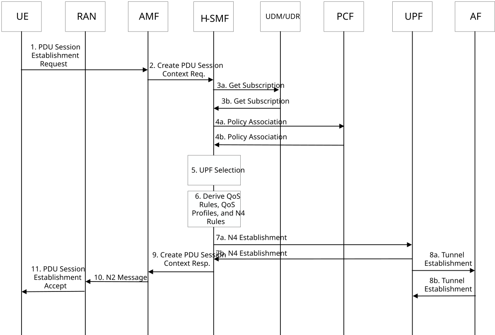

# 6.19.3.3 Establishing a PDU Session for Data Collection

Figure 6.19.3.3-1 shows an example procedure how a UE can initiate a PDU Session Establishment procedure so that the PDU Session can be used for data collection. The procedure of Figure 6.19.3.3-1 can be triggered by the UE when the UE receives a DL NAS Transport message that triggers the UE establish the PDU Session for data collection or after the UE sends the UL NAS Transport message that acknowledges the triggers. In other words, the procedure of Figure 6.19.3.3-1 can be triggered by the receipt of Data Collection Initiation message in step 5 of Figure 6.19.3.1-1, or messages of steps 6(a/b) of Figure 6.19.3.1-1 or the message of step 6 of Figure 6.19.3.2-1.

Figure 6.19.3.3-1: Procedure for Establishing a PDU Session for Data Collection

1\. In step 1, the UE sends a PDU Session Establishment Request to the network. The PDU Session Establishment Request message is a NAS-SM message that is carried in a NAS-MM message.

\- The NAS-MM message can include an indication that the PDU Session is for data collection. The reason for including an indication that the PDU Session is for data collecting in the NAS-MM part of the message is that the AMF can consider this indication when performing SMF selection. For example, the AMF can select an SMF that ca be used in a data collection PDU Session.

\- The NAS-MM part of the message can include an DNN / S-NSSAI combination. The DNN / S-NSSAI combination is used by the AMF to perform SMF selection. For example, the AMF will select an SMF that is part of a slice that is associated with the S-NSSAI and an SMF that can be used to reach the DNN.

\- The DNN / S-NSSAI combination can be the DNN / S-NSSAI combination that was provided in the DL NAS Transport trigger message.

\- The DNN / S-NSSAI combination can be determined based on URSP Rule evaluation. The URSP Rule evaluation can be based on a traffic descriptor (e.g. a connection capability) that indicates data collection or based on a traffic descriptor that is the address of the DCF that was received in the DL NAS Transport trigger message.

2\. In step 2, the AMF will receive the NAS-MM message which carries the PDU Session Establishment Request. The AMF will use information from the NAS-MM part of the message to perform SMF selection. The AMF will then send a request to the selected SMF to create a new PDU Session. The request from the AMF to the SMF will carry the PDU Session Establishment Request, the DNN, the S-NSSAI and the indication that the PDU Session will be used for data collection.

3\. In step 3, the SMF will read Session Management subscription data for the UE from the UDM/UDR. The SMF may use the UE identifier as a data key when reading the Session Management subscription data and may use the S-NSSAI / DNN combination as a Data Sub-Key when requesting to read the Session Management subscription data from the UDM/UDR in step 3a. In step 3b, the SMF will receive the information that the DCF stored in the UDM/UDR in the procedure of 6.19.3.2-1 For example, the SMF will receive:

\- The address of the AF (e.g. the address of the UE-model training entity).

\- The AF Identity.

\- The information about the type of data that the AF wants to collect.

4a. In step 4, the SMF will select a PCF to serve the PDU Session and send a policy association request to the selected PCF. The request may include an indication that the PDU Session will be used for data collection, the address of the AF, the AF Identity and the information about the type of data that the AF (e.g. the UE-model training entity) wants to collect.

The PCF will use the information from the request to derive PCC Rule(s) for the PDU Session. For example, the PCF may derive PCC Rule(s) that are based on the type of data that will be collected and where the data will be sent (i.e. what UE-model training entity (i.e. AF Identity) will receive the data). For example, the network operator may configure the PCF to configure a higher or lower quality of service when sending certain types of data or when sending data to certain AFs. For example, the network operator may configure the PCF not to charge the user (or charge the user differently as compared to traffic in other PDU sessions) for the traffic associated with this PDU session.

4b. In step 4b, the PCF will send the PCC Rule(s) to the SMF.

5\. In step 5, the SMF will perform UPF Selection. For example, the SMF may select a UPF that can be used to reach the AF. Thus, UPF selection may be based on the AF Identity or the address of the AF.

6\. In step 6, the SMF will derive QoS Rule(s), QoS Profile(s) and N4 Rule(s).

For example, the PDU Session may be an PDU Session whose type is unstructured. Thus, the SMF may derive QoS Rule(s), QoS Profile(s) and N4 Rule(s) that are based on a single QoS Flow. In other words, all traffic from the PDU Session may be mapped to one QoS Flow. The configuration of the QoS Flow may be based on the PCC Rules. The PCC Rules may be based on the PDU Session being used for data collection.

7\. In step 7, the SMF will perform an N4 Establishment procedure with the UPF. In step 7a, the SMF will send the N4 Rules to the UPF and will send the address of the AF to the UPF. The message of step 7a may also include an indication that the PDU Session will be used for data collection. In step 7b, the UPF may indicate that the N4 Session was successfully established.

8\. In step 8, the UPF will establish an application layer connection with the AF (e.g. the UE-model training entity). The UPF use the AF address that was received in step 7a to initiate the procedure to establish the application layer connection. The application layer connection can be a UDP tunnel type connection. The UPF may determine what application layer protocol to use based on the indication that the PDU Session will be used for data collection.

9\. In step 9, the SMF will send a response to the AMF's request to create a PDU Session. The response will include:

\- a PDU Session Establishment Accept message for the UE. The PDU Session Establishment Accept message includes the QoS Rules that were derived in step 6.

\- an N2 SM Message for the RAN Node. The N2 SM Message for the RAN Node includes the QoS Profiles that were derived from in step 6 and the indication that data collection context information is requested from the RAN node that serves the PDU Session, the DC correlation identifier and the context information destination address. The N2 Message for the RAN Node also includes information about the type of data that the AF (e.g. the UE-model training entity) wants to trigger collection of context data.

10\. In step 10, the AMF will send the PDU Session Establishment Accept message and the N2 SM Message to the RAN Node.

11 In step 11, the RAN Node stores information from the N2 SM Message and will send the PDU Session Establishment Accept message to the UE. The information from the N2 SM Message includes the indication that data collection context information is requested from the RAN node that serves the PDU Session, the DC correlation identifier and the context information destination address.

In this step, the RAN Node sends an RRC Message to the UE. The RRC Message carries the NAS PDU Session Establishment Accept message to the UE. The RRC message also includes data collection configuration information.
