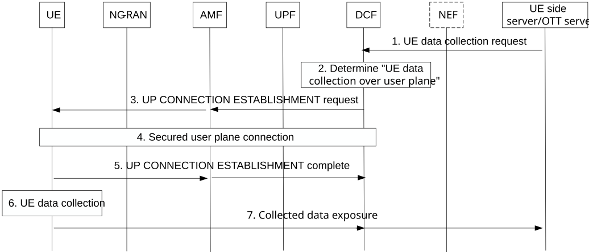

# 6.2 Solution \#2: Generalized UE data collection over user plane

## 6.2.1 High level principles

This solution addresses the key issue#1.

It proposes a solution for Generalized UE data collection over user plane by applying the existing user plane-based LCS, in similar to a user plane connection between UE and LMF specified in clause 6.18 of TS 23.273 \[6\].

This solution provides MNO's controllability through the UP signalling between UE and DCF over the secured user plane connection (i.e. explicitly requesting the initiation/termination of data transfer and/or providing the validity condition of the data transfer to UE).

This solution provides MNO's visibility through DCF verification before providing the collected data to UE side data collection server/OTT server.

## 6.2.2 Description

It assumes the following:

\- Data collection function (DCF) in core network.

Decides to use user plane for UE data collection based on UE subscription data, UE capability (if needed) to perform data collection and local configuration.

Provides the UE the information to establish a secure connection (e.g. DCF address).

Sends the request on UE data transfer via the secured user plane connection.

Sends the event reporting (if the event data collection is allowed such as Deferred MT-LR of TS 23.273 \[6\]) related request to UE.

Expose the collected data to UE side data collection server/OTT server, etc.

\- UE subscription data in UDM:

\- DCF ID.

\- Data collection over user plane between UE and DCF is allowed/not allowed.

\- User consent on data collection, etc.

\- URSP and/or UE Local configuration information includes:

\- DCF address.

\- PDU session information for UE data collection (i.e. associated DNN and S-NSSAI), etc.

## 6.2.3 Procedures

Figure 6.2.3-1: High-level procedure for UE data collection over user plane

1\. UE side data collection server/OTT server sends UE data collection request to 5GC. This request implies both UE data collection and UE data transfer. It may include the target UE(s), the data configured to be collected, the validity condition of the data transfer (e.g. immediately, or time/location for transfer, etc.) and so on.

If the UE side da collection server/OTT server is located outside MNO, the NEF authorizes it to accept the request.

2\. The DCF determines to use user plane for UE data collection based on UE subscription data (e.g. Data collection over user plane between UE and DCF is allowed/not allowed), etc. It may be triggered by AMF request.

User consent is checked based on UE subscription data for the purpose of UE data collection and ML model training.

NOTE 1: The DCF can be collocated with Location Management Function (LMF) specified in TS 23.273 \[6\] depending on network deployment.

3\. In similar to user plane connection establishment procedure specified in clause 6.2.1 of TS 24.572 \[7\], the DCF invokes an Namf_Communication_N1N2MessageTransfer service operation towards the AMF to request transfer of the USER PLANE CONNECTION ESTABLISHMENT COMMAND message. The AMF forwards it to the UE via DL NAS TRANSPORT message.

4\. The UE establishes a PDU session if there is no established PDU session for UE to DCF PDU connectivity service and establishes a TLS connection with the DCF. Finally, the secured user plane connection is established between UE and DCF.

NOTE 2: The URSP rules or UE Local configuration is used to enable to routing of collected data via a specific PDU session (e.g. associated DNN and S-NSSAI). "UE data collection" traffic is identified by PDU session with associated DNN and S-NSSAI, and this configuration is decided by operator and (if any) SLA in this Release.

5\. The UE sends USER PLANE CONNECTION COMPLETE message via UL NAS TRANSPORT message the to the AMF and the AMF forwards it to the DCF by invoking Namf_Communication_N1MessageNotify service operation.

After the secured user plane connection is established, the DCF sends the requests for "the transfer of the data collected by UE" to UE through UP signalling. It includes the initiation or termination of the data transfer, or the condition of the data transfer (e.g. immediately, or time/location for transfer, etc.).

6\. The UE performs UE data collection. The NG-RAN may provide the configuration for the UE data measurement.

NOTE 3: The configuration and trigger in UE and NG-RAN for data collection per use case are specified in RAN WGs. The data collection between UE and NG-RAN may be independent on the request in step 1.

7\. The collected data and/or event reports (if the event data collection is allowed such as Deferred MT-LR of TS 23.273 \[6\]) are notified to UE side data collection server/OTT server via the DCF based on the request of step 1.

Before sending to UE side data collection server/OTT server, the DCF verifies whether the collected UE data is standardized data or not, and whether the request of step 1 matches the data collected by UE.

## 6.2.4 Impacts on services, entities and interfaces

**DCF:**

\- Decides to use user plane for UE data collection and provides the UE the information to establish a secure connection (e.g. DCF address, etc.).

\- Sends the request on UE data transfer via the secured user plane connection.

\- Exposes collected data and/or event report from UE to UE side data collection server/OTT server.

**UE:**

\- Establishes a secured user plane for UE data collection with DCF.

\- Performs UE data collection and provides it to the DCF.
