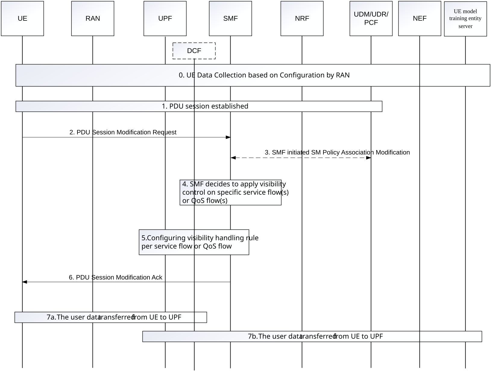

# 6.20 Solution \#20: UE data collection over UP

## 6.20.1 High level principles

The solution is for Key Issue \#1: Transfer of data over UP for UE data collection.

The principles of the solution including:

\- The mechanism of PDU session with user plane connectivity between UE and the UE model training entity server with UPF performing visibility handling is used, which is totally standardised mechanism which is pretty mature in 5G.

\- The UPF or an dedicated NF (e.g. a new NF as DCF(Data Collection Function) in 5GC performs the full visibility of standardized UE data contents based on configured data packets handling rules.

\- The PDU session management mechanisms of QoS flow management or service data flow management support the controllability of standardized UE data transfer including initiating, terminating data transfer and also support to differentiate the traffic for UE data collection from the UE regular traffic in the 5GC.

\- The UE knows about what the standardized data to be transferred are based on what data is standardised.

## 6.20.2 Description

The data to be transferred is the UE collected data for UE-side model training. And within the scope of KI#1, the data transfer over UP refers to the sending/transfer of the collected data from the UE to the UE model training entity Server via UP with 5GC as intermediary node of the data transfer path between UE and the UE model training entity server. The UE model training entity server can be the server for data collection for UE-side model training or OTT server.

The mechanism of PDU session with user plane connectivity between UE and the server with UPF in 5GC performing visibility handling is used, which is totally standardised mechanism which is pretty mature in 5G. The controllability of standardized UE data transfer including initiating, terminating data transfer and differentiating the traffic for UE data collection from the UE regular traffic in the 5GC can be fulfilled using QoS flow management or service data flow management for the PDU session.

## 6.20.3 Procedures

### 6.20.3.1 UE data collection over UP

Figure 6.20.3.1-1: UE data collection over UP

0\. UE collects the data based related configuration procedure defined by RAN. The data collection can be triggered by AF, NF within core network, RAN or UE.

NOTE: Details on the data collection triggering is based on which entities triggers the data collection, which may take the data collection configuration solution decided by RAN into consideration. The details on the data collection triggering is not covered by this solution.

1\. The PDU session to manage the data communication path(s) between User Equipment (UE) and the data network where the UE model training entity server is hosted is established. The address information of the UE model training entity server for UE data collection can be obtained by the UE via application layer, or configuration or URSP rule.

2\. The UE sends PDU session modification request to the SMF to QoS rule management indicating the specific user data is expected to be exchanged between UE and the UE model training entity server requiring visibility handling, e.g. via one of the following:

\- addition or update QoS rule with specific packet filter(s), e.g. flow label, remote address info, local address info, Type of service/Traffic class;

\- creating a new Segregation QoS rule by setting the rule operation code to "Create new QoS rule" and set the segregation bit to "Segregation requested".

3\. The SMF may request the PCC rule update from PCF based on the information received via step 2 if the rule for visibility handling is configured in PCF. And the PCC rule to provide visibility for specific service flow(s) or QoS flow(s) is sent to SMF.

4\. The SMF decides the information to apply visibility control based on information received in step 3, or information received in step 2 and/or location policy configuration.

5\. The visibility control information on the specific service flow(s) or QoS flow(s) is configured by the SMF.

If it is the UPF in 5GC performing the visibility of standardized UE data contents, the SMF configures the UPF to perform the visibility check and the data packets are further forwarded after the visibility check.

If it is the dedicated NF such as a new NF as DCF(Data Collection Function) in 5GC performing the visibility check of standardized UE data contents, the SMF decides the DCF, configures the UPF to forwards the related packets to be forwarded to the selected DCF and configures the DCF to perform the visibility check. The data packets are further forwarded after the visibility check.

The PDU session management mechanisms of QoS flow management or service data flow management support the controllability of standardized UE data transfer including initiating, terminating data transfer and also support to differentiate the traffic for UE data collection from the UE regular traffic in the 5GC. The UE or AF or the core network can trigger to initiate, modify or terminate the data transfer of the service data flow or QoS flow for the UE data collection via UP.

The visibility control information includes the data handling action as verifying/matching the received user data with configured information. The configured information can be configured onto the UPF or DCF, or preconfigured in SMF or PCF and sent by the SMF via including configured information in the visibility control information.

Editor's note: Details on the visibility control information is FFS, based on what visibility handling means.

6\. The PDU Session Modification Ack is sent to UE.

7\. The standardised data requiring visibility handling is transferred from UE to core network via user plane and the UPF or DCF in 5GC performs the full visibility of standardized UE data contents, after the visibility check, the collected data is sent to UE model training entity server. The data can be transport to UE model training entity server from the NF performing visibility handling or via UPF.

## 6.20.4 Impacts on services, entities and interfaces

**SMF/PCF:**

\- Decides the PCC rule for visibility control for specific service flow(s) or QoS flow(s) and configures related rule to UPF.

**UPF:**

\- Enforce the PCC rule for visibility handling for specific service flow(s) or QoS flow(s).

\- Forward the data packets requiring visibility handling to DCF.

**DCF:**

\- Support visibility handling for the collected data.

\- Forward the data packets to UE model training entity server after visibility handling.
