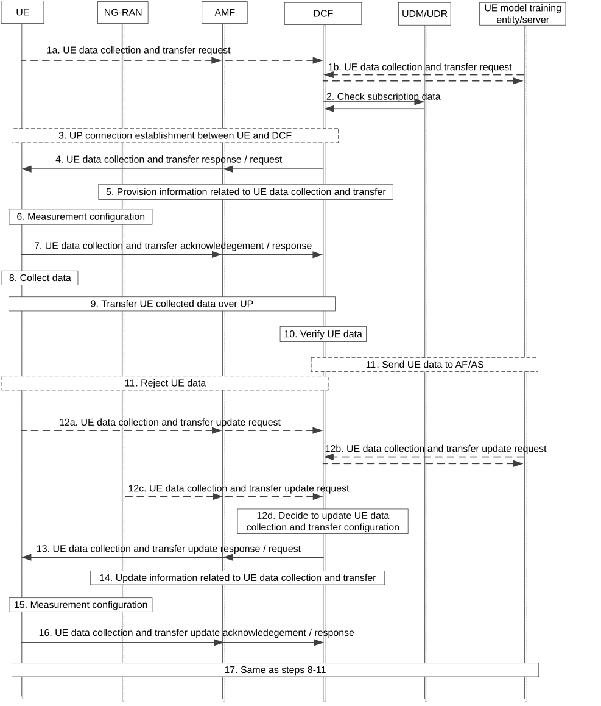

# 6.21 Solution \#21: Control of UE data collection and transfer with UE data verification

## 6.21.1 High-level principles

The high level principles of this solution are as follows:

A data collection function (i.e. DCF) in 5GC instructs the UE what and how UE data are to be collected and transferred, based on UE request or AF request and subscription data.

\- A data session between the DCF and the UE is used for UE data transfer over the secure user plane with TLS connection, which is established over PDU connectivity service provided by a PDU session.

\- The DCF verifies the received UE data in encapsulated data packets over the data session according to the UP protocol for UE data collection and transfer.

\- The DCF may perform the UE data collection and transfer update procedure to update the configuration for UE data collection and transfer towards the UE, based on various triggers (e.g. the request from UE, AF or RAN, or DCF internal decisions).

## 6.21.2 Description

This solution addresses Key Issue \#1.

In this solution, DCF (Data Collection Function), which can be an existing 5GC NF (e.g. DCCF) or newly introduced 5GC NF if needed for UE data collection, receives UE data collection / transfer request from the UE or the UE model training entity/server. The DCF decides what UE data can be collected / reported (e.g. data for what use cases / what kind of the model to be trained, data types) over the data session between the DCF and the UE based on the UE request or AF request and subscription data and sends the configuration information for UE data collection and transfer to the UE accordingly. The DCF also sends information relevant to UE data collection and transfer to the NG-RAN, so that the NG-RAN may determine or update the UE measurement configuration for the UE to perform data collection via measurement. Based on the configuration information for UE data collection and transfer from the DCF, as well as measurement configuration from the NG-RAN, the UE decides what and how UE data can be collected and reported and sends to the DCF over the data session the collected UE data as encapsulated data packets according to the UP protocol for UE data collection and transfer. The DCF verified the UE data in the data packets and only sends the authorized UE data to the UE model training entity/server.

When the status in the UE, NG-RAN, AF or DCF changes, the DCF may be triggered to updates the configuration information for UE data collection and transfer. The DCF sends the updated configuration information to the UE, and optionally also to the NG-RAN for possible update of measurement configuration. Then the UE starts to collect and send UE data according to the updated configuration information.

## 6.21.3 Procedures

Figure 6.21.3.1-1: UE data collection and transfer over User Plane for UE side model training

1\. The procedure may be triggered by following events:

1a. \[UE triggered UE data collection and transfer\] The UE may receive a UE data collection request from the UE model training entity/server via the application layer and based on the request, the UE sends an UE data collection and transfer request to the AMF. The AMF discovers and selects a proper DCF by querying the NRF or based on local configuration and forwards the UE request to the DCF. The UE request contains AF Identifier, model type (identifying the use case of the model for which the data is collected, e.g. UE-based positioning, CSI prediction, beam management) and optionally, reporting area, time window, data types, data accuracy, reporting latency, reporting period (for periodic reporting) or event trigger.

NOTE 1: The messages between the UE and DCF are contained in UL/DL NAS TRANSPORT messages and forwarded by the AMF transparently based on the Payload container type "UE data collection".

1b. \[AF triggered UE data collection and transfer\] The UE model training entity/server sends a request to the DCF to collect UE data for UE side model training. The UE data collection request contains requirements for UE data collection and transfer, including Target of Reporting (identifying the UEs from which to collect data), model type (identifying the use case of the model for which the data is collected, e.g. UE-based positioning, CSI prediction, beam management), Notification Target Address and optionally, reporting area, time window, data types, data accuracy, reporting latency, reporting period (for periodic reporting) or event trigger.

If the UE model training entity/server is an untrusted AF, the request is transferred to the DCF via the NEF and the NEF authorizes the AF request.

2\. Upon receiving the UE request or AF request, the DCF may check subscription data for UE data collection and transfer from the UDM. The subscription data includes AF Identifier(s) (identifying the AF(s) which is allowed to collect data from the UE for UE side model training), reporting area and/or time window, as well as user consent, for UE data collection and transfer for UE side model training. The DCF continues to perform the following steps only if UE data collection and transfer for UE side model training is allowed for the UE according to the subscription data. If the procedure is triggered by UE request and UE data collection and transfer for UE side model training is not allowed for the UE, the DCF rejects the UE request.

For the UE sending the request (see step 1a) or for each UE which is requested by the AF (see step 1b) for collecting and reporting data for UE side model training, the following steps are performed:

3\. If UP connection for a data session between the UE and DCF has not been established, the DCF initiates UP connection establishment procedure towards the UE for establishing the data session. Otherwise, the DCF may determine to associate the data session with an existing PDU Session (i.e. establishing the data session over an existing PDU Session) or modify an existing data session for UE data transfer.

NOTE 2: The DCF can initiate UP connection establishment procedure towards the UE as described in steps 3-5 in clause 6.2.3, or as described in steps 5-8 in clause 6.1.3.1 if DCCF is used as the DCF.

4\. For UE triggered UE data collection and transfer, the DCF sends a UE data collection and transfer response to the UE. The response contains configuration information for UE data collection and transfer, which includes the authorized reporting area, time window, data types, data accuracy, reporting latency, and/or, reporting period (for periodic reporting) or event trigger. These parameters (e.g. data types) are determined based on the UE request and operator policy.

For AF triggered UE data collection and transfer, the DCF sends a UE data collection and transfer request to the UE. The request contains configuration information for UE data collection and transfer, which includes the AF Identifier, model type and optionally, reporting area, time window, data types, data accuracy, reporting latency, reporting period (for periodic reporting) or event trigger. These parameters (e.g. data types) are determined based on the AF request and operator policy.

The DCF determines the configuration information for UE data collection and transfer based on the UE request or AF request, the subscription data if obtained in step 2 and local configuration.

5\. The DCF also sends configuration information to the NG-RAN via the AMF for UE data collection and transfer, which includes model type and optionally, reporting area, time window, data types, data accuracy, reporting latency, reporting period (for periodic reporting) or event trigger. Based on the UE data collection and reporting related configuration information received from the DCF, the NG-RAN determines UE measurement configuration, as well as the downlink radio signals, to be sent/transmitted to the UE for UE data collection (i.e. measurement) and transfer.

NOTE 3: The UE measurement configuration information and downlink radio signals for UE measurement are defined in RAN specifications.

Editor's note: How the NG-RAN takes into account the information provided by the DCF for measurement configuration to the UE is up to RAN WGs to decide.

6\. The NG-RAN sends the UE measurement configuration for UE data collection and transfer to the UE.

7\. Based on the configuration information for UE data collection and transfer from the DCF, as well as the measurement configuration from the NG-RAN, the UE decides what and how UE data can be collected and reported. The UE sends an acknowledgement (for UE data collection and transfer response) or a response (for UE data collection and transfer request) to the DCF, indicating whether the configuration for UE data collection and transfer is accepted or not. The UE may decide not to accept the configuration for UE data collection and transfer e.g. based on UE status, AF Identifier and/or model type.

8\. The UE performs measurements according to the measurement configuration and obtains data.

9\. The UE sends to the DCF over the data session the collected UE data as encapsulated data packets according to the UP protocol for UE data collection and transfer, based on the configuration information for UE data collection and transfer.

10\. The DCF decides that the received data packets contains collected UE data based on the UP protocol for UE data collection and transfer and further verifies the UE data, e.g. checking whether the reported data types and formats comply with the configured data types and formats for UE data collection and transfer.

11\. If the verification succeeds, the DCF sends the UE data to the UE model training entity/server; otherwise, the DCF rejects the data packet(s) and indicates an error to the UE. The UE may, based on the error indication (e.g. wrong data type), resend the data packet(s) with correct content to the DCF.

The following steps show how the UE data collection and transfer update is performed to update the configuration information for UE data collection and transfer, based on various triggers (e.g. the request from UE, AF or RAN, or DCF internal decisions).

12\. The UE data collection and transfer update may be triggered by the following events:

12a. The UE may decide to request change of UE data collection and transfer configuration, e.g. considering UE status (e.g. UE performance, UE energy saving) or due to change of UE measurement configuration. The UE sends a UE data collection and transfer update request to the DCF.

12b. The UE model training entity/server may decide to change the requirements for UE data collection and transfer, e.g. due to changed requirements for UE side model training. The AF sends a UE data collection and transfer update request to the DCF.

12c. The NG-RAN may decide to request change of UE data collection and transfer configuration, e.g. considering NG-RAN performance (e.g. NG-RAN load) or due to change of NG-RAN capability (e.g. when the UE hands over to a new NG-RAN node and the new NG-RAN node does not support the measurement configuration relevant to UE data collection). The NG-RAN sends a UE data collection and transfer update request to the DCF.

12d. The DCF may decide to change the UE data collection and transfer configuration based on local policy, e.g. considering the DCF load.

13\. The DCF sends a UE data collection and transfer update response (for UE initiated request) or UE data collection and transfer update request (for other cases) to the UE. The message contains the updated configuration information for UE data collection and transfer.

14-15. The DCF may send updated configuration information for UE data collection and transfer to the NG-RAN via the AMF and then the NG-RAN may update the UE measurement configuration towards the UE for UE data collection and transfer.

16\. Based on the updated configuration information for UE data collection and transfer from the DCF, as well as the measurement configuration from the NG-RAN, the UE decides what and how UE data can be collected and transferred. The UE sends an acknowledgement (for UE data collection and transfer update response) or a response (for UE data collection and transfer update request) to the DCF, indicating whether the configuration update for UE data collection and transfer is accepted or not.

17\. Same as steps 8-11.

## 6.21.4 Impacts on services, entities and interfaces

**DCF:**

\- instructs the UE what and how UE data are to be collected and transferred over the data session between the DCF and the UE based on the UE request or AF request and subscription data;

\- establishes User Plane connection with the UE for UE data transfer;

\- verifies received UE data in encapsulated data packets over the data session according to the UP protocol for UE data collection and transfer;

\- updates UE data collection and transfer based on various triggers (e.g. the request from UE, AF or RAN, or DCF internal decisions).

**AMF:**

\- discovers and selects the DCF and forwards the messages between the UE and the DCF.

**UE:**

\- performs UE data collection and transfer over the data session between the DCF and the UE based on the configuration information for UE data collection and transfer from the DCF;

\- collects UE data via measurements based on measurement configuration from the NG-RAN;

\- updates UE data collection and transfer based on the updated configuration information for UE data collection and transfer from the DCF.

**NG-RAN:**

\- determines or updates the UE measurement configuration for UE data collection, based on the information received from the DCF for UE data collection and transfer.
