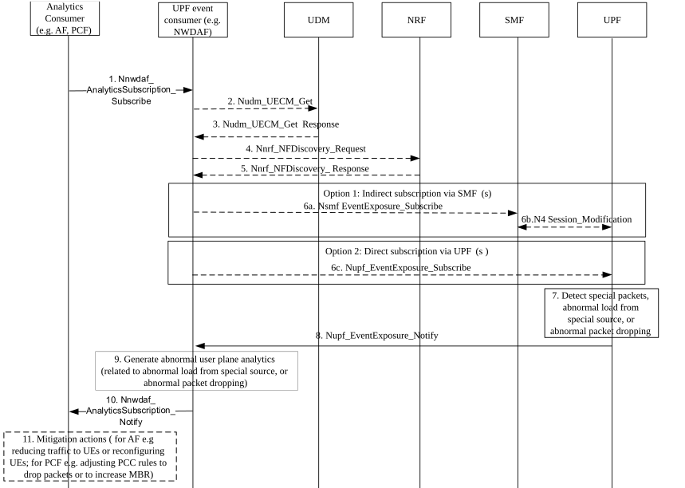

# 6.22 Solution \#22: Assistance for User plane performance optimization

## 6.22.1 High level principles

A UPF can be configured to report Information about detected packets complying to certain pattern(s) (e.g. same size, protocol, same target address/port etc) received from multiple external sources, abnormal amounts of traffic received from external source and/or rate of dropped packets. Reporting only special detected packet patterns reduces the signalling load from UPF to NWDAF.

An NWDAF as consumer of the UPF notification can use this information to compile statistics and/or analytics related to abnormal user plane observations (e.g. detection of special packets/ special traffic volumes from specific sources and/or the detection of dropped packets).

Consumers of related NWDAF analytics could then block abnormal traffic or to increase capacity for legitimate traffic peaks. An IoT Server AF as analytics consumer can also use the information to control abnormal traffic to/from (IoT) devices or to reconfigure some mis-configured devices.

As abnormal packet patterns of interest can be subject to frequent change, it is supposed that packet patterns are not standardized, but configured values are used in analytics subscription and analytics output, as well as in event subscription and event reports between UPF and NWDAF. Either the application ID or a new packet pattern ID can be used to identify traffic patterns. Thus analytics consumers, the NWDAF and the UPF are supposed to be configured with related values.

## 6.22.2 Description

A UPF can be configured to report one or several of:

1\. Information about detected packets complying to certain pattern(s) (identified by any of the following criteria, possibly in combination: same size, protocol, same target address/port, packets identified by a vendor specific algorithm identified by a packet pattern ID, packets matching search criteria obtained from databases about known malicious packets, etc, possibly only first packet(s) from a source considered) received from multiple external sources. (High rates could be caused e.g. by distributed DOS attack or protocol/application malfunction or misconfiguration):

\- Target Packets or packet patterns are identified by packet pattern ID or Application ID, or any type of frequently occurring packets can be reported. Target Packets/packet patterns are identified by a special packet pattern ID or Application ID without standardized values; Possible values are configured in UPF and event exposure consumer (NWDAF) and analytics consumers. Detection of related packets is not standardized.

NOTE 1: The application ID is used to identify packet flows, i.e. sequences of packets. Such packet flows may comprise multiple different packets, and a packet pattern IDs may target specific packets out of those. Using Application IDs as packet filters is possible if all packets in a flow are to be reported. It is to be decided in the normative phase whether both application ID and packet pattern ID is required.

\- Characteristics of detected packets patterns are reported (e.g. source or destination ports, packet size, IP Protocol ID (TCP, UDP etc), packet pattern IDs. Application IDs, observed packet rate).

\- Allows to understand normal traffic levels and identify sudden abnormal increases.

\- Only sudden increases or very high ratees of similar packets are reported (could be caused e.g. by distributed DOS attack or malfunctioning server/router).

\- Targets of reporting can be traffic for any UE, certain UEs or UE groups, certain applications and/or packets received from certain external IP addresses / domains.

\- Reporting should identify when possible affected UEs and/or traffic filters for related packet streams, and/or application IDs to enable SMF/UPF/PCF/AF to take appropriate corrective actions.

2\. (Abnormal) amounts of traffic received from external source (could be caused e.g. by DOS attack or protocol/application malfunction or misconfiguration):

\- Allows to understand normal traffic levels and identify sudden abnormal increases.

\- Only external sources with high volume and/or sudden increases are reported.

\- Targets of reporting could be traffic for certain UEs or UE groups, certain applications and/or packets received from certain external IP addresses / domains.

\- Reporting should identify when possible affected UEs and/or traffic filters for related packet streams and/or application IDs to enable SMF/UPF/PCF/AF to take appropriate corrective actions.

3\. Rate of dropped packets (e.g. due to QoS enforcements/rate control/invalid uplink target address):

\- only report high rates or sudden increases of dropped packets.

\- Targets of reporting could be traffic for certain UEs or UE groups certain applications and/or packets received from certain external IP addresses / domains.

\- Reporting should identify when possible affected UEs and/or traffic filters for related packet streams and/or application IDs to enable SMF/UPF/PCF/AF to take appropriate corrective actions.

\- Cause of packet dropping (e.g. QoS enforcement, closed gates, invalid uplink target address, UE not reachable, Buffer overflow) can be part of the reporting.

NOTE 2: It can be studied in the normative phase whether to combine the events related to Detected packets complying to certain pattern(s) and related to amounts of traffic received from external source into a single event.

The existing mechanism for UPF event exposure with subscription via SMF or directly at the UPF are reused and enhanced with new events as described above. For the subscription via SMF, the N4 protocol is also enhanced to enable subscriptions with the new events.

An NWDAF as consumer of the UPF notification can use this information to compile statistics and/or analytics related to user plane observations (e.g. detection of special packets/ special traffic volumes from specific sources and/or the detection of dropped packets):

\- Subscription/request to/for related Analytics/Statistics can target any UE, a group of UEs, or specific UEs, special Application IDs, traffic filters, SNSSAI, DNN and can indicate desired type of abnormal user plane observations (e.g. detection of special types of packets/ special traffic volumes from specific sources and/or the detection of dropped packets) and also desired special packet type (if applicable, can be denoted via packet pattern IDs and/or Application IDs), target Causes for packet drop (if applicable).

\- Analytics/statistics reports can indicate applicable UEs, Analytics ID, Application IDs, packet pattern IDs, traffic filters, SNSSAI, DNN, type of abnormal user plane observations, rate/frequency/count of abnormal user plane observations, cause of packet drop (if applicable), expected/observed time period(s) of abnormal user plane observations.

A PCF as consumer of NWDAF analytics could then apply PCC rules to block abnormal traffic, or to optimize the user plane performance optimization by adjusting the QoS for instance to increase capacity for legitimate traffic peaks.

A SMF as consumer of NWDAF analytics could then configure UPFs to block abnormal traffic.

OAM as consumer of NWDAF analytics could configure SMF and/or UPF to block abnormal traffic or to increase capacity for legitimate traffic peaks.

An AF as consumer of NWDAF analytics and data source could take action to correct abnormal traffic. For instance, in an enterprise network or IoT deployments, an (IOT) server to control abnormal traffic to/from (IoT) devices or to reconfigure some mis-configured devices.

## 6.22.3 Procedures

Figure 6.22.3-1 shows an example procedure where a request for QoS is provided by the AF or UE.

Figure 6.22.3-1: Procedure for Abnormal user plane traffic mitigation

1\. An NF aiming to mitigate abnormal user plane behaviour may subscribe at the NWDAF for related analytics/statistics (e.g. detection of packets complying to some pattern/ special traffic volumes from specific sources and/or the detection of dropped packets). Subscription/request to/for related Analytics/Statistics can target any UE, a group of UEs, or specific UEs, special Application IDs, traffic filters, SNSSAI, DNN and can indicate desired type of abnormal user plane observations (e.g. detection of special types of packets/ special traffic volumes from specific sources and/or the detection of dropped packets) and also desired special packet type (if applicable), target Causes for packet drop (if applicable).

2-3. an SMF handling particular UEs is discovered via the UDM.

4-5. SMF(s) or UPF(s) in a PLMN are discovered via the NRF (e.g. all SMFs or UPFs if all UEs are targeted)

6\. The NWDAF subscribes to notifications related to the detection of special packets and/or high traffic volumes from specific sources and/or high rates of dropped packets at the identified UPF(s). The subscription can be indirect via the identified SMF(s) (e.g. if specific UE groups are targeted) or directly at the UPF.

7\. One of the UPF(s) detects events as outlined in Clause 6.22.2, for instance special packets patterns, abnormal load from a special source, or a high level of packet dropping.

8\. The UPF(s) notifies the subscribing NWDAF about the detected packets complying to some packets, abnormal load from a special source, or abnormal packet dropping.

9\. The NWDAF generates analytics related to user plane behaviour.

10\. The NWDAF notifies the analytics consumer (i.e. NF aiming to mitigate abnormal user plane behaviour) about abnormal user plane behaviour.

11\. The analytics consumer takes actions to mitigate abnormal user plane behaviour or to optimize user plane performance. For instance, an AF con reduce traffic to UEs or reconfiguring UEs; a PCF can adjust PCC rules to drop packets or to increase MBR.

## 6.22.4 Impacts on services, entities and interfaces

**NWDAF:**

\- Provide new analytics about user plane observations. Subscribe to related event exposure from the UPF for input data.

**UPF:**

\- Support event exposure for Rate of similar packets, abnormal) amounts of traffic received from external source, rate of dropped packets.

**SMF:**

\- Support receiving requests for event exposure for Rate of similar packets, (abnormal) amounts of traffic received from external source, rate of dropped packets and configure UPF to expose those events.

**Analytics consumer:**

\- Take mitigation or user plane optimization actions based on new analytics about user plane observations. For instance, an AF can reduce traffic to UEs or reconfiguring UEs; a PCF can adjust PCC rules to drop packets or to increase MBR.
