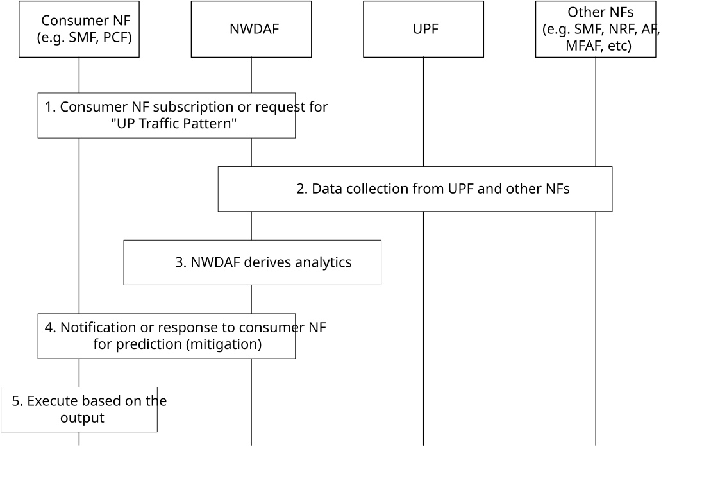

# 6.23 Solution \#23: AI/ML-assisted UP traffic pattern and behaviour analysis

## 6.23.1 High level principles

The high level principles of the solution are:

\- The consumer (e.g. UPF, SMF, PCF) subscribes/requests "UP Traffic Pattern" analytics to the NWDAF.

\- The NWDAF provides Output Analytics from existing and new Input Data from UPF and SMF about the UP pattern data collection based on observed UPF's packet handling, and from AF about the traffic characteristics of different traffic patterns.

\- Based on the Output Analytics, the consumer executes mitigation adjustments.

\- Mitigation actions shall follow operator-configured policies. For UPF as the consumer, only actions not related to Session/QoS are permitted, i.e., UPF does not change any SMF/PCF‑provisioned PDU Session or QoS state (N4/PCC). Actions are limited to operator‑configured local packet handling, e.g. allow, deny, mirroring, auditing, shaping, enabling fast and security‑focused mitigation at the enforcement point while preserving SMF/PCF authority.

\- To reduce the load on Control Plane NFs due to excessive reports from UPF, consumers should utilise Analytics Filters, reporting intervals, measurement duration and thresholds when subscribing/requesting to NWDAF. Additionally, UPF should collect and generate UP pattern data based on threshold limits and the maximum number of anomaly and application traffic information.

## 6.23.2 Description

This solution is for Key Issue#2 for AI/ML-assisted UP traffic pattern and behaviour analysis which the NWDAF is used to train and infer AI/ML models from UPF data and, to provide analytics on user plane traffic patterns, to apply mitigation strategies using analytics, e.g. avoid abnormal or malicious traffic, so as to improve efficient performance of user plane as well as UPF's robustness.

Since UPF processes all UP packets, it has the ability collect and generate a UP pattern data and report to NWDAF based on what is monitors and observes most efficiently accordingly to the PFCP rules and its local configurations.

\- The UP pattern data is a collection of packet information within the measurement duration, e.g. it attempts to capture any potential anomalies locally observed during the measurement period based on primitive thresholds or rules configured by operator. If at least one anomaly is supposedly found, it should list such related information, e.g. unexpected flows and packets and also obtain those related Application(s) made up of n-tuple IP flow(s).

\- Individual per IP flow information is obtained such as total number of packets, volume, directionality, basic stats, packet discarded, buffered information along with associated UPF's resource.

The consumer (e.g. UPF, SMF, PCF) receives a response or notification from the NWDAF's Output Analytics of statistics or predictions. For prediction example, it contains severity or risk level about UP anomalies predicted, along with a list of predicted anomalies of the UP pattern data, each with pattern type, e.g. DDoS, burst, overload type, e.g. Interface queue full in 5s. The example actions of the consumer are described in Table 6.23.3-5.

\- Output Analytics should also reveal which Application caused such predicted anomalies.

\- Load on Control Plane NFs should be monitored and have a separate resource allocation and thresholds for this Analytic, e.g. Analytics Filter, reporting periods, maximum number of UP pattern data's Anomalies, including, e.g. reporting thresholds, receiving only top-N most severity ones, etc.

## 6.23.3 Procedures

### 6.23.3.1 UP pattern data collection from UPF as Input Data to NWDAF

Figure 6.23.3.1-1: UP Pattern data collection by the NWDAF for analytics

1\. The consumer (e.g. UPF, SMF, PCF) subscribe to or sends a request to NWDAF for the "UP traffic pattern" analytics using either Nnwdaf_AnalyticsSubscription_Subscribe or Nnwdaf_AnalyticsInfo_Request service operation. The request additionally includes thresholds such as confidence level.

\- The Analytics ID is set to "UP Traffic Pattern" analytics. The target for analytics reporting is set to be any UE or group of UEs. Analytic Filter, e.g. AoI and/or S-NSSAI and/or DNN, can be provided to reduce Control Plane signalling.

\- The consumer NF can request statistics or/and predictions for a given Analytics target period.

2\. The NWDAF retrieves Input data from UPF and other NFs, using Nnf_EventExposure_Subscribe service operation.

3\. The NWDAF derives the required analytics with the collected data.

4\. The NWDAF invokes Nnwdaf_AnalyticsSubscription_Notify or Nnwdaf_AnalyticsInfo_Request response to the consumer NF for the Output data analytics.

5\. The consumer (e.g. UPF, SMF, PCF) upon receiving the statistic and prediction may execute as described in Table 6.23.3-5.

6\. The UPF may execute mitigation actions not related to Session/QoS, as configured by the operator.

NOTE 1: UPF analytics‑driven mitigation shall not override SMF/PCF control, and any PDU Session Release or UP connection deactivation remains SMF‑initiated as in clauses 4.3.4 and 4.3.7 of TS 23.502 \[3\]

NOTE 2: UPF reports outcomes to SMF via PFCP Usage Reports based on URR triggers (e.g. Dropped DL Traffic Threshold), and to OAM as configured.

The NWDAF collects the Input Data for the UP Pattern data as listed in Table 6.23.3-1.

Table 6.23.3-1: UP Pattern data collected by NWDAF

<table>
<colgroup>
<col style="width: 22%" />
<col style="width: 10%" />
<col style="width: 67%" />
</colgroup>
<tbody>
<tr class="odd">
<td>Information</td>
<td>Source</td>
<td>Description</td>
</tr>
<tr class="even">
<td>UE ID</td>
<td>SMF, UPF</td>
<td>Identifier of the UE (e.g. SUPI) associated for the UP pattern data.</td>
</tr>
<tr class="odd">
<td>UE IP Address</td>
<td>SMF, UPF</td>
<td>UE IP address associated for the UP pattern data.</td>
</tr>
<tr class="even">
<td>S-NSSAI</td>
<td>SMF, UPF</td>
<td>Network Slice associated for the UP pattern data.</td>
</tr>
<tr class="odd">
<td>DNN</td>
<td>SMF, UPF</td>
<td>Data Network Name.</td>
</tr>
<tr class="even">
<td>PDU Session ID</td>
<td>SMF</td>
<td>PDU Session identifier.</td>
</tr>
<tr class="odd">
<td>UPF ID</td>
<td>UPF</td>
<td>IP address or FQDN of the UPF.</td>
</tr>
<tr class="even">
<td>UP pattern data</td>
<td>SMF, UPF</td>
<td>User Plane pattern data collection.</td>
</tr>
<tr class="odd">
<td>&gt; Measurement duration</td>
<td>SMF, UPF</td>
<td>The measurement duration for the UP pattern (timestamp of start and end time).</td>
</tr>
<tr class="even">
<td>&gt; UPF interface info</td>
<td>SMF, UPF</td>
<td>Identifier and address of the UPF interface where UP pattern is observed (e.g. N3 for RAN side, N6 for DN side).</td>
</tr>
<tr class="odd">
<td>&gt; PFCP session info</td>
<td>SMF, UPF</td>
<td>Summary of PFCP session context (e.g. PDR/FAR/QER/URR/BAR) status and any PFCP errors per clause 7.6 of TS 29.244 [14] for the UP pattern.</td>
</tr>
<tr class="even">
<td>&gt; Delay info</td>
<td>SMF, UPF</td>
<td>Delays observed at N6 (N6 Delay), N3/N9 (GTP-U Path), N4 (PFCP HB) Interface per clauses 5.33.8, 5.24.5, 6.2.2 of TS 29.244 [14] for the pattern.</td>
</tr>
<tr class="odd">
<td>&gt; Sampled info</td>
<td>UPF</td>
<td>Information related to the traffic sample rate, if sampling is used.</td>
</tr>
<tr class="even">
<td>&gt; Anomaly info (0..max)</td>
<td>UPF</td>
<td>List of any anomalies locally observed for the UP pattern during the measurement period based on thresholds or rules configured by operator at UPF (each entry describes one anomaly observation).</td>
</tr>
<tr class="odd">
<td>&gt;&gt; Unexpected flow info</td>
<td>UPF</td>
<td>
Anomaly information regarding a traffic persisting unusually long/sort or at very high/low throughput relative to expected usage patterns​. For examples, Long duration &gt;60 secs, Short duration: &lt;1 sec, High rate: &gt; 5000pps, Slow rate: &lt;0.1pps.

It can also be a high/low frequency of new application traffic initiations or service access attempts by the UE's application or application server, e.g. DDoS behaviour, unexpected traffic access outside of its normal usage.
</td>
</tr>
<tr class="even">
<td>&gt;&gt; Unexpected packet info</td>
<td>UPF</td>
<td>Anomaly information regarding traffic targeting an unexpected or unauthorized packet address (e.g. IP, protocol, port, prefix, domain) and packet string (e.g. headers, fields, sizes, malformed, duplicates, unknown, fragmented).</td>
</tr>
<tr class="odd">
<td>&gt; Application traffic info (1..max)</td>
<td>UPF</td>
<td>List of observed Application traffic information communicating with the UE based on thresholds or rules configured by operator at UPF (each entry describes one flow observation).</td>
</tr>
<tr class="even">
<td>&gt;&gt; Per-flow info</td>
<td>UPF</td>
<td>IP flow represented and aggregated by n-tuples, e.g. SrcIP, DstIP, SrcPort, DstPort, Protocol, uni/bi-directionality, URL, total number of packets, their total volume in size and duration. This also implies the address of the application server which have communicated with the UPF.</td>
</tr>
<tr class="odd">
<td>&gt;&gt; Per-flow stats info</td>
<td>UPF</td>
<td>Quartiles and statistics such as average packet size.</td>
</tr>
<tr class="even">
<td>&gt;&gt; Per-flow discarded packet info</td>
<td>UPF</td>
<td>Discarded packets including total number of packets, discarded reasons.</td>
</tr>
<tr class="odd">
<td>&gt;&gt; Per-flow buffered info</td>
<td>UPF</td>
<td>Buffered or queued packets including total number of buffered packets, average buffered time, buffered reasons.</td>
</tr>
<tr class="even">
<td>&gt;&gt; Per-flow temporal behaviour</td>
<td>UPF</td>
<td>Temporal packet behaviour including inter arrival time, jitter, latency related information.</td>
</tr>
<tr class="odd">
<td>&gt;&gt; Per-flow resource info</td>
<td>UPF</td>
<td>Resources related to load, e.g. CPU, Memory, Energy, processing delay, associated for processing the flow.</td>
</tr>
<tr class="even">
<td>&gt;&gt; Syn-Ack signalling info</td>
<td>UPF</td>
<td>Measured syn-ack signalling characteristic of an application traffic communicating with the UE's application, e.g. number of syn-ack packets.</td>
</tr>
<tr class="odd">
<td>&gt;&gt; SSL/TLS fingerprint</td>
<td>UPF</td>
<td>Calculated SSL/TLS fingerprint of an encrypted connection of the traffic flow between the UE and application.</td>
</tr>
</tbody>
</table>

Table 6.23.3-2: Input data from AF related to traffic pattern

| Information                                                               | Source | Description                                                                                                               |     |
|---------------------------------------------------------------------------|--------|---------------------------------------------------------------------------------------------------------------------------|-----|
| UE address distribution                                                   | AF     | For a specific application, the UE address has traffic flow with the application.                                         |     |
| Normal SSL/TLS fingerprint                                                | AF     | SSL/TLS fingerprints of normal traffic flow communicated with the AS.                                                     |     |
| Average and variance of the number of UE communicated with the AS         | AF     | The average and variance of the number of UE communicated with the same AS in a time window.                              |     |
| Traffic pattern Information (1..max)                                      | AF     | Indicates the traffic characteristics of different traffic patterns.                                                      |     |
| \> Traffic flow filter information                                        |        | Identifies the traffic flow from the DN, e.g. application identifier, or packet filter set as defined in TS 23.501 \[2\]. |     |
| \> Traffic life-time                                                      |        | The average duration of the traffic flow.                                                                                 |     |
| \> UL data rate                                                           |        | UL data rate of this traffic flow.                                                                                        |     |
| \> DL data rate                                                           |        | DL data rate of this traffic flow.                                                                                        |     |
| \> Maximum burst size                                                     |        | Maximum data burst volume of the traffic flow.                                                                            |     |
| \> Burst periodicity                                                      |        | Average burst periodicity of the traffic flow.                                                                            |     |
| NOTE 1: Alternatively, NWDAF can have above information by configuration. |        |                                                                                                                           |     |

The NWDAF notifies/responses the Output Analytics to the consumer NF as listed in Tables 6.23.3-3 and 6.23.3-4.

Table 6.23.3-3: Output Analytics of UP Traffic Pattern statistics

|                                        |                                                                                                                                                                                               |
|----------------------------------------|-----------------------------------------------------------------------------------------------------------------------------------------------------------------------------------------------|
| Information                            | Description                                                                                                                                                                                   |
| Time slot entry (1..max)               | List of time slots during the Analytics target period.                                                                                                                                        |
| \> Time slot start                     | Time slot start within the Analytics target period.                                                                                                                                           |
| \> Duration                            | Duration of the time slot.                                                                                                                                                                    |
| \> Severity                            | Identified severity/risk level, e.g. Information, Warning, High, Critical.                                                                                                                    |
| \> UPF ID                              | Identified UPF ID.                                                                                                                                                                            |
| \> Pattern info (0..max)               | Identified whether the traffic type is normal or abnormal and if abnormal list of detected anomalies analysed in the UP pattern data, each entry describes one identified anomalies analysed. |
| \>\> UP pattern type                   | UP pattern type, e.g. DDoS, misbehaving server/UE, burst, malformed packets, unknown packets, duplicate packets, fragmented packets, etc.                                                     |
| \>\> Overload type                     | Detected overloads, e.g. CPU overloaded, NIC queue full, etc.                                                                                                                                 |
| \>\> Application traffic info (0..max) | Identified list of detected Application traffic information in the UP pattern data.                                                                                                           |
| \>\>\> IP packet filter set            | IP packet filter set.                                                                                                                                                                         |

Table 6.23.3-4: Output Analytics of UP Traffic Pattern predictions

|                                                  |                                                                                                                                                                                              |
|--------------------------------------------------|----------------------------------------------------------------------------------------------------------------------------------------------------------------------------------------------|
| Information                                      | Description                                                                                                                                                                                  |
| Time slot entry (1..max)                         | List of time slots during the Analytics target period.                                                                                                                                       |
| \> Time slot start                               | Time slot start within the Analytics target period.                                                                                                                                          |
| \> Duration                                      | Duration of the time slot.                                                                                                                                                                   |
| \> UPF ID                                        | Identified UPF ID.                                                                                                                                                                           |
| \> Predicted severity                            | Predicted severity/risk level, e.g. Informative, Warning, High, Critical.                                                                                                                    |
| \> Predicted Pattern info (0..max)               | Predicted whether the traffic type is normal or abnormal and if abnormal list of detected anomalies analysed in the UP pattern data, each entry describes one identified anomalies analysed. |
| \>\> UP pattern type                             | Predicted UP pattern type, e.g. DDoS, misbehaving server/UE, burst, malformed packets, unknown packets, duplicate packets, fragmented packets, etc.                                          |
| \>\> Overload type                               | Predicted overloads, e.g. CPU overloads in 20s, queue full in 5s, etc.                                                                                                                       |
| \>\> Predicted application traffic info (0..max) | Predicted list of Application traffic information in the UP pattern data.                                                                                                                    |
| \>\>\> IP packet filter set                      | IP packet filter set.                                                                                                                                                                        |
| \> Confidence                                    | Confidence of this prediction.                                                                                                                                                               |

Table 6.23.3-5: Example action of the consumer

<table>
<colgroup>
<col style="width: 22%" />
<col style="width: 77%" />
</colgroup>
<thead>
<tr class="header">
<th>Consumer</th>
<th>Example of actions</th>
</tr>
</thead>
<tbody>
<tr class="odd">
<td>SMF</td>
<td>
Instruct the UPF for:

- BAR adjustment, e.g., adjust Downlink Data Report messages delay, queue and buffering size.

- Selective packet drops e.g. anomaly packet(s).

- Overload controls, e.g. reduce UPF load.

- Re-selections, e.g. to less loaded UPF.

- Traffic suppression, e.g. interface pps thresholds.

- PDR resources, e.g. load balancing.

e.g. based on N4 rules during the traffic life time.
</td>
</tr>
<tr class="even">
<td>PCF</td>
<td>Generates or updates the PCC rules which includes the filter of abnormal traffic and sends it to the SMF. The created or updated PCC rules may indicate to drop packet from the abnormal traffic filter (e.g. change the gate status of the abnormal traffic to close) or degrade the QoS level of the abnormal traffic filter (e.g. modify the 5QI or limit the DL-MBR of the abnormal traffic) during the traffic life time.</td>
</tr>
<tr class="odd">
<td>UPF</td>
<td>Apply operator-configured policies (e.g. drop, rate-limit, deny), adjust packet processing resources, mirror suspicious/attack/fraud/phishing packets for security audits, and/or regard as error/partial failure to trigger UPF-initiated PFCP Session Release per clause 5.18.2 of TS 29.244 [14].</td>
</tr>
</tbody>
</table>

## 6.23.4 Impacts on services, entities and interfaces

**UPF:**

\- Collects UP pattern data upon request from NWDAF.

\- Sends the UP pattern data as Input Data for reporting to NWDAF.

**NWDAF:**

\- Supports providing subscriptions and/or requests of the "UP Traffic Pattern" analytics.

\- Supports deriving statistics and/or predictions for the consumer NF's requests.

**Consumer NF:**

\- Supports subscribing /requesting "UP traffic pattern" analytics to NWDAF and receives notification/response from the NWDAF.

\- Supports executing the action based on the Output Analytics from NWDAF.
