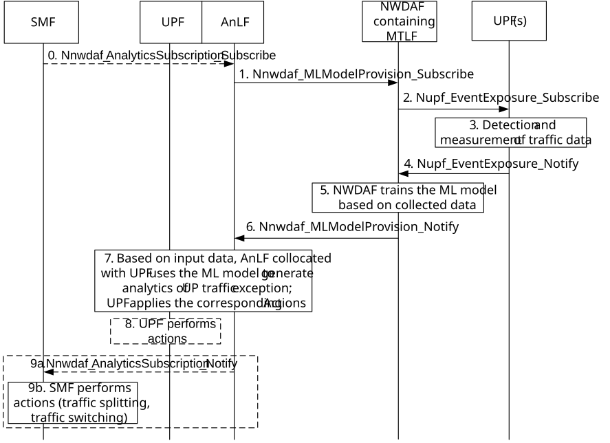

# 6.24 Solution \#24: Collocation of UPF and NWDAF containing AnLF to support efficient performance of User Plane

## 6.24.1 High level principles

The NWDAF containing MTLF is used to train ML model of User Plane Traffic Exception.

The UPF is collocated with NWDAF containing AnLF and it is used to generate analytics result of User Plane Traffic Exception based on the ML model from the NWDAF containing MTLF.

Based on the analytics result of User Plane Traffic Exception, the consumer performs corresponding mitigation actions to handle burst, malicious or suspicious traffic.

## 6.24.2 Description

### 6.24.2.0 General

This solution is to address Key Issue#2: AI/ML-assisted user plane traffic pattern and behaviour analysis to support efficient performance of User Plane.

Since UPFs in the network have plenty observed information and measurements data about UP traffic, the NWDAF containing MTLF can use these input data from UPFs to train ML model of User Plane Traffic Exception. This ML model will be provided to NWDAF containing AnLF to generate analytics of User Plane Traffic Exception by performing ML model inference process.

However, considering latency and big data volume of input data reporting from UPF to the NWDAF containing AnLF during ML model inference process, this solution proposes to collocate the UPF and the NWDAF containing AnLF together. In this case, the ML model from the NWDAF containing MTLF will be offloaded to UPF collocated with AnLF, then the UPF can generate analytics result itself and this result can assist the consumer to perform some corresponding mitigation actions, e.g. handle burst, malicious (e.g., DDoS) or suspicious traffic.

### 6.24.2.1 Input Data

Table 6.24.2.1-1: Input data collected by NWDAF

|                              |          |                                                                                                                                                                                        |
|------------------------------|----------|----------------------------------------------------------------------------------------------------------------------------------------------------------------------------------------|
| Information                  | Source   | Description                                                                                                                                                                            |
| UE ID                        | SMF, UPF | Identifier of the UE (e.g. SUPI) associated with the collected UP-related data.                                                                                                        |
| UE IP Address                | SMF, UPF | IP address assigned to the UE for the observed UP-related data.                                                                                                                        |
| S-NSSAI                      | SMF, UPF | Single Network Slice Selection Assistance Information associated with the observed UP-related data.                                                                                    |
| DNN                          | SMF, UPF | Data Network Name corresponding to the PDU Session.                                                                                                                                    |
| PDU Session ID               | SMF      | Identifier of the PDU Session.                                                                                                                                                         |
| UPF ID                       | UPF      | Identifier of the UPF (e.g. IP address or FQDN).                                                                                                                                       |
| UP related data              | SMF, UPF | User Plane–related data collected for a traffic flow. May include one or more of the following:                                                                                        |
| \> Abnormal packet indicator | UPF      | Wrong or malformed or duplicated packets.                                                                                                                                              |
| \> Traffic description       | UPF      | Detailed description of the observed traffic, e.g. IP tuple (SrcIP, DstIP, SrcPort, DstPort, Protocol). (IP 5-tuple or 3-tuple)                                                        |
| \> Traffic direction         | UPF      | Indicates the direction of traffic, i.e. uplink or downlink                                                                                                                            |
| \> Duration                  | SMF, UPF | Observation time range for the collected data (start and end timestamps).                                                                                                              |
| \> UPF interface info        | SMF, UPF | Identifier and address of the UPF interface where traffic was observed (e.g. N3 for RAN side, N6 for DN side).                                                                         |
| \> Delay information         | SMF, UPF | Latency observed at relevant interfaces, e.g. N6 (N6 Delay), N3/N9 (GTP-U path delay), N4 (PFCP Heartbeat delay), as defined in clauses 5.33.8, 5.24.5, and 6.2.2 of TS 29.244 \[14\]. |
| \> Sampled info              | UPF      | Information related to the traffic sample rate, if sampling is used.                                                                                                                   |
| \> Traffic volume            | UPF      | Total traffic size (including average, maximum, minimum).                                                                                                                              |
| \> Number of packets         | UPF      | Total number of packets within the observed traffic.                                                                                                                                   |

NOTE: Additional input data types and their descriptions can be considered as described in Solution \#23.

### 6.24.2.2 Output data

Table 6.24.2.2-1: Output Analytics of UP Traffic Exception statistics

|                          |                                                                                                           |
|--------------------------|-----------------------------------------------------------------------------------------------------------|
| Information              | Description                                                                                               |
| Time slot entry (1..max) | List of time slots during the Analytics target period.                                                    |
| \> Exception type        | Indicates the exception, i.e. one of burst, malicious, suspicious.                                        |
| \> Exception level       | Indicate the severity level of exception, e.g. low, medium, high.                                         |
| \> Time slot start       | Time slot start within the Analytics target period.                                                       |
| \> Duration              | Duration of the time slot.                                                                                |
| \> traffic description   | Information describing the observed traffic for identification. May include one or more of the following: |
| \>\> UPF ID              | Identifier of the UPF where the traffic was observed.                                                     |
| \>\> PDU session ID      | Identifier of the PDU Session related to the traffic.                                                     |
| \>\> Qos flow ID         | Identifier of the QoS Flow related to the traffic.                                                        |
| \>\> IP tuple            | IP flow information, e.g. SrcIP, DstIP, SrcPort, DstPort, Protocol. (IP 5-tuple or 3-tuple)               |

Table 6.24.2.2-2: Output Analytics of UP Traffic Exception predictions

|                          |                                                                                                           |
|--------------------------|-----------------------------------------------------------------------------------------------------------|
| Information              | Description                                                                                               |
| Time slot entry (1..max) | List of time slots during the Analytics target period.                                                    |
| \> Exception type        | Indicates the type of exception, i.e. one of burst, malicious, suspicious.                                |
| \> Exception level       | Indicate the severity level of exception, e.g. low, medium, high.                                         |
| \> Time slot start       | Time slot start within the Analytics target period.                                                       |
| \> Duration              | Duration of the time slot.                                                                                |
| \> traffic description   | Information describing the observed traffic for identification. May include one or more of the following: |
| \>\> UPF ID              | Identifier of the UPF where the traffic was observed.                                                     |
| \>\> PDU session ID      | Identifier of the PDU Session related to the traffic.                                                     |
| \>\> Qos flow ID         | Identifier of the QoS Flow related to the traffic.                                                        |
| \>\> IP tuple            | IP flow information, e.g. SrcIP, DstIP, SrcPort, DstPort, Protocol. (IP 5-tuple or 3-tuple)               |
| \> Confidence            | Confidence of this prediction.                                                                            |

NOTE: It is up to implementation for exception traffic determination (e.g. based on the number of packets to a same IP destination and number of duplicated packets to determine malicious traffic, based on an uncommon IP destination and wrong/malformed packet indication to determine suspicious traffic).

### 6.24.2.3 Example actions

Table 6.24.2.3-1: Examples of NF actions for exception traffic mitigation

<table>
<colgroup>
<col style="width: 20%" />
<col style="width: 21%" />
<col style="width: 57%" />
</colgroup>
<thead>
<tr class="header">
<th>Exception type</th>
<th>Analytics consumer</th>
<th>Example actions of consumers</th>
</tr>
</thead>
<tbody>
<tr class="odd">
<td>Burst traffic</td>
<td>SMF</td>
<td>
The SMF may perform traffic splitting or traffic switching.

For the traffic splitting, the SMF may use ULCL mechanism to route some traffic to a new UPF to mitigate the load of the original UPF, as described in clause 4.3.5.4 of TS 23.502 [3].

For the traffic switching, the SMF may change the PSA UPF from the UPF suffering from burst traffic to a new UPF for some PDU session to mitigate the load of original UPF. The SMF may perform different session modification procedures based on the different SSC mode of PDU session as described in clause 4.3.5 of TS 23.502 [3].
</td>
</tr>
<tr class="even">
<td>Malicious traffic</td>
<td>UPF</td>
<td>The UPF may drop the traffic based on malicious traffic description.</td>
</tr>
<tr class="odd">
<td></td>
<td>SMF</td>
<td>The SMF may instruct UPF to drop or block the traffic related to the malicious traffic.</td>
</tr>
<tr class="even">
<td>Suspicious traffic</td>
<td>SMF</td>
<td>The SMF may perform traffic redirection for further traffic analysis or traffic isolation as described in clause 6.1.3.12 of TS 23.503 [4].</td>
</tr>
</tbody>
</table>

## 6.24.3 Procedures

### 6.24.3.1 Support of efficient performance of User Plane by collocating UPF and NWDAF containing AnLF

Figure 6.24.3.1-1: Support of efficient performance of User Plane by collocating UPF and NWDAF containing AnLF

0\. \[Optional\] SMF could be the analytics consumer and subscribes to the NWDAF containing AnLF collocating with UPF for analytics result of User Plane Traffic Exception, by invoking the Nnwdaf_AnalyticsSubcription_Subscribe service operation. The subscription request may include the exception type to indicate the type of exception, e.g. burst, malicious and suspicious, and filter information, e.g. target time interval and reporting information.

1\. AnLF collocated with UPF subscribes to NWDAF containing MTLF for a trained ML Model of User Plane Traffic Exception, by invoking the Nnwdaf_MLModelProvision_Subscribe service operation.

2\. To train the ML model of User Plane Traffic Exception, the NWDAF containing MTLF collects input data from UPF(s), by invoking the Nupf_EventExposure_Subscribe service operation.

3-4. The UPF(s) collects user plane traffic pattern data (e.g. UPF local data, N3 measurements, N6 measurements, as defined in table 6.24.2.1-1) and notifies the NWDAF containing MTLF by invoking the Nupf_EventExposure_Notify service operation.

NOTE 1: To avoid much impacts on UPF performance and reduce signalling load for data reporting, the data reporting from UPF for ML model training can be done during off-peak time.

NOTE 2: N3 measurements, e.g. UL/DL packet drop rate GTP-U, UL/DL packet delay GTP as defined in existing specifications don't have new RAN impacts.

Editor's note: If it is feasible to train models outside peak hours but still update models quick enough for new observed malicious traffic is FFS. Whether and what other solutions to reduce data reporting load for model training are FFS.

5\. NWDAF containing MTLF trains ML model of User Plane Traffic Exception based on training data collected from data sources e.g. UPFs.

6.The NWDAF containing MTLF provides the trained ML model to the AnLF collocated with UPF, by invoking Nnwdaf_MLModelProvision_Notify service operation.

7\. Based on the ML model from the NWDAF containing MTLF, the UPF collocated with AnLF collects user plane traffic pattern data, e.g. UPF local data, N3 measurements, N6 measurements, etc. as input data for ML model inference. Then the AnLF collocated with UPF generates analytics result of User Plane Traffic Exception based on the ML model. The consumer (e.g. the UPF) performs specific action related to the User Plane Traffic Exception.

The interactions between a collocated UPF and AnLF are performed using existing SBA services. For example, the UPF may invoke the Nnwdaf_AnalyticsSubscription service to request analytics results for a User Plane Traffic Exception, while the NWDAF containing the AnLF may invoke the Nupf_EventExposure service to collect the corresponding input data.

NOTE 3: It is optional to collocate UPF and AnLF for minimizing the load on Control Plane, and if the UPF and AnLF are not collocated, other methods for minimizing the load on Control Plane should be used.

8\. \[Optional\] After receiving the analytics results of malicious or suspicious traffic, the UPF may perform actions related to the User Plane Traffic Exception, such as dropping malicious traffic or send the suspicious traffic information to the SMF, as described in table 6.24.2.3-1. The UPF analytics‑driven mitigation shall not override SMF/PCF control.

9a. \[Optional\] If the SMF has subscribed to the analytics result of User Plane Traffic Exception in step 0, the NWDAF containing AnLF shall send the analytics results to the SMF to indicate the User Plane Traffic Exception.

9b. \[Optional\] After receiving the User Plane Traffic Exception notification from the NWDAF containing AnLF, the SMF may perform specific actions based on exception type, such as traffic splitting, traffic switching for burst traffic and traffic redirection, as described in table 6.24.2.3-1.

## 6.24.4 Impacts on services, entities and interfaces

**NWDAF containing AnLF(collocated with UPF):**

\- Retrieves ML model for Traffic pattern from NWDAF containing MTLF.

\- Generates analytics of User Plane Traffic Exception based on the ML model.

**NWDAF containing MTLF:**

\- Trains and provides ML model of User Plane Traffic Exception.

**UPF:**

\- Executes mitigation actions corresponding to the traffic exception notification.

**SMF:**

\- Executes mitigation actions, e.g. traffic splitting, traffic switching and traffic redirection.
