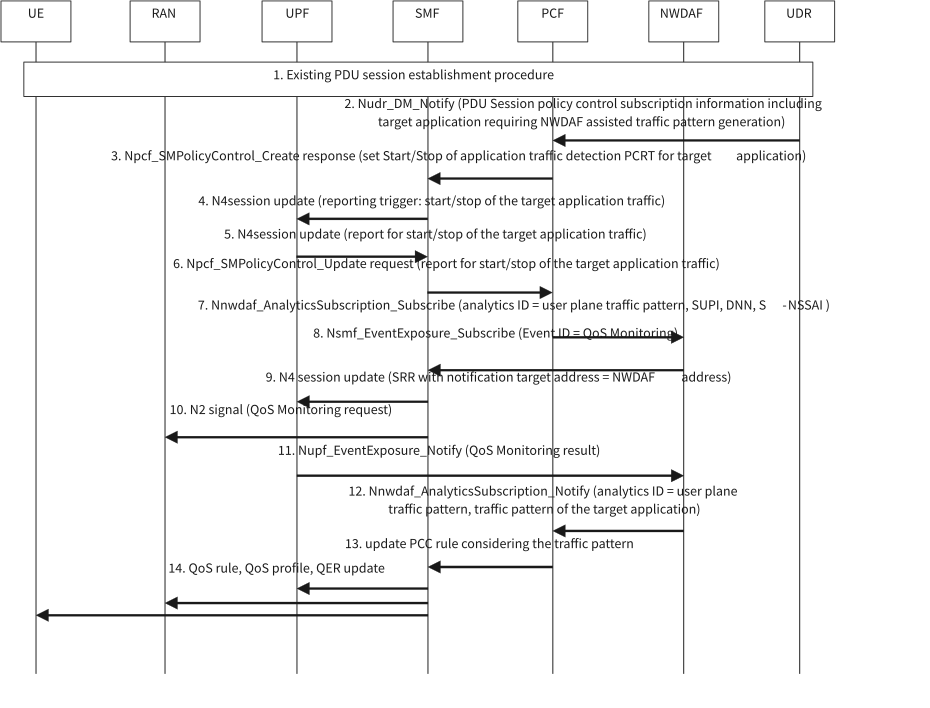

# 6.25 Solution 25: NWDAF assisted traffic pattern generation for user plane performance optimization

## 6.25.1 High level principles

The high level principles of the solution are:

\- The PCF subscribes and retrieves traffic pattern related analytics from the NWDAF and creates/updates PCC rule based on the analytic result.

\- The NWDAF provides Analytic output of traffic pattern for target application(s) based on QoS monitoring result from UPF and N6 delay from SMF.

## 6.25.2 Description

This solution resolves Key Issue \#X about how to analyse traffic pattern and update the QoS control of target application(s) with the assistance of NWDAF. This solution enhances the NWDAF to analysis traffic pattern based on QoS monitoring result and N6 delay and the PCF retrieves the traffic pattern for QoS control.

Based on target application(s) in the PDU Session policy control subscription information or by configuration, which requires NWDAF assisted traffic pattern generation, the PCF subscribes traffic pattern related analytic from NWDAF and updates PCC rule based on the traffic pattern prediction or statistics. The NWDAF can predict the bitrate related requirement of the application according to network status. For example, the bitrate will decrease based on high packet delay which may cause down speed of TCP sender. The NWDAF subscribes to SMF of the QoS monitoring result and N6 delay for traffic pattern analytic. Based on the Analytic output of traffic pattern from NWDAF, PCF could create/update PCC rule for target application(s) (e.g. mapping maximum burst size and maximum flow bitrate in the traffic pattern to MDBV and MBR as described in clause 5.27.3 of TS 23.501 \[2\]).

## 6.25.3 Procedures

The procedure is described in Figure 6.25.3-1.

Figure 6.25.3-1: Procedure for NWDAF assisted traffic pattern generation

1\. UE PDU session is established via existing PDU session establishment procedure.

2-3. The PCF retrieves the PDU Session policy control subscription information from the UDR and may get the target application(s) identified by Application ID(s) which requires NWDAF assisted traffic pattern generation. If so, the PCF provides PCC rule(s) for these Application ID(s) (e.g. with the same parameters as used for the match-all PCC rule, apart from the precedence) and sets Start/Stop of application traffic detection PCRT and QoS Monitoring PCRT as defined in clause 6.1.3.5 of TS 23.503 \[4\] in the SMF. As an alternative, PCF may make such PCC decision based on configuration.

4\. Based on these PCC rule(s) received and the PCRT from PCF, SMF configures UPF to report the start of traffic from target application(s) as described in clause 6.2.2.2 of TS 23.503 \[4\].

7\. when the PCF is notified about the start of target application(s) detection, PCF subscribes to NWDAF for the user plane traffic pattern of the target application(s). The PCF also provides DNN, S-NSSAI of the PDU session and SUPI to the NWDAF for SMF discovery.

8\. After subscribed by PCF, the NWDAF discovers the SMF serving the PDU session as described in clause 6.2.8 of TS 23.288 \[5\]. The NWDAF subscribes to the SMF for QoS monitoring result and optional N6 delay result of the target application(s) (e.g. packet delay, data rate, congestion information). The input for the analytic is described in Table 6.25.3-1.

9-10. SMF starts QoS monitoring as described in clause 5.45 of TS 23.501 \[2\]. If the NWDAF also subscribes for N6 delay and N6 delay measurement assistance information of the target application is applicable, the SMF starts N6 delay measurement as described in clause 5.8.2.23 of TS 23.501 \[2\].

11\. The UPF notifies to NWDAF the QoS monitoring result as described in clause 5.8.2.18 of TS 23.501 \[2\]. If SMF started N6 delay measurement in step 10, the UPF notifies to SMF the N6 delay and the SMF further notifies to NWDAF.

12\. NWDAF provides the Analytic output as described in Table 6.25.3-2 of user plane traffic pattern for the target application(s) based on QoS monitoring result and notifies to PCF.

13\. PCF creates/updates PCC rule for target application(s) based on the traffic pattern provided from NWDAF (e.g. mapping maximum burst size and maximum bitrate in the traffic pattern to MDBV and MBR as described in clause 5.27.3 of TS 23.501 \[2\]).

14\. SMF updates QoS rule, QoS profile and QER on UE, RAN, UPF respectively based on the updated PCC rule via existing QoS framework.

Table 6.25.3-1: Input data from UPF related to user plane traffic pattern analytic

| Information                  | Source | Description                                                                                                                                                                             |
|------------------------------|--------|-----------------------------------------------------------------------------------------------------------------------------------------------------------------------------------------|
| Packet Filter Set            | UPF    | Identifies the traffic flow of the UE communicating with target application(s), as defined in clause 5.7.6 of TS 23.501 \[2\].                                                          |
| UL/DL/roundtrip packet delay | UPF    | UL/DL/roundtrip packet delay generated by QoS monitoring as defined in clause 5.45 of TS 23.501 \[2\].                                                                                  |
| Congestion information       | UPF    | congestion information (i.e. a percentage of congestion level) generated by QoS monitoring as defined in clause 5.45 of TS 23.501 \[2\].                                                |
| UL/DL data rate              | UPF    | UL/DL data rate generated by QoS monitoring as defined in clause 5.45 of TS 23.501 \[2\].                                                                                               |
| Reporting period             | UPF    | Measurement period of the QoS monitoring as defined in clause 5.8.2.18 of TS 23.501 \[2\]. This can be used to provide burst analysis.                                                  |
| Packet Interval              | UPF    | (Optional) The interval value (e.g. minimum, maximum, average and/or variance value) between packets with the traffic flow. This can be used to provide periodicity and burst analysis. |

Table 6.25.3-1: Input data from SMF related to user plane traffic pattern analytic

| UL/DL/roundtrip N6 packet delay | SMF | UL/DL/roundtrip N6 packet delay generated by N6 delay measurement mechanism as defined in clause 5.8.2.23 of TS 23.501 \[2\]. |
|---------------------------------|-----|-------------------------------------------------------------------------------------------------------------------------------|

Table 6.25.3-2: Output data for user plane traffic pattern prediction

| Information                                           | Description                                                                                                                 |
|-------------------------------------------------------|-----------------------------------------------------------------------------------------------------------------------------|
| Packet Filter Set                                     | Identified the service data flow of the target application(s), as defined in clause 5.7.6 of TS 23.501 \[2\]).              |
| Traffic pattern                                       | Traffic pattern of the target application(s), as defined in of TS 23.503 \[4\] and TS 23.501 \[2\].                         |
| \> Maximum Bitrate                                    | Requested Maximum Bitrate (UL, DL) as defined in clause 6.1.3.22 of TS 23.503 \[4\] of the target application(s).           |
| \> Guaranteed Bitrate                                 | Requested Guaranteed Bitrate (UL, DL) as defined in clause 6.1.3.22 of TS 23.503 \[4\] of the target application(s).        |
| \> Maximum Burst Size                                 | Maximum Burst Size as defined in clause 6.1.3.22 of TS 23.503 \[4\] of the target application(s).                           |
| \> 5GS delay                                          | Requested 5GS delay (UL, DL) as defined in clause 6.1.3.22 of TS 23.503 \[4\] of the target application(s).                 |
| \> Packet Error Rate                                  | Requested Packet Error Rate (UL, DL) as defined in clause 6.1.3.22 of TS 23.503 \[4\] of the target application(s).         |
| \> Periodicity                                        | (Optional) Periodicity as defined in clause 5.27 of TS 23.501 \[2\] of the traffic for target application(s) if applicable. |
| Start time and validity period of the traffic pattern | Start time and validity period of the analysed traffic pattern.                                                             |

## 6.25.4 Impacts on services, entities and interfaces

**PCF:**

\- Subscribes to NWDAF for the Analytic output of traffic pattern for target application(s) requiring NWDAF assisted traffic pattern generation.

\- Updates PCC rule based on the traffic pattern provided from NWDAF as described in clause 6.25.2.

**NWDAF:**

\- Provides Analytic output of traffic pattern based on QoS monitoring result and (optional) N6 delay.

**UDR:**

\- (Optional) Stores the target application(s) requiring NWDAF assisted traffic pattern generation in the PDU Session policy control subscription information and provides to PCF.

**UPF:**

\- (Optional) Report Packet Interval to the NWDAF.
