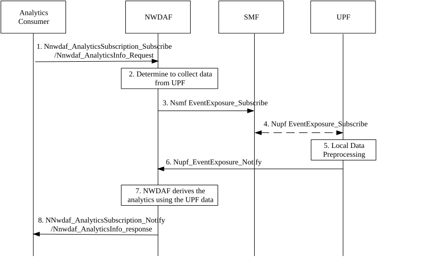

# 6.26 Solution \#26: User plane analytics derivation with efficient UP data collection

## 6.26.1 High level principles

The high-level principles of the proposed solution are as follows:

\- The existing mechanisms such as Processing & Formatting Instructions or bulk data transfer is not applicable when UPF is the data source. Accordingly, the main idea of the proposed solution is to extend the UPF event exposure services in a similar way that instead of sending raw UP information from the UPF to the NWDAF, the UPF may pre-process the data (in a manner which facilitates the ML model training/inference in the NWDAF) and sends the result of the pre-processing to reduce the signalling overhead.

\- In this solution, to derive UP related analytics using UP data by the NWDAF, the NWDAF sends a data collection request to the UPF, which also may include data pre-processing instructions (including the UPF local ML model(s) as an implementation option) that specify how the information required for model training/inference in the NWDAF should be obtained from the raw (packet-level) data in the UPF.

\- The UPF performs the local data processing and reports the locally pre-processed data to the NWDAF based on the received instructions.

## 6.26.2 Description

This solution addresses the key issue#2.

In this Release, NWDAF can derive analytics to optimize user plane (UP) performance using information provided by UPF such as UP traffic pattern, traffic information and application traffic measurement information. However, the detailed packet-level raw data of UP traffic for ML model training/inference is huge, so, as the key issue also described, a solution that minimizes the load on control plane (CP) NFs is required. To address this aspect of the issue, solutions would avoid sending large raw (packet-level) data from the UPF to the NWDAF.

One approach to reduce the signalling overhead of data transfer from UPF to NWDAF is to locally process the data in the UPF and send the pre-processed data to the NWDAF. Similar mechanisms are already specified in TS 23.288 \[5\] including the Formatting/Processing instructions of DCCF and bulk data transfer for NWDAF, DCCF/MFAF, ADRF. However, they are not applicable for UP analytics due to the following reasons:

\- Even if DCCF is used for data collection, the large volume of unprocessed data should be transferred from the UPF to the DCCF that cause significant signalling overhead.

\- The capabilities are specified only for NWDAF, DCCF/MFAF and ADRF. The UPF services do not support such capability to process data before exposing the consumer (e.g. NWDAF).

\- The existing formatting/processing instruction in DCCF are generic but for the UP analytics, the data can be pre-processed in a way that facilitate ML model training and/or inference in the NWDAF, i.e. the pre-processing can be Analytics specific.

Based on these observations, this solution proposes an analytics derivation mechanism based on efficient data collection from the UPF; wherein, the NWDAF sends the data collection request to the UPF, which may also include local data pre-processing instructions that specify local data pre-processing requirements for the UPF to obtain the information required for the analytics. It should be noted that the local data pre-processing instructions may depends on the Analytics ID and corresponding performance metrics (e.g. for a certain level of model accuracy, aggregated information within a relatively large time-window may be sufficient).

The following list is an example of what may be included in the local data pre-processing instructions. Based on the analytics and considering factors such as the trade-off between signalling overhead vs. pre-processing load, etc. different kind of data pre-processing can be performed locally by the UPF following the pre-processing instructions from NWDAF. The NWDAF decide whether to provide instructions or not based on internal logic or operator policy.

\- Data volume instructions: Instructions specifying the amount of data to be sent by UPF e.g. maximum amount of data, samples per data batch, total number of data batches, etc.

\- Sampling instructions: Instructions how to sample the UPF data. Examples of sampling instructions include Sampling Method (Periodic sampling, Event-driven sampling, etc.), Sampling Interval, Sampling Ratio, etc.

\- Statistical feature extraction instructions: Instructions how to statistically aggregate the UPF data. Examples of data aggregation methods include Feature type aggregation (Mean, median, variance, standard deviation, max, min, etc.). For example, this aggregation can be applied to data measured for values such as packet size, packet inter-arrival time, flow duration, packet loss, etc. for QoS flow or PDU level metrics, and time window to compute the features. In other words, it is possible to aggregate measurement data corresponding to a specific flow and calculate aggregate data such as averages and variances.

\- Compression and/or encoding instructions: Instructions for setting up the Compression/Encoding algorithm settings of UPF data.

\- Local ML model: If the UPF deployed local ML model as a implementation option, the NWDAF may ask the UPF to locally process the data using a specified ML Model(s), and the outputs of the local ML model are used as input of the ML model in the NWDAF.

## 6.26.3 Procedures

Figure 6.26.3-1 shows the procedure of the proposed solution where the indirect (via SMF) subscription to the UPF events is used. The same mechanism of providing the local pre-processing instructions to the UPF is also applicable for direct subscription to the UPF event exposure and also when the SMF configures the UPF via PFCP reporting.

Figure 6.26.3-1: User plane analytics derivation with UP data

1\. Analytics consumer requests or subscribes for a UP analytics ID to the NWDAF using either Nnwdaf_AnalyticsSubscription service or Nnwdaf_AnalyticsInfo.

2\. If the request is authorized and in order to provide the requested analytics, the NWDAF determine whether to collect data from UPF for derive the analytics. Based on the analytics ID, corresponding requested ML model performance metric and NWDAF internal logic (considering the NWDAF load, etc.), the NWDAF may also prepare local data pre-processing instructions, which may also include information about local ML model (e.g., or the ID of the ML model which is already available in UPF).

NOTE 1: How to train or provision the ML model for UPF is implementation option in this release.

3\. If the NWDAF determined to collect the UP data in step 2, the NWDAF sends the Nsmf EventExposure_Subscribe with local data pre-processing instructions that indicates the information needed for the analytics e.g. time period, statistical characteristics, and local ML model inference in UPF.

4\. The SMF received the request from the NWDAF selects the PDU session(s) and UPF as data sources. The SMF sends the request to the UPF using Nupf EventExposure_Subscribe or N4 PFCP Session Establishment/ Modification Request containing usage Reporting Rules including the local data pre-processing instructions in step 3.

5\. The UPF collects the raw data and then processes the raw data based on the local pre-processing instructions received from the NWDAF to obtain the required information.

6\. The UPF sends the locally collected and pre-processed data to the NWDAF using Nupf_EventExposure_Notify.

NOTE 2: Contents of the pre-processed data (e.g. if the pre-processed data contain a traffic pattern ID) needs to be determined in the evaluation phase.

7\. The NWDAF derives requested analytics using collected data which may also include the output of the UPF local ML model outputs.

8\. The NWDAF provides the analytics using either the Nnwdaf_AnalyticsInfo_Request response or Nnwdaf_AnalyticsSubscription_Notify, depending on the service used in step 1.

## 6.26.4 Impacts on services, entities and interfaces

**NWDAF:**

\- Generates the local pre-processing instructions (including UPF local ML models) based on analytics required from the analytics consumer.

\- Sends the local data pre-processing instructions to the UPF (via SMF).

**SMF:**

\- Sends the local data pre-processing instructions to the UPF.

**UPF:**

\- Pre-processes the local data following the instructions from the data consumer.

\- Sends the pre-processed data to the SMF or data consumer.

\- Extending service to send the pre-processed data to the data consumer.

\- Run local ML model to provide input to the NWDAF to derive the UP analytics.
