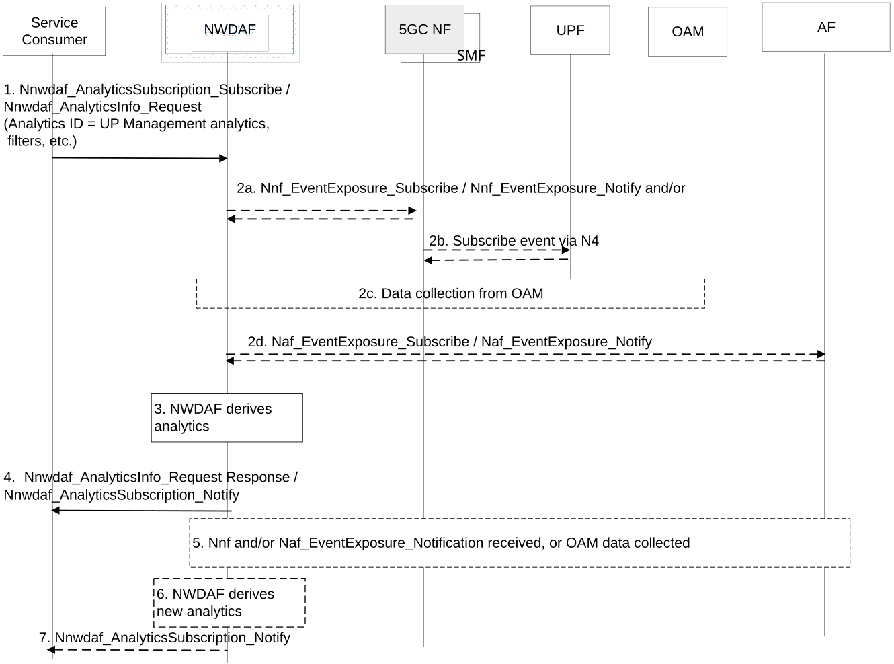

# 6.27 Solution \#27: Support of user plane management analytics

## 6.27.1 High level principles

In this contribution, a new NWDAF-based analytics, plane management analytics, is introduced to support user plane management, including.

\- Based on consumer's request, the user plane management analytics is able to provide the statistics and predictions of the characteristics of the traffic to be transferred via user plane, UP healthy status, cause of (potential) UP performance degradation, etc.

\- The consumer may take the outputs of the user plane management analytics into account to mitigate or prevent the user plane issues, reserve or allocated resources for user plane date transfer, update corresponding policies; and therefore, to maintain the health working condition of user plane and the corresponding UPF.

\- In order to derive the analytics outputs, the NWDAF may collect the relevant input data from different data sources, e.g. UPF, SMF, NRF OAM, AF, etc.

\- Corresponding procedure is also detailed in this contribution.

## 6.27.2 Description

### 6.27.2.1 General Description of UP Management Analytics

This solution aims to address the issues in KI#2, including:

\- How to provide analytics (e.g. enhancing existing in TS 23.288 \[5\] or introducing new) including the aspects of required inputs/outputs to improve performance of user plan.

\- Which consumers can subscribe/request the analytics and how the consumers use the analytics to take actions to improve user plane performance.

\- Whether and how to train ML models and perform the inference for the user plane analytics, considering solutions that minimize the load on Control Plane NFs.

Based on the two use cases of KI#2 documented in clause 5.1 of TR 23.700-04, the abnormal packets may cause some issues such as UE malfunctions, UPF performance degradation and system errors. Therefore, it would be beneficial to provide the statistics and/or perdition information of traffic characteristics from/to the application server. By taking this information into account, the network can take action to improve the network performance; for example the network would be able to allocate or reserve sufficient resources for data transmission, determine the appropriate configuration for user plane management. It would be also helpful to provide the statistics and/or perdition of UP working status and the corresponding causes of (potential or detected) UP failure or UP performance degradation. Therefore, the consumer of the analytics could take the above information into account to maintain the healthy working condition of user plane in a failure preventative manner.

The traffic characteristics may include the UL/DL/ round trip of: Data Burst Size, traffic patterns, traffic volume or the number of data packets, traffic rate (e.g. packet rate, bit flow rate, etc.), delay, loss rate, throughput, packet size distribution, jitter, (average) packet interval, etc.

The service consumer of the analytics may be a UPF, SMF, PCF, OAM, etc.

The consumer of these analytics indicates the following information in the request or subscription:

\- Analytics ID = "User Plane Management"

\- Target of Analytics Reporting: a list of NF instance ID(s) or NF Set ID(s), any UE, specific UE or group of UEs. E.g. the UPF (instance/set) IDs (list of) SUPIs or GPSIs.

\- Optional, matrix for UP performance level evaluation, e.g. the thresholds of the parameters of traffic characteristics.

\- Optional, application ID(s).

\- Optional, Area of Interest (AOI(s)).

\- Analytics Filter Information optionally includes:

\- (list of) UPF ID(s) .

\- DNN

\- Area of Interest (AOI(s))

\- S-NSSAI and NSI ID

\- RAT Type

\- List of analytics subsets that are requested, (see clause 6.27.2.3).

\- IP Packet Filter Set or PDR

\- An Analytics target period indicates the time period over which the analytics are requested.

\- In a subscription, the Notification Correlation Id and the Notification Target Address are included.

\- Optionally, reporting Thresholds, which apply only for subscriptions and indicate conditions on the levels to be reached for the reporting of respective analytics subsets (see clause 6.23.3 of TS 23.288 \[5\]).

### 6.27.2.2 Input Data

The NWDAF supporting UP management analytics shall be able to collect information from AF, OAM and 5GC NFs.

Table 6.27.2.2-1: Input data related to UPF performance

<table>
<colgroup>
<col style="width: 31%" />
<col style="width: 21%" />
<col style="width: 47%" />
</colgroup>
<thead>
<tr class="header">
<th>Information</th>
<th>Source</th>
<th>Description</th>
</tr>
</thead>
<tbody>
<tr class="odd">
<td>UPF info</td>
<td>UPF/ SMF/NRF</td>
<td>Identifying the UPF(s) that is associated to the collected information, e.g. the NF instance ID(s) or NF set ID(s) of the UPF(s), or the IP address or FQDN of the UPF.</td>
</tr>
<tr class="even">
<td>UPF load</td>
<td>NRF</td>
<td>Load information indicates the current load of the UPF, e.g. CPU, memory, or percentage of load information.</td>
</tr>
<tr class="odd">
<td>DL/ UL Throughput</td>
<td>UPF/ AF</td>
<td>The throughput UL/DL over the measurement period, .e.g. peak value or average value.</td>
</tr>
<tr class="even">
<td>UPF service area</td>
<td>UPF/ NRF</td>
<td>The service area information of the corresponding UPF(s).</td>
</tr>
<tr class="odd">
<td>Capacity GTP</td>
<td>UPF/ OAM</td>
<td>The maximum achievable UL and/or DL GTP transmission rate between PSA UPF and NG-RAN and between PSA UPF and UE, e.g. as defined in clause 6.3.11 of TS 28.554 [16].</td>
</tr>
<tr class="even">
<td>Data transmission over N3 interface</td>
<td>UPF/ OAM</td>
<td>Data packets or traffic volume of incoming and/or outgoing GTP data packets on the N3 interface (from (R)AN to UPF), e.g. as defined in clause 5.4.1 of TS 28.552 [15].</td>
</tr>
<tr class="odd">
<td>Data loss over N3 interface</td>
<td>UPF/ OAM</td>
<td>Incoming GTP Data Packet Loss or Rejection in UPF and/or outgoing GTP Data Packet Loss that are not successfully received at gNB over N3, e.g. as defined in clause 5.4.1 of TS 28.552 [15].</td>
</tr>
<tr class="even">
<td>Throughput of N3 interface</td>
<td>UPF/ OAM</td>
<td>Upstream and/or downstream throughput at N3 interface, e.g. as defined in clauses 6.3.3 and 6.3.4 of TS 28.554 [16].</td>
</tr>
<tr class="odd">
<td>Data transmission over N6 interface</td>
<td>UPF/ OAM</td>
<td>The link usage of N6 interface, including the usage of incoming traffic and/or outgoing traffic, e.g. as defined in clause 5.4.2 of TS 28.552 [15].</td>
</tr>
<tr class="even">
<td>N4 interface information</td>
<td>SMF/ OAM</td>
<td>The N4 interface information may include the number of requested, successful or failed N4 session establishments and/or N4 session reports, e.g. as defined in clause 5.4.3 of TS 28.552 [15].</td>
</tr>
<tr class="odd">
<td>Data transmission over N9 interface</td>
<td>UPF/ OAM</td>
<td>
The Number of incoming and/or outgoing GTP data packets on the N9 interface associated to the PSA UPF, e.g. as defined in clause 5.4.4.2 of TS 28.552 [15].

This may include the overall, successful or failed data packets transfer.
</td>
</tr>
<tr class="even">
<td>Delay</td>
<td>SMF/UPF/ OAM</td>
<td>
The UL/DL/ round trip delay between UPF and NG-RAN, or between UE and UPF, e.g. as defined in clauses 5.4.7, 5.4.8 and 5.4.9 of TS 28.552 [15] or collected from UPF/ SMF.

The delay could be the values of average, distribution, maximum, or variance.
</td>
</tr>
<tr class="odd">
<td>Time stamp or measurement period</td>
<td>UPF/SMF/NRF/OAM</td>
<td>The associated timing information of the collected information.</td>
</tr>
</tbody>
</table>

Table 6.27.2.2-2: Input data related to the service flow via user plane

<table>
<colgroup>
<col style="width: 31%" />
<col style="width: 21%" />
<col style="width: 47%" />
</colgroup>
<thead>
<tr class="header">
<th>Information</th>
<th>Source</th>
<th>Description</th>
</tr>
</thead>
<tbody>
<tr class="odd">
<td>Application info</td>
<td>UPF/ AF</td>
<td>
Identifying the application associated to traffic/ service flow, e.g. application ID, IP address or FDQN of the application.

The data transmission might be from or to the application server.
</td>
</tr>
<tr class="even">
<td>UE IDs</td>
<td>SMF/ UPF/ AF</td>
<td>Identifying the UE(s) (e.g. SUPIs, GPSIs) that are associated to the corresponding data transmission from/to the application server(s).</td>
</tr>
<tr class="odd">
<td>Transport protocol information</td>
<td>SMF/UPF/AF/</td>
<td>The transport protocol associated to the traffic transmission, e.g. RTP, SRTP, TCP, UDP, DCCP, SCTP, QUIC, etc.</td>
</tr>
<tr class="even">
<td>IP Packet Filter Set or PDR</td>
<td>UPF/ AF</td>
<td>IP Packet Filter set as defined in clause 5.8.2 of TS 23.501 [2] or the PDR for traffic detection at UPF.</td>
</tr>
<tr class="odd">
<td>Data communication type</td>
<td>SMF/UPF/AF</td>
<td>Identify the data communication type, e.g. IP type, Ethernet type, or unstructured type data communication.</td>
</tr>
<tr class="even">
<td>Traffic characteristics</td>
<td>UPF/ AF</td>
<td>The traffic characteristics may include the UL/DL/ round trip of: Data Burst Size, traffic patterns, traffic volume or the number of data packets, traffic rate (e.g. packet rate, bit flow rate, etc.), packet delay, loss rate, throughput, etc. within the measurement period.</td>
</tr>
<tr class="odd">
<td>Variation of traffic characteristics</td>
<td>UPF/ AF</td>
<td>The variation or standard deviation of the parameters belong to traffic characteristics within the measurement period, e.g. the variation of the traffic volume or data burst size, etc. within a given time period.</td>
</tr>
<tr class="even">
<td>(Abnormal) data packet information</td>
<td>UPF</td>
<td>
For example, malformed packets, duplicate packets, packet retransmission, traffic hijacking and traffic spoofing.

The UPF may report the abnormal data packet base on operation's pre-configuration or information in consumer's request.
</td>
</tr>
<tr class="odd">
<td>Time stamp or measurement period</td>
<td>UPF/SMF/NRF/OAM</td>
<td>The associated timing information of the collected information</td>
</tr>
</tbody>
</table>

Editor's note: It is FFS whether and how the UPF can detect traffic hijacking and traffic spoofing.

NOTE: UPF reports the specific data based on subscription from NWDAF by using, e.g. analytics filter, to reduce UPF reporting load.

### 6.27.2.3 Output Analytics

The NWDAF shall be able to provide the statistics and/or predictions on UP management analytics to consumer NFs, as defined in Table 6.27.2.3-1.

Table 6.27.2.3-1: Statics and/or predictions of UP management analytics

<table>
<colgroup>
<col style="width: 39%" />
<col style="width: 60%" />
</colgroup>
<thead>
<tr class="header">
<th>Information</th>
<th>Description</th>
</tr>
</thead>
<tbody>
<tr class="odd">
<td>Time slot entry (1..max)</td>
<td>List of time slots during the Analytics target period.</td>
</tr>
<tr class="even">
<td>&gt; Time slot start</td>
<td>Time slot start within the Analytics target period.</td>
</tr>
<tr class="odd">
<td>&gt; Duration</td>
<td>Duration of the time slot.</td>
</tr>
<tr class="even">
<td>&gt; UP performance (1...max)</td>
<td>
The statics and/or prediction of UP performance.

Max. is the number of UPFs.
</td>
</tr>
<tr class="odd">
<td>&gt;&gt; UPF info</td>
<td>Identifying the UPF(s) that is associated to the output analytics, e.g. the NF instance ID(s) or NF set ID(s) of the UPF(s), or the IP address or FQDN of the UPF.</td>
</tr>
<tr class="even">
<td>&gt;&gt; Application info</td>
<td>Identifying the application server(s) associated to the output analytics e.g. application ID, IP address or FDQN of the application.</td>
</tr>
<tr class="odd">
<td>&gt;&gt; UE ID</td>
<td>The UE(s) (e.g. SUPIs or GPSIs) that are associated to the traffic flow via UP.</td>
</tr>
<tr class="even">
<td>&gt;&gt; Transport protocol information</td>
<td>The transport protocol associated to the traffic transmission from/to the corresponding application server, e.g. RTP, SRTP, TCP, UDP, DCCP, SCTP, QUIC, etc.</td>
</tr>
<tr class="odd">
<td>&gt;&gt; Traffic characteristics</td>
<td>The statics and/or prediction of traffic characteristics over the relevant interfaces associated to the UPF, e.g. N3, N6, N9. N4 interfaces.</td>
</tr>
<tr class="even">
<td>&gt;&gt; UP performance level</td>
<td>The indicator that reflects the working condition of UP and/or the associated UPF, e.g. high/medium/low performance level. The higher performance level indicates a lower probability of failure and vice versa.</td>
</tr>
<tr class="odd">
<td>&gt;&gt; Cause</td>
<td>The cause of potential/ detection UP performance degradation, e.g. unexpected service flow, unexpected traffic volume or burst size, etc.</td>
</tr>
<tr class="even">
<td>&gt;&gt; Confidence</td>
<td>For prediction, the confidence of this prediction.</td>
</tr>
</tbody>
</table>

## 6.27.3 Procedures

Figure 6.27.3-1: Procedure for providing UP management Analytics

1\. The Consumer NF, e.g. UPF, SMF, requests or subscribes to UP management analytics from NWDAF (via NEF in the case that the consumer NF is an untrusted AF) and provides the request input information as specified in clause 6.27.2.1 to NWDAF.

2a. The NWDAF may subscribe to the service data from 5GC NFs, e.g. SMF, UPF, etc. as defined in clause 6.27.2.2 by invoking the corresponding NF event exposure service operations.

2b. The SMF may subscribe to QoS Monitoring information from UPF using the N4 Session level Reporting procedure defined in TS 23.502 \[3\]. The UPF notifies the subscribed event report directly to the NWDAF.

2c. The NWDAF may collect data from the OAM following the procedure captured in clause 6.2.3.2 of TS 23.288 \[5\].

2d. The NWDAF may subscribe to the service data from AF by invoking Nnef_EventExposure_Subscribe or Naf_EventExposure_Subscribe service (Event ID = UP management analytics, Application ID, Event Filter information, etc.) as defined in TS 23.502 \[3\].

3\. The NWDAF derives the requested analytics based on NWDAF internal logic and based on operator policies.

4\. The NWDAF provides the requested analytics to the consumer NF, using either Nnwdaf_AnalyticsInfo_Request response or Nnwdaf_AnalyticsSubscription_Notify, depending on the service operation used in step 1.

After receiving the analytics results, the consumer NF may take the following actions:

\- The UPF as a consumer may control the number of DLDR (Downlink Data Report) messages sent to SMF by e.g. adjusting message frequency; or apply downlink traffic suppression (e.g. selective packet dropping) for AS-initiated traffic bursts..

\- The SMF as a consumer may initiate UPF reselection to distribute the load across UPF instances upon detecting abnormal traffic patterns (e.g. RTT fluctuations, abnormal PPS).

\- The SMF as a consumer may identify anomalies and take preventive actions, e.g. notifying UPF to execute traffic gating or shaping, enforcing maximum data rate (e.g. rate limiting to 5Mbps) or adjusting QoS parameters.

\- The PCF as a consumer may provision policies to SMF, e.g. executing traffic gating or shaping, enforcing bandwidth parameters (e.g. rate limiting to 5Mbps) or adjusting QoS parameters.

5-7. If the consumer NF subscribes to UP Management Analytics in step 1, once the NWDAF generates new output analytics, it provides the new analytics via Nnwdaf_AnalyticsSubscription_Notify to the Consumer NF.

## 6.27.4 Impacts on services, entities and interfaces

**NWDAF:**

\- Support UP management analytics.

\- Collect defined input data to derive the output of UP management analytics from 5GC NFs, AF and OAM.

\- Expose outputs of UP management analytics to consumer, based on consumer request.

**UPF, SMF, PCF:**

\- Request outputs of UP management analytics from NWDAF, based on its internal logic.

\- Take the outputs of UP management analytics into account for UP management, based on its internal logic.
