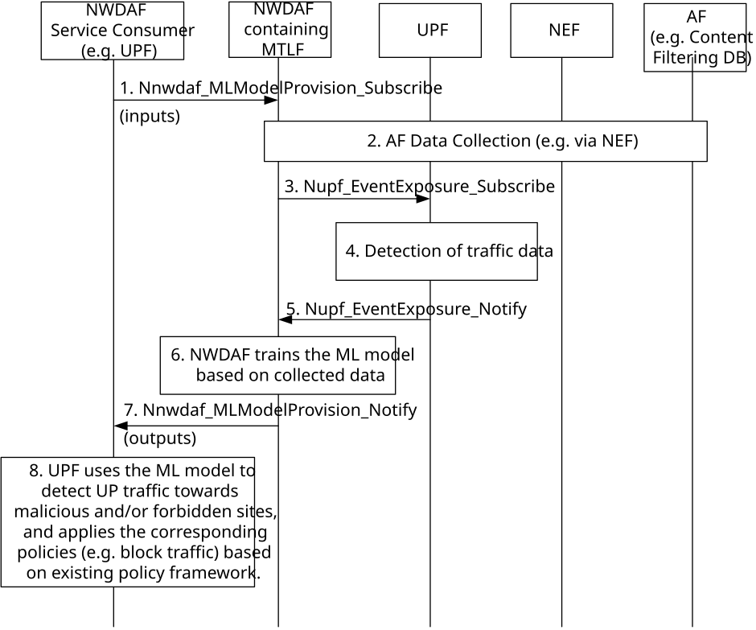

# 6.28 Solution \#28: Analysis of user plane traffic towards malicious and/or forbidden sites

## 6.28.1 High Level principles

The high level principles of this solution are as follows:

\- A consumer (i.e. UPF) retrieves a trained ML Model which allows detection of UP traffic towards malicious and/or forbidden sites either from NWDAF (MTLF).

\- The training of this ML Model is performed based both on AF data (e.g. a Content filtering DB) and UPF data (e.g. UP traffic parameters).

\- The UPF uses this ML Model for detection of user plane traffic to malicious or forbidden sites in real-time (e.g. on a per flow basis).

\- The UPF applies corresponding actions (e.g. block) for the detected traffic, based on existing policy framework.

## 6.28.2 Description

This solution aims the following aspects for KI#1:

\- UPF retrieving the ML Model is a solution to minimize the load for doing inference in the control plane.

This solution proposes a 5GC enhancement to support analysis of user plane traffic towards websites or services that are deemed harmful, illicit, or restricted, specifically:

\- Malicious Sites: These are sites that host malware, phishing or other harmful activities designed to compromise user devices, steal information, or disrupt services. Traffic directed towards such sites can lead to security breaches, data theft, or system infections.

\- Forbidden Sites: These are sites that are restricted by policy, law, or regulation. Examples include sites that host illegal content, violate intellectual property rights, or are restricted due to geographical or organizational policies.

Editor's note: Whether and how can UPF use the model is FFS.

Editor's note: Which the input and output of the model is FFS.

Editor's note: Whether there is the relationship with the AnalyticsID on PFD determination, if so which the relationship is FFS.

## 6.28.2 Procedures

Figure 6.28.2-1 depicts the procedure for the proposed solution, for the specific case UPF (acting as NWDAF Service Consumer) requests a ML Model for UPF-based detection of traffic towards malicious and/or forbidden sites, where the ML Model is trained by an NWDAF containing MTLF.

Editor's note: Whether the UPF can retrieve a ML Model from OAM is FFS.

Editor's note: How to avoid extensive signalling load between NWDAF and UPF during training is FFS.

Figure 6.28.2-1: Proposed solution for retrieval of a trained ML Model from NWDAF with inference at UPF

1 NWDAF Service Consumer (UPF) subscribes to NWDAF containing MTLF for a trained ML Model related to detection of user plane traffic towards malicious and/or forbidden sites, by invoking the Nnwdaf_MLModelProvision_Subscribe service operation, including the following input data:

\- Indication to request a model for detection of traffic towards malicious and/or forbidden sites, including the traffic of interest (e.g. content filtering categories and/or parental control categories like adult, violence, etc.).

Editor's note: The indication to request a model for detection of traffic towards malicious and/or forbidden sites is FFS.

\- Optionally, Vendor ID, ML Model Filter Information (e.g. Area of Interest), Target of ML Model Reporting, ML Model Target Period, Time when model is needed and ML Model Monitoring Information.

\- If vendor specific information is required, then the ML Model Interoperability Information is included.

\- If the UPF supports multiple AI/ML Models, indication of support for multiple ML Models, optionally with Number of ML Models and Accuracy level(s) of Interest.

When a ML Model subscription is received, the NWDAF containing MTLF may:

\- determine whether existing trained ML Model(s) can be used for the subscription then steps 2 to 6 are skipped; or

\- determine whether triggering further training for the existing trained ML Models is needed for the subscription;

If the service invocation is for a subscription modification or subscription cancelation, the NWDAF service consumer includes an identifier (Subscription Correlation ID) to be modified in the invocation of Nnwdaf_MLModelProvision_Subscribe.

Editor's note: What the trigger to step 1 is for the UPF to request a trained ML Model is FFS.

2\. If the NWDAF containing MTLF determines that further training is needed, this NWDAF may initiate data collection from AF (via NEF if AF is external/untrusted) to retrieve information relative to malicious and/or forbidden sites (e.g. Content filtering DB).

3\. The NWDAF containing MTLF may also collect input data from UPF to retrieve user plane traffic information, by invoking the Nupf_EventExposure_Subscribe service operation, including as eventType="USER_DATA_USAGE_MEASURES" and the target SUPIs. This data might be relevant for ML Model training, e.g. to know the weight relative to the information retrieved from AF.

NOTE: It is assumed both UPF event subscription and reporting applies per SUPI, but optimizations (to minimize signalling) as discussed by CT4 can also be applied.

4-5. The UPF collects data for the above event and notifies NWDAF by invoking the Nupf_EventExposure_Notify service operation, including the eventType="USER_DATA_USAGE_MEASURES" and the event information, e.g. 5-tuple(s), SNI(s), URL(s) for the target SUPIs.

6\. The NWDAF containing MTLF, based on collected data and e.g. by correlating the information about the list of forbidden or malicious sites and the usage per application retrieved from the UPF, trains the ML Model which allows UPF to detect user plane traffic towards malicious and/or forbidden sites.

7\. NWDAF containing MTLF notifies the NWDAF Service Consumer (e.g. UPF) by invoking the Nnwdaf_MLModelProvision_Notify service operation, including the following information:

\- ML Model identifier and ML Model Information;

\- Optionally, ML Model Filter Information and/or Target of ML Model Reporting, if the ML Model provisioning request includes multiple ML Model Filter Information and/or Target of ML Model Reporting;

\- Optionally, Indication of whether the ML Model identifier is updated (e.g. retrained ML model);

\- Optionally, Validity period, Spatial validity, ML Model accuracy Information.

8\. The NWDAF Service Consumer (e.g. UPF), based on the above information, retrieves the ML Model and uses it to detect in real-time (e.g. on a per traffic flow basis) user plane traffic towards malicious and/or forbidden sites. It is assumed UPF applies the corresponding policies (e.g. block traffic towards malicious and/or forbidden sites) based on existing policy framework (e.g. via a PCC rule for an application ID relative to malicious and/or forbidden sites).

## 6.28.3 Impacts on services, entities and interfaces

**NWDAF containing MTLF:**

\- New ML Model which allows UPF to detect UP traffic towards malicious and/or forbidden sites, which is trained based both on AF data (e.g. a Content filtering DB) and UPF data (e.g. UP traffic parameters).

\- New procedure to retrieve from AF (via NEF if AF is external/untrusted) information relative to malicious and/or forbidden sites (e.g. a Content filtering DB) and from UPF to retrieve input data related to the usage of an application traffic.

\- Correlate the information about the list of forbidden or malicious sites and the usage per application retrieved from the UPF.

**UPF:**

\- Retrieval (either from NWDAF containing MTLF or via OAM (depending on coordination with SA WG5) of the trained ML Model to detect traffic towards malicious and/or forbidden sites,

\- Use the trained ML Model to detect traffic towards malicious and/or forbidden sites.

\- Enforcement of policies (e.g. block traffic towards malicious and/or forbidden sites) based on existing policy framework (e.g. via a PCC rule for an application ID relative to malicious and/or forbidden sites).

**NEF:**

\- New procedure to enable NWDAF containing MTLF to retrieve from AF information relative to malicious and/or forbidden sites (e.g. a Content filtering DB).

Editor's note: Whether the NWDAF retrieves content filtering DB information via NEF is FFS.
