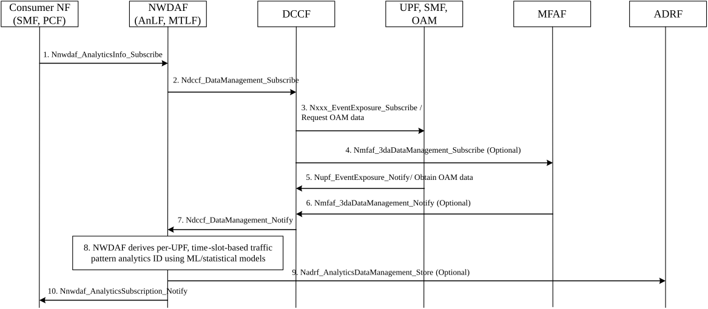

# 6.29 Solution \#29: NWDAF-assisted Analytics for Efficient User Plane Performance

## 6.29.1 High level principles

The high-level principles of the solution are:

\- Some user plane traffic (e.g. IoT, live video, encrypted flows) is bursty or irregular, making static rules such as PDR and QER insufficient.

\- Encrypted traffic (e.g. QUIC, TLS) limits DPI-based classification, potentially resulting in QoS misalignment or inefficient UPF resource allocation.

\- Static DLDR (Downlink Data Report, as defined in TS 29.244 \[14\]) or shaping configurations may cause delay or packet loss under dynamic traffic conditions.

\- The UPF can export statistical and behavioural traffic indicators to the NWDAF, which analyses them using ML or statistical models.

\- The analytics output can help detect unstable or unrecognized flows, such as malformed or abnormal packet streams, which may impact UPF performance or resource integrity.

\- Based on the analytics, consumer NFs (e.g. SMF, PCF) can adapt traffic-handling parameters such as DLDR, QER, FAR, or initiate mitigation for abnormal traffic.

## 6.29.2 Description

This solution supports the analysis of user plane traffic patterns, primarily enabling dynamic QoS adaptation, while also allowing detection of anomalies if needed.

The NWDAF collects traffic indicators from the UPF, SMF and OAM via DCCF, optionally mediated by MFAF. Input includes flow-level metrics such as packet rate, burstiness, flow stability, drop causes, protocol information and QoS alignment context.

The NWDAF processes the data using AI/ML models or statistical algorithms and generates output analytics structured per time slot. Each time slot may include per-UPF analytics results for multiple UEs and application flows. These results contain flow stability indicators, protocol-level insights, predicted idle behaviour, abnormal packet indicators and confidences.

The analytics output is structured as shown in Table 6.29.1.2-1 and can be used by consumer NFs (PCF, SMF) as follows:

\- PCF: To reassess or adjust QER, 5QI assignment, shaping profiles, or DLDR configuration via PCC rules, based on traffic analytics or anomaly flags.

\- SMF: To modify FARs, reassess forwarding behaviour, or update UP path configurations in cases of burstiness, idle prediction, or QoS profile mismatch (e.g. 5QI misalignment).

NWDAF does not directly control policy or forwarding logic. The consumer NFs interpret and apply the analytics in accordance with operator policies.

### 6.29.2.1 Input Data

To support AI/ML-based traffic analysis, NWDAF can collect data from network functions (NFs) and OAM, including data from MDT.

Table 6.29.2.1-1: NWDAF Input Data for UP Traffic Pattern Analysis

|                                             |               |                                                                                                                                   |
|---------------------------------------------|---------------|-----------------------------------------------------------------------------------------------------------------------------------|
| Information                                 | Source        | Description                                                                                                                       |
| UE IP Address                               | SMF, UPF      | IP address assigned to the UE, used to associate traffic flows.                                                                   |
| SUPI (within PDI)                           | SMF, UPF      | Subscription Permanent Identifier in the Packet Detection Information, uniquely identifying the UE.                               |
| DL TEID                                     | UPF           | Downlink Tunnel Endpoint Identifier used in GTP-U for packet forwarding.                                                          |
| N6 DL Packet Info (5-tuple + header)        | UPF           | Contains source/destination IP addresses, ports and protocol. Application-layer headers may be available depending on encryption. |
| Packet Count (UL/DL, N3/N6)                 | UPF, OAM      | Number of packets observed on N3 and N6 interfaces, for uplink and downlink.                                                      |
| QoS Flow Info (5QI, QFI, ARP)               | SMF, UPF      | Parameters used to define QoS characteristics of each flow.                                                                       |
| QER Info (GBR, shaping, discard, buffering) | UPF           | QoS Enforcement Rule settings such as guaranteed bit rate, shaping behaviour, discard handling and buffer use.                    |
| FAR / BAR                                   | UPF, SMF      | PFCP rules used to forward or buffer packets as per session context.                                                              |
| DL Usage Threshold Crossing                 | SMF, UPF      | Triggered when downlink usage exceeds a threshold; may help detect bursty flows.                                                  |
| Flow End                                    | SMF, UPF      | Marks the termination of a flow; used for resource release or analytics.                                                          |
| Congestion Notification                     | SMF, UPF      | Indicates congestion in the UPF or RAN. May be inferred from queue depth or packet drops.                                         |
| UL/DL Volume, Duration                      | UPF, OAM      | Total traffic volume and session duration per direction.                                                                          |
| Jitter                                      | OAM, UPF      | Variation in packet arrival delay. Can be derived per TS 29.244 \[14\], depending on implementation.                              |
| UE Registration / Mobility State            | AMF           | Indicates whether the UE is registered, idle, connected, or suspended.                                                            |
| Paging Event Count                          | AMF, OAM      | Number or frequency of paging events observed for the UE.                                                                         |
| Packet drop cause                           | UPF, SMF      | Indicates why packets were dropped (e.g. invalid header, unknown dest).                                                           |
| UPF load                                    | UPF, OAM, NRF | CPU usage, buffer depth, or throughput metrics indicating load.                                                                   |
| Malformed packet count                      | OAM, UPF      | Number of packets dropped or flagged due to protocol violations (e.g. invalid headers, checksum errors).                          |

NOTE: Encrypted traffic (e.g. QUIC, TLS) is classified based on observable metadata such as 5QI, port, packet size and timing-not by inspecting payload.

Editor's note: How to minimize signalling load from UPF reporting (e.g. one-time or continuous, DCCF) is FFS.

Editor's note: How to determine that the traffic for encrypted services is abnormal or not is FFS.

### 6.29.2.2 Output Analytics

Table 6.29.2.2-1: Output Analytics of UP Traffic Pattern (statistics and prediction)

|                                |                                                                                                                                                                                                                                                                                            |
|--------------------------------|--------------------------------------------------------------------------------------------------------------------------------------------------------------------------------------------------------------------------------------------------------------------------------------------|
| Information                    | Description                                                                                                                                                                                                                                                                                |
| Time slot entry (1..max)       | List of time slots during the Analytics evaluation period.                                                                                                                                                                                                                                 |
| \> Time slot start             | Start of the slot.                                                                                                                                                                                                                                                                         |
| \> Duration                    | Duration of the slot.                                                                                                                                                                                                                                                                      |
| \> Per-UPF analytics (1..max)  | Analytics generated per UPF per time slot.                                                                                                                                                                                                                                                 |
| \>\> UPF ID                    | Identified UPF (NF Instance ID or IP).                                                                                                                                                                                                                                                     |
| \>\> Application info          | Application ID, FQDN (e.g. video_server.example.com), or IP.                                                                                                                                                                                                                               |
| \>\> UE ID                     | SUPI/GPSI associated with flow.                                                                                                                                                                                                                                                            |
| \>\> Transport protocol        | Transport-layer protocol observed in the flow, e.g. TCP, UDP, QUIC.                                                                                                                                                                                                                        |
| \>\> Abnormal packet indicator | Indicates whether unclassified, malformed, or suspicious packet flows were detected during the slot. Value: Yes / No.                                                                                                                                                                      |
| \>\> Traffic burst index       | Categorized burstiness level of the traffic pattern: High / Medium / Low.                                                                                                                                                                                                                  |
| \>\> Flow stability score      | Indicates how consistent the traffic is over time: Stable / Medium / Unstable.                                                                                                                                                                                                             |
| \>\> Idle state prediction     | Likelihood that the session may enter an idle state, useful for DLDR tuning: High / Medium / Low.                                                                                                                                                                                          |
| \>\> QoS suitability indicator | Indicates whether the currently assigned QoS parameters (e.g. 5QI, QER, ARP) appear suitable for the flow, based on observable metrics such as packet size, inter-arrival time and burst level. This is an estimation and does not rely on DPI. Values: Suitable / Uncertain / Unsuitable. |
| \>\> Policy-related field      | Relevant QoS control field that may be reviewed by the consumer NF (e.g. QER, DLDR, FAR).                                                                                                                                                                                                  |
| \>\> Timestamp of observation  | The time at which the traffic observation or prediction applies.                                                                                                                                                                                                                           |
| \>\> Confidence                | Confidence level (if prediction applied).                                                                                                                                                                                                                                                  |

Table 6.29.2.2-2: Example Use of NWDAF Analytics by Consumer NFs

|             |                                                                                                                                                                                                                                                        |
|-------------|--------------------------------------------------------------------------------------------------------------------------------------------------------------------------------------------------------------------------------------------------------|
| Consumer NF | Typical Use of NWDAF Analytics                                                                                                                                                                                                                         |
| SMF         | May use traffic behaviour analytics (e.g. burstiness, idle prediction, abnormal flow indicators) to optimize UPF handling. This includes adjusting DLDR timers, updating FAR configurations, or triggering path reassessment based on operator policy. |
| PCF         | May interpret traffic indicators to revise PCC rules, adjust QER shaping levels, or deprioritize flows when traffic does not align with QoS expectations. Policy-driven mitigation actions may be considered for abnormal or unclassified traffic.     |

## 6.29.2 Procedures

Figure 6.29.2.1-1: Data Collection and Analytics for UP Traffic Behaviour using NWDAF

1\. A Consumer NF (e.g. SMF or PCF) sends a Nnwdaf_AnalyticsSubscription_Subscribe request to the NWDAF to subscribe to UP traffic behaviour analytics (e.g. burst level, flow stability, idle prediction).

2\. Upon receiving the subscription, the NWDAF determines the required data and subscribes to DCCF using Ndccf_DataManagement_Subscribe. This message instructs the DCCF to coordinate data collection from appropriate source NFs.

3\. The DCCF then sends subscription requests to the relevant data-producing NFs such as UPF, SMF and OAM using either: Nupf_EventExposure_Subscribe, Nsmf_EventExposure_Subscribe depending on the nature of the data (e.g. flow stats, session info, KPIs).

4\. (Optional) If direct SBI subscription is not feasible (e.g. due to protocol mismatch or legacy systems), the DCCF may utilize the Messaging Framework Adaptor Function (MFAF) to intermediate data subscription using Nmfaf_3daDataManagement_Subscribe.

5\. The subscribed source NFs, OAM begin sending their reports to the DCCF using: Nupf_EventExposure_Notify, Nsmf_EventExposure_Notify.

6\. (Optional) Alternatively, if MFAF was used, it forwards the received data to DCCF via Nmfaf_3daDataManagement_Notify.

7\. DCCF aggregates or filters the collected data as needed and sends it to NWDAF via Ndccf_DataManagement_Notify.

8\. NWDAF processes the input data, possibly invoking trained internal ML models and derives per-UPF, time-slot-based traffic behaviour analytics (e.g. burst level, idle probability, QoS match). A new Analytics ID may be assigned to represent the computed analytics set.

9\. The analytics output can be optionally stored in the ADRF (Analytics Data Repository Function) via Nadrf_AnalyticsDataManagement_Store for reuse or historical analysis.

10\. Finally, NWDAF delivers the structured analytics output to the subscribing Consumer NF.

NOTE: OAM data is obtained via DCCF using implementation-specific interfaces, as defined in TS 28.552 \[15\]. No standard SBI exists for direct NWDAF-OAM interaction.

## 6.29.3 Impact on services, entities and interfaces

**NWDAF:**

\- Collects traffic-related indicators from UPF, SMF, OAM.

\- Analyses user plane traffic behaviour using AI/ML or statistical models.

\- Generates analytics for each UPF, UE and application flow, structured per time slot. The analytics include burstiness, flow stability, idle prediction, QoS match level and flags indicating unknown or potentially abnormal traffic.

\- Exposes analytics to consumer NFs via Nnwdaf_AnalyticsSubscription or Nnwdaf_AnalyticsInfo interfaces.

\- Supports indirect inference of UE state (e.g. idle or congested) based on indicators such as DL usage, jitter, discard count, or paging activity.

**Consumer NFs (e.g. SMF, PCF):**

\- Subscribe to or request traffic behaviour analytics from NWDAF.

\- Interpret analytics results to determine whether adjustment of QER, DLDR, FAR, or shaping is needed.

\- Update relevant control or policy rules via existing interfaces.

\- Take mitigation actions such as flow throttling or FAR-based drop if analytics indicate traffic anomalies or unrecognized flows.

**UPF:**

\- Acts as both data source and policy executor by SMF.

\- Applies the updated DLDR, QER, or FAR configurations based on instructions from SMF or PCF.

\- May export burst, drop cause, or abnormal packet statistics as part of NWDAF input data.
