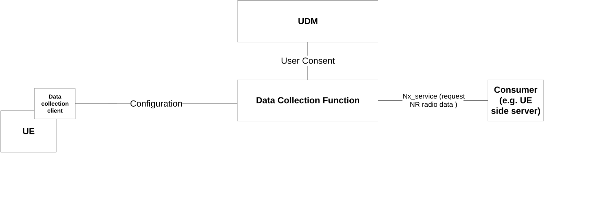
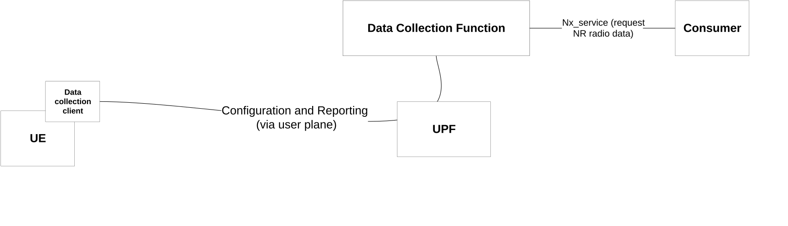
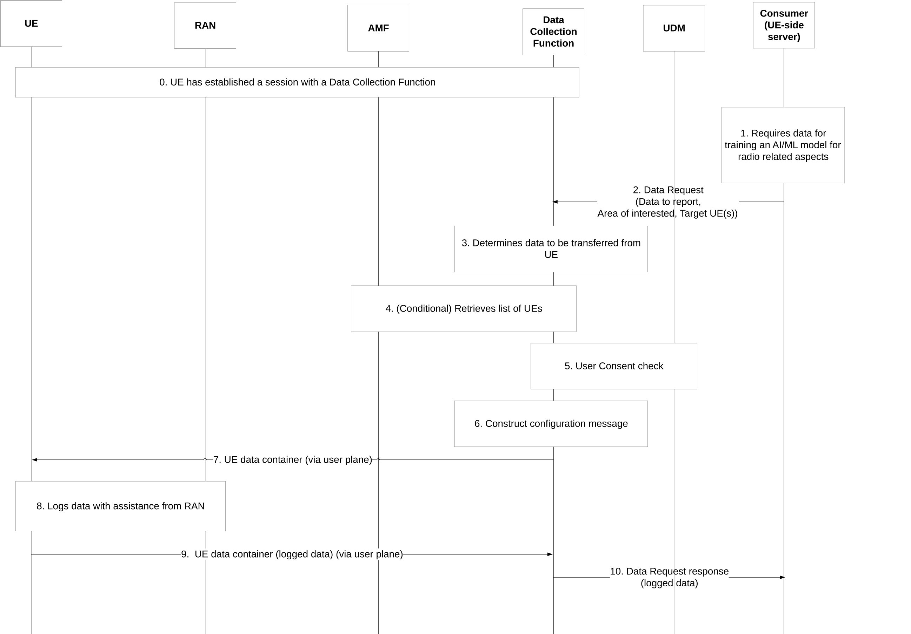

# 6.3 Solution \#3: General framework for supporting transfer of standardised data from the UE via user plane

## 6.3.1 High level principles

The high level principles of the solution are:

\- A UE-side server sends a request to receive data from a UE or Group of UEs. The standardised data to report are identified by a specific identifier.

\- A Data Collection Function (DCF) receives the UE-side server request and determines the standardised data to retrieve from one or more UEs according to the request from the UE-side server.

\- Data Collection Functions prepares configuration information for the UEs where the configuration information indicates to the UE:

1\) the standardised data to transfer; and

2\) validity conditions on when to transfer the data.

\- The Data Collection Function sends the configuration information to the UE via an already established session with the Data Collection Function.

\- The UE establishes a UP session with a Data Collection Function based on existing URSP rules. No changes to URSP rules are required.

## 6.3.2 Description

**Triggering and configuring transfer of standardised data from the UE:**

\- a data collection function in the network is responsible for triggering a UE to report data and collect data from the UE. The Data Collection Function (DCF) uses DCAF defined APIs to retrieve training data from the UE. The DCF is located in the core network.

NOTE 1: Extension to DCAF API to support data collection for AIML radio will be defined by stage 3.

\- the architecture is shown in Figure 6.3.2-1.

Figure 6.3.2-1: Triggering and configuring data collection from a UE

The main steps of the data collection procedures are as follows:

\- The data collection function receives from a consumer a request for standardised data from a UE or a group of UEs. The request may be sent via an NEF. The request includes an identifier to indicate a (list of) standardised data which will be needed to be transferred by the UE to the UE-side server for training an UE-side ML model. The request may also include validity information of the requested data (i.e. an area of interest and/or a time window of the collected data by the UE, type of UEs to report data (i.e. PEI identifier)).

NOTE 2: The standardised data needed to be collected and reported by the UE will be defined by RAN WG1.

\- The Data Collection Function ensures that the users of UEs have provided user consent for reporting data.

\- The Data Collection Function may also select UEs for providing the requested data based on PEI list (if provided by AF).

\- The Data Collection Function prepares a configuration for the UEs to transfer standardised data according to the identifier received by the consumer. The request may include additional information to indicate to the UE how often to report data, size of the transfer of data, etc.

The Data Collection Function sends the configuration via user plane).

\- The UE transfers the related standardised data to the Data Collection Function via user plane. In turn the Data Collection Function reports the data to the consumer.

NOTE 3: The trigger for data collection and how the UE collects standardised data are FFS.

## 6.3.3 Procedures

The architecture for this option in shown in Figure 6.3.3-1.

Figure 6.3.3-1: Architecture for data collection configuration and reporting via user plane

In this option:

\- The UE is configured with the address of the Data Collection Function e.g. based on SLA agreements between the UE-side server and the MNO. Other options are not precluded, e.g. the UE receiving the address of the Data Collection Function via CP within a NAS message.

\- UE establishes a session with Data Collection Function which is used for data reporting. The trigger for establishing a session is based on UE implementation. The session is via a PDU session established according to a received URSP rules where the URSP rules contains a traffic description the FQDN/IP address of the Data Collection Function and as RSD the DNN/S-NSSAI to use.

\- Once the Data Collection Function receives a request to retrieve data the Data Collection Function constructs configuration information for data to transferred UE (according to the identifier included in the consumer request). The configuration information is included in a UE Data Container and sent to the UE via the established session.

NOTE 1: Any enhancements in the DCAF framework to retrieve training data from the UE will be defined in stage 3.

\- The UE logs data according to the configuration information.

Detailed procedure in shown in Figure 6.3.3-2.

Figure 6.3.3-2: Data Transfer configuration and reporting via user plane

0\. A UE establishes a session for reporting data with the Data Collection Function.

1\. A consumer requires data from UE in order to train an AI/ML model used by the UE. The consumer may be an AF, a third party AI/ML training server.

2\. The consumer sends a data request to the Data Collection Function where in the request includes an identifier of the standardised data needed to be transferred by the UE, an area of interest (where data are to be collected) and target UEs.

NOTE 2: The SBI between the consumer and the DCF is FFS and depends on the functionalities needed to be supported by the DCF. One option is to re-use the DCAF SBI between the consumer and the DCF.

3\. The Data Collection Function determines what standardised data are needed to be transferred.

4\. If a PEI list is provided by the Consumer (UE-side server), the DCF finds AMF(s) based on the area of interest provided by the Consumer (UE-side server) and retrieves from the AMF a list of UEs and associated PEIs.

5\. The Data Collection Function checks user consent for data collection from UDM.

6\. The Data Collection Function selects the applicable UEs matching the PEI list and prepares configuration information to retrieve the standardised data.

7\. The Data Collection Function sends the container in a message to the UE via the established session between the UE and the Data Collection Function.

8\. The data reporting client in the UE checks the configuration information within the UE data container and determines the data to transfer. The UE logs data in assistance with the RAN node. Details are specified in RAN.

9\. The UE includes the logged data in a container and reports via user plane to the Data Collection Function via the established session. The UE is instructed to transfer to the Data Collection Function standardised data. Any data provided by the UE that do not conform to the standardised data expected by the Data Collection Function are invalid data.

How the Data Collection Function identifies invalid data is up to implementation (e.g. by performing offline check of the data provided by the UE).

How the Data Collection Function handles invalid data is up to MNO configuration (e.g. Data Collection Function can blacklist UEs that provide invalid data).

10\. The Data Collection Function reports the data to the consumer.

Editor's note: Further details to support visibility depends on further feedback from RAN.

## 6.3.4 Impacts on services, entities and interfaces

**Data Collection Function:**

\- Receives requests from consumer (UE-side server) to collect and transfer standardised data from the UE.

\- Determines configuration information for the UE to report standardised data.

\- Sends configuration information via an established session between the UE and the Data Collection Function.

**UE:**

\- Determines standardised data to transfer based on configuration information received from Data Collection Function.

\- Establishes a session with the Data Collection Function based on configuration information.
