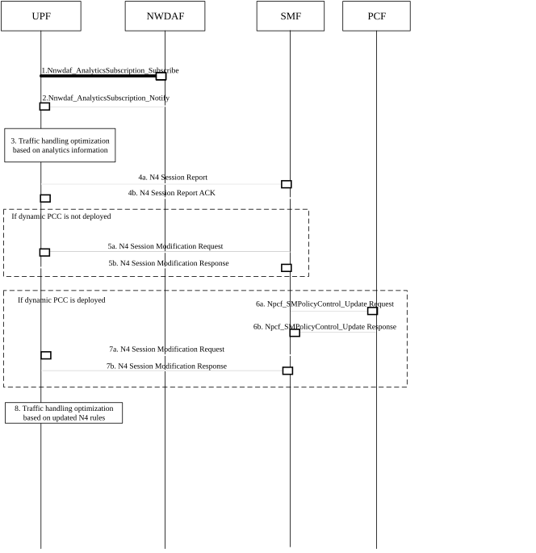

# 6.30 Solution \#30: User plane traffic pattern and anomaly detection and policy update based on NWDAF analysis

## 6.30.1 High-level principles

The solution proposes that the UPF can sends N4 Session Report to the SMF based on the subscribed traffic pattern and anomaly analytics information from the NWDAF, which then triggers SMF initiated SM Policy Association Modification procedures to update the SM policy and N4 rules (PDR, FAR), to improve efficiency and performance of user plane.

## 6.30.2 Description

This solution addresses Key Issue \#2 "AI/ML-assisted user plane traffic pattern and behaviour analysis to support efficient performance of User Plane" and Use Case \#1.

In this solution, UPF subscribes to traffic pattern and anomaly analytics information from the NWDAF. If specific traffic patterns or abnormal behaviours in the user plane are detected based on the analytics, UPF performs user plane traffic handling optimization, e.g. data rate limitation, traffic filtering, etc. to improve user plane performance. UPF can process the traffic real-time based on the analytics information before the SMF or PCF can send update PFCP/PCC based on analytics information. If an "abnormal traffic detection" event reporting or existing usage reports "start of traffic detection" trigger is received from the SMF, UPF sends an N4 Session Report containing the traffic pattern and anomaly analytics information related to the identified abnormal traffic to SMF. Then SMF may decide to update N4 rules based on local policy (if dynamic PCC is not deployed) or updated SM policy after initiating SM policy Association Modification procedure towards the PCF (if dynamic PCC is deployed) and sends the updated N4 rules to the UPF for improving the user plane efficiency and performance.

## 6.30.3 Procedures

Figure 6.30.3-1: Procedure for NWDAF assisted user plane traffic pattern / anomaly detection and policy update

1\. The UPF subscribes to traffic pattern and anomaly analytics information by invoking the Nnwdaf_AnalyticsSubscription_Subscribe service operation. The parameters that can be provided by the UPF are listed in clause 6.1.3 of TS 23.288 \[5\]. When a subscription to analytics information is received, the NWDAF determines whether triggering new data collection is needed.

2\. The NWDAF collects input data and notifies the UPF with the traffic pattern and anomaly analytics information by invoking Nnwdaf_AnalyticsSubscription_Notify service operation, based on the request from the UPF. The input data from UPF can contain packet information and traffic information, packet information including source address, destination address, IPv6 prefix, port number, protocol type, size, direction, flowl label, application source, etc. Traffic information includes service type (traffic type), frequency, duration, size, direction, DDoS attack, etc. The traffic pattern and anomaly analytics information contains packet information and traffic analysis results. The traffic analysis results include traffic classification (e.g. by service type or traffic type), abnormal detection information (e.g. IP address error, port number error) and traffic prediction information (e.g. data traffic frequency, data traffic volume, data traffic rate, data transmission duration, peak time, bandwidth), etc.

3\. Based on the traffic pattern and anomaly analytics information, the UPF performs user plane traffic handling optimization, e.g. data rate limitation (i.e. throttling suspicious data flows), traffic filtering (i.e. dropping malicious packets), preventing DDoS attack etc. to improve user plane performance.

NOTE: How the UPF uses the traffic pattern and anomaly analytics information to optimize user plane traffic handling is up to implementation.

4a/4b. UPF sends the N4 Session Report to SMF if the "abnormal traffic detection" event reporting or existing usage reports "start of traffic detection" trigger is received from the SMF and the report contains traffic pattern and anomaly analytics information related to the identified abnormal traffic.

5a/5b. If dynamic PCC is not deployed, the SMF may decide to update N4 rules, e.g. FAR (Forwarding Action Rule), towards the UPF to instruct the UPF to drop the identified abnormal packets, based on local policy and the received traffic pattern and anomaly analytics information. The SMF initiates N4 session modification towards the UPF to provide the update N4 rules.

If dynamic PCC is deployed, the following steps 6-8 are performed.

6a. SMF invokes an Npcf_SMPolicyControl_Update request to the PCF and the request contains traffic pattern and anomaly analytics information related to the identified abnormal traffic.

6b. PCF decides to update the SM Policy, e.g. adding new traffic gating rules to discard the identified abnormal traffic, based on the received traffic pattern and anomaly analytics information from the SMF and sends an Npcf_SMPolicyControl_Update response with updated policy information to the SMF.

7a/7b. SMF sends the N4 session modification request message to the UPF to update N4 rules based on the received SM policy from the PCF.

8\. UPF handles the user plane traffic based on the updated N4 rules.

## 6.30.4 Impacts on services, entities and interfaces

**UPF:**

\- Subscribes to traffic pattern and anomaly analytics information from NWDAF.

\- Sends an N4 Session Report, which contains traffic pattern and anomaly analytics information related to the identified abnormal traffic, to SMF based on "abnormal traffic detection" event reporting trigger.

**NWDAF:**

\- Collects input data and generates traffic pattern and anomaly analytics information base on the subscription request from the UPF.

**SMF:**

\- Sends "abnormal traffic detection" event reporting trigger to the UPF and receives the traffic pattern and anomaly analytics information related to the identified abnormal traffic in N4 Session Report from the UPF.

\- Update N4 rules to the UPF based on the traffic pattern and anomaly analytics information related to the identified abnormal traffic.

**PCF:**

\- Updates one or more SM policies based on the traffic pattern and anomaly analytics information related to the identified abnormal traffic.
