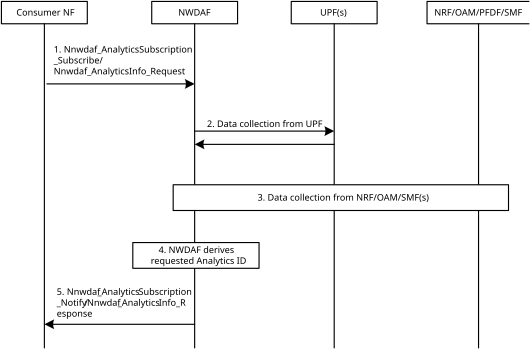

# 6.31 Solution \#31: Analytics on user plane traffic pattern

## 6.31.1 High-level solution principles

The main principles of this solution include:

\- NWDAF derives a new Analytics ID "User Plane Traffic Pattern" towards a UPF or a list of UPFs. The output of Analytics provides the traffic pattern information in the UPF(s), the status of the UPF(s) and the contribution of each SMF which is connected with the UPF(s).

\- The UPF or SMF is a consumer NF to subscribe "User Plane Traffic Pattern" from NWDAF directly.

\- The UPF could detect malicious IP packets, allocate more resource before the bursts, adjust interface thresholds, etc. based on the Analytics ID.

\- SMF could select/reselect suitable UPF for new PDU sessions, adjust N4 rules, etc. based on the Analytics ID.

## 6.31.2 Description

This solution is proposed to resolve the Key issue \#2: AI/ML-assisted user plane traffic pattern and behaviour analysis to support efficient performance of User Plane.

As described in Use Cases, the performance of User Plane could be influenced by a large amount of abnormal or malicious IP packets, flows, bursts, syn-ack signalling. To mitigate such impact, it proposes that NWDAF derives a new Analytics ID towards user plane traffic patterns by collecting data from UPF(s), SMF(s), OAM, NRF and AF. The output of the Analytics will reflect the status of target UPF(s), including the traffic transmitted through the UPF and the associated N4 interfaces between the UPF and SMF(s). Furthermore, consumers could directly subscribe the Analytics ID from NWDAF and take some actions to improve the performance of user plane, e.g. detect the malicious packets, prepare more network resource for the bursts, based on the output of Analytics.

The UPF or SMF could be a consumer of Analytics ID "User Plane Traffic Pattern" in this solution:

\- UPF as a consumer subscribes Analytics ID "User Plane Traffic Pattern" from NWDAF and provides its UPF ID as target and a list of SMF ID (s) which have connections with this UPF. The NWDAF collects input data as described in Table 6.31.1-1 and derives the output as described in Table 6.31.1-2 which reflects the status of the traffic in the target UPF and the contribution of each associated SMF. Based on the output of Analytics, the following actions could be taken by UPF:

\- The UPF could calculate load report including the action on detecting malicious IP packets, allocating more resource before the bursts, adjusting interface thresholds based on the internal logic or operator's policy.

\- The UPF could refuse the new N4 sessions from the SMF with high load contribution to the UPF, request the SMF with high load contribution to transfer PDU sessions to another UPF, etc.

\- The UPF could select an access type for downlink traffic in ATSSS scenario based on the packet retransmission pattern from Analytics output.

SMF as a consumer to subscribe Analytics ID "User Plane Traffic Pattern" and provides a list of UPFs which could be selected by the SMF as target of Analytics ID. The NWDAF collects input data as described in Table 6.31.1-1 and derives the output as described in Table 6.31.1-2 which reflects the resource status of each UPF and the traffic status in each UPF. Based on the output of Analytics, the SMF could consider this and select/reselect suitable UPF for new PDU sessions, adjust N4 rules, etc. Based on the adjusted N4 rules provided by the SMF, the UPF may detect malicious IP packets.

The input data and output of Analytics ID "User Plane Traffic Pattern" are shown as below.

**Input Data:**

Table 6.31.1-1: Input data from 5GC

<table>
<colgroup>
<col style="width: 28%" />
<col style="width: 21%" />
<col style="width: 49%" />
</colgroup>
<thead>
<tr class="header">
<th>
Information

(NOTE 1)
</th>
<th>Source</th>
<th>Description</th>
</tr>
</thead>
<tbody>
<tr class="odd">
<td>UPF ID</td>
<td>UPF, OAM</td>
<td>The identification of UPF.</td>
</tr>
<tr class="even">
<td>Average number of PDU Sessions</td>
<td></td>
<td>The average number of the PDU sessions handling in the UPF during the target time period. NOTE 1.</td>
</tr>
<tr class="odd">
<td>Maximum number of PDU Sessions</td>
<td></td>
<td>The maximum number of the PDU sessions handling in the UPF during the target time period.</td>
</tr>
<tr class="even">
<td>Minimum number of PDU Sessions</td>
<td></td>
<td>The minimum number of the PDU sessions handling in the UPF during the target time period.</td>
</tr>
<tr class="odd">
<td>Average number of UEs</td>
<td></td>
<td>The average number of UEs handling in the UPF during the target time period. NOTE 1.</td>
</tr>
<tr class="even">
<td>Maximum number of UEs</td>
<td></td>
<td>The maximum number of UEs handling in the specified UPF during the target time period.</td>
</tr>
<tr class="odd">
<td>Minimum number of UEs</td>
<td></td>
<td>The minimum number of UEs handling in the specified UPF during the target time period.</td>
</tr>
<tr class="even">
<td>Application ID</td>
<td></td>
<td>Identify the traffic flow.</td>
</tr>
<tr class="odd">
<td>IP 5-tuple</td>
<td></td>
<td>Identify the traffic flow, including protocol, source IP address, source port number, destination IP address and destination port number.</td>
</tr>
<tr class="even">
<td>URL</td>
<td></td>
<td>The significant parts of the URL to be matched, e.g. host name.</td>
</tr>
<tr class="odd">
<td>Number of packets</td>
<td></td>
<td>The total number of packets for the specified traffic flow. NOTE 1.</td>
</tr>
<tr class="even">
<td>Length of packet</td>
<td></td>
<td>The average length of packets for the specified traffic flow. NOTE 1.</td>
</tr>
<tr class="odd">
<td>Direction of traffic</td>
<td></td>
<td>The direction of the specified traffic flow, e.g. UL, DL.</td>
</tr>
<tr class="even">
<td>Number of failure packets</td>
<td></td>
<td>The number of packets which are failed transmitted. NOTE 1.</td>
</tr>
<tr class="odd">
<td>Number of retransmission packets</td>
<td></td>
<td>The number of packets which are retransmitted. NOTE 1.</td>
</tr>
<tr class="even">
<td>UPF resource usage</td>
<td>NRF, OAM</td>
<td>The average usage of assigned resources (CPU, memory, disk) during the target time period.</td>
</tr>
<tr class="odd">
<td>UPF capacity</td>
<td></td>
<td>The capacity information of the specified UPF during the target time period.</td>
</tr>
<tr class="even">
<td>SMF ID</td>
<td>SMF, OAM</td>
<td>The identification of the SMF.</td>
</tr>
<tr class="odd">
<td>Average number of N4 Sessions</td>
<td></td>
<td>The average number of N4 Sessions which are connected to the target UPF during the target time period.</td>
</tr>
<tr class="even">
<td>Maximum number of N4 Sessions</td>
<td></td>
<td>The maximum number of N4 Sessions which are connected to the target UPF during the target time period.</td>
</tr>
<tr class="odd">
<td>Minimum number of N4 Sessions</td>
<td></td>
<td>The minimum number of N4 Sessions which are connected to the target UPF during the target time period.</td>
</tr>
<tr class="even">
<td>IP 3-tuple</td>
<td>PFDF</td>
<td>Including protocol, server side IP address and port number.</td>
</tr>
<tr class="odd">
<td>URL</td>
<td></td>
<td>The significant parts of the URL to be matched, e.g. host name.</td>
</tr>
<tr class="even">
<td colspan="3">NOTE 1: It could be collected and classified per SMF ID which is connected with the UPF.</td>
</tr>
</tbody>
</table>

**Output Analytics:**

Table 6.31.1-2: Output of User Plane Traffic Pattern

| Information                                            | Description                                                                                                                                        |
|--------------------------------------------------------|----------------------------------------------------------------------------------------------------------------------------------------------------|
| UPF ID                                                 | Identification of UPF.                                                                                                                             |
| \> UPF resource usage                                  | The average usage of assigned resources (CPU, memory, disk) during the target time window.                                                         |
| \> UPF capacity                                        | The capacity information of the specified UPF.                                                                                                     |
| \> Number of PDU Sessions                              | The number of the PDU sessions handling in the specified UPF during the target time window, including average, maximum, minimum.                   |
| \> Number of UEs                                       | The number of UEs handling in the specified UPF during the target time window, including average, maximum, minimum.                                |
| \> Traffic Pattern Report                              | List of traffic pattern report towards the traffic over the specified UPF.                                                                         |
| \>\> Application ID                                    | Identify the detected traffic flow. NOTE 1.                                                                                                        |
| \>\> IP 5-tuple                                        | Identify the detected traffic flow, including protocol, source IP address, source port number, destination IP address and destination port number. |
| \>\> Number of packets                                 | The total number of packets for the specified traffic flow.                                                                                        |
| \>\> Size of packet                                    | The average size of packets for the specified traffic flow.                                                                                        |
| \>\> Direction of traffic                              | The direction of the specified traffic flow, e.g. UL, DL.                                                                                          |
| \>\> Data volume                                       | The total data volume of specified traffic flow.                                                                                                   |
| \>\> Data rate                                         | The data rate of specified traffic flow.                                                                                                           |
| \>\> Number of abnormal packets                        | The number of packets which are transmitted with abnormality (e.g. retransmitted packets, malformed packets).                                      |
| \>\> Reason of abnormality                             | The reasons of abnormal packets, e.g. failure transmission, repeat transmission.                                                                   |
| \>\> Start time                                        | Start time of the specified traffic flow.                                                                                                          |
| \>\> End time                                          | End time of the specified traffic flow.                                                                                                            |
| \> SMF ID list                                         | The list of the SMF identification which is associated with the UPF.                                                                               |
| \>\> Contribution of the SMF                           | The contribution of the SMF to the UPF, it might be a weight.                                                                                      |
| NOTE 1: This applies when application ID is available. |                                                                                                                                                    |

## 6.31.2 Procedures

Figure 6.31.2-1: Procedure for User Plane Traffic Pattern Analytics

1\. The consumer (e.g. UPF or SMF) subscribes or requests "User Plane Traffic Pattern" Analytics via Nnwdaf_AnalyticsInfo or Nnwdaf_AnalyticsSubscription service. If the consumer is UPF, it provides UPF ID, SMF ID list which have N4 connections with the UPF. If the consumer is SMF, it provides UPF ID list which can be selected by the SMF.

2\. The NWDAF collects input data from UPF(s) as described in Table 6.31.1-1. If the consumer is SMF and provides a list of UPFs, the NWDAF will collects input data from multiple UPFs based on the provided UPF list.

3\. The NWDAF collects input data from NRF, OAM, PFDF and SMF(s) as described in Table 6.31.1-1 via Nnf_EventExposure_Subscribe. If the consumer is UPF and it provides a list of SMFs, the NWDAF collects input data from multiple SMFs based on the provided SMF list.

4\. The NWDAF derives the requested Analytics as described in Table 6.31.1-2 based on the input data.

5\. The NWDAF provides the requested User Plane Traffic Pattern Analytics to the consumer via Nnwdaf_AnalyticsSubscription_Notify or Nnwdaf_AnalyticsInfo_Request response, depending on the service operation used in step 1.

## 6.31.3 Impacts on services, entities and interface

**UPF:**

\- Support to subscribe or request "User Plane Traffic Pattern Analytics" from NWDAF.

\- Support to provide input data as described in Table 6.31.1-1.

\- Support for the new enforcement and reporting to the SMF as per clause 6.31.2.

**SMF:**

\- Support to subscribe or request "User Plane Traffic Pattern Analytics" from NWDAF.

\- Support to provide input data as described in Table 6.31.1-1.

**NWDAF:**

\- Support to derive new "User Plane Traffic Pattern Analytics".
