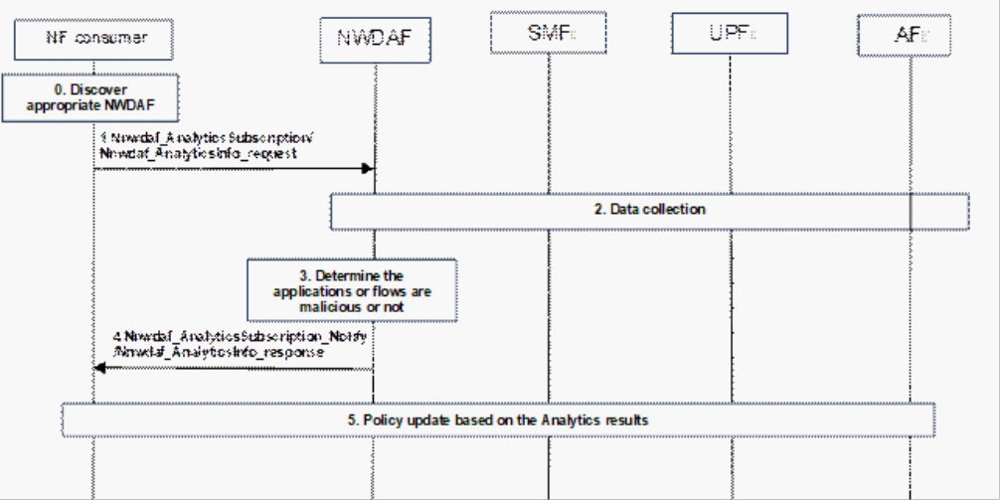

# 6.33 Solution \#33: Malicious traffic identification and mitigation

## 6.33.1 High level principles

This solution addresses KI#2. The NWDAF is enhanced to support 'traffic analyse' Analytics ID. The NF consumer can input the Application identifier, QFI or IP-5 tuple to the ML Model related to this Analytics ID and the model outputs a binary value (i.e. it is a normal application/data flow or malicious application/data flow) and optionally the malicious type.

## 6.33.2 Functional Description

### 6.33.2.1 General Description

This solution enables intelligent and dynamic threat mitigation by allowing NWDAF to collect and analyze multi-source network data (including flow characteristics, usage patterns), detect suspicious or malicious flows or applications, and coordinate with PCF, SMF, and UPF to enforce real-time policy control and traffic blocking.

### 6.33.2.2 Input data of the Analytics

Table 6.33.2.2-1

| Information                                                                                                                                 | Source      | Description                                                                                                                                                                                                                                                              |
|---------------------------------------------------------------------------------------------------------------------------------------------|-------------|--------------------------------------------------------------------------------------------------------------------------------------------------------------------------------------------------------------------------------------------------------------------------|
| IP-5 tuple                                                                                                                                  | AF/UPF/SMF  | The IP 5-tuple includes the source IP address, destination IP address, source port, destination port, and transport layer protocol (e.g. TCP or UDP).                                                                                                                    |
| Malicious information                                                                                                                       | external AF | Information (e.g. from Webpage or database in the internet) whether the data flow or application ID is malicious and the type of malicious data at some time stamps in the past, used as label for model training.                                                       |
| User Data Usage Measures (NOTE 1)                                                                                                           | SMF/UPF     | Data usage information (e.g. uplink and downlink byte counts, packet counts). This can be used to detect malicious data usage patterns (such as sudden bursts of high traffic in a short time), assisting in the identification of fraudulent sessions.                  |
| User Data Usage Trends (NOTE 1)                                                                                                             | SMF/UPF     | Statistical trends of data usage over a period of time. This can be used to analyse user behaviour and identify traffic that deviates from normal behaviour patterns.                                                                                                    |
| Session Management Event (NOTE 1)                                                                                                           | SMF         | Including events such as PDU session establishment, modification, and release. These can be used to identify abnormal behaviours involving frequent session establishment and release.                                                                                   |
| URL list                                                                                                                                    | UPF         | If available. Malicious URLs often contain misleading domain names, unusual file extensions (e.g. .exe, .scr), or encoded characters to obfuscate intent. They may also include suspicious parameters like token=, login=, cmd=, or redirect= commonly used in phishing. |
| time stamp                                                                                                                                  | \-          | The time stamp of the collected data.                                                                                                                                                                                                                                    |
| NOTE 1: These events can be filtered by Application ID or Traffic Filtering Information (e.g. IP 5-tuple) to narrow the subscription scope. |             |                                                                                                                                                                                                                                                                          |

NOTE: The malicious packet identification is out of scope of this solution.

### 6.33.2.2 Output data of the Analytics

Table 6.33.2.2-1

| Information                  | Description                                                                                                                                       |
|------------------------------|---------------------------------------------------------------------------------------------------------------------------------------------------|
| Flow identifier              | QFI, Application ID or IP 5-tuple.                                                                                                                |
| \> Malicious identification  | Whether the data flow or Application ID input by the NF consumer is malicious.                                                                    |
| \> Malicious type            | Malicious type of the identified Application ID or data flow: e.g. Phishing websites, Telecommunication fraud websites or apps, Malicious emails. |
| \> suspicious identification | Whether the data flow or Application ID input by the NF consumer is suspicious.                                                                   |

## 6.33.3 Procedures

Figure 6.33.3-1: Analytics procedure for flow or application

0\. The NWDAF has registered support for the "traffic analysis" analytics ID into the NRF. NF consumers (e.g. PCF, SMF, UPF) discover and select the appropriate NWDAF through the NRF using the existing procedure.

NOTE: The NF consumer (e.g. PCF) may trigger the Analytics request based on local configuration or trigger the Analytics request based on request from AF.

1\. The NF consumer sends a analytics request or analytics subscription to the NWDAF, which includes the Analytics ID = 'traffic analyse'. Target of Analytics reporting = Any UE/list of UE IDs or Any UPF or list of UPF ID; Analytics filtering information = combinations of DNN, S-NSSAI, AoI. The analytics request or analytics subscription may also include Application ID, QFI or IP 5-tuple and other parameters defined in clauses 7.2.2 and 7.3.2 of TS 23.288 \[5\].

2\. The NWDAF collects model training or Analytics data from SMF, UPF and AF as specified in clause 6.33.2.2.

3\. The NWDAF performs analytics to determine whether the data flow identified by the QFI is malicious, whether the Application ID is malicious, and whether the data flow associated with the IP 5-tuple is considered malicious. If the application or data flow is identified as malicious, the NWDAF may also indicate the type of malicious traffic.

4\. The NWDAF returns to the NF Consumer an indication of whether the data flow (e.g. identified by QFI or IP 5-tuple) or the Application ID is considered malicious. Optionally, the NWDAF may also provide the associated type of malicious traffic, if applicable.

5\. Based on the Analytics result received, the PCF makes a policy decision on whether to update the PCC rules (e.g. setting the Gate Status of the PCC rule associated with a specific QoS Flow to "closed"). If the NWDAF indicates that a specific Application ID is identified as a source of malicious traffic, the PCF may identify all PCC rules associated with that Application ID and set the Gate Control of each corresponding PCC rule to "closed".

Subsequently, the PCF updates the session management policy towards the SMF, including the modified PCC rules. The SMF then generates the corresponding QER(s)/FAR(s) based on the updated PCC rules and sends them to the UPF. Based on the received FAR(s)/QER(s), the UPF blocks or discards the suspicious or malicious packets accordingly.

If the NF consumer is SMF, the SMF may update FAR based on the Analytics result without instruction from PCF.

## 6.33.4 Impacts on services, entities and interface

**NWDAF:**

\- Registers or updates traffic analyse capability (a new Analytics ID) to NRF.

\- Receives analysis requests from consumer NF.

\- Collects analytics input data defined in clause 6.33.2.2.

\- Outputs whether the application ID or flow is malicious and the type of maliciousness.

**NF consumer (e.g. PCF, SMF, UPF):**

\- Discovers NWDAF that can support traffic analyse capability (a new Analytics ID) from NRF.

\- Sends Analytics request requests to NWDAF.

\- Receives analysis results returned by NWDAF.

\- Updates PCC rules or FAR based on the analytic results.

**External AF:**

\- Support to provide malicious information as ground truth data for model training.
