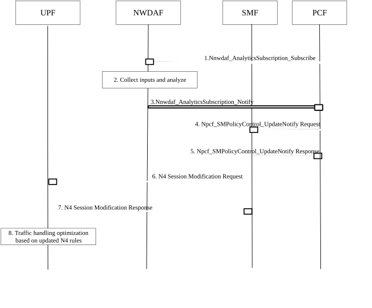

# 6.34 Solution \#34: User plane traffic pattern and anomaly detection and policy update based on NWDAF analysis

## 6.34.1 High-level principles

This solution can work only if dynamic PCC is deployed. The solution proposes that the PCF can, based on the subscribed traffic pattern and anomaly analytics information from the NWDAF, initiate SM Policy Association Modification procedures to update the SM policy and consequently SMF will update N4 rules (PDR, FAR), to improve efficiency and performance of user plane. For example, if PCF learns about a pattern of malicious traffic performed by a specific subscriber (e.g. DDOs attack), it can instruct the SMF to gate the traffic or ask the SMF to release existing PDU session (as shown in clause 4.16.6 of TS 23.502 \[3\]) or/and reject future establishment request(s) of that subscriber. Another example, if PCF learns about a pattern of congestion at some ToD (Time of Day) it may instruct the UPF (via the SMF) and the RAN/UE (via the AMF) to adjust QoS.

## 6.34.2 Description

This solution addresses Key Issue \#2 "AI/ML-assisted user plane traffic pattern and behaviour analysis to support efficient performance of User Plane" and Use Case \#1.

In this solution, PCF subscribes to traffic pattern and anomaly analytics information from the NWDAF. If specific traffic patterns or abnormal behaviours in the user plane are detected based on the analytics, NWDAF will report this to PCF. PCF can then update PCC rules at the SMF. Consequently, SMF sends updated N4 rules to the UPF for improving the user plane efficiency and performance.

## 6.34.3 Procedures

Figure 6.34.3-1: Procedure for NWDAF assisted user plane traffic pattern / anomaly detection and policy update

1\. if dynamic PCC is deployed, the PCF subscribes to traffic pattern and anomaly analytics information by invoking the Nnwdaf_AnalyticsSubscription_Subscribe service operation. The parameters that can be provided by the PCF are listed in clause 6.1.3 of TS 23.288 \[5\]. When a subscription to analytics information is received, the NWDAF determines whether triggering new data collection is needed.

2\. The NWDAF collects input data from the UPF and analyses it. The detailed inputs provided by the UPF is as described in other solutions to KI \#2.

3\. NWDAF notifies the PCF with the traffic pattern and anomaly analytics information by invoking Nnwdaf_AnalyticsSubscription_Notify service operation, based on the request from the PCF. The traffic pattern and anomaly analytics information contains packet information and traffic analysis results. The analysis results include traffic classification (e.g. by service type), abnormal detection information and traffic prediction information (e.g. data traffic volume, data traffic rate, data transmission time interval, peak time), etc.

4\. PCF decides to update the SM Policy, e.g. gate abnormal traffic, based on the received traffic pattern and anomaly analytics information from the NWDAF. Consequently, PCF sends an Npcf_SMPolicyControl_UpdateNotify request with updated PCC rules or/and update SM policy association to the SMF.

5\. The SMF acknowledges the PCF request with an Npcf_SMPolicyControl_UpdateNotify response.

6\. SMF sends the N4 session modification request message to the UPF to update N4 rules based on the SM policy received from the PCF.

7\. UPF acknowledges the SMF request with an N4 session modification response.

8\. UPF handles the user plane traffic based on the updated N4 rules.

## 6.34.4 Impacts on services, entities and interfaces

**UPF:**

\- Performs traffic handling optimization based on updated N4 rules.

\- Provides inputs to NWDAF as part of data collection.

**NWDAF:**

\- Collects input data and generates traffic pattern and anomaly analytics information base on the subscription request from the PCF.

**SMF:**

\- Receives updated PCC rules from the PCF.

\- Updates N4 rules to the UPF based on the PCC rules received from the PCF.

**PCF:**

\- Subscribes to traffic pattern and anomaly analytics information from NWDAF.

\- Updates SM policy based on the traffic pattern and anomaly analytics information related to the identified abnormal traffic.
