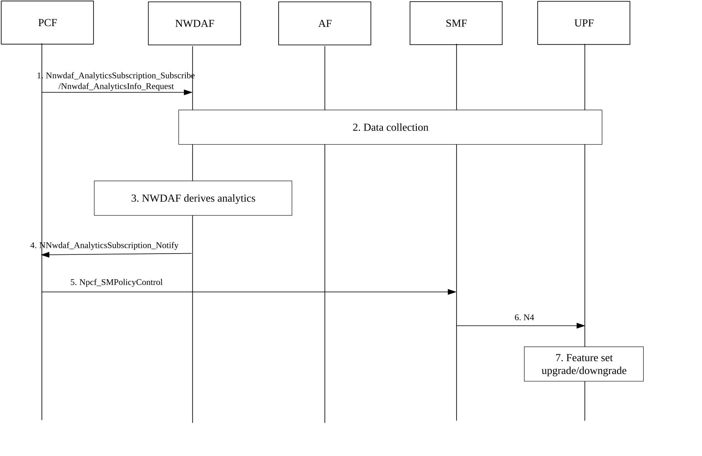

# 6.35 Solution \#35: NWDAF-Driven UPF Function Set Dynamic Adaptation Mechanism

## 6.35.1 High level principles

The high-level principles of the proposed solution are as follows:

NWDAF collects and analyses UP traffic data and other relevant data, generating statistics and predictions on traffic patterns, load, and anomaly risks.

PCF formulates UPF function set upgrade/downgrade strategies based on NWDAF's analytics, considering UPF load, traffic anomaly risks, and service priorities. Strategies shall prioritize alignment with the requirements for mitigating abnormal/malicious traffic.

SMF converts PCF's strategies into specific UPF function set configurations and delivers them to UPF.

UPF dynamically activates or deactivates session-level functions according to received configurations, releases resources by simplifying non-core functions, and ensures the efficiency of basic forwarding and preliminary handling of abnormal/malicious traffic.

## 6.35.2 Description

To address the UPF performance degradation issue induced by abnormal/malicious traffic in the 5GC user plane, as well as to address the inefficiencies in resource utilization arising from non-essential UPF session-level functions operating continuously under varying load conditions and traffic patterns, this solution identifies the following limitations in current mechanisms: In existing mechanisms, UPF session-level functions are generally activated statically. During periods of high load or when abnormal traffic (e.g. DDoS attacks) occurs, redundant functions persist in consuming CPU, memory, and other resources-this leads to UPF being unable to simultaneously ensure basic packet forwarding and abnormal traffic mitigation capabilities, thereby triggering service interruptions . Meanwhile, existing ORM can only passively reduce the load (such as session migration) after the UPF is overloaded, and cannot optimize resource allocation in advance based on abnormal traffic characteristics. Furthermore, current solutions lack a mechanism to dynamically adjust function activation status based on traffic patterns, anomaly risk levels, and service priorities, making it infeasible to balance resource allocation and abnormal traffic defence according to actual network conditions.

To address these limitations, this solution introduces a dynamic adaptation mechanism for UPF function sets. It defines three types of function sets as an example of function set classification provided by this solution (full function set, intermediate function set, and minimal function set), where the specific functions included in each set depend on service requirements, UPF capabilities, and network policies:

\- Full function set: Includes all dynamically de-activatable session-level functions supported by the UPF.

\- Intermediate function set: Activates or deactivates specific session-level functions for different scenarios to optimize resource allocation and avoid redundancy.

\- Minimal function set: Retains only the minimum necessary functions for the UPF to operate normally in specific scenarios and mandatory compliance/charging/emergency features, with other functions deactivated to release resources.

Editor's note: The specific functions included in each function set (e.g. which session-level functions are dynamically adjustable) are FFS and shall be configured based on actual network deployment and service needs.

NWDAF collects UP traffic data from UPF, SMF, and AF, focusing on load-related metrics, traffic pattern data (e.g.UPF ID, UE ID), risk-related information (e.g. unexpected flows, malformed packets), and service identification data (e.g. application IDs, traffic characteristics). Based on this data, NWDAF generates analytics including UPF load levels, traffic anomaly risk levels (high/medium/low), predicted traffic patterns (which serve as the basis for dynamically adjusting UPF function sets), and associated application information to assist PCF in determining service types.

The trigger conditions for function set upgrade/downgrade are as listed in table 6.35.2-1:

Table 6.35.2-1: Trigger conditions for function set upgrade/downgrade

<table>
<colgroup>
<col style="width: 27%" />
<col style="width: 72%" />
</colgroup>
<thead>
<tr class="header">
<th>Direction of function set upgrade/downgrade</th>
<th>Trigger conditions</th>
</tr>
</thead>
<tbody>
<tr class="odd">
<td>Full --&gt; Intermediate</td>
<td>
UPF load will remain in the medium-high range;

NWDAF analytics indicate medium-low anomaly risks
</td>
</tr>
<tr class="even">
<td>Intermediate --&gt; Full</td>
<td>
UPF load will remain in the medium-low range;

NWDAF analytics indicate no anomaly risks
</td>
</tr>
<tr class="odd">
<td>Intermediate --&gt; Minimal</td>
<td>
UPF load will remain in the high range;

NWDAF analytics indicate high anomaly risks (e.g. sudden large traffic attacks)
</td>
</tr>
<tr class="even">
<td>Minimal --&gt; Intermediate</td>
<td>
UPF load will remain in the low range;

NWDAF analytics indicate no anomaly risks (stable traffic characteristics)
</td>
</tr>
<tr class="odd">
<td>Full --&gt; Minimal</td>
<td>
UPF load will remain above the high threshold;

NWDAF analytics indicate high anomaly risks (e.g. DDoS attacks)
</td>
</tr>
<tr class="even">
<td>Minimal --&gt; Full</td>
<td>
UPF load will remain below the low threshold;

NWDAF analytics indicate low anomaly risks
</td>
</tr>
</tbody>
</table>

Editor's note: UPF load ranges and anomaly risk levels are independent triggering dimensions. The final decision on whether to trigger an upgrade/downgrade and the direction depends on PCF's further judgment based on service priorities (e.g. "security first" or "resource first"). Without clear priorities, meeting either dimension can trigger the change, with the direction determined by the combination of load and risk. With clear priorities, the dimension corresponding to the priority (security/resource) is the core decision basis.

Editor's note: The specific thresholds for "high/medium/low load" and the criteria for "anomaly risk levels" are FFS.

## 6.35.3 Procedures

Figure 6.35.3-1

1\. When PCF needs to optimize UP performance or mitigate abnormal behavior, it subscribes to/requests "UP traffic pattern" analytics from NWDAF using Nnwdaf_AnalyticsSubscription_Subscribe or Nnwdaf_AnalyticsInfo_Request, specifying the target UE(s) or groups.

2\. NWDAF retrieves traffic pattern data(e.g. UE ID, UPF ID, traffic load, anomaly info) from UPF via Nupf_EventExposure_Subscribe service, and acquires other relevant supplementary data from SMF and AF through Nnf_EventExposure_Subscribe service.

Editor's note: The specific list of collected data items may vary by scenario, and the mechanism to ensure data collection efficiency (e.g. sampling strategies) is FFS.

3\. NWDAF generates statistical and predictive analytics, including load levels, anomaly risks, and traffic patterns, based on the collected data.

4\. NWDAF notifies PCF of the analytics results via Nnwdaf_AnalyticsSubscription_Notify. PCF formulates UPF function set upgrade/downgrade strategies based on these results(clarify target UPF ID and the list of functions to be activated/deactivated).

Editor's note: The specific AI/ML models or algorithms used by NWDAF to generate analytics are FFS.

5\. PCF delivers the strategies to SMF via the N7 interface using Npcf_SMPolicyControl.

6\. SMF generates specific UPF function set configurations (matching the target UPF's supported functions) and sends them to UPF via the N4 interface using a PFCP Session Modification Request.

Editor's note: How SMF obtains and maintains the list of functions supported by each UPF is FFS.

7\. UPF parses the function set identifier, adjusts its configurations, and activates/deactivates the specified functions.

## 6.35.4 Impacts on services, entities and interfaces

**NWDAF:**

\- Collects UP traffic pattern data from UPF, SMF, and AF, and generates analytics on load, anomaly risks, and traffic patterns.

\- Provides the analytics to PCF via relevant interfaces.

**PCF:**

\- Subscribes to/requests UP traffic pattern analytics from NWDAF.

\- Formulates and delivers UPF function set upgrade/downgrade strategies to SMF based on the analytics.

**SMF:**

\- Converts PCF's strategies into UPF configurations and delivers them via the N4 interface.

**UPF:**

\- Reports UP traffic data to NWDAF as required.

\- Dynamically activates or deactivates functions according to configurations from SMF.
