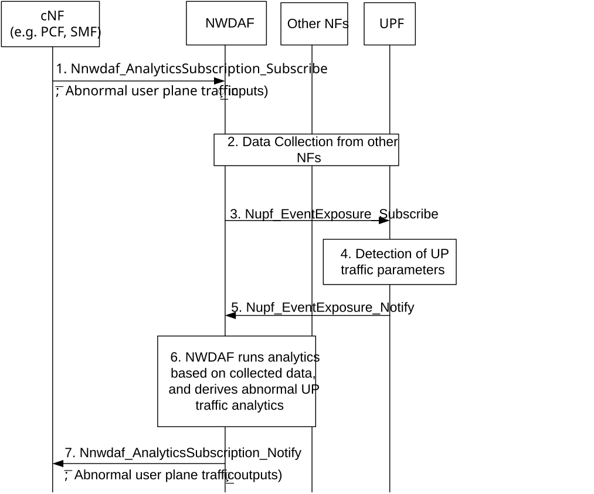
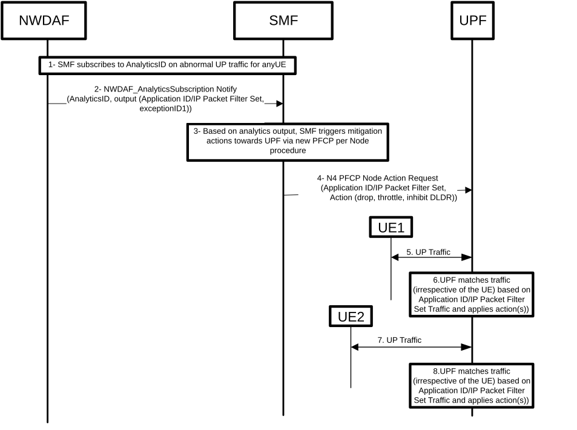

# 6.36 Solution \#36: Analysis of abnormal user plane traffic

## 6.36.1 High level principles

These are the high-level principles of the proposed solution:

\- A new AnalyticsID "Abnormal user plane traffic" is proposed:

\- Input data retrieved from UPF on user plane traffic parameters as defined in Table 6.36.2.2-1.

\- Output, a list of observed exceptions (user plane traffic anomalies) and associated information (e.g. IP packet filter(s), Application ID(s), SUPI(s) and/or UPF(s) affected on a per observed exception basis), as defined in Table 6.36.2.3-1 for statistics and Table 6.36.2.3-2 for predictions:

\- The list of observed exceptions can be e.g. DDoS, too much data, too high or too low rate, abnormal traffic bursts, unnecessary UE wake-up, too many malformed packets, too many duplicate packets, too many retransmitted packets and/or too many fragmented packets.

\- The analytics consumer may be SMF or PCF.

\- Mitigation actions can be provisioned by the SMF into the UPF both on N4 level, a new PFCP per Node procedure as well as per PDU session level.

\- UPF can detect abnormal traffic and take actions using N4 rules without any analytics support.

Other principles of the solution:

\- The consumer may indicate the exception(s) it is interested in when subscribing to this new AnalyticsID.

\- The consumer takes actions based on the exception(s) reported by NWDAF, e.g. blocking traffic when there are too many fragmented packets (to avoid excessive degradation in UPF performance).

\- To identify abnormal user plane traffic, NWDAF may provide a threshold to the UPF when retrieving the input data, then any traffic not reaching the threshold is not considered "abnormal". This also reduces the load on Control Plane NFs due to excessive reports from UPF.

## 6.36.2 Description

This solution proposes a 5GC enhancement to support analysis of abnormal user plane traffic, specifically a new AnalyticsID related to abnormal user plane traffic.

### 6.36.2.1 Abnormal user plane traffic AnalyticsID

The consumer of this AnalyticsID shall indicate in the request:

\- Analytics ID = "Abnormal user plane traffic";

\- Target of Analytics Reporting can be a list of SUPIs, a group of SUPIs or any UE;

\- An Analytics target period indicates the time period over which the statistics or predictions are requested;

\- Analytics Filter Information optionally including:

\- list of Exception ID, where each exception ID refers to a traffic data anomaly of interest, e.g. DDoS, too much data, too high or too low rate, abnormal traffic bursts, unnecessary UE wake-up, too many malformed packets, too many duplicate packets, too many retransmitted packets and/or too many fragmented packets;

\- Optionally, when the list of Exception ID includes abnormal traffic bursts, information relative to the definition of a traffic burst;

\- Optionally, associated thresholds (for each Exception ID);

\- Area of interest;

\- Application ID;

\- DNN;

\- S-NSSAI.

### 6.36.2.2 Input Data

NWDAF triggers data collection from UPF (and SMF) to retrieve user plane traffic parameters. The detailed input data is described in Table 6.36.2.2-1.

Table 6.36.2.2-1: Input data

|                                                                                                                                                                                                                                                            |          |                                                                                                                |
|------------------------------------------------------------------------------------------------------------------------------------------------------------------------------------------------------------------------------------------------------------|----------|----------------------------------------------------------------------------------------------------------------|
| Information                                                                                                                                                                                                                                                | Source   | Description                                                                                                    |
| UE ID                                                                                                                                                                                                                                                      | SMF, UPF | Identifier of the UE (e.g. SUPI)                                                                               |
| UE IP Address                                                                                                                                                                                                                                              | SMF, UPF | UE IP address                                                                                                  |
| S-NSSAI                                                                                                                                                                                                                                                    | SMF, UPF | Network Slice                                                                                                  |
| DNN                                                                                                                                                                                                                                                        | SMF, UPF | Data Network Name                                                                                              |
| PDU Session ID                                                                                                                                                                                                                                             | SMF      | PDU Session identifier                                                                                         |
| numSessRep                                                                                                                                                                                                                                                 | SMF      | Number of received Session Report from UPF triggered by DL packet in case of PDU Session is in 5GCM-idle state |
| UPF ID                                                                                                                                                                                                                                                     | UPF      | IP address or FQDN of the UPF                                                                                  |
| Application ID                                                                                                                                                                                                                                             | UPF      | Identifies the application                                                                                     |
| Application Traffic Flow Information (1..max) (NOTE 1)                                                                                                                                                                                                     | UPF      | Per Application Traffic flow related information                                                               |
| \> IP 5-tuple                                                                                                                                                                                                                                              | UPF      | Identifies a service flow of the UE that uses the application                                                  |
| \> Start time                                                                                                                                                                                                                                              | UPF      | Start time of traffic detection for the flow                                                                   |
| \> End time                                                                                                                                                                                                                                                | UPF      | End time of traffic detection for the flow                                                                     |
| \> UL Data volume                                                                                                                                                                                                                                          | UPF      | Measured UL data traffic volume for the flow                                                                   |
| \> DL Data volume                                                                                                                                                                                                                                          | UPF      | Measured DL data traffic volume for the flow                                                                   |
| \> UL Data Rate                                                                                                                                                                                                                                            | UPF      | Measured UL data rate for the flow                                                                             |
| \> DL Data Rate                                                                                                                                                                                                                                            | UPF      | Measured DL data rate for the flow                                                                             |
| \> URL list                                                                                                                                                                                                                                                | UPF      | List of URLs extracted from the inspected user plane packets in the flow                                       |
| \> Domain Name list                                                                                                                                                                                                                                        | UPF      | List of domain names extracted from the inspected user plane packets in the flow                               |
| \> UL Traffic Bursts                                                                                                                                                                                                                                       | UPF      | Number of detected UL traffic bursts in the flow                                                               |
| \> DL Traffic Bursts                                                                                                                                                                                                                                       | UPF      | Number of detected DL traffic bursts in the flow                                                               |
| \> UL Malformed packets                                                                                                                                                                                                                                    | UPF      | Number of UL malformed packets in the flow.                                                                    |
| \> DL Malformed packets                                                                                                                                                                                                                                    | UPF      | Number of DL malformed packets in the flow                                                                     |
| \> UL Duplicate packets                                                                                                                                                                                                                                    | UPF      | Number of UL duplicate packets in the flow                                                                     |
| \> DL Duplicate packets                                                                                                                                                                                                                                    | UPF      | Number of DL duplicate packets in the flow                                                                     |
| \> UL Retransmitted packets                                                                                                                                                                                                                                | UPF      | Number of UL retransmitted packets in the flow                                                                 |
| \> DL Retransmitted packets                                                                                                                                                                                                                                | UPF      | Number of DL retransmitted packets in the flow                                                                 |
| \> UL Fragmented packets                                                                                                                                                                                                                                   | UPF      | Number of UL fragmented packets in the flow                                                                    |
| \> DL Fragmented packets                                                                                                                                                                                                                                   | UPF      | Number of DL fragmented packets in the flow                                                                    |
| \> Per flow stats                                                                                                                                                                                                                                          | UPF      | Statistics e.g. average packet size, average packet inter-arrival, etc                                         |
| NOTE 1: Application Traffic Flow Information is only reported by UPF for unexpected flow (and/or packet) information (e.g. based on thresholds configured by operator at NWDAF/UPF), e.g. very high rate, very high percentage of fragmented packets, etc. |          |                                                                                                                |

Editor´s note: Not all of the above information from the UPF may be needed.

NWDAF also triggers data collection (e.g. from OAM, NRF, UPF) to retrieve information relative to UPF load via existing mechanisms.

NWDAF might also trigger data collection from AF to retrieve the normal (expected) UP traffic behaviour for a certain application. Alternatively, this might be configured by the operator (e.g. in NWDAF).

### 6.36.2.3 Output Analytics

Corresponding to the "Abnormal user plane traffic" Analytics ID, the analytics result provided by the NWDAF is defined in Table 6.36.2.3-1 and Table 6.36.2.3-2. When the level of an exception passes above or below the threshold, the NWDAF shall notify the consumer with the exception ID associated with the exception if the exception ID is within the list of exception IDs indicated by the consumer. The NWDAF shall provide the Exception Level and determine which of the other information elements to provide, depending on the observed exception.

Abnormal user plane traffic statistics information is defined in Table 6.36.2.3-1.

Table 6.36.2.3-1: Abnormal user plane traffic statistics

|                                      |                                                                                                                                                                              |
|--------------------------------------|------------------------------------------------------------------------------------------------------------------------------------------------------------------------------|
| Information                          | Description                                                                                                                                                                  |
| Exceptions (1..max)                  | List of observed exceptions (abnormal UP traffic)                                                                                                                            |
| \> Exception ID                      | The identifier of the exception observed by NWDAF                                                                                                                            |
| \> Exception level                   | Scalar value indicating the severity of the observed abnormal UP traffic                                                                                                     |
| \> Exception trend                   | Measured trend (up/down/unknown/stable)                                                                                                                                      |
| \> S-NSSAI                           | Network Slice associated to the Exception                                                                                                                                    |
| \> DNN                               | Data Network Name associated to the Exception                                                                                                                                |
| \> Application traffic info (1..max) | Application traffic related information associated to the Exception                                                                                                          |
| \>\> Application ID list (0..max)    | (If available) Application ID(s) affected by the Exception                                                                                                                   |
| \>\> IP packet filter set (1..max)   | List of IP packet filters (e.g. 3-tuples) affected by the Exception                                                                                                          |
| \> Time slot information (1..max)    | List of time slots associated to the Exception                                                                                                                               |
| \>\> Time slot start                 | Time slot start                                                                                                                                                              |
| \>\> Duration                        | Duration of the time slot                                                                                                                                                    |
| \> PDU session list (1..max)         | List of PDU sessions (SUPI(s), DNN, S-NSSAI) of the UE(s) affected by the Exception. When the consumer requests the analytics for “any UE”, this information is not present. |
| \> Ratio                             | Estimated percentage of UEs affected by the Exception within the Target of Analytics Reporting                                                                               |
| \> List of UPF Instance ID           | List of UPFs affected by the Exception                                                                                                                                       |

Abnormal user plane traffic predictions information is defined in Table 6.36.2.3-2.

Table 6.36.2.3-2: Abnormal user plane traffic predictions

|                                      |                                                                                                                                                                              |
|--------------------------------------|------------------------------------------------------------------------------------------------------------------------------------------------------------------------------|
| Information                          | Description                                                                                                                                                                  |
| Exceptions (1..max)                  | List of predicted exceptions (abnormal UP traffic)                                                                                                                           |
| \> Exception ID                      | The identifier of the exception predicted by NWDAF                                                                                                                           |
| \> Exception level                   | Scalar value indicating the severity of the predicted abnormal UP traffic                                                                                                    |
| \> Exception trend                   | Predicted trend (up/down/unknown/stable)                                                                                                                                     |
| \> S-NSSAI                           | Network Slice associated to the Exception                                                                                                                                    |
| \> DNN                               | Data Network Name associated to the Exception                                                                                                                                |
| \> Application traffic info (1..max) | Application traffic related information associated to the Exception                                                                                                          |
| \>\> Application ID list (0..max)    | (If available) Application ID(s) affected by the Exception                                                                                                                   |
| \>\> IP packet filter set (1..max)   | List of IP packet filters (e.g. 3-tuples) affected by the Exception                                                                                                          |
| \> Time slot information (1..max)    | List of time slots associated to the Exception                                                                                                                               |
| \>\> Time slot start                 | Time slot start                                                                                                                                                              |
| \>\> Duration                        | Duration of the time slot                                                                                                                                                    |
| \> PDU session list (1..max)         | List of PDU sessions (SUPI(s), DNN, S-NSSAI) of the UE(s) affected by the Exception. When the consumer requests the analytics for “any UE”, this information is not present. |
| \> Ratio                             | Estimated percentage of UEs affected by the Exception within the Target of Analytics Reporting                                                                               |
| \> List of UPF Instance ID           | List of UPFs affected by the Exception                                                                                                                                       |
| \> Confidence                        | Confidence of this prediction                                                                                                                                                |

Exception ID can be, e.g. DDoS, too much data, too high or too low rate, abnormal traffic bursts, unnecessary UE wake-up, too many malformed packets, too many duplicate packets, too many retransmitted packets or too many fragmented packets.

### 6.36.2.4 Procedure for AnalyticsID on abnormal user plane traffic

Figure 6.36.2.4-1 depicts the procedure for the proposed solution.

Figure 6.36.2.4-1: Procedure for analytics on abnormal user plane traffic

1 Consumer (e.g. PCF, SMF) subscribes to NWDAF analytics on abnormal user plane traffic, by triggering Nnwdaf_AnalyticsSubscription_Subscribe request message including as analytics identifier ("Abnormal user plane traffic"), including as input the user plane traffic data anomalies of interest (e.g. DDoS, too much data, too high or too low rate, abnormal traffic bursts, unnecessary UE wake-up, too many malformed packets, too many duplicate packets, too many retransmitted packets and/or too many fragmented packets), and for each, optionally, a threshold (e.g. in case the number and/or percentage of malformed packets is above the threshold, this needs to be provided as analytic output to the consumer), as analytic filter the DNN, S-NSSAI and/or Area of Interest, as analytic target a list of SUPIs, a group of SUPIs or any UE, and this either for the traffic of the whole PDU session or for certain application identifier(s).

2 NWDAF triggers data collection from other NFs, e.g. from SMF to retrieve session parameters, and e.g. from OAM, NRF, UPF to retrieve information relative to UPF load via existing mechanisms.

3 NWDAF triggers data collection from UPF to retrieve user plane traffic parameters, by triggering a Nupf_EventExposure_Subscribe request message, including e.g. as eventType="USER_DATA_USAGE_MEASURES", a new measurementType="TRAFFIC_DATA \_ANOMALIES" and a list of traffic data anomalies of interest (volume and/or rate, traffic bursts, malformed packets, duplicate packets, retransmitted packets and/or fragmented packets), and for each a threshold, e.g. to report only when the percentage of fragmented packets goes over a certain threshold (when included in step 1 above or locally provisioned at NWDAF; when not included, it is assumed the threshold is locally provisioned at UPF), and the target SUPI(s) and application identifier(s). Optionally, when traffic data of interest refers to traffic bursts, information relative to the definition of a traffic burst.

Editor's note: Whether the list of traffic data anomalies is completed and if it is to be standardized is FFS.

NOTE: It is assumed both UPF event subscription and reporting applies per SUPI (and application identifier), but optimizations (to minimize signalling) as discussed by CT4 can also be applied.

4 UPF collects data for the above event, specifically the UP traffic parameters of interest: metrics or KPIs like volume, data rate, etc and/or packet parameters like 5-tuple(s), SNI(s), domain name(s), etc and/or classification related information, if available, like application identifier(s), traffic burst(s), malformed, duplicate, retransmitted and/or fragmented packets.

5 UPF notifies NWDAF by triggering a Nupf_EventExposure_Notify request message, including the eventType="USER_DATA_USAGE_MEASURES" and the event information, specifically the UP traffic parameters indicated above (when the corresponding thresholds are surpassed).

6 NWDAF runs analytics based on collected data and derives the analytics result, specifically a list of Exception IDs corresponding to observed abnormal UP traffic, e.g. when the number and/or percentage of fragmented packets is over the threshold, indicating for which SUPI(s), application identifier(s) and/or server IP addresses it applies to. NWDAF can also determine and indicate to the consumer if and how the abnormal UP traffic has any impact on the UPF load.

7 NWDAF notifies the analytic consumer by triggering Nnwdaf_AnalyticsSubscription_Notify request message including the analytics identifier ("Abnormal user plane Traffic") and the analytics result. Based on the analytics result, the consumer can apply actions to improve user plane performance, e.g. to avoid abnormal traffic. When the PCF is the consumer providing PCC Rules to the SMF to block traffic from/to servers (server IP addresses) from which abnormal behaviour has been detected . When the SMF is the consumer to e.g. trigger UPF re-selection for PDU Sessions for the SUPIs from which abnormal behaviour has been detected.

Table 6.36.2.4-1: Example action of the consumer

<table>
<colgroup>
<col style="width: 22%" />
<col style="width: 77%" />
</colgroup>
<thead>
<tr class="header">
<th>Consumer</th>
<th>Example of actions</th>
</tr>
</thead>
<tbody>
<tr class="odd">
<td>SMF</td>
<td>
- Selective traffic handling, via node rules in a N4 Node level procedure where SMF instructs UPF to apply actions (drop, throttle, inhibit DLDR) on data flows that match the provided packet filters. NOTE 1.

- Re-selections, e.g. to less loaded UPF.
</td>
</tr>
<tr class="even">
<td>PCF</td>
<td>- Generates the PCC rule(s) which includes the filter of abnormal traffic and sends it to the SMF. The created PCC rule(s) may indicate to drop packet from the abnormal traffic filter (e.g. change the gate status of the abnormal traffic to close) or degrade the QoS level of the abnormal traffic filter (e.g. modify the 5QI or limit the DL-MBR of the abnormal traffic) during the traffic life time.</td>
</tr>
<tr class="odd">
<td colspan="2">NOTE 1: Any actions that are provisioned via the node level procedure shall be taken before the normal PDR packet handling.</td>
</tr>
</tbody>
</table>

### 6.36.2.5 Provisioning of N4 rules to take mitigation actions on node level

Figure 6.36.2.5-1 depicts the procedure for the proposed solution, showing the example Use Case of mitigation actions on a per node level basis, which applies to the case when the consumer (i.e. SMF) subscribes/requests the AnalyticsID for any UE, and e.g. when an Exception ID is reported with Exception level indicating high severity, and the Ratio (as estimated percentage of UEs affected by the Exception within the Target of Analytics Reporting) is high.

NOTE: Not depicted in Figure 6.36.2.5-1, but in the case that the consumer (SMF) subscribes/requests the AnalyticsID for a list of SUPIs or for a group of SUPIs, it is assumed the mitigation actions are to be applied on a per individual SUPI basis (not per node), e.g. when an Exception ID is reported with Exception level indicating high severity, and for the SUPIs included in the PDU Session list in the analytics output, as such the procedure in clause 6.36.2.4 applies.

Figure 6.36.2.5-1: Procedure for mitigation actions on a per node level basis

1 Consumer (SMF) subscribes to NWDAF on AnalyticsID related to "Abnormal user plane traffic" for any UE. This step corresponds to steps 1-6 in Figure 6.36.2.4-1.

2 NWDAF sends the notification report(s) according to the subscription. The report includes (as analytic output) the exception ID(s) and the (if available) application ID(s) and/or packet filter(s) of the source of the traffic causing the exception(s). This step corresponds to step 7 in Figure 6.36.2.4-1.

3 Based on analytics output received from NWDAF, SMF decides to trigger mitigation actions towards UPF via a new PFCP per Node procedure.

4 SMF triggers a N4 PFCP Node Action Request message including the following information as node rules:

\- Application ID/IP Packet Filter Set: Indicates the traffic for which to apply the actions on a per N4 level (i.e. for all UE´s PFCP sessions).

\- Action (drop, throttle, inhibit DLDR): Indicates the action(s) to be applied to the traffic matching the rules above.

5 UE \#1 transmits/receives user plane traffic passing through UPF.

6 Based on the information (node rules) received in step 4 above, UPF matches traffic (irrespective of the UE) based on Application ID/IP Packet Filter Set and applies the corresponding action(s):

\- Drop: Block traffic matching Application ID/IP Packet Filter Set.

\- Throttle: Apply bandwidth limitation (e.g. to a pre-configured value in Mbps) to the traffic matching Application ID/IP Packet Filter Set.

\- Inhibit DLDR: When UE is in IDLE mode and receives (DL) traffic matching Application ID/IP Packet Filter Set, UPF does not trigger N4 DLDR notification towards SMF, thus avoiding waking up UE unnecessarily (due to abnormal traffic).

7 UE \#2 transmits/receives user plane traffic passing through UPF.

8 Based on the information received in step 4 above (node rules), UPF matches traffic (irrespective of the UE) against the node rules based on Application ID/IP Packet Filter Set Traffic and applies the corresponding action(s), same as above.

Finally, another alternative of this solution when no NWDAF is deployed, the cNF (i.e. SMF) can directly subscribe to Nupf_EventExposure (i.e. steps 3 to 5 in the sequence diagram in Figure 6.36.2.4-1) with the event extensions proposed. The thresholds are set to differentiate data flows with abnormal behaviour(s), and cNF can take actions to mitigate the impact of abnormal traffic based on UPF reporting. Alternatively, when the UPF has the N4 rules to be applied to mitigate the abnormal traffic, actions can be taken locally at UPF without reporting to SMF.

## 6.36.3 Impacts on services, entities and interfaces

**NWDAF:**

\- New AnalyticsID relative to abnormal user plane traffic.

**UPF:**

\- Extension of the existing USER_DATA_USAGE_MEASURES event with a new measurement type (TRAFFIC_DATA_ANOMALIES) which allows UPF to report information related with user plane traffic data anomalies.

\- Support for a new N4 Node level procedure where SMF instructs UPF to apply actions (drop, throttle, inhibit DLDR) on data flows that match the provided packet filters.

**SMF:**

\- Act as consumer of the new AnalyticsID relative to abnormal user plane traffic, and based on the received analytics result, to apply the actions, e.g. the ones indicated in Table 6.36.2.4-1, including the support for a new N4 Node level procedure where SMF instructs UPF to apply actions (drop, throttle, inhibit DLDR) on data flows that match the provided packet filters.
