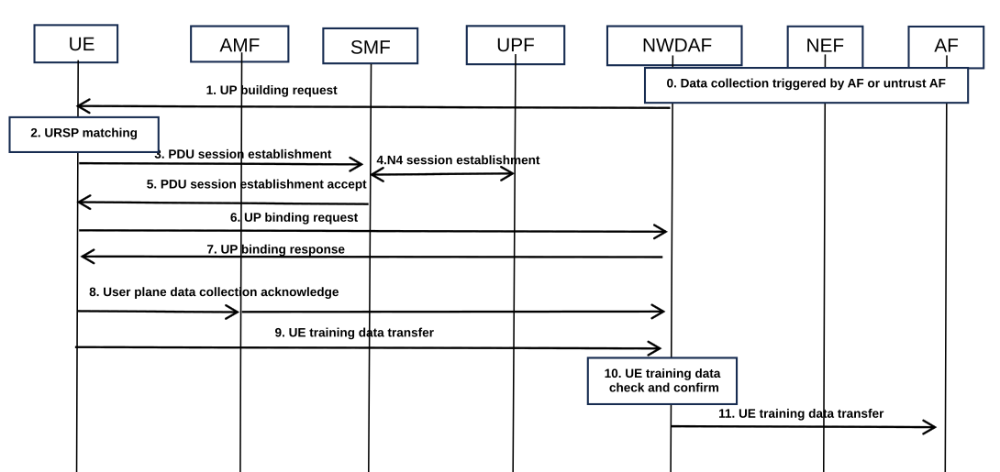
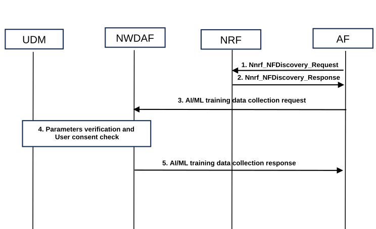
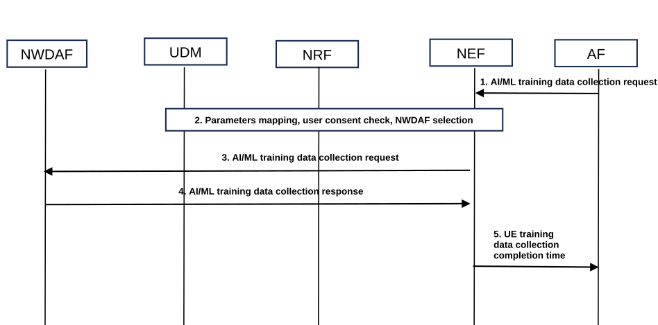
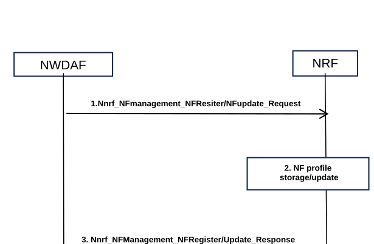
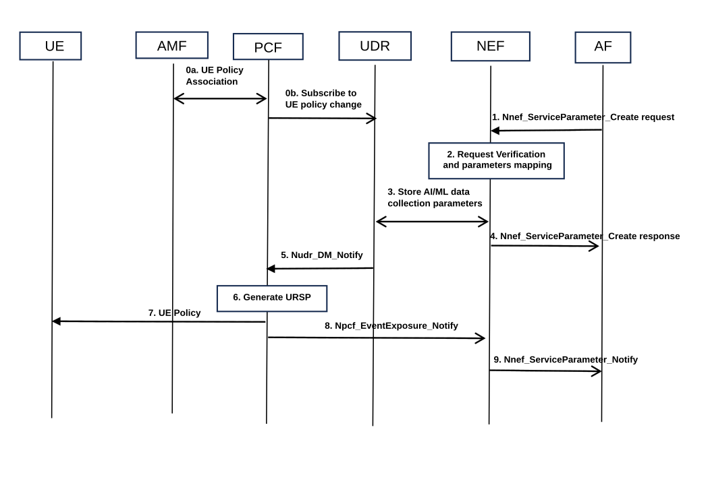
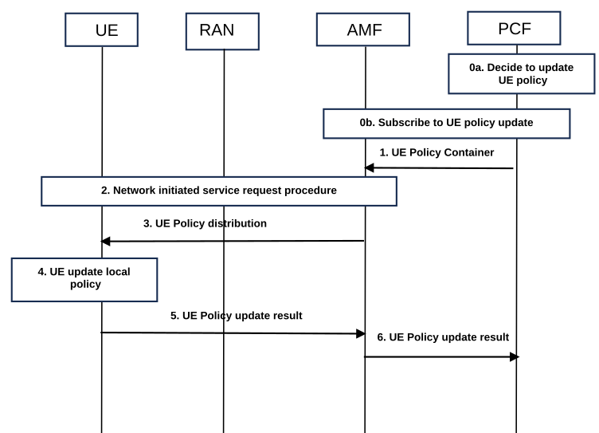

# 6.4 Solution \#4: UP Building for UE data collection

## 6.4.1 High level principles

This solution addresses KI#1 by defining triggering mechanisms, NF selection and UP building procedures for UE data collection. The data collection process can be initiated by either a trusted AF or an untrusted AF. On the other side, this solution also contains some URSP generation and UE policy distribution procedures.

## 6.4.2 Description

This solution addresses Key Issue \#1.

This solution proposes a user plane connection between an NF and UE, with some enhancements in the UP building request. The NF received the request from AF and trigger UP building. After UE training data collection finished, the NF checks the training data and sends them to NEF/AF. This solution is based on the user plane positioning procedure as described in clause 6.18.1 of TS 23.273 \[6\]. Besides UP building procedure, The data collection trigger and NF selection procedures for UE data collection are also included in this solution. Finally, the URSP generation procedure in clause 6.3.4.5 re-uses the procedure defined in clause 4.15.6.7.2 of TS 23.502 \[3\] with some additional parameters (e.g. the AI ML positioning indication and the data volume information from AF to NEF then to UDR). The UE policy distribution procedure in clause 6.4.3.6 re-uses the procedure defined in clause 4.2.4.3 of TS 23.502 \[3\] with enhancement in the content inside policy container (i.e. an enhancement on connection capability).

## 6.4.3 Procedures

### 6.4.3.1 The UP building procedure

Figure 6.4.3.1-1: User plane building between an NF and UE

Editor's note: The service operations will be updated.

NOTE 1: Dedicated S-NSSAI/DNN is used to differentiate the traffic of collected UE data from the UE regular traffic per PDU Session level. The UE matching the dedicated DNN/S-NSSAI using URSP rule and send the DNN/S-NSSAI in the PDU session establishment request in steps 2 and 3.

0\. The data collection triggering procedures are defined in clauses 6.4.3.2 and 6.4.3.31.

1\. The NWDAF sends a UP building request to UE via AMF and gNB for AI/ML data collection, the message may contain an NWDAF address information, UP binding ID (i.e. to associate the user plane connection to be established with the target UE), purpose of building user plane (e.g. AI/ML user plane data collection). If the NWDAF received UE ID from AF, it send the UP building request to the UE. If the NWDAF received location information, it retrieve the list of UE ID in the area from AMF and send the UP building request accordingly.

NOTE 2: In this solution, NWDAF is the NF to transfer the collected data.

2\. The UE performs URSP rule matching based on the received parameters. For example, the UE uses the purpose of building user plane to match based on the AI/ML data collection indication within the URSP rule's Connection Capability of Traffic Descriptor (TD). Then, the UE decides whether to establish a new PDU session using DNN and S-NSSAI in the Route Selection Descriptor (RSD) or use an existing PDU session for transmitting AI/ML-related application traffic. The URSP generation procedure and UE policy distribution procedure are specified in clause 6.4.3.5 and 6.4.3.6 respectively.

3\. The UE sends a PDU session establishment request to the SMF and the request message includes the DNN and S-NSSAI.

4\. The SMF selects the appropriate UPF based on the S-NSSAI and DNN and initiates the N4 session establishment.

5\. The SMF replies with a PDU session establishment acceptance message to the UE and the PDU connection service between the UE and the NF is established.

6\. The UE initiates the user plane connection binding process. It sends a user plane connection binding request to the NF and the request message includes the user plane binding ID received in step 1.

7\. The NWDAF replies with a user plane connection binding acceptance message to the UE.

8\. UE sends an acknowledgement to the NF through AMF to indicate a success of user plane connection establishment for data collection or a failure to utilize the user plane connection.

9\. The UE sends UE training data for AI/ML through the user plane to the NF.

10\. The NWDAF check whether the collected UE training data align with the requirements (e.g. number of data sample, type of data) from AF.

11\. The NWDAF transfer the AI/ML-related data collected from the UE to the NEF. This message may include one or more data types requested by the AF along with the corresponding data.

12\. The NEF maps the information received from the NF into external information (e.g. mapping SUPI to GPSI) and transfer the training data to the AF.

Editor's note: How to support visibility of standardized data is FFS.

### 6.4.3.2 UE training data collection triggered by trust AF

Figure 6.4.3.2-1: Trust AF triggered UE training data collection

1\. AF invokes NRF services to send a message such as Nnrf_NFDiscovery_Request, which may include the following information: NF Type = "NWDAF", AI/ML user plane data collection capability, Location information (e.g. TAI, AoI), Time information (e.g. data collection time period).

2\. NRF responds with Nnrf_NFDiscovery_Response, which includes information about one or more NWDAF(s).

3\. AF can invoke NWDAF services such as Nnwdaf_DataManagement_Subscribe or a new service specifically for AI/ML training data collection. The training data collection request may include following parameters:

\- Indication for AI/ML-related (user) data collection

\- Application information, such as Application ID, AF ID

\- UE information, including UE ID (e.g. GPSI), UE Group Information (e.g. Group ID) or indications for data collection from any UE.

\- Time-related information, including data collection time window (i.e. the time duration for data collection), required data validity period.

\- Location/area information for data collection, such TAI, Cell ID.

\- Data type, for example, reference signal information (e.g. CSI, SSB) and corresponding RSRP information, UE positioning information (e.g. latitude and longitude), UE antenna orientation information, codebook information, and radio measurement data information

\- Data sample information, such as number of data samples and required data quality thresholds

\- Subscription and notification address for collected AI/ML-related (user) data information

4\. NWDAF performs user consent confirmation for one or more parameters in the AF request. This may involve invoking UDM services, where NWDAF sends relevant parameters (e.g. UE ID) to UDM for user consent check and UDM returns the validation result.

5\. NWDAF responds to AF with a response message, which may include: Assigned AI/ML data collection reference ID or AI/ML data collection association ID, Authorized UE list or unauthorized UE list, expected data collection completion time or time when collected data will be provided to AF.

### 6.4.3.3 UE training data collection triggered by untrust AF

Figure 6.4.3.3-1: Untrust AF triggered UE training data collection

1\. The untrusted AF sends a AI/ML training data collection request to NEF, providing parameters listed in the step 3 of clause 6.4.3.2.

2\. NEF may perform various operations, including mapping external parameters to core network internal parameters, such as converting location information into TAI and Cell ID. It can also invoke UDM services (e.g. Nudm_SDM_Get) for parameter mapping, like converting GPSI to SUPI or mapping an external group ID to an internal group ID. Additionally, NEF is responsible for user consent confirmation for one or more UE IDs in the AF request, by sending the UE ID to UDM for verification and receiving the result. NEF also performs NWDAF selection, where if the selection is based on location information (e.g. TAI), NEF may invoke NRF services and find a NWDAF has user plane AI/ML data collection capability and covers the target TAI.

If it is based on UE information (e.g. UE ID), NEF may invoke UDM services to query the NWDAF serving the UE. Alternatively, NEF may select NWDAF based on local configurations. Finally, NEF is also responsible for assigning a transaction reference ID or subscription association ID.

3\. NEF sends the AI/ML data collection request to NWDAF, with mapped parameters and authorized UE list.

4\. The NWDAF sends a response with estimated UE training data collection completion time to NEF.

5\. The NEF forwards UE training data collection completion time to AF. The message can also include authorized UE list or unauthorized UE list, types of data collection authorized or not authorized for one UE or group of UE, together with the assigned reference ID or association ID.

### 6.4.3.4 NF profile registration and update procedure

Figure 6.4.3.4-1: NWDAF capability registration and update

1\. NWDAF registers or updates its AI/ML user plane data collection capability and the time that it support AI/ML user plane data collection capability to NRF.

2\. NRF stores or updates the capability.

3\. NRF returns registration or update result indication.

### 6.4.3.5 URSP generation procedure

The untrusted AF (OTT server) can provide AI related data collection parameters to core network as follows:

Figure 6.4.2-5: Untrusted AF provide AI related data collection parameters

0a. The UE has registered to the network, and the AMF has established UE policy association with the PCF.

0b. The PCF subscribes to notifications regarding changes in UE policy information from the UDR by invoking the Nudr_DM_Subscribe operation . The subscription may include SUPI, Data Set setting to "Application Data", Data Subset setting to "Service specific information".

1\. The AF invokes Nnef_ServiceParameter_Create to provide parameters related to AI/ML data collection to the NEF, which may include:

\- Application information, such as AF Service ID.

\- UE information, such as UE ID (e.g. GPSI), UE address (e.g. IP address), UE group information (e.g. external group ID).

\- Indication for AI/ML data collection.

\- External location/area information (e.g. Geographical coordinates (latitude/longitude) or Street-based city addresses) for the data collection.

\- Data volume-related information (e.g. required data size, required number of data sample, traffic offloading indication (i.e. allowing traffic offload (e.g. to non-3GPP access WLAN)) when the data volume is significantly large).

\- Subscription to UE policy delivery result notifications, along with a notification address.

2\. The NEF may perform the following operations:

\- Authorization of the AF request.

\- Mapping external parameters to core network internal parameters, such as:

\- Mapping AF Service ID and indication for AI/ML data collection to a combination of S-NSSAI and DNN of an entity inside core network based on local configuration; Mapping location information to core network parameters such as TAI and Cell ID; Invoking UDM services, such as Nudm_SDM_Get, for mapping GPSI to SUPI, mapping external group ID to an internal group ID.

\- Authorizing the service specific parameter provisioning request with the UDM by sending a Nudm_ServiceSpecificAuthorisation_Create.

\- Assigning a transaction reference ID.

3\. The NEF stores the mapped AF request parameters (from Steps 1 and 2) in the UDR, which may include: AI/ML data collection parameters (Indication for AI/ML data collection, SUPI or internal group ID, location/area information, data volume-related information, DNN, S-NSSAI), assigned transaction reference ID.

4\. NEF responds to the AF with a Nnef_ServiceParameter_Create response message, which includes the transaction reference ID assigned by NEF.

5\. The PCF receives a data change notification from the UDR via the Nudr_DM_Notify service. The notification may contain the AI/ML data collection parameters from steps 1 and 2.

6\. The PCF generates URSP rules based on the received information. The URSP rules may include:

\- AI/ML data collection indications, possibly as a connectivity capability value in a URSP rule's traffic descriptor (TD).

\- Location/area information, possibly as a parameter in the Routing Selection Descriptor (RSD).

NOTE 1: Only when UE in the location provided, the RSD is valid.

\- Traffic offloading indications, possibly as a parameter in the RSD (e.g. If the AF requested data volume is large).

\- DNN and S-NSSAI.

7\. The PCF delivers the UE policy to the UE (see the next procedure).

8\. If the AF has subscribed to UE policy delivery result notifications, and the PCF has received the UE policy container notification from AMF, then PCF sends a UE policy result notification to the NEF, using the Npcf_EventExposure_Notify message with SUPIs.

9\. The NEF maps the received PCF information to external information (e.g., mapping SUPI to GPSI). NEF then notifies the AF of the received information, including UE policy delivery result. This is done using the Nnef_ServiceParameter_Notify message.

NOTE 2: There are no impacts on the existing procedure, only some new parameters are added.

### 6.4.3.6 UE policy distribution

Figure 6.4.2.6-1: UE Policy distribution

0a. The PCF determines to update the UE policy based on trigger conditions (e.g., initial registration, UE policy update required).

0b. PCF subscribes to the AMF to be notified about the UE response to an update of UE policy information.

2\. The PCF invokes Namf_Communication_N1N2MessageTransfer to AMF with send a message containing:

\- SUPI , URSP rule, which includes:

\- AI/ML data collection indications (which may be a connectivity capability value in a URSP rule's traffic descriptor).

\- Location/area information (which may be a parameter in the URSP rule's routing selection parameters).

\- Traffic offloading indications (which may be a parameter in the Routing Selection Descriptor (RSD)).

\- DNN and S-NSSAI of an entity in core network.

3\. If the UE is in connected mode, the AMF delivers the URSP rule received from the PCF to the UE.

The URSP rule includes:

\- AI/ML data collection indications (which may be a connectivity capability value in a URSP rule's traffic descriptor(TD)).

\- Location/area information (which may be a parameter in the routing selection parameters of a URSP rule).

\- Traffic offloading indications (which may be a parameter in the RSD).

\- DNN and S-NSSAI of an entity in core network.

4\. The UE updates its locally stored UE policy based on the PCF-provided UE policy, which includes:

\- AI/ML data collection indications, Location/area information, Traffic offloading indications, DNN and S-NSSAI of an entity in core network.

\- The UE utilizes the AI/ML data collection indication within the URSP rule's Traffic Descriptor (TD) to match the corresponding Routing Selection Descriptor (RSD) parameters and decides whether to establish a new PDU session or use an existing PDU session for transmitting AI/ML-related application traffic.

5\. The UE sends the reception result (e.g. success indication) to the AMF.

6\. The AMF forwards the UE's response to the PCF by sending a Namf_Communication_N1MessageNotify message.

## 6.4.4 Impacts on services, entities and interface

The NWDAF needs to be enhanced to build a user plane with UE. The NWDAF may provide a purpose of building user plane (e.g. AI/ML user plane data collection) and data types/sample information to UE in the UP building request message. Also, the NWDAF needs to check and confirm the collected training data are aligned with the requirements before it sends to NEF/AF. On the other side, the NWDAF registers its AI/ML data collection capability with NRF, receives AI/ML data collection parameters from NEF or trust AF, and performs user consent verification for the provided parameters. It then sends a response back to NEF or trust AF, which may contain a list of authorized/unauthorized UEs and the expected data collection completion time.

The trust AF is responsible for selecting the appropriate NWDAF, sending data collection request with AI/ML data collection parameters to NWDAF, and receiving a response from NWDAF.

The untrust AF is responsible for sending data collection request with AI/ML data collection parameters to NEF.

The NEF receives AI/ML data collection parameters from untrust AF, performs user consent verification, and carries out NWDAF selection. Additionally, NEF forwards the AI/ML data collection parameters to NWDAF and subsequently receives a response from NWDAF, including the expected data collection completion time. It then sends a response to AF, which may include data collection authorization details and expected data collection completion time.

For the UE policy enhancement, the AF needs provide parameters to NEF, the new parameters include Indication for AI/ML data collection and data volume related information. The NEF needs to do mappings which includes a new mapping (i.e. mapping AF Service ID and indication for AI/ML data collection to a combination of S-NSSAI and DNN of an entity inside core network) and store the parameters to UDR. The UDR needs to store the parameters which includes the new parameters (i.e. Indication for AI/ML data collection and data volume related information) and inform PCF for policy update.

The PCF generate URSP rule considering the parameters related to AI/ML data collection. The URSP rule may contain a new value of CC, which is AI/ML data collection indications (i.e. a new CC value in a URSP rule's traffic descriptor), After generate the URSP rule, the PCF distributes to UE using existing procedure.
