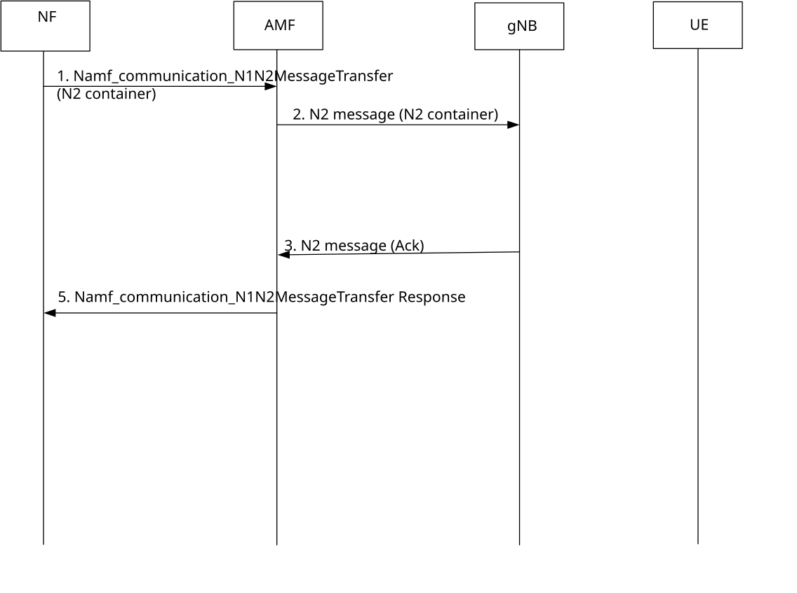

# 6.5 Solution \#32: How to authorize a UE request to make use of radio resources for measurements

## 6.5.1 High level principles

This solution is for Key Issue#1 for UE data collection over UP. The high level principles of the solution are:

\- This solution assumes selection of UEs is done in Core Network using some criteria, but the solution does not present how the selection is done, but rather rely on the full solution. This solution starts when the Namf_communication_N1N2MessageTransfer service is used in the full agreed solution.

\- RAN needs to know which UEs are authorized to request gNB to perform measurements for certain Event IDs for UE data collection for UE sided. This information is provided to the AMF in Namf_communication_N1N2MessageTransfer request that is forwarded to RAN in a container over a N2 message.

\- RAN considers information provided in the N2 container.

## 6.5.2 Description

Many solutions in this KI, relies on an Namf_communication_N1N2MessageTransfer request to AMF. The N1 container is then forward to UE which triggers an action in the UE (e.g. requesting the RAN to perform measurements at the UE, receiving a configuration for performing measurements, start performing measurements and later sending data collected to a data collecting NF in Core).

This solution builds upon that either UE training centre AF via NF in Core or an NF in Core decides upon which UE that are applicable for measurements and later send data to the Data collection NF in Core.

What is needed in any of these solutions is to let RAN know that the UE is selected and authorized to request measurements for single sided models. The AMF forwards authorization to RAN.RAN decides whether to accept the data measurement trigger from the UE.

## 6.5.3 Procedures

It is assumed for the agreed and concluded solution that a CN in Core has selected UEs using certain criteria. An NF in Core starts communication with each UE that is selected and thereby authorized to perform measurements for Data collection according to the Event ID.

It is assumed the procedure for the agreed and concluded solution uses Namf_communication_N1N2MessageTransfer service operation to trigger, via N1 (NAS) container the UE to start measurements.

Figure 6.5.3-1: Provisioning of authorized EventIDs for a UE to RAN

1\. Namf_communication_N1N2MessageTransfer service operation is sent from triggering NF (according to the agreed and concluded solution) with an N2 container added including Event ID and an indication that the UE using this NGAP ID is authorized to request RAN to configure measurements for the Event ID.

NOTE 1: The Event ID indicates what data needs to be collected.

NOTE 2: Optionally, if the agreed and concluded solution requires so, an extra Namf_communication_N1N2MessageTransfer request can be sent with only the N2 container.

2\. N2 message including an N2 container with the Event ID and an indication that the UE using this NGAP ID is authorized to request RAN to configure measurements for the Event ID.

3\. gNB response to the N2 container message.

4\. AMF forwards the information to the triggering NF.

NOTE 3: The gNB configures the UE, as of today, before measurements are started from UE.

NOTE 4: Further coordination with RAN WGs is needed to check the use of the indication.

## 6.5.4 Impacts on services, entities and interfaces

**NF initiating the Namf_communication_N1N2MessageTransfer request:**

\- Adding an N2 container including Event ID and indication that UE measurements for UE model is authorized for this NGAP ID.

**gNB:**

\- Receive N2 container from AMF and consider indication in the following UE configurations.
