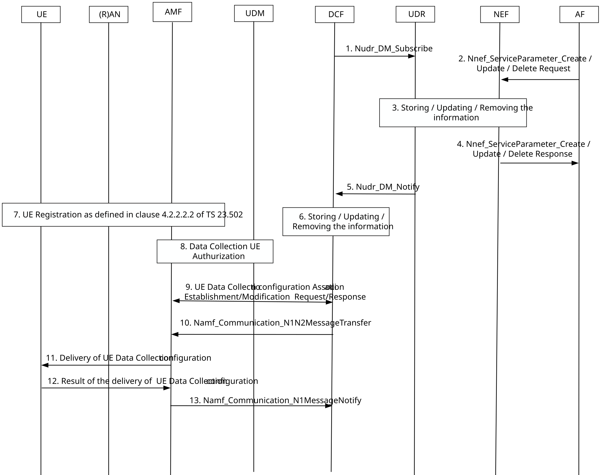
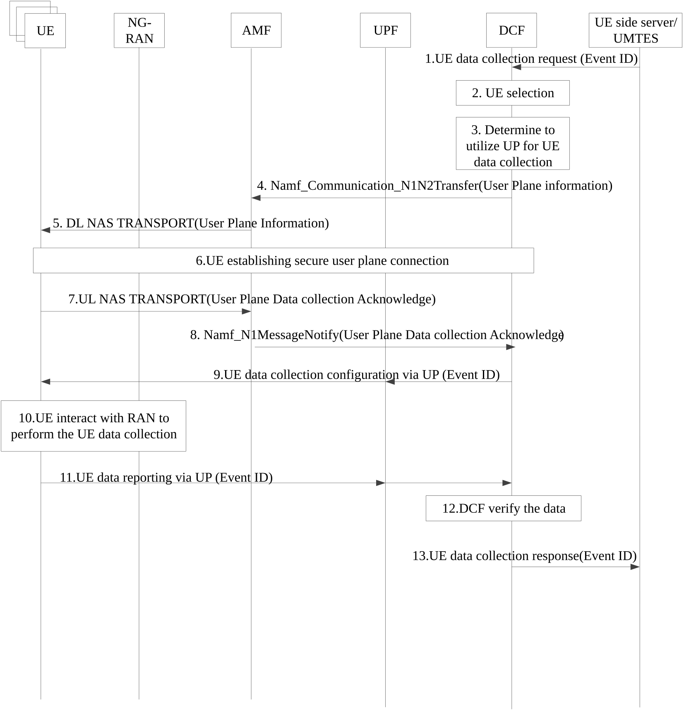
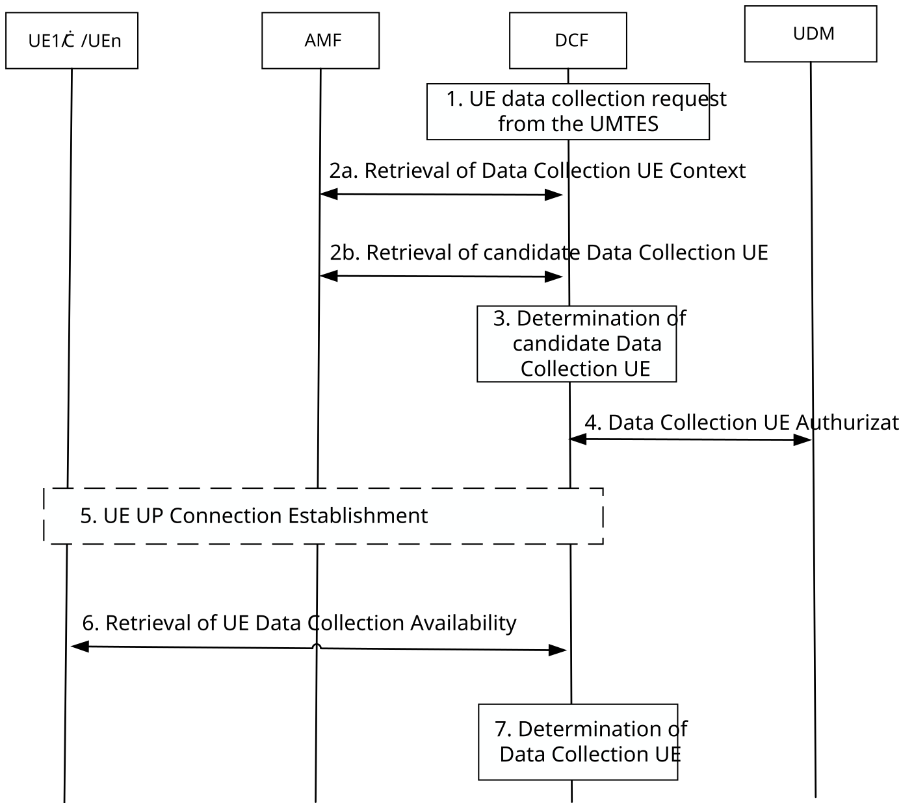

# 6.5 Solution \#5: Establish the UP connection between UE and 5GC to support the standardized UE data collection

## 6.5.1 High level principles

This solution is for Key Issue#1 for UE data collection over UP.

The high level principles of the solution are:

\- A new network function in the 5GC named Data Collection Function (DCF) is introduced to support the data collection.

\- The UE side server/UE model training entity server (UMTES) configure the DCF about the data collection application information including the Event ID and the corresponding data type the UE need to be measured and reported. The detail description is in the clause 6.5.3.1.

\- The DCF provision the UE Data Collection configuration to the UE via control plane signalling including the Event ID and the corresponding data type the UE need to be measured and reported.

\- The UE side server/UE model training entity server sends the UE data collection request to the DCF including the AoI and the Event ID.

\- The DCF selects the UEs to be used for the data collection and establish the UP based connection with the UEs.

\- The DCF sends the Event ID to the UE via UP to tigger the UE to perform the data measurement with the RAN.

\- The UE sends the measured data to the DCF via UP with the Event ID.

\- The DCF verify and match the UE transmitted data based on the data collection application information stored in the DCF and the Event ID.

\- The DCF expose the UE transmitted data to the UE side server/UE model training entity server.

The clarification of the different terminology for the data collection are as following:

**Data collection**: Refer to the end-to-end procedure including how to provision data collection application information and UE data collection configuration and how the UE side server/UE model training entity server request and receive the UE related data.

**Data measurement**: The UE interact with the RAN to obtain the data based on the measurement configurations and reference signals. This part is in the RAN scope.

**Data transmission**: The UE sends the measured data to the DCF via UP.

**Data exposure**: The DCF sends the data to the UE side server/UE model training entity server.

**Data verification**: DCF verify/match the data configured to be collected and the data that is received.

## 6.5.2 Description

To enable the 5GC to collect UE data and exposure the collected UE data to the UE side server/UE model training entity server, a Data Collection Function (DCF) is introduced with the key functionalities as following:

1\. Receive the Data collection application information provisioned by the UE side server/UE model training entity server.

2\. Send the UE Data Collection Configuration to the UE.

3\. Receive data collection requests from UE side server/UE model training entity server.

4\. Determine the data collection method (e.g. CP-based or UP-based).

5\. Identify the target UE(s) from which data needs to be collected.

6\. Establish a user plane connection with the target UEs.

7\. Send data collection request to the UE.

8\. Receive UE measured data.

9\. Match and verify the data transmitted from the UE.

10\. Expose the collected data to the UE side server/UE model training entity server.

Bullet 1-7 and 10 aim to achieve how 5GC can support the full controllability of standardized UE data transfer.

Bullet 2, 8, 9, 10 aim to achieve how 5GC can support the full visibility of standardized UE data contents.

## 6.5.3 Procedures

### 6.5.3.1 UE Data Collection Mapping Table

To minimize the consumption of network and air interface resources during the exchange of data collection requests and configuration among the UE, DCF and UE side server/UE model training entity server, the UE side server/UE model training entity server is responsible for creating and maintaining a UE Data Collection Mapping Table. The UE Data Collection Mapping Table is included in the data collection application information and UE Data Collection Configuration. The example of the mapping table is:

Table 6.5.3.1-1: UE Data Collection Mapping Table

| Event      | Description                                                             | Data Type (This is determined by RAN)        |
|------------|-------------------------------------------------------------------------|----------------------------------------------|
| Event ID 1 | This event is used to collect the CSI feedback related data from UE.    | The data type needs to be collected from UE. |
| Event ID 2 | This event is used to collect the Beam management related data from UE. | The data type needs to be collected from UE. |
| …          | …                                                                       | …                                            |

NOTE: The terminology for the event ID will be determined during the normative phase.

Before initiating a data collection request, the UE side server/UE model training entity server configures this mapping table across all relevant entities, including the UE and the DCF. When data collection related messages (such as requests/responses or subscriptions/notifications) are exchanged among the UE, DCF and UE side server/UE model training entity server, only the event ID need to be carried. Each node can then refer to the mapping table to determine the corresponding measurement data type.

### 6.5.3.2 Data collection application information and UE data collection configuration provision

Figure 6.5.3.2-1: Data Collection Application Information and UE data collection configuration provisioning over CP

1\. DCF subscribes to the UDR on any modification of Data collection application information by invoking Nudr_DM_Subscribe (AF service parameter provisioning information, SUPI, Data Set setting to "Application Data", Data Subset setting to "Service specific information").

2\. To create a new request, the AF invokes an Nnef_ServiceParameter_Create service operation.

To update or remove an existing request, the AF invokes an Nnef_ServiceParameter_Update or Nnef_ServiceParameter_Delete service operation together with the corresponding Transaction Reference ID which was provided to the AF in Nnef_ServiceParameter_Create response message.

The request includes Data collection application information. The data colletion application information includes the UE Data Collection Mapping Table.

3\. The NEF authorizes the AF request. The NEF performs the following mappings:

\- Map the AF-Service-Identifier into DNN and S-NSSAI combination, determined by local configuration.

\- Map the External Application Identifier into the corresponding Application Identifier known in the core network.

In the case of Nnef_ServiceParameter_Create or Update: The NEF stores the AF request information in the UDR as the "Application Data" (Data Subset setting to "Service specific information") together with the assigned Transaction Reference ID.

In the case of Nnef_ServiceParameter_delete: The NEF deletes the AF request information from the UDR.

4\. The NEF responds to the AF. In the case of Nnef_ServiceParameter_Create response message, the response message includes the assigned Transaction Reference ID.

5\. UDR notifies DCF on any modification of Data collection application information by invoking Nudr_DM_Notify.

6\. DCF stores/modifies/removes the Data collection application information based on what is received in Nudr_DM_Notify.

Step 7 onwards can happen in parallel with steps 1-6.

7\. UE registers to the network as defined in clause 4.2.2.2.2 of TS 23.502 \[3\].

8\. If UE indicates the capability of data collection in the registration request, the AMF checks with UDM on whether the UE is authorised to perform data collection.

9\. If UE is authorised to perform data collection, the AMF initiates UE Data collection configuration association establishment/modification to the DCF.

10\. On any modification of Data collection application information received from the UDR, the DCF provides the updated UE Data collection configuration in a container to the AMF by invoking Namf_Communication_N1N2MessageTransfer.

11\. The AMF transfers transparently the UE Data Collection configuration received from the DCF to the UE.

12\. The UE updates the UE Data Collection configuration provided by the DCF and sends the result to the AMF.

13\. The AMF forwards the response of the UE to the DCF using Namf_Communication_N1MessageNotify.

### 6.5.3.3 UP connection establishment and UE data collection request between the UE and DCF to support the UE data collection

To enable UP-based data collection, a UP connection need to be established between the UE and the DCF. When the DCF receive the UE data collection request and if there is no existing connection between the target UE and the DCF, DCF will tigger the UP connection establishment.

Figure 6.5.3.3-1: UP connection establishment and UE data collection configuration

1\. When the UE side server/UE model training entity server wants to collect the UE data to perform the UE-side model training, it sends a UE data collection request to the DCF. The request may include:

\- The Event ID.

\- The data collection period, indicate the time window that the data need to be collected from UE.

\- The maximum response time, indicate when the collected data need to be response to the UE side server/UE model training entity server.

\- The area of interest (AoI) to indicate a certain area the data consumer want to collect the data to perform model training.

\- Data size.

\- Reporting policy: the data should be reported from the DCF to the UE side server/UE model training entity server based on individual UE level or the group of UEs level.

\- The required number of the data samples.

NOTE 1: In this solution, it is assumed only one DCF is deployed to support the UE data collection.

2\. Based on the UE data collection request, the DCF determines which UEs to be selected to perform data collection as described in the clause 6.5.3.4.

3\. The DCF use UP-based connection for UE data collection. Steps 4-10 are skipped if there is already a user plane connection context of the target UE in DCF.

NOTE 2: The protocol between the DCF and UE for the UE data collection need to be cooperated with CT WG1.

4\. If DCF decides to utilize user plane for UE data collection and there is no established secure user plane connection between the UE and DCF, the DCF sends its user plane information to the AMF via Namf_communication_N1N2MessageTransfer. This information includes the DCF's address, represented as an IP address or FQDN. Additionally, the DCF assigns a UE data collection-UP binding ID to each UE. This ID may also be included in the user plane information sent to the AMF. The UE data collection-UP binding ID serves to bind the target UE with the user plane connection.

5\. The AMF sends the DCF's user plane information to the UE via NAS message.

6\. Based on the DCF's user plane information, the UE initiates establishment of the user plane connection with the DCF.

7\. UE sends an acknowledgement to DCF through AMF to indicate a success of user plane connection establishment.

8\. AMF sends the acknowledgement received in step 7 to the DCF via Namf_N1messageNotify service.

9\. Since the UE maintains a mapping of Event IDs to the corresponding required data type, the DCF only needs to send the Event ID to the UE to trigger the UE perform the data measurement. The DCF sends a data collection request to the UE, which includes the Event ID.

10\. UE locally maps the Event ID to the specific data types that need to be collected. The UE interacts with the RAN to obtain measurement configurations and reference signalling, then performs the required data collection.

11\. UE encapsulates the measured data into data packets and sends them to the DCF via the user plane connection. The data packets sent by the UE to the DCF include the Event ID.

12\. The DCF uses the Event ID provided by the UE and its locally stored mapping information to verify and match the expected data types that UE should be reported. The DCF may performs further formatting (e.g. anonymization, normalization) for the collected data according to the UE side server/UE model training entity server 's request.

13\. The DCF sends a data collection response to the UE side server/UE model training entity server including the Event ID and the corresponding collected data.

### 6.5.3.4 Discover and selection of data collection UE

Figure 6.5.3.4-1: Discover and selection of data collection UE

1\. DCF receives a UE data collection request as described in the clause 6.5.3.3 step 1, which may include candidate data collection UE list or a target data collection area.

2a. If candidate data collection UE list is obtained from step 1, for each UE, DCF requests UE context information from its serving AMF.

2b. If no candidate data collection UE list is available, DCF requests candidate data collection UE list from the AMF based on the target data collection area. The AMF will response on which UEs are in the target data collection area. The DCF will then based on each UE to request the following UE context from AMF:

\- Vendor ID/Chipset ID generated from PEI.

\- UE capability: e.g. UE data collection capability.

\- UE Data Collection UP connection information.

\- Access Type.

\- RM State.

\- UE location information.

\- Mobility Restrictions.

AMF sends the above information to the DCF.

3\. DCF determines the potential candidate data collection UE(s) based on information received from AMF.

4\. DCF sends the data collection UE authorization request to the UDM, which includes UE ID(s), user consent check and Data collection purpose. UDM checks for each UE if it is authorized to perform data collection based on its subscription information, and responds to DCF with the following information:

\- UE ID.

\- User consent.

\- Whether UE is authorized to provide data collection service.

\- Additional information if the UE is authorized: authorized data collection purpose, authorized PLMN, authorized Location, authorized Time Period, UE Availability verification indication.

5\. For each authorized data collection UE, if UE Availability verification indication is set, the DCF needs to verify UE availability. If DCF determines to interact with UE over UP connection, and there is no available UP connection, the UP connection is established.

6\. DCF receives the UE data collection availability information from the UE, which includes: UE current availability and User authorization.

7\. DCF determines final data collection UE(s) based on UE data collection availability information.

## 6.5.4 Impacts on services, entities and interfaces

**DCF:**

\- Support the Data Collection Application Information and UE data collection configuration provisioning.

\- Select the Target UE to perform the UE data collection.

\- Support the data collection UE selection.

\- Support data collection UE availability verification.

\- Support data collection UE authorization.

\- Determine to use UP based connection to support the UE data collection and assign a UE data collection-UP binding ID.

\- Send the UP information to UE to assist UE establish the UP connection.

\- Send the Event ID to the UE via UP.

\- Receive UE-side measured data.

\- Match and verify the data transmitted from the UE.

\- Expose the collected data to the UE side server/UE model training entity server.

**UE:**

\- Receive and maintain the UE data collection configuration.

\- Receive the DCF UP information and establish the UP based connection with the DCF.

\- Support to collect the measurement data and send the collected data to DCF via UP.

\- Support data collection UE availability verification.

**UDM:**

\- Support data collection UE authorization.

\- Support data collection UE availability management.
