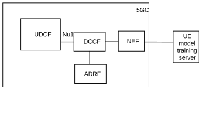
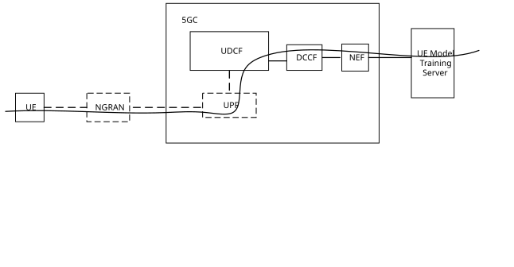
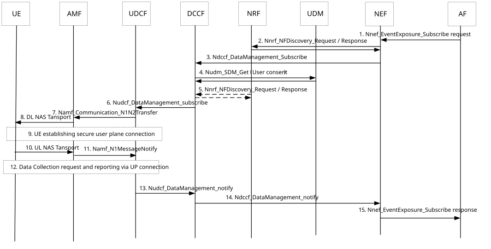
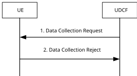
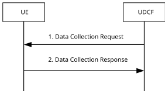
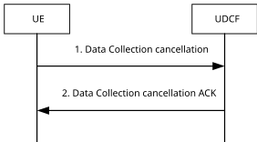

# 6.6 Solution \#6: Hybrid solution using UDCF to support UP based UE data collection for NR AIML air interface operation

## 6.6.1 High level principles

The following principles for this solution are proposed as below:

\- New UDCF is proposed as a UP path termination entity in 5GC for UE data transfer as below:

\- AF requests the data for specific UE from DCCF.

\- DCCF checks if the requested UE collected data are already stored in ADRF or not. If the requested UE collected data are available in ADRF, DCCF exposes the data from ADRF to AF. If the requested UE collected data are not available in ADRF, DCCF sends data for the specific UE from UDCF.

\- UDCF informs the UDCF address to UE via NAS signalling. UE establishes the UP connection via UPF to UDCF.

\- UDCF sends data collection request to UE via application layer signalling. The security about the application layer signalling between UE and UDCF will be discussed in SA WG3.

\- UE collects data according to RAN1/RAN2's decisions and sends the report to UDCF.

\- UDCF sends the received data from UE to DCCF, DCCF further sends to AF. DCCF may also store the collected UE collected data in ADRF.

## 6.6.2 Description

This solution addresses KI#1.

Based on the LS in RP-24331, SA WG2 is required to study transfer of data over UP for option 2 and study if the solution fulfil the visibility and controllability requirements from RAN2.

In order to do that, a new NF named UDCF (UE Data Collection Function) is proposed as a new 5GC entity with the following functionality:

\- The UP path termination entity in 5GC for UE data transfer from UE.

\- Receiving the UE data collection request from DCCF.

\- Requests data collection to UE.

\- Receiving data reporting from UE.

\- Expose UE data to DCCF.

The Nu1 interface is defined between UDCF and DCCF is described in Figure 6.6.2-1.

Figure 6.6.2-1: New Interfaces defined for UDCF

The UDCF based UE data transfer to UE-side model training is described in Figure 6.6.2-2.

Figure 6.6.2-2: UDCF based architecture

## 6.6.3 Procedures

### 6.6.3.1 General call flow about data collection

Figure 6.6.3.1-1 describes the procedure about AF subscribes UE data via UDCF.

Figure 6.6.3.1-1: AF subscribes UE collected data from UDCF

Editor's note: The benefit to define a separate UDCF comparing to DCCF and the mandating of DCCF need further evaluation.

AF is the UE model training server.

1\. AF sends the Nnef_EventExposure_Subscribe request message to request the UE collected data. This message may include the following information:

\- event ID, define a new event ID for different use cases that supported by RAN1, in this release the event ID may indicate beam management;

\- Target of reporting (any UE)and the maximum number of UE;

\- location information;

\- reporting info, e.g. reporting time period, number of reporting, reporting time window, reporting event condition.

2\. NEF discovers the DCCF from NRF for UE data collection request based on the following info:

\- the event ID: e.g. beam management;

\- location information.

3\. NEF sends Ndccf_DataManagement_Subscribe to the selected DCCF, the subscribe message includes the event ID, Target of reporting (GPSI(s), or any UE), location information and reporting info that received from AF.

DCCF should further determine the UE list from AMF with the location info.

4\. For each UE, DCCF checks user consent about the UE collected data collection.

5\. If user consent is granted, DCCF determines if any available parameters that stored in ADRF, if yes, DCCF will retrieve data from ADRF and report to AF via NEF. The following steps are skipped.

If there is no available data stored in ADRF, DCCF will discover an UDCF for each for UE collected data.

The UDCF was discovered from NRF.

UDCF registers the supported event ID, e.g. beam management, S-NSSAI, DNN and location information as NF profile in NRF. DCCF will discover the UDCF from NRF for each UE with these information.

6\. DCCF sends the requested Nudcf_DataManagement_Subscribe signalling to UDCF for each UE, the signalling includes event ID, e.g. beam management, UE ID and reporting info in the message. DCCF determines the reporting info based on AF's request in step 1 and operator's configuration.

7\. UDCF invokes the Namf_Communication_N1N2Transfer message to include the UDCF UP information to AMF. The UDCF UP information may be the UDCF IP address, or FQDN, or the connection capability. If the connection capability is used, a new standardized connection capability component value set as "data collection" is required to be defined for this feature.

8\. AMF sends the NAS message to UE which includes the UDCF UP information.

9\. UE establishes the UP connection to UDCF by using the UDCF UP information and the URSP rule that received from PCF.

10\. UE sends the NAS response to AMF.

11\. AMF sends response to UDCF.

12\. UDCF sends the data request to UE, which includes the event ID, reporting info. UE performs data collection as defined in RAN1 and RAN2, UE reports the collected data to UDCF if the reporting condition is fullfilled. The data collection and reporting between UE and UDCF is via a UP based signalling, e.g. HTTP protocol in this release. The details of data collection and reporting procedure between UDCF and UE are described in clause 6.6.3.3. The security about the interaction between UE and UDCF will be determined in SA WG3.

13\. UDCF reports the UE data received in step 12 to DCCF.

14\. DCCF reports data to NEF. DCCF may further store the UE data in ADRF as described in TS 23.288 \[5\].

15\. NEF forwards the data to AF.

It is also possible to support the direct report from UDCF to AF via NEF. In this case, DCCF will send the address of AF to UDCF in step 6, UDCF may further send the data to DCCF in parallel with the direct reporting with the purpose to store the data in ADRF.

Editor's note: Whether the UDCF can store the data to ADRF directly is FFS.

### 6.6.3.2 Traffic differentiation

The traffic for UE data collection can be differentiate with UE regular traffic in either PDU session level or QoS flow level.

**a) PDU session level:**

The URSP rule is provided by PCF to UE, in order to support the UE data collection, the operator may provide the UDCF UP information for UE data collection in traffic descriptors as described in table 6.6.3.2-1.

The structure of URSP rule is defined in Table 6.6.2.1-2 of TS 23.503 \[4\]. The parameters of traffic descriptor in table 6.6.3.2-1 is excerpted from Table 6.6.2.1-2 of TS 23.503 \[4\], the non-relevant parameters are not shown here.

Table 6.6.3.2-1: Traffic descriptors for UE data collection

<table>
<colgroup>
<col style="width: 20%" />
<col style="width: 55%" />
<col style="width: 23%" />
</colgroup>
<thead>
<tr class="header">
<th><strong>Traffic descriptor</strong></th>
<th><em>This part defines the Traffic descriptor components for the URSP rule.</em></th>
<th>Mandatory 
(NOTE 3)</th>
</tr>
</thead>
<tbody>
<tr class="odd">
<td>Application descriptors</td>
<td>It consists of OSId and OSAppId(s) (NOTE 2, NOTE 8).</td>
<td>Optional</td>
</tr>
<tr class="even">
<td>
IP descriptors

(NOTE 6)
</td>
<td>Destination IP 3 tuple(s) (IP address or IPv6 network prefix, port number, protocol ID of the protocol above IP) (NOTE 8, NOTE 12).</td>
<td>Optional</td>
</tr>
<tr class="odd">
<td>Domain descriptors</td>
<td>FQDN(s) or a regular expression which are used as a domain name matching criteria (NOTE 7, NOTE 8).</td>
<td>Optional</td>
</tr>
<tr class="even">
<td>DNN</td>
<td>This is matched against the DNN information provided by the application (NOTE 8).</td>
<td>Optional</td>
</tr>
<tr class="odd">
<td>Connection Capabilities</td>
<td>This is matched against the information provided by a UE application when it requests a network connection with certain capabilities (NOTE 4, NOTE 8) or traffic categories (NOTE 5).</td>
<td>Optional</td>
</tr>
</tbody>
</table>

In order to support the UE data collection, the UDCF IP address, or UDCF FQDN or a new standardized connection capability component value which sets as "data collection" can be set in the traffic descriptor.

NOTE: Coordination with GSMA is needed to define a new traffic category for data collection.

The structure of Route Selection Descriptor is defined in Table 6.6.2.1-3 of TS 23.503 \[4\], the user plane UE data collection dedicated PDU session parameters (e.g. DNN and S-NSSAI) are set in Route Selection Descriptors to the UE as part of URSP rule.

After UE receives the UDCF UP information in step 8 in Figure 6.6.3.1-1, or step 4 in 6.6.3.1-2, the UE will bind the data collection traffic to the PDU session with specific DNN and S-NSSAI.

**b) QoS flow level:**

The packet Filter set is used in the QoS rule and the PDR to identify one or more packet flow. Based on operator's decision, SMF provides the QoS rule to UE and PDR to UPF during SM procedure. For the IP PDU session type, the packet filter set support packet filters based on IP 5-tuples as described in clause 5.7.6.2 of TS 23.501 \[2\].

The UDCF IP address / IPv6 prefix or port number can be used as packet filter to differentiate the data collection traffic to other regular traffic.

### 6.6.3.3 Format of data reporting parameters send to UDCF

The details of protocol used for UE data transfer will be defined by stage-3. In order to support the controllability and visibility of data transfer, it is proposed to define a standard data reporting parameters, as an example in table 6.6.3.3-1. The content of the reported parameters will be decided by RAN WGs.

Table 6.6.3.3-1: Example of Data reporting parameters

<table>
<colgroup>
<col style="width: 36%" />
<col style="width: 15%" />
<col style="width: 48%" />
</colgroup>
<thead>
<tr class="header">
<th>Information name</th>
<th>Presence</th>
<th>Description</th>
</tr>
</thead>
<tbody>
<tr class="odd">
<td>Event ID</td>
<td>M</td>
<td>The event ID is defined in spec for each use cases that supported by RAN WGs, e.g. beam management.</td>
</tr>
<tr class="even">
<td>Reported parameters</td>
<td>M</td>
<td>
The UE measurement parameters, the content of reported parameters are defined by RAN WGs.

e.g. RSRP
</td>
</tr>
<tr class="odd">
<td>Data exposure restriction</td>
<td>O</td>
<td>Indicate if any data processing in UE side, e.g. normalization within the reporting periodic.</td>
</tr>
</tbody>
</table>

Considering the future enhancement, it is also supported to define some operator specific event ID and the corresponding UE measurement parameters. The detail can be defined by stage 3 based on operator's requirement.

### 6.6.3.4 Data collection reject and cancellation

It is supported by UE to reject the data collection requested from UDCF due to e.g. UE's power condition, the radio connection, .etc. Figure 6.6.3.4-1 is call flow of Data Collection reject procedure.

Figure 6.6.3.4-1: Data collection reject procedure

1\. UDCF sends data collection request to UE, with the requested event ID and the reporting information. The reporting information may include the reporting time period, number of reporting, reporting time window, reporting event condition, .etc.

2\. If UE cannot support the reporting information, e.g. the number of reporting, reporting time period or reporting time window, UE will reject the data collection to UDCF.

In order to reduce the UE data collection reject, the UDCF may provide some alternative reporting information to UE as proposed in Figure 6.6.3.4-2.

Figure 6.6.3.4-2: Data collection with alternative reporting information

1\. UDCF sends data collection request with the requested event ID and the reporting information. For each reporting information, the UDCF may provide different allowable values with a precedence sequence to the UE. For example, the UDCF may include different number of reporting, different reporting time period, or different time window.

2\. UE will consider the UE power condition, radio condition and select the more suitable reporting information value comparing to step 1. UE will include the selected value for reporting information in the response message send to UDCF.

After UE accept the data collection request, UE may decide to cancel the data collection procedure due to UE's power condition, the radio connection, .etc. as described in Figure 6.6.3.4-3.

Figure 6.6.3.4-3: Data collection cancellation

1\. UE decides to cancel the data collection, the data collection cancellation message is sent to UDCF

2\. UDCF sends ACK to UE.

All the procedure that proposed between UE and UDCF in this clause is based user plane signalling and the detail will be determined by stage 3.

## 6.6.4 Impacts on services, entities and interfaces

**UDCF:**

\- New 5GC entity to support UE data collection and exposure to DCCF.

\- support the UP path based interaction between UE and UDCF.

**DCCF:**

\- Enhance to support data exposure to AF.

\- Enhance to support UDCF discovery.

**UE:**

\- Receiving UDCF UP information via NAS signalling.

\- Establishing the UP connection to UDCF.

\- Receiving UE collected data collection request and data reporting to UDCF via UP signalling.

\- Support the UP path based interaction between UE and UDCF.

\- Support the Data reporting parameters.
