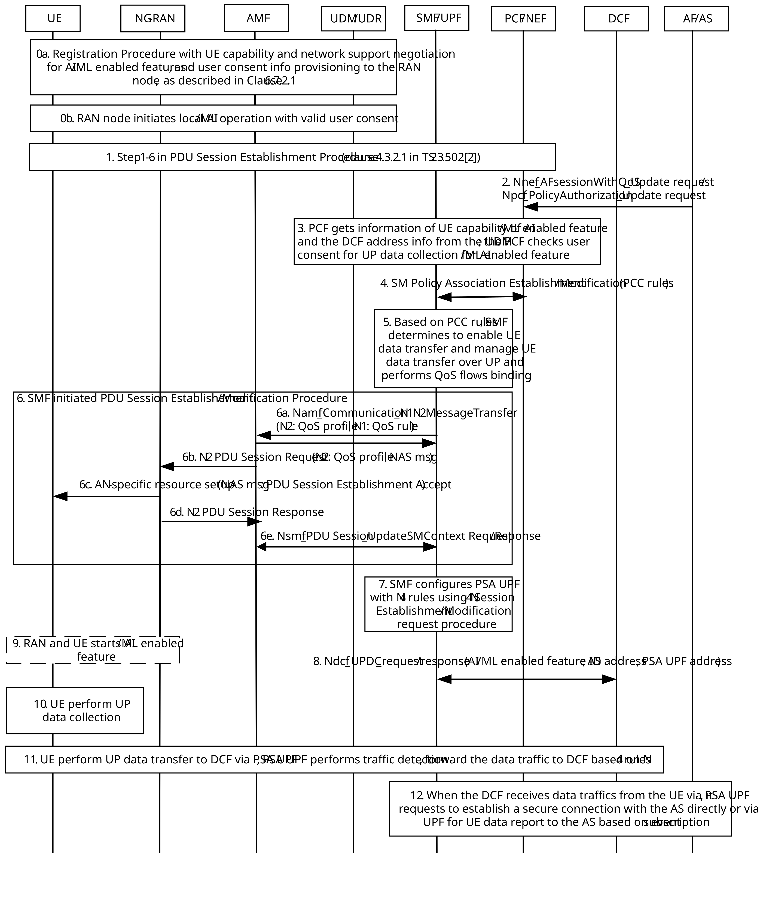

# 6.7.3 Procedures

The procedure of the AF request for UE Data Collection, Transfer and Reporting is shown in Figure 6.7.3-1.

Figure 6.7.3-1: AF request for UE Data Collection, Transfer and Reporting

0a. The UE performs registration procedure with negotiation of UE capability and network support for AI/ML enabled features and user consent information provisioning to the RAN node, as described in clause 6.7.2.1.

0b. When the RAN node detects an AI/ML optimization opportunity, it determines whether to perform local AI/ML operation by firstly checking its local RAN UE Context for a valid local AI/ML Operation Consent, which is pre-provisioned during registration procedure.

\- If the consent is unavailable or expired, the RAN performs a real-time user consent check by sending a new Namf_UserConsentQuery message, including the AI/ML feature ID, UE ID, and the user consent indication and purpose set for local AI/ML operation, to the UDM via the AMF.

\- If consent is granted, the RAN proceeds to enable the AI/ML enabled feature locally. This step is independent of the UP data collection procedure.

1\. The UE performs PDU Session Establishment procedure (as defined in step 1-6 in clause 4.3.2.2.1 of TS 23.502 \[3\]) are performed.

2\. An AF sends AF request using Nnef_AFsessionWithQoS or Npcf_PolicyAuthorization_Create service operation for the UE or a group of the UEs that may provide a least one of the following pieces of information for an AI/ML enabled feature:

\- AI/ML enabled feature ID.

\- QoS parameters for the UE data transfer.

\- Indication of UE data collection.

\- UE data report configuration information: AS server address and port number for UE data transfer (e.g. from DCF to the AS), Subscription of UE data report with a new Event ID for the DCF including UP data reporting schedule information, e.g. time, frequency.

3\. The PCF gets information of UE capability of AI/ML enabled feature ID and DCF address information from the UDM/UDR. In addition, the PCF checks user consent of UP data collection with purpose of AI/ML enabled feature for NR air interface, using data-key: SUPI of the UE and/or the AI/ML enabled feature ID and proceed with the following steps if user consent indicates allowed. Otherwise, the PCF replies AF with proper cause indicating lacking of user consent for the AI/ML enabled feature for NR air interface.

4\. The SMF performs SM Policy Association Modification procedure to the PCF for the PDU session. The PCF provides PCC rule to the SMF for the impacted PDU session for the UE (or PCC rules for the impacted PDU sessions for a group of UE). The PCC rule includes information obtained from the AF request message and DCF address information, in which the DCF address information is retrieved from the UDM/UDR if available.

5\. Based on received PCC rules, the SMF determines to enable UE data transfer and manage UP data transfer over user plane for the AI/ML enabled feature and performs QoS flows binding accordingly.

6\. Based on PCC rules, the SMF discovers a suitable DCF, configures the RAN node with QoS profile including the QoS parameters and AI/ML enabled feature ID, in N2 container in the Namf_Communication_N1N2MessageTransfer message to the AMF in step 6a. Then the RAN node receiving N2 PDU Session Request message, in step 6b, obtains QoS profile from the AMF. Also, the SMF configures the UE with QoS rule, AI/ML enabled feature ID, Indication of UP data collection and DCF address information, which are included in NAS message of PDU Session Establishment Accept or Modification Command message and sends the NAS message in N1 container in the Namf_Communication_N1N2MessageTransfer message to the AMF. Then the RAN node receiving N2 PDU Session Request message, in step 6b, forwards PDU Session Establishment Accept or PDU Session Modification Command message in step 6c to the UE.

\- For the RAN node: Based on the QoS profile and AI/ML enabled feature ID, the RAN node may query the UE capability of the AI/ML enabled feature ID and sends RRCReconfiguration message to the UE if determining to enable the AI/ML enabled feature operation (e.g. the AI/ML enabled feature needs inferencing input from the RAN node).

\- For the UE: Based on the QoS rule for UP data collection for the AI/ML enabled feature ID, the UE starts the corresponding AI/ML enabled feature operation and data collection of the standardized data of the corresponding AI/ML enabled feature.

Editor's note: N2 impacts and how RAN and UE interact for enabling an AI/ML enabled feature need coordination with RAN.

7\. The SMF configures the PSA UPF by sending N4 Session Modification Request message including N4 rules with the following information for the uplink direction:

\- PDR rule, which is used to detect the data traffic flow with destination address set as DCF address and port number, which is associated with the AI/ML enabled feature ID.

\- FAR rule includes the DCF address and port number. When the traffic is detected based on the PDR, the PSA UPF enforces Forwarding Action Rule (FAR) that defines how the detected packet is to be forwarded.

\- QER rule are used to associate the data traffic flow with proper QoS parameters for UP data transfer of the AI/ML enabled feature.

In addition, the SMF may configure N4 rules for UE data report to the AS with the following information for the uplink direction:

\- PDR rule, which is used to detect the data traffic flow with source address set as DCF address and port number for UE data report, which is associated with the AI/ML enabled feature ID.

\- FAR rule includes the AS address and port number.

8\. if the DCF address information is not available in the PCC rules and configures the DCF using a new Ndcf service operation with the following information:

\- AI/ML enabled feature ID.

\- UP Connection information for data transfer including AS address information and PSA UPF information.

NOTE: If only AS address information is provided, the DCF requests for a secure connection with the AS. If both PSA UPF information and AS address information are provided, the DCF requests for a secure connection with the AS via PSA UPF. In this case, the PSA UPF requests for a secure connection with the AS.

\- UP data reporting schedule information, e.g. time, frequency.

9\. The RAN node and the UE start AI/ML enabled feature identified by AI/ML enabled feature ID, e.g. using RRCReconfiguration procedure, if not already starting. Upon receiving RRCReconfiguration indicating to activate an AI/ML feature ID, the UE responds with either: RRCReconfigurationComplete (success), or RRCReconfigurationFailure (rejection), including proper cause indicating AI/ML feature ID not supported currently, and optionally additional information, e.g. specific constraint (battery/load/thermal), retry timer indicating when UE might be available again.

Editor's note: How RAN and UE interact for enabling an AI/ML enabled feature need coordination with RAN.

10\. The UE performs UE data collection of the AI/ML enabled feature.

11\. The UE sends collect data and transfer the data traffic to DCF via PSA UPF. Based on configured N4 rules, when the PSA UPF detects data traffics from the UE based on PDR, it forwards the data traffics to the configured DCF address indicated in FAR.

12\. When the DCF receives data traffics from the UE via PSA UPF, it may perform the following steps based on information, obtained in step 8, for configured UP data transfer schedule information, e.g. time, frequency:

\- If only AS address information is configured by the SMF, the DCF requests for a secure connection with the AS directly over an new interface between the DCF and the AS.

\- If both PSA UPF information and AS address information are provided, the DCF requests for a secure connection with the AS via PSA UPF. In this case, the PSA UPF requests for a secure connection with the AS. For data traffic received from the DCF, the PSA UPF forwards it to the AS.
