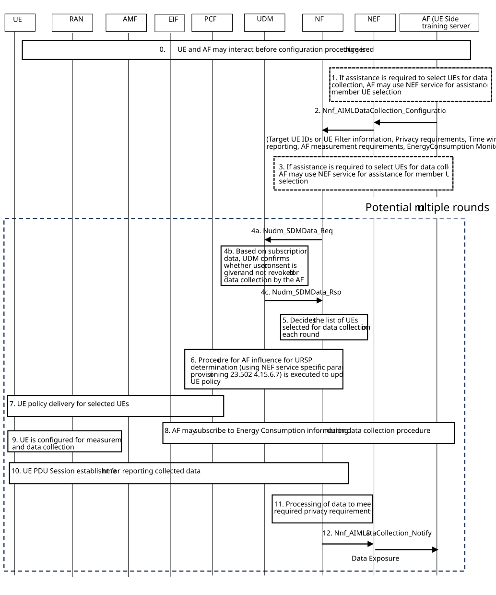

# 6.8 Solution \#8: AF provisioning of UE Data collection requirements with NEF support

This solution is addressing KI#1: Data collection over user plane for UE side model training.

## 6.8.1 High-level solution principles

The following are the high-level solution principles:

1\. The UE side model training server acts as an untrusted AF and interacts with the 5GC via NEF for providing data collection requirements and measurements configuration.

a\. Data collection requirements may include required area of interest where data has to be collected, privacy preservation requirements for the data transfer, information to help in selecting target UEs, etc.

b\. Measurement configuration may include frequency/band for data collection, time window for data transfer and reporting.

2\. The NF within the MNO domain supporting the data collection and transfer, receives the measurement and data collection configuration from the UE side training server acting as untrusted AF.

Editor's note: Which NF within the MNO domain supports the data collection and transfer is FFS.

3\. Either the NF supporting the data collection and transfer or the UE side training server may use NEF services to request assistance to perform UE selection for data collection. For example, the NF may use NEF services if the UE side model training server does not specify UE IDs or need 5GC assistance to select suitable UEs meeting certain criteria. Alternatively, the UE side training server may directly use NEF services to request assistance for UE selection for data collection and provide the UE IDs to the NF supporting the data collection and transfer.

4\. The NF supporting the data collection and transfer may check the user consent data from the UDM before finalizing selection of UEs for data collection. User consent data in UDM holds consent status for a subscriber per purpose of data collection and per AF authorized to request data collection.

5\. The user plane connection for UE data collection is terminated at the NF supporting the data collection and transfer. The NF supporting the data collection and transfer or NEF perform required privacy operations on the collected data from the UE (anonymisation, aggregation) before exposure of the data towards UE side training server acting as AF.

## 6.8.2 Description

The UE side model training is performed by a training server external to MNO domain. The data required for UE side model training depends on the training server. The training server can have specific requirement on where the data is collected (Area of interest). The training server may not have a requirement on collecting data from specific UEs, it may be that the server has some filter conditions that it needs the UEs providing data to satisfy, so the NEF can provide assistance. The training server may also have specific requirements on measurement configuration (e.g. frequencies where measurement is to be performed). Some training servers may also require that collected data is sanitized, i.e. to remove UE identifiers before that data is provided to the server.

The training server acts as an AF and interacts with 5GC using NEF (The training server may also interact directly with the 5GC bypassing NEF, if it has an SLA with the MNO). There is also a NF which is responsible for receiving the requirements from the UE side training server (untrusted AF) and preparing the collected data for exposure outside of MNO domain.

In addition, the training server may optionally request the 5GC to monitor network energy consumption for the data collection procedure leveraging the exposure of energy information by EIF.

Editor's note: Which NF within the MNO domain is responsible supports the data collection and transfer is FFS.

## 6.8.3 Procedure for collecting UE data and reporting to the UE side training server

The following call flow provides an overview of the procedure.

Figure 6.8.3‑1: Call flow for configuring data collection and transfer for UE side model training

0\. UE and AF may interact before the UE data collection and transfer configuration procedure is triggered.

NOTE: Step 0 is out of scope of this key issue.

1\. **Assistance for UE selection:** If the AF performs the UE selection itself, the AF may request assistance for member UE selection from NEF indicating appropriate filtering criteria (e.g. UE's in certain target area) as specified in clause 4.15.13 of TS 23.502 \[3\]. The AF may include as a filter criteria, the requirement to select UE’s with a required AI/ML capability. For example, the AF could include AI/ML-based beamforming as required capability in the selected UEs.

Editor's note: How the AI/ML capability is used is FFS and requires feedback from RAN WGs.

2\. AF invokes the NF services via NEF to provide configuration parameters supporting UE data collection. This includes UE IDs (SUPIs, IP addresses) and filter information for selection of UEs, Area of interest, Time window for collection and reporting, Privacy requirements for exposure of data, measurement requirements.

3\. The NF may or may not authorize the request from the AF with configuration parameters supporting UE data collection mentioned in step 2. The NF also checks with UDM whether the requested UEs are registered for normal service using Nudm_UECM_Get service operation. The UEs that are not registered for normal service are not included for data collection and transfer procedure.

**Assistance for UE selection:** If assistance is required to initially select UEs for data collection in case the AF does not provide the selected UE IDs, then the NF supporting the data collection and transfer may use NEF services to request or subscribe to such assistance information indicating appropriate filtering criteria (e.g. UE's in certain target area) as specified in clause 4.15.13 of TS 23.502 \[3\]. The AF may include as filter the requirement to select UE’s with a required AI/ML capability. For example, the AF could include AI/ML-based beamforming as required capability in the selected UEs.

Editor's note: Whether assistance for UE selection in steps 1 and 3 requires new or enhanced NEF services and filtering criteria is FFS.

The following steps can be provided in multiple rounds, if the UEs selected for data collection need to change.

4\. **User Consent check:** The user consent information from subscription data for the UEs are verified by the NF by checking with UDM using existing services before deciding on their suitability for data collection and transfer for the requesting AF. If the AF provides specific UE IDs, the NF verifies their user consent information before proceeding with data collection configuration from those UEs.

Editor's note: The user consent purpose for step 4 is FFS.

5\. Once the user consent status is verified, the NF decides the list of UEs for data collection and transfer removing any UEs for which user consent has not been granted or has been revoked. The selection may also be updated based on the energy consumption information being received in previous rounds for the previously selected UEs.

6\. **UE Policy updates for data collection:** UEs selected for data collection are configured with URSP rules that help how and when to establish a PDU Session with connectivity towards the NF. The NF invokes PCF service for configuring the right URSP rules for selected UEs. Procedure for AF influence for URSP determination in clause 4.15.6.7 of TS 23.502 \[3\] is reused here. The UE policy may include the configured time window for reporting as requested by the AF.

7\. Updated UE policy is delivered to the selected UE(s) using existing mechanisms.

8\. The AF may subscribe to EIF for energy consumption information via NEF using the event exposure service at the required granularity for the data collection procedure (i.e. at the granularity of a slice if separate DNN/S-NSSAI is provisioned, PDU Session if a separate PDU Session is used or at the granularity of SDF for the data flow terminating at the NF).

9\. UE performs measurement as per the configuration from NG-RAN.

NOTE: The trigger for the UE to perform data collection is up to RAN WG decision and therefore out of scope of this solution.

10\. **Procedure for reporting:** UE establishes PDU Session for the transfer of collected data as per the configured URSP rules. UE may have its application client that is responsible for communicating with the 5GC NF and/or packaging measurement results for collection and exposure.

11\. **Processing of collected data before exposure:** The NF supporting the data collection and transfer may perform additional data processing before exposure of data from MNO domain towards the AF. The range of operations include data anonymisation (remove UE IDs from collected data and act as a proxy for data exposure towards AF), data aggregation (aggregates data from multiple UEs and then expose the aggregated data towards AF) as requested by the AF. The NF also may provide additional metadata about the collected data (including whether the data is for training or inference or both) and data collection process (including the QoS parameters applicable to the QoS flow carrying this data in 5GS, e.g. 5QI, ARP).

12\. The NF supporting the data collection and transfer notifies the AF via NEF of the results of the request for data collection and transfer including the exposure of the transferred data.

Editor's note: How the visibility requirement is fulfilled is FFS.

## 6.8.4 Impacts on services, entities and interfaces

This solution impacts the NF supporting the data collection and transfer and NEF.

Editor's note: Details on impacts will be finalized after it is clarified which NF within the MNO domain supports the data collection and transfer.

**Data Collection NF:**

\- New 5GC entity to support UE data collection and transfer.

\- Sets up URSP rule for selected UEs.

\- Performs data processing after collection (e.g. anonymisation, data aggregation) before exposure.

**NEF:**

\- New service to request configuration of the UEs for data collection.

\- Enhance to support new filtering criteria to select UE (i.e. AI/ML capability).

**UE:**

\- Receives configuration information via URSP rule.

\- Establishes the UP connection to data collection NF.
