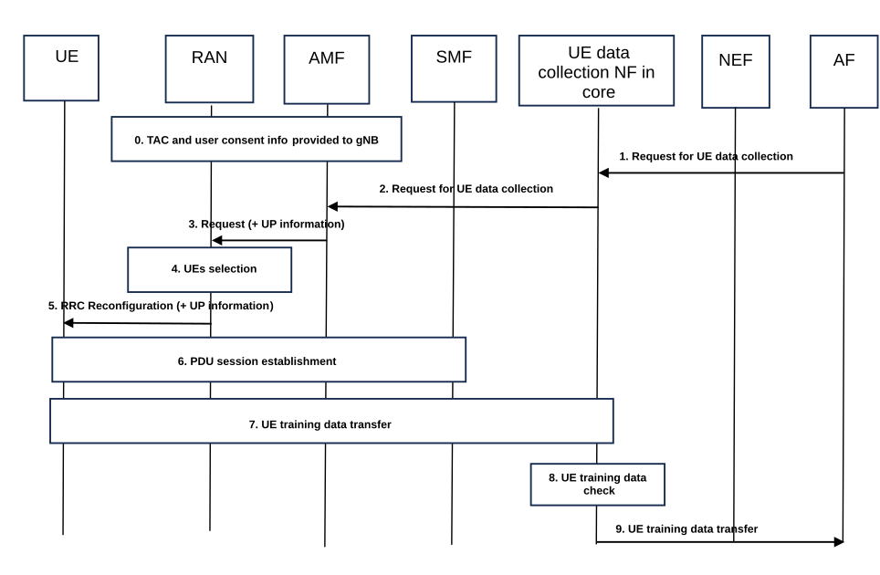

# 6.9 Solution \#9: High-level UE data collection procedure

## 6.9.0 High-level solution Principles

This solution is based on the following high-level principles:

\- UE model training entity OTT server acting as an AF contacts (via NEF) a "UE data collection NF in 5G Core" to request data collection from specific UEs (identified by Type Allocation Codes), for specific measurement Id(s) and possibly in specific area(s).

\- Configuration of the data collection in the UEs is done via Control Plane.

\- gNBs are responsible for selecting the UEs for data collection based on Type Allocation Codes provided by Training entity OTT server, taking user consent and local gNB information into account.

\- UEs are configured by gNBs for data collection, together with UP information, which then allows UEs to transfer collected data to "UE data collection NF in 5G Core" via User Plane.

## 6.9.1 Description

This solution addresses Key Issue \#1.

A "UE data collection NF in 5G Core" is responsible for handling requests from UE model training entity servers. This NF could be mapped to existing NF, e.g. DCCF, or could be a new NF.

The request from UE model training entity server (acting as an AF) for data collection may contain specific target UE(s), specific geographical area(s) and specific measurement Id(s). The identification of target UE(s) is made via Type Allocation Code (TAC).

The "UE data collection NF in 5G Core" transfers the request to AMFs together with UP information (allowing UE(s) to address the "UE data collection NF in 5G Core"), The AMF then forward the request to appropriate gNBs.

The gNBs are responsible for selecting the UEs for data collection, based e.g. on other procedures running at gNB for the UEs, e.g. avoiding conflict with MDT or taking radio conditions into account. Once the UEs are selected, the gNBs provide the request to the UEs, together with the UP information.

The UEs then start data collection and data transfer to the UP entity provided in UP information.

## 6.9.2 Procedures

### 6.9.2.1 Initiating UE data collection

The procedure is shown below:

Figure 6.9.2-1: High-level UE data collection initiation procedure

0\. During UE context setup, AMF provides RAN with Type Allocation Code (in the PEI) and user consent information for the UE for UE data collection.

Editor's note: AMF providing user consent information to gNB is already supported for e.g. management-based MDT as per TS 32.422 \[11\] clause 4.9. For the present solution enhanced user consent "for UE data collection" would need to be provided to RAN. Further details on how to provide user consent "for UE data collection" to RAN are FFS.

Editor's note: Impacts to RAN would need to be agreed by RAN WG2 and RAN WG3.

1\. UE model training entity server request for UE data collection is provided to "UE data collection NF in 5G Core" via NEF. The request contains Type Allocation Code(s) for the UEs to collect data from, geographical area(s) or cell(s) where to collect data and measurement Id(s) indicating the type of measurements expected. The NEF checks whether the AF is authorized for this request. The NEF maps the geographical area(s) into a list of TAIs.

Editor's note: Whether measurement IDs or AIML feature IDs are provided is FFS.

2\. The "UE data collection NF in 5G Core" checks whether the request from the UE model training entity server can be fulfilled and transfers the request to appropriate AMFs, together with UP information indicating the intended destination of the collected data.

Editor's note: How 5GC can support the full controllability of standardized UE data transfer is FFS.

3\. The AMF forwards the request to appropriate gNBs. This uses non-UE associated NGAP signaling. The AMF provides the UP information to the gNB. The UP information provides enough information to the UE to be able to establish the PDU session in step 6 and they are transparently forwarded by gNB to the selected UEs in step 5.

4\. The gNBs are responsible for selecting the UEs based on information received in step 3 and information received in step 0, also taking into account local information at gNB. For example, the gNBs may take into account potential conflict with on-going MDT procedures or radio conditions associated with the specific measurement Id.

NOTE: Whether and how gNBs take UE capabilities for UE data collection into account if up to RAN2.

5\. The gNB provides radio measurement configuration to the UE, together with the UP information. UP information provide enough information to the UE to be able to establish the PDU session in step 6 and they are transparently forwarded by gNB to the selected UEs.

Editor's note: Impacts to RAN and UE for step 4 and step 5 would need to be checked with RAN WG2 and CT WG1.

6\. (if such PDU session is not already established) The UE establishes a PDU session for data collection taking the received UP information into account . This may use URSP.

7\. The UE starts collecting data and provides data to the "UE data collection NF in 5G Core" over user plane.

8\. The "UE data collection NF in 5G Core" can, if configured by the operator, check collected data, e.g. check that collected data is according to measurement Ids requested at step 2.

9\. The "UE data collection NF in 5G Core" transfers the collected data to the UE model training entity server.

## 6.9.3 Impacts on services, entities and interface

Editor's note: Details to be added.
