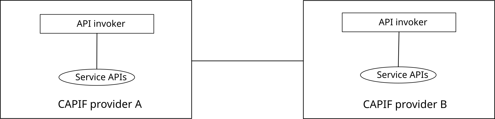

# 4 Architectural requirements

## 4.1 General

### 4.1.1 Introduction

This subclause specifies the general requirements for CAPIF architecture.

### 4.1.2 Requirements

\[AR-4.1.2-a\] The CAPIF shall provide mechanisms (e.g. publish service APIs, authorization, logging, charging) to support service API operations.

\[AR-4.1.2-b\] The CAPIF shall enable API invoker(s) to discover and communicate with service APIs from the API providers.

\[AR-4.1.2-c\] Reference points between CAPIF and external applications shall be provided as APIs.

\[AR-4.1.2-d\] Reference points internal to CAPIF may be provided as APIs.

### 4.1.3 Requirements for supporting 3rd party API providers

\[AR-4.1.3-a\] The CAPIF shall provide mechanisms (e.g. publish service APIs, authorization, logging, charging) to support service API operations from trusted 3rd party API providers.

\[AR-4.1.3-b\] The CAPIF shall enable API invoker(s) to discover and communicate with service APIs from trusted 3rd party API providers.

## 4.2 Service API publish and discover

### 4.2.1 Introduction

This subclause specifies the service API publish and discover related requirements.

### 4.2.2 Requirements

\[AR-4.2.2-a\] The CAPIF shall provide a mechanism to publish the service API information to be used by the API invokers to discover and subsequently invoke the service API.

\[AR-4.2.2-b\] The CAPIF shall provide a mechanism for the API invokers to discover the published service API information as specified in \[AR-4.2.2-a\] according to the API invokers' interest.

\[AR-4.2.2-c\] The CAPIF shall provide a mechanism to restrict the discovery of the published service API information by the API invokers, based on configured policies.

\[AR-4.2.2-d\] The CAPIF shall provide a mechanism to configure policies to restrict the discovery of the published service API information.

\[AR-4.2.2-e\] The CAPIF shall provide mechanism to support Serving Area Information related to service APIs.

\[AR-4.2.2-f\] The CAPIF may provide mechanism to support the information related to the usage of the service APIs information.

### 4.2.3 Requirements for 3rd party API providers

\[AR-4.2.3-a\] The CAPIF shall provide a mechanism to publish the service API information of the 3rd party API providers.

## 4.3 Security

### 4.3.1 Introduction

This subclause specifies the security related requirements for API invokers.

### 4.3.2 Requirements

\[AR-4.3.2-a\] The CAPIF shall provide mechanisms to hide the topology of the PLMN trust domain from the API invokers accessing the service APIs from outside the PLMN trust domain.

\[AR-4.3.2-b\] The CAPIF shall provide mechanisms to authenticate API invokers prior to accessing the service APIs.

\[AR-4.3.2-c\] The CAPIF shall provide mechanisms to authenticate API invokers upon the service API invocation.

\[AR-4.3.2-d\] The CAPIF shall provide mechanisms to authorize API invokers to access the service APIs.

\[AR-4.3.2-e\] The CAPIF shall provide mechanisms to validate authorization of the API invokers upon the service API invocation.

\[AR-4.3.2-f\] The CAPIF shall provide mechanisms for mutual authentication between the CAPIF and the API invoker.

\[AR-4.3.2-g\] The CAPIF shall provide mechanisms to control the service API access for every API invocation.

\[AR-4.3.2-h\] The communication between the CAPIF and the API invoker shall be confidentiality protected.

\[AR-4.3.2-i\] The communication between the CAPIF and the API invoker shall be integrity protected.

\[AR-4.3.2-j\] The CAPIF shall provide mechanisms to authenticate the service API publishers to publish and manage the service API information.

\[AR-4.3.2-k\] The CAPIF shall provide mechanisms to authorize the service API publishers to publish and manage service API information.

\[AR-4.3.2-l\] The CAPIF shall provide mechanisms to validate authorization of the service API publishers to publish and manage service API information.

\[AR-4.3.2-m\] The CAPIF shall provide mechanisms to enable that upon authorization revocation, the API invoker and the API Exposing Function are notified about the revocation of previously granted authorization.

### 4.3.3 Additional requirements for 3rd party API provider

\[AR-4.3.3-a\] The CAPIF shall provide mechanisms to hide the topology of the 3rd party API provider trust domain from the API invokers accessing the service APIs from outside the 3rd party API provider trust domain.

\[AR-4.3.3-b\] The CAPIF shall provide authorization mechanism for service APIs from the 3rd party API providers.

\[AR-4.3.3-c\] The CAPIF shall provide data confidentiality (across API providers) for data (e.g. logging, charging) related to service APIs from multiple API providers.

## 4.4 Charging

### 4.4.1 Introduction

This subclause specifies the charging related requirements for the usage of service APIs.

### 4.4.2 Requirements

\[AR-4.4.2-a\] The CAPIF shall support online and offline charging for service APIs usage.

\[AR-4.4.2-b\] The CAPIF shall provide mechanisms to record the usage (e.g. invocation count) of the service APIs for charging purpose, on a per API invoker basis.

\[AR-4.4.2-c\] The CAPIF shall provide mechanisms to record timestamp of the service API invocation.

\[AR-4.4.2-d\] The CAPIF shall provide mechanisms to record the service API related information, e.g. API location.

### 4.4.3 Requirements for 3rd party API providers

\[AR-4.4.3-a\] The CAPIF shall support online and offline charging for 3rd party API providers' service APIs usage.

\[AR-4.4.3-b\] The CAPIF shall provide mechanisms to query charging related information of the 3rd party service APIs by the authorized users.

## 4.5 Operations, Administration and Maintenance

### 4.5.1 Introduction

This subclause specifies the OAM aspects including performance monitoring, fault monitoring, policy configurations, and certain lifecycle management aspects such as monitoring the running status of service APIs and related operations.

### 4.5.2 Requirements

\[AR-4.5.2-a\] The CAPIF shall provide mechanisms to monitor the status of service APIs, e.g. starting and stopping access of the service APIs.

\[AR-4.5.2-b\] The CAPIF shall provide mechanisms to monitor and report the performance of the service APIs.

\[AR-4.5.2-c\] The CAPIF shall provide mechanisms to monitor and report the fault information about the service APIs.

\[AR-4.5.2-d\] The CAPIF shall provide mechanisms to record change events of service APIs, e.g. service APIs relocation.

\[AR-4.5.2-e\] The CAPIF shall provide mechanisms to configure policies related to service APIs.

### 4.5.3 Requirements for 3rd party API providers

\[AR-4.5.3-a\] The CAPIF shall provide mechanisms to configure policies related to 3rd party service APIs by the authorized users.

\[AR-4.5.3-b\] The CAPIF shall provide mechanisms to monitor faults, performance and status of the 3rd party service APIs by the authorized users.

## 4.6 Service API invocation monitoring

### 4.6.1 Introduction

The CAPIF includes monitoring functions. This enables API provider to monitor service API invocations, to determine critical aspects such as system load, API usage information, uncover potential overload and attacks (e.g. DDoS) conditions.

### 4.6.2 Requirements

\[AR-4.6.2-a\] The CAPIF shall provide mechanisms to capture service API invocation events and make them available to service API provider.

\[AR-4.6.2-b\] The CAPIF shall provide mechanisms to notify events related to overload and threat conditions (e.g. system load, resource usage information).

\[AR-4.6.2-c\] The CAPIF shall provide mechanisms to allow service API provider to apply monitoring filters based on criteria such as API invoker's ID and IP address, service API name and version, invoked operation, input parameters, and invocation result.

## 4.7 Logging

### 4.7.1 Introduction

The CAPIF supports the ability to log events and store the corresponding logs. This enables the API providers to use the logs for the purpose of tracing back and statistical analysis.

The following events in CAPIF are supported for logging:

\- Service API invocation events;

\- API invoker onboarding events; and

\- API invoker interactions with the CAPIF (e.g. authentication, authorization, discover service APIs).

### 4.7.2 Logging events related to service API invocations

\[AR-4.7.2-a\] The CAPIF shall provide mechanisms for service API invocation event logging and storage functionality.

\[AR-4.7.2-b\] The service API invocation log shall be stored for a configurable time period, according to the service API provider's policy.

\[AR-4.7.2-c\] The service API invocation log shall be stored securely, and shall only be accessed by CAPIF administrators of the service API provider.

### 4.7.3 Logging events related to API invoker onboarding

\[AR-4.7.3-a\] The CAPIF shall provide mechanisms for API invoker onboarding event logging and storage functionality.

\[AR-4.7.3-b\] The API invoker onboarding log shall be stored at least for the duration during which the onboarding is valid.

\[AR-4.7.3-c\] The API invoker onboarding log shall be stored securely, and shall only be accessed by CAPIF administrators.

### 4.7.4 Logging events related to API invoker interaction with the CAPIF

\[AR-4.7.4-a\] The CAPIF shall provide mechanisms for the event logging of API invoker interactions with the CAPIF (e.g. authentication, authorization, discover service APIs).

\[AR-4.7.4-b\] The API invoker interactions log shall be stored for a configurable time period.

\[AR-4.7.4-c\] The API invoker interactions log shall be stored securely, accessed only by CAPIF administrators.

## 4.8 Auditing service API invocation

### 4.8.1 Introduction

The CAPIF includes auditing capabilities. This enables the service API provider to identify illegal service API invocations e.g. by querying the service API invocation log.

### 4.8.2 Requirements

\[AR-4.8.2-a\] The CAPIF shall provide mechanisms to query the service API invocation log, by CAPIF administrators.

## 4.9 Onboarding API invoker

### 4.9.1 Introduction

This subclause specifies the requirements related to onboarding API invoker to the CAPIF.

### 4.9.2 Requirements

\[AR-4.9.2-a\] The CAPIF shall provide the capability to onboard new API invokers.

\[AR-4.9.2-b\] The CAPIF shall support granting an API invoker's request to onboard with the CAPIF administrator.

\[AR-4.9.2-c\] The CAPIF shall support offboarding an API invoker from the CAPIF.

\[AR-4.9.2-d\] The CAPIF shall support updating an API invoker's API list e.g., subsequent to discovery of new API(s).

## 4.10 Policy configuration

### 4.10.1 Introduction

This subclause specifies the policy configuration related requirements.

### 4.10.2 Requirements

\[AR-4.10.2-a\] The CAPIF shall support policy configurations (e.g. related to the protection of platforms and network, specific functionalities exposed, message payload size or throughput).

## 4.11 Protocol design

### 4.11.1 Introduction

In order for the CAPIF to be common across all present and future API invokers for various usages and purposes, a minimum common protocol stack model is necessary so that all API invokers that use the common-framework-based API need to support only one and the same set of protocols, e.g. security layer protocol(s). Extensibility of this model allows evolution and re-use.

### 4.11.2 Requirements

\[AR-4.11.2-a\] The CAPIF shall support a minimum common protocol stack model common for all API implementations to be based on.

\[AR-4.11.2-b\] The CAPIF shall support a common security mechanism for all API implementations to provide confidentiality and integrity protection.

\[AR-4.11.2-c\] The CAPIF shall be extensible to support different protocol stack models, including related security mechanisms, in addition to the minimum common protocol stack model.

NOTE: Potentially, Stage 3 needs to consider all CAPIF APIs for protocol extensibility.

\[AR-4.11.2-d\] CAPIF APIs and associated information flows shall be extensible to support vendor-specific functionality.

## 4.12 Interconnection between the CAPIF providers

### 4.12.1 Introduction

Two organizations with a business relationship that have each deployed CAPIF may need to interoperate to allow API invokers in each trust domain to utilize service APIs from both CAPIFs as illustrated in figure 4.12.1-1.

Figure 4.12.1-1: Interconnection between the CAPIF providers

NOTE: From each CAPIF provider's perspective the other CAPIF provider is a 3rd party.

### 4.12.2 Requirements

\[AR-4.12.2-a\] The CAPIF shall provide mechanisms to enable the API invokers of the CAPIF provider to discover and invoke the service APIs of the 3rd party CAPIF provider.

\[AR-4.12.2-b\] The CAPIF shall provide mechanisms to enable a CAPIF provider to publish, retrieve unpublish and update service APIs in a 3rd party CAPIF provider.

\[AR-4.12.2-c\] The CAPIF shall provide mechanisms for authentication, authorization, authorization revocation for access to the service APIs exposed by a 3rd party CAPIF provider.

## 4.13 Identities

### 4.13.1 Introduction

This subclause specifies the identities related requirements.

### 4.13.2 Requirements

\[AR-4.13.2-a\] The CAPIF shall support uniform addressing (e.g. identity) for communication within the same trust domain or from the 3rd party trust domain.

\[AR-4.13.2-b\] The CAPIF shall support identities for uniquely identifying each service API.

\[AR-4.13.2-c\] The CAPIF shall support identities for uniquely identifying each API invoker.

## 4.14 API provider domain interactions

### 4.14.1 Introduction

This subclause specifies the API provider domain interactions related requirements.

### 4.14.2 Requirements

\[AR-4.14.2-a\] The CAPIF shall enable interactions between multiple API exposing functional entities within the same trust domain.

\[AR-4.14.2-b\] The CAPIF shall enable interactions of multiple API exposing functional entities between trust domains.

## 4.15 Dynamic routing of service API invocation

### 4.15.1 Introduction

This subclause specifies the dynamic routing of service API invocation related requirements.

### 4.15.2 Requirements

\[AR-4.15.2-a\] The CAPIF shall provide a mechanism to support the dynamic routing of service API invocation.

## 4.16 Registering API provider domain functions

### 4.16.1 Introduction

This subclause specifies the requirements related to registration of API provider domain functions on the CAPIF core function.

### 4.16.2 Requirements

\[AR-4.16.2-a\] The CAPIF shall provide the capability to register API provider domain functions.

\[AR-4.16.2-b\] The CAPIF shall support the capability to update the registration information of the API provider domain functions.

## 4.17 Resource owner-aware northbound API invocation

### 4.17.1 Introduction

This subclause specifies requirements related to the resource owner-aware northbound API invocation.

### 4.17.2 Requirements

\[AR-4.17.2-a\] The CAPIF shall support applications on the UE acting as an API invoker and applications on a server acting as an API invoker.

\[AR-4.17.2-b\] The CAPIF shall support the authentication of the resource owner.

\[AR-4.17.2-c\] The CAPIF shall provide mechanisms to manage (provide, obtain, revoke) resource owner authorization for API invoker(s) to access (API provider domain hosted) resources owned by resource owners.

\[AR-4.17.2-d\] The CAPIF shall provide a mechanism to enable API invoker on a UE to access resources of another UE or group of UE(s) with resource owner authorization.

\[AR-4.12.2-e\] The CAPIF shall enable API invokers to access (API provider domain hosted) resources via the service APIs exposed by a 3rd party CAPIF provider with resource owner authorization.

\[AR-4.17.2-f\] The CAPIF shall provide a mechanism to enable API invoker on an application server to access resources of a UE that belongs to a group of UE(s) with resource owner authorization.

## 4.18 API Analytics

### 4.18.1 Introduction

This subclause specifies requirements related to the support of analytics related to service API invocations.

### 4.18.2 Requirements

\[AR-4.18.2-a\] The CAPIF may provide the mechanisms to enable the service API analytics for the API providers.

\[AR-4.18.2-b\] When the analytics of service API invocations are supported by CAPIF, the CAPIF may provide the mechanisms to consider the permissions and preferences from API providers for generation of API analytics.
