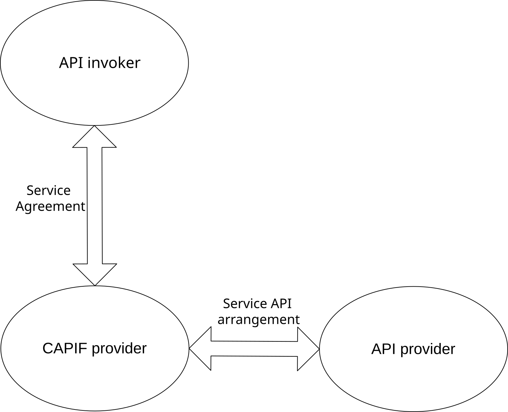
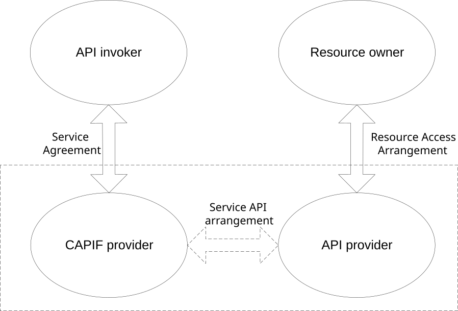

# 5 Involved business relationships

## 5.1 Basic CAPIF business relationships

Figure 5.1-1 shows the typical business relationships in CAPIF.

Figure 5.1-1: Business relationships in CAPIF

The API invoker has service agreement with a CAPIF provider and consumes the CAPIF APIs and service APIs. There are various API invokers like application management client (used by application developers, application service provider), hosted applications (on cloud, edge or UE), and channel aggregator (who aggregates the CAPIF APIs and/or the service APIs). For more details about these API invoker roles, please refer to Annex F.

The API provider hosts one or more service APIs and has a service API arrangement with CAPIF provider to offer the service APIs to the API invoker.

The CAPIF provider and the API provider can be part of the same organization (e.g. PLMN operator), in which case the business relationship between the two is internal to a single organization. The CAPIF provider and the API provider can be part of different organizations, in which case the business relationship between the two must exist.

## 5.2 CAPIF business relationships for RNAA

Figure 5.2-1 shows the CAPIF business relationships for the resource owner-aware northbound API access (RNAA).

Figure 5.2-1: CAPIF business relationships for RNAA

The business relationships the API invoker, the CAPIF provider, and the API provider follow the description in the clause 5.1. In addition to them, the resource owner is an entity capable of granting access to a protected resource related to the resource exposed by the API provider. The API invoker and the resource owner can be the same entity or separate entities. In the current release, the resource owner is a user of a UE and can provide authorization information using the UE.

The CAPIF provider and the API provider can belong to the same organization (e.g. PLMN operator), in which case the service API arrangement is not required explicitly.

The CAPIF provider and the API provider (e.g. 3rd party CAPIF provider or 3rd party API provider) can belong to different organizations, in which case the service API arrangement is required. The specification of service API arrangement is out of scope of 3GPP.
