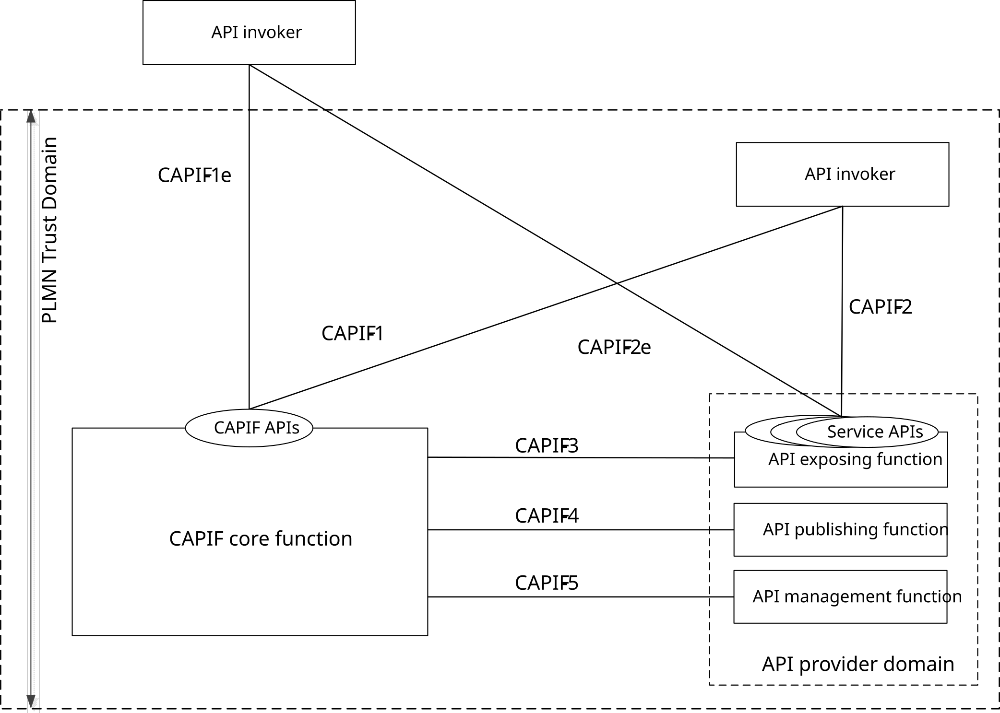
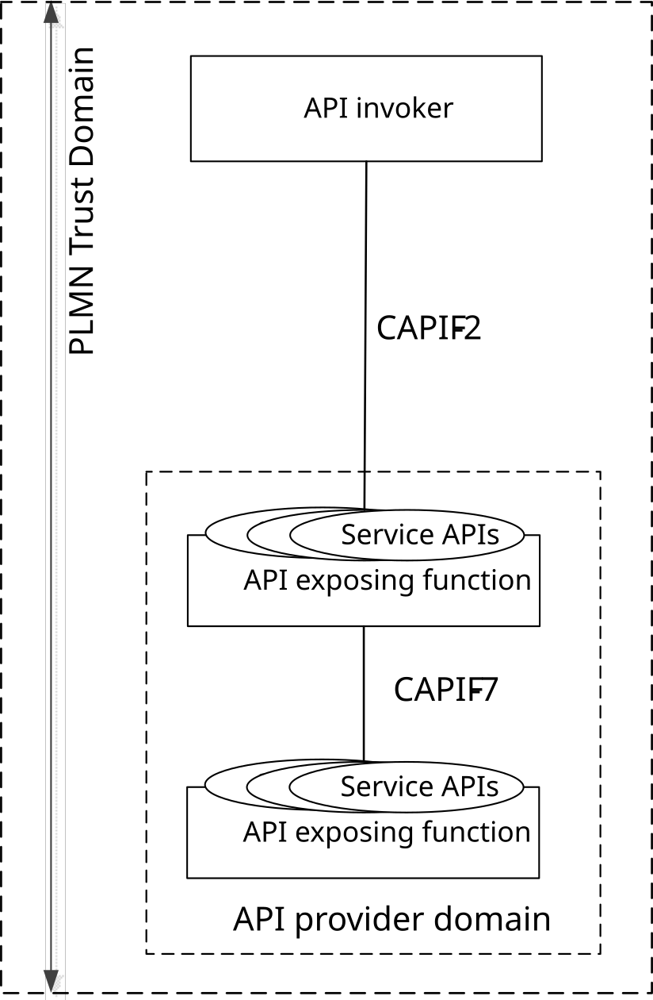
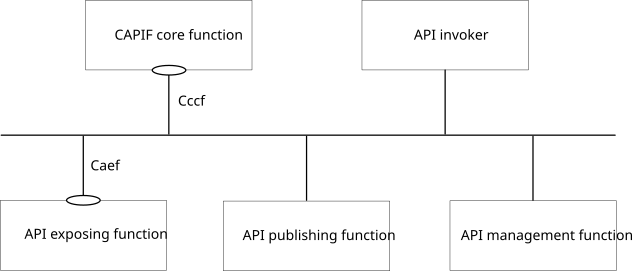
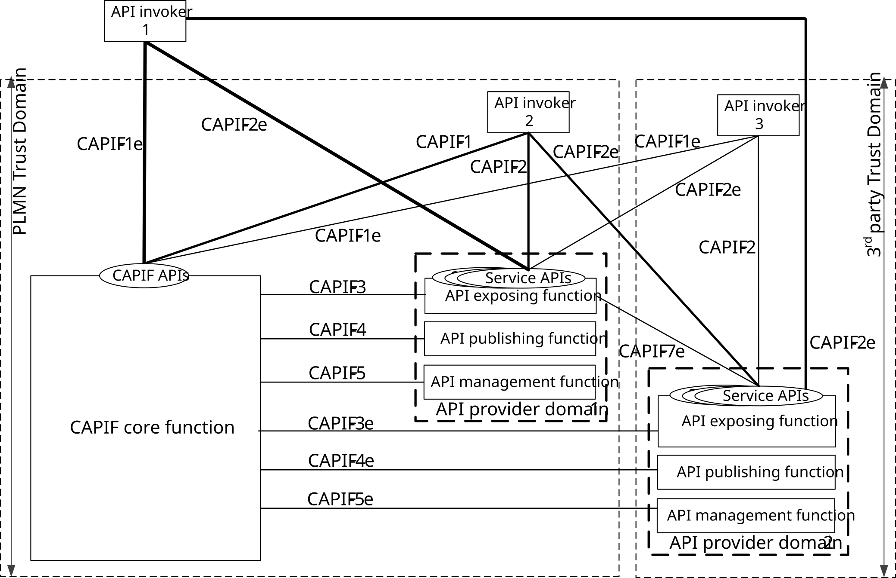
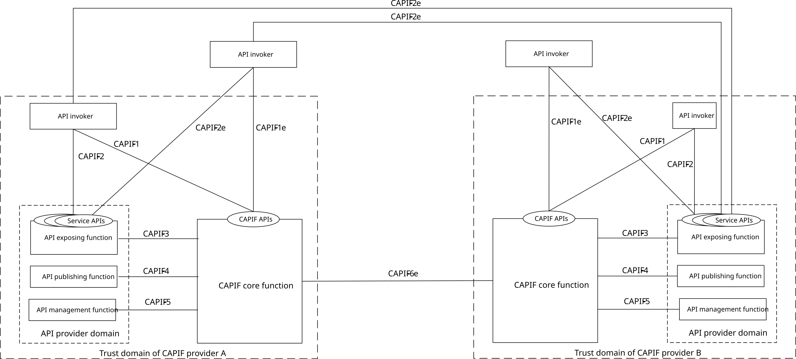
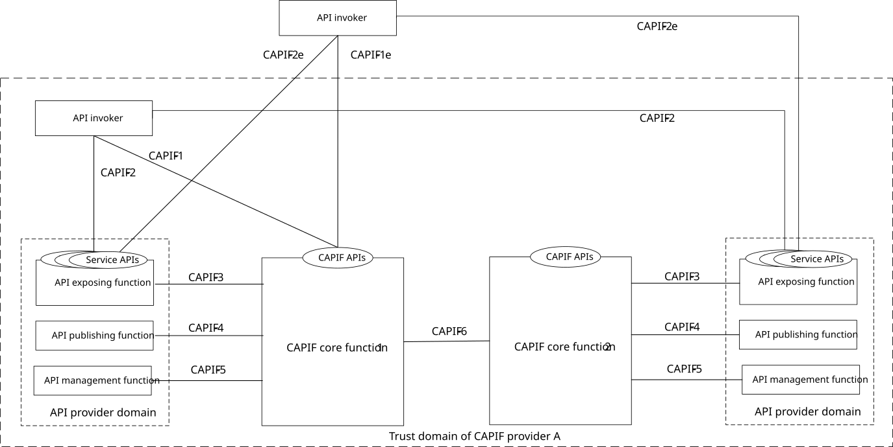
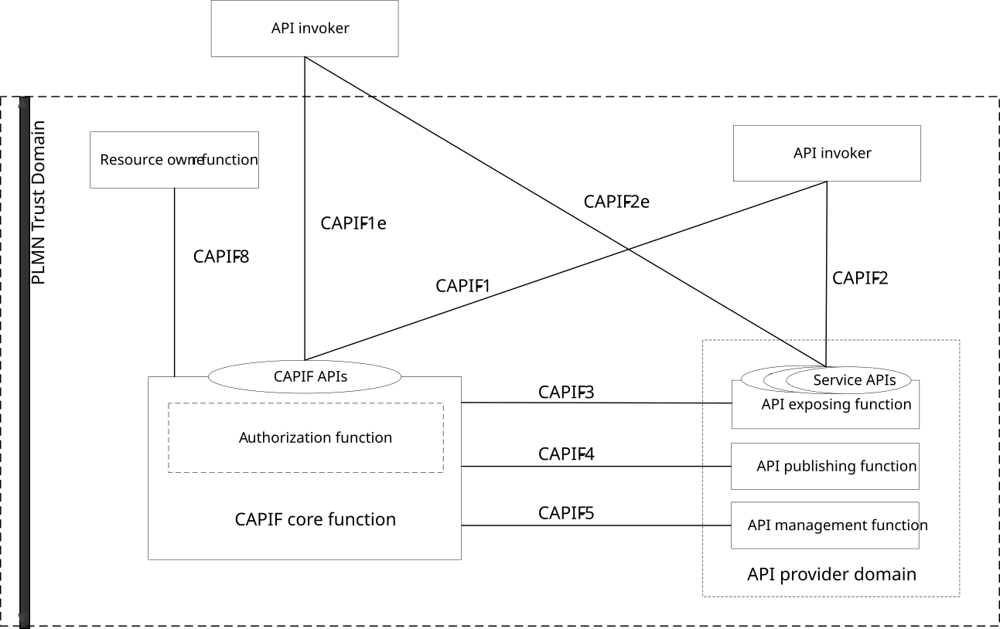

# 6.2 Functional model description

## 6.2.0 Functional model description for the CAPIF

Figure 6.2.0-1 shows the reference point based functional model for the CAPIF.

Figure 6.2.0-1: Functional model for the CAPIF

The CAPIF is hosted within the PLMN operator network (or even an SNPN). The API invoker is typically provided by a 3rd party application provider who has service agreement with PLMN operator. The API invoker may reside within the same trust domain as the PLMN operator network.

In a reference point based model, the API invoker within the PLMN trust domain interacts with the CAPIF via CAPIF-1 and CAPIF-2. The API invoker from outside the PLMN trust domain interacts with the CAPIF via CAPIF-1e and CAPIF-2e. The API exposing function, the API publishing function and the API management function of the API provider domain (together known as API provider domain functions) within the PLMN trust domain interacts with the CAPIF core function via CAPIF-3, CAPIF-4 and CAPIF-5 respectively.

Figure 6.2.0-2: Functional model for interactions between API exposing functions

As illustrated in figure 6.2.0-2, the interactions between the API exposing functions within the PLMN trust domain is via CAPIF-7.

The CAPIF core function provides CAPIF APIs to the API invoker over CAPIF-1 and CAPIF-1e. The API exposing function provides the service APIs to the API invoker over CAPIF-2 and CAPIF-2e.

NOTE 1: The communication between the API exposing function and the CAPIF core function, between the API publishing function and the CAPIF core function and between the API management function and the CAPIF core function over CAPIF-3, CAPIF-4 and CAPIF-5 respectively can be API based.

The detailed information of the APIs provided by the CAPIF core function is specified in clause 10.

The security aspects of CAPIF reference points are specified in 3GPP TS 33.122 \[12\].

Figure 6.2.0-3 illustrates the CAPIF functional model using service-based interfaces.

Figure 6.2.0-3: CAPIF functional model representation using service-based interfaces

Table 6.2.0-1 specifies the service-based interfaces supported by CAPIF.

Table 6.2.0-1: Service-based interfaces supported by CAPIF

| Service-based interface | Entity                | APIs offered              |
|-------------------------|-----------------------|---------------------------|
| Cccf                    | CAPIF core function   | Specified in subclause 10 |
| Caef                    | API exposing function | Specified in subclause 11 |

## 6.2.1 Functional model description to support 3rd party API providers

Figure 6.2.1-1 shows the functional model for the CAPIF to support 3rd party API providers.

Figure 6.2.1-1: Functional model for the CAPIF to support 3rd party API providers

The CAPIF core function in the PLMN trust domain supports service APIs from both the PLMN trust domain and the 3rd party trust domain having business relationship with PLMN. The API invokers may exist within the PLMN trust domain, or within the 3rd party trust domain or outside of both the PLMN trust domain and the 3rd party trust domain. The API provider domain 1 offers the service APIs from the PLMN operator. The API provider domain 2 offers the service APIs from the 3rd party. When the 3rd party API provider is a trusted 3rd party of the PLMN, the API provider domain 1 may also offer the service APIs from the 3rd party.

The API invoker 2 within the PLMN trust domain onboards and interacts with the CAPIF core function via CAPIF-1, and invokes the service APIs in the PLMN trust domain via CAPIF-2 and invokes the service APIs in the 3rd party trust domain via CAPIF-2e. The API invoker 3 within the 3rd party trust domain onboards and interacts with the CAPIF core function via CAPIF-1e, and invokes the service APIs in the PLMN trust domain via CAPIF-2e and invokes the service APIs in 3rd party trust domain via CAPIF-2. The API invoker 1 from outside the PLMN trust domain and 3rd party trust domain, onboards and interacts with the CAPIF core function via CAPIF-1e and invokes the service APIs in the PLMN trust domain and the service APIs in the 3rd party trust domain via CAPIF-2e. The CAPIF core function consolidates in the API invoker profile the service API enrollment information for the service APIs in the PLMN trust domain and the service APIs in the 3rd party trust domain, as specified in clause 8.1.3.

The API exposing function, the API publishing function and the API management function of the API provider domain 1 within the PLMN trust domain interacts with the CAPIF core function via CAPIF-3, CAPIF-4 and CAPIF-5 respectively. The API exposing function, the API publishing function and the API management function of the API provider domain 2 within the 3rd party trust domain interacts with the CAPIF core function in the PLMN trust domain via CAPIF-3e, CAPIF-4e and CAPIF-5e respectively. The API exposing function within the PLMN trust domain and the 3rd party trust domain provides the service APIs to the API invoker, offered by the respective trust domains.

The interactions between the API exposing functions within the PLMN trust domain is via CAPIF-7 (not shown in the figure 6.2.1-1 for simplicity). The API exposing function within the PLMN trust domain interacts with the API exposing function in the 3rd party trust domain via CAPIF-7e.

NOTE 1: The communication between the API exposing function and the CAPIF core function, between the API publishing function and the CAPIF core function and between the API management function and the CAPIF core function over CAPIF-3/3e, CAPIF-4/4e and CAPIF-5/5e respectively can be API based.

The detailed information of the APIs provided by the CAPIF core function is specified in clause 10.

NOTE 2: The security aspects of CAPIF reference points are under SA3 responsibility and out of scope of the present document.

## 6.2.2 Functional model description to support CAPIF interconnection

Figure 6.2.2-1 shows the architectural model for the CAPIF interconnection which allows API invokers of a CAPIF provider to utilize the service APIs from the 3rd party CAPIF provider.

Figure 6.2.2-1: High level functional architecture for CAPIF interconnection with multiple CAPIF provider domains

Figure 6.2.2-2 shows the architectural model for the CAPIF interconnection within the same CAPIF provider domain, which allows API invokers of CAPIF core function 1 to utilize the service APIs from CAPIF core function 2, where both CAPIF core function 1 and CAPIF core function 2 are hosted within the trust domain of the CAPIF provider A.

Figure 6.2.2-2: High level functional architecture for CAPIF interconnection within a CAPIF provider domain

The CAPIF provider A and CAPIF provider B host the CAPIF in their trust domains. A business relationship exists between the CAPIF providers.

The CAPIF providers in their respective trust domain hosts multiple CAPIF instances where each CAPIF instance consists of the CAPIF core function (local), the API provider domain and the API invokers. All interactions within the CAPIF instance is according to the functional model specified in clause 6.2.0.

When multiple CAPIF instances are deployed by a CAPIF provider there may be a hierarchy associated with the multiple CAPIF core function deployed which allows:

\- the designated CAPIF core function of the CAPIF provider A to interconnect with the designated CAPIF core function of the CAPIF provider B; and

\- within CAPIF provider A, one or more CAPIF core function interacts with the designated CAPIF core function 1.

The designated CAPIF core function of the CAPIF provider A provides the information about the CAPIF instances and service APIs deployed by the CAPIF provider A to the designated CAPIF core function of the CAPIF provider B and vice versa over CAPIF-6e reference point.

The CAPIF core function 2 of CAPIF provider A provides the information about the service APIs to the CAPIF core function 1 over CAPIF-6 reference point.

NOTE 1: Void

The API invokers may exist within the trust domain of CAPIF provider A, or within the trust domain of CAPIF provider B or outside of the trust domains of both CAPIF provider A and CAPIF provider B. The API invoker of a CAPIF provider is onboarded with the CAPIF core function in the corresponding trust domain of the CAPIF provider.

NOTE 2: For sake of simplicity, the service API interactions of API invokers of the CAPIF provider B are not shown. From each CAPIF provider's perspective the other CAPIF provider is a 3rd party.

One or more CAPIF core function can publish service APIs to the designated CAPIF core function over CAPIF-6 reference point and, also discover the service APIs from the designated CAPIF core function and vice versa over CAPIF-6 reference point.

The API invoker within the trust domain of CAPIF provider A interacts with the CAPIF core function of the CAPIF provider A via CAPIF-1 and discovers the service APIs of both CAPIF providers, and invokes the service APIs in the trust domain of CAPIF provider A via CAPIF-2 and invokes the service APIs in the trust domain of CAPIF provider B via CAPIF-2e. The API invoker from outside the trust domain of CAPIF providers, interacts with the CAPIF core function of th CAPIF provider A via CAPIF-1e and invokes the service APIs in the trust domain of the CAPIF providers via CAPIF-2e.

NOTE 3: The communication between the CAPIF core function of the CAPIF providers over CAPIF-6 or CAPIF-6e can be API based.

The detailed information of the APIs provided by the CAPIF core function is specified in clause 10.

NOTE 4: The security aspects of CAPIF reference points are under SA3 responsibility and out of scope of the present document.

NOTE 5: All interactions among entities within the CAPIF provider domains (regardless if CAPIF is deployed in a PLMN, SNPN or 3rd party network) are ruled by the functional model in clause 6.2.0, the support of 3rd party API providers is as in clause 6.2.1, whereas the interconnection among CCFs is according to this clause.

NOTE 6: RNAA for CAPIF interconnection is not specified in this release of the specification.

## 6.2.3 Functional model description to support RNAA

Figure 6.2.3-1 shows the architectural model for the RNAA which allows the resource owner to provide authorization to access their resources through Service API invocation.

Figure 6.2.3-1: High level functional architecture for CAPIF supporting RNAA

The authorization function is an internal entity of the CAPIF core function and performs API invoker authorization based on the API invoker authorization policies and on the applicability of RO authorization per service API available in the CCF, and the RO authorization information obtained via the ROF.

The CAPIF core function (authorization function) verifies whether the requested resource(s) are authorized for the API invoker for the indicated purpose of data processing. The purpose of data processing identifies the specific and predefined reason for which the API invoker processes the requested resource(s).

NOTE 1: An example for purpose for data processing values can be found in the W3C Data Privacy Vocabulary, <https://w3c.github.io/dpv/>, from where a subset of values can be selected. These values are extensible so that they can adapt to any relevant local data protection policy or regulation.

The resource owner function interacts with the authorization function in the CAPIF core function via CAPIF-8. The authorization function in the CAPIF core function interacts with the resource owner function to obtain the resource owner authorization. The CAPIF core function (authorization function) uses resource owner authorization information obtained via the ROF as part of the processing of the authorization requests received from API invokers.

The API exposing function (e.g. NEF, SCEF) interacts with the authorization function in the CAPIF core function via CAPIF-3. The API exposing function acts as an authorization enforcement point according to the authorization token received from the API invoker.

NOTE 2: RNAA support is not dependant of the access network, i.e., the RNAA support is not restricted to 5G networks.

The API invoker interacts with authorization function in the CAPIF core function via CAPIF-1/CAPIF-1e.

The available information in the CCF about the applicability of RO authorization to service API(s), is used by the CCF to determine the service APIs for which the RO authorization is required. The CCF triggers the RO authorization procedures only for these service API(s) invocation. The available information in the CCF about the applicable purposes of data processing for a service API is used by the CCF to validate the purpose of data processing requested by the API invoker for obtaining authorization from a resource owner (clause 8.31). The API publishing function may publish in the CCF the applicability of RO authorization to service API(s) (e.g. yes/no, or applicable purposes of data processing) via CAPIF-4 interface.

NOTE 3: In the current release, 3rd party API providers (i.e., API providers outside the PLMN trust domain) are not supported for RNAA.

NOTE 4: The interaction between resource owner function and CCF over CAPIF-8 is not specified in the current release of the specification.

NOTE 5: The authorization information from the resource owner used by CCF (described in 3GPP TS 33.122 \[12\]) is independent from the user consent information used from user subscription data at UDM/UDR (described in Annex V of 3GPP TS 33.501 \[16\]). In the current release of 3GPP specifications, no synergy between CCF and UDM is specified.

The security aspects of CAPIF supporting RNAA are specified in 3GPP TS 33.122 \[12\].
