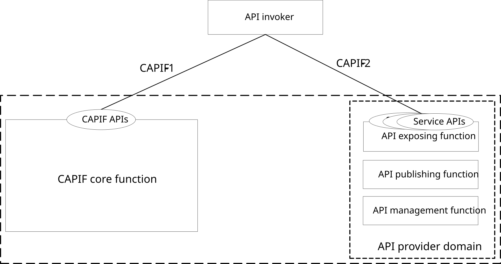
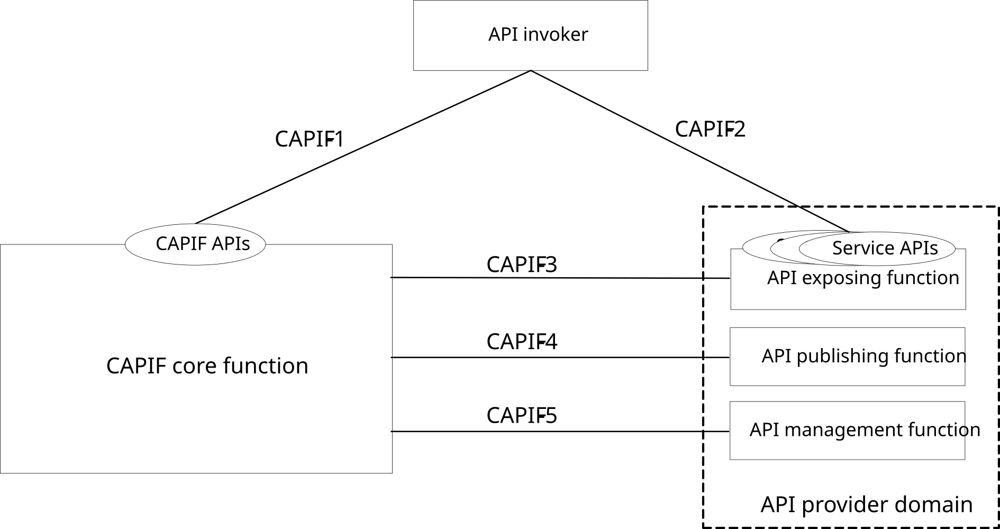
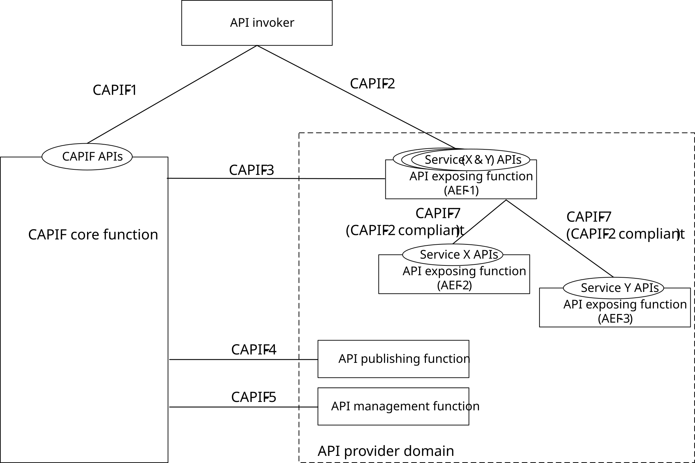
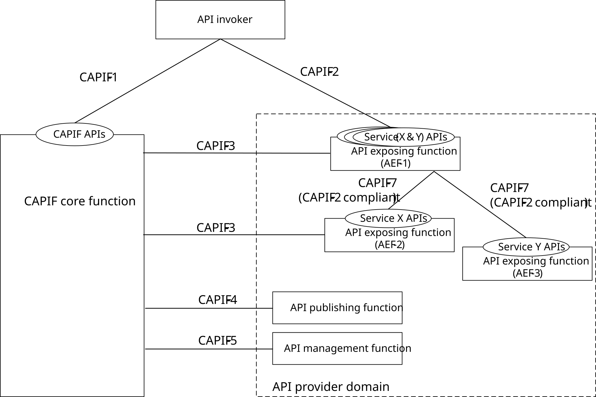
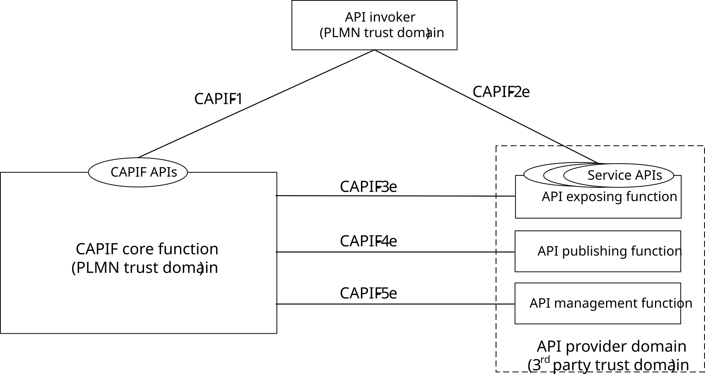
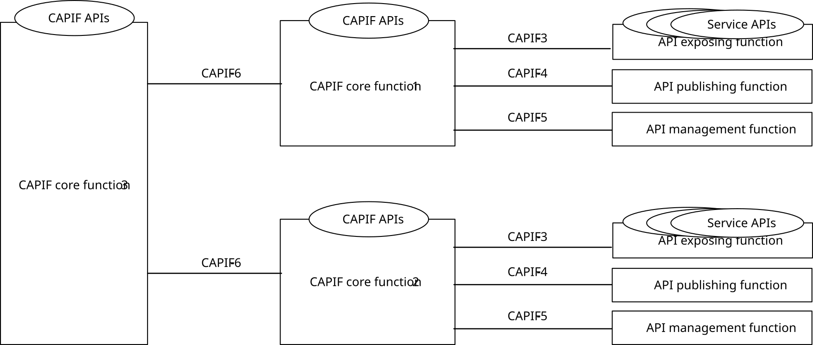

# 7 Application of functional model to deployments

## 7.1 General

The CAPIF deployments in centralized and distributed models are described in clause 7.2 and clause 7.3. The multiple CCFs deployment is described in clause 7.4.

The RNAA deployments are described in clause 7.5.

The CAPIF deployment models shown are not exhaustive.

## 7.2 Centralized deployment

The CAPIF can be deployed centrally as illustrated in the figure 7.2-1.

Figure 7.2-1: Centralized deployment of CAPIF

In one centralized deployment, the CAPIF core function and the API provider domain functions are co-located. The API invoker can interact independently with the CAPIF core function and the API exposing function including the service APIs. The CAPIF appears as a gateway for all API invoker interactions. The API invoker obtains the service API information and its entry point details from the CAPIF core function via CAPIF-1. The service communication point of entry for the service API is the API exposing function which also applies any access control or policy control to the internal interactions between the API invoker and the service API in coordination with the CAPIF core function.

NOTE: The API invoker can be outside the PLMN trust domain and will access the CAPIF via CAPIF-1e and CAPIF-2e instead of CAPIF-1 and CAPIF-2.

Another variation of the centralized deployment is where the CAPIF core function and the API exposing function is co-located where as other API provider domain functions (API publishing function and API management function) are not co-located with the API exposing function. In such deployment scenario, the CAPIF core function interacts with the API publishing function and the API management function via CAPIF-4 and CAPIF-5 reference points respectively.

## 7.3 Distributed deployment

The CAPIF can be deployed in a distributed manner illustrated in the figure 7.3-1.

Figure 7.3-1: Distributed deployment of the CAPIF within PLMN trust domain

In distributed deployment, the CAPIF core function and the API provider domain functions are not co-located. The CAPIF core function interacts with the API exposing function, the API publishing function and the API management function via CAPIF-3, CAPIF-4 and CAPIF-5 reference points respectively. The API invoker can interact independently with the CAPIF core function and the API exposing function including the service APIs. In this deployment, the API exposing function appears as an agent for all service API invocations from the API invoker. The API invoker obtains the service API information and its entry point details from the CAPIF core function via CAPIF-1 interface. The first point of entry for the service API is the API exposing function during API invocation. The API exposing function acts as agent for service API applying any access control or policy control to the interactions between the API invoker and the service API in coordination with the CAPIF core function via CAPIF-3 interface.

The CAPIF can be deployed by splitting the functionality of the API exposing function among multiple API exposing function entities, of which one acts as the entry point. However there will be single API publishing function and single API management function in the API provider domain although there could be multiple API exposing function entities. The CAPIF deployment with cascading API exposing functions is as illustrated in the figure 7.3-2.

Figure 7.3-2: Distributed deployment of the CAPIF with cascading API exposing functions

In this deployment option, the API exposing function can have several instances like AEF-1, AEF-2 and AEF-3 which can be assigned with different roles. The roles for each API exposing function are decided by the operator. In this illustration, the API exposing functions AEF-2 and AEF-3 provide service APIs for service X and service Y respectively. The API exposing function AEF-1 provides the service communication entry point to the service APIs for service X APIs and service Y APIs. The API exposing function AEF-1 for instance can hide the topology of service X APIs and service Y APIs from the API invoker. The API exposing function AEF-1 also applies any access control or policy control to the interactions between the API invoker and service X APIs and between the API invoker and service Y APIs, in coordination with the CAPIF core function using CAPIF-3.

The API invoker interacts with the CAPIF core function via CAPIF-1. The API invoker interacts with service (X&Y) APIs on the API exposing function AEF-1 via CAPIF-2. The API exposing function AEF-1 forwards the invocation of the service X API or service Y API from the API invoker to the API exposing functions AEF-2 or AEF-3 respectively via CAPIF-2. The API messages are forwarded via CAPIF-7 (in compliance with CAPIF-2 interaction between the API invoker and the AEF-1) in the interactions between API exposing functions. The API invoker cannot directly interact with service X APIs and service Y APIs provided by API exposing functions AEF-2 and AEF-3 respectively.

Different splits of responsibility are possible. In another example illustrated in figure 7.3-3, the API exposing function AEF-1 could provide topology hiding for API exposing functions AEF-2 and AEF-3, plus access control for AEF-3. The API exposing function AEF-2 would provide its own access control, interacting with the CAPIF core function via CAPIF-3.

Figure 7.3-3: Another example of distributed deployment of the CAPIF with cascading API exposing functions

NOTE 1: The API invoker can be outside the PLMN trust domain and will access the CAPIF via CAPIF-1e and CAPIF-2e instead of CAPIF-1 and CAPIF-2.

When considering the 3rd party trust domain deployment, the API provider domain belongs to a 3rd party trust domain, the CAPIF core function belongs to PLMN trust domain and the API invoker belongs to PLMN trust domain as illustrated in figure 7.3-4.

Figure 7.3-4: Distributed deployment of CAPIF considering PLMN trust domain and 3rd party trust domain

The interactions between the AEF and the CAPIF core function is based on CAPIF-3e. The interactions between the API publisher function and the CAPIF core function is based on CAPIF-4e. The interactions between the API management function and the CAPIF core functions are based on CAPIF-5e. The interactions between the API invoker and the AEF are based on CAPIF-2e. The API provider domain functions may be deployed in the PLMN trust domain and the interactions of the API provider domain functions within CAPIF of the PLMN trust domain is not shown in the figure 7.3-4 and is as illustrated in figure 7.3-1.

NOTE 2: For deployments illustrated in figure 7.3-2 and figure 7.3-3, when the API provider domain belongs to the 3rd party trust domain, the interactions between the AEF of the API provider domain and API invoker belonging to the PLMN trust domain are carried over CAPIF-2e reference point and the interactions between the entities of the API provider domain and the CAPIF core function belonging to the PLMN trust domain are carried over CAPIF-3e, CAPIF-4e and CAPIF-5e as illustrated in figure 7.3-4.

For the API provider domain in all deployment options as shown above, the API publish function, API management and the API exposing function may be centralized or distributed (e.g., fully distributed, or with partial co-location) deployed.

NOTE 3: For example, the API publish function can be co-located with the API exposing function and publishes the service APIs from this co-located AEF or deployed as a standalone entity and publishes all the service APIs from the AEF in the API provider domain. The API management function can be co-located with the API exposing function and provides the management related information of the service APIs from this co-located AEF, or deployed as a standalone entity and provides the management related information of the service APIs from all the AEFs (as specified in e.g., figure 7.3-3) in the API provider domain.

## 7.4 Multiple CCFs deployment

Multiple CAPIF core functions may be deployed within the PLMN trust domain as illustrated in the figure 7.4-1. For simplicity, the API invoker is not shown.

Figure 7.4-1: Multiple CCFs deployment within the PLMN trust domain

In the distributed deployment, the CAPIF core function 1 and the CAPIF core function 2 interact with CAPIF core function 3 via CAPIF-6 reference point. The CAPIF core function 3 assumes the role of a centralized repository of service APIs in the PLMN trust domain.

NOTE: The CAPIF core function 3 can be connected with the API exposing function(s) and API invokers.

The CAPIF core function 1 and the CAPIF core function 2 publishes the service API provided by its connected API exposing function(s) to the CAPIF core function 3, and obtains the service API information provided by other CAPIF core function(s).

An API invoker (not shown in the figure for simplicity) connected to the CAPIF core function 1 is able to discover and invoke the service APIs provided by the API exposing function connected to the CAPIF core function 2.

## 7.5 RNAA deployments

CAPIF supports RNAA and has enabled API invoker(s) to have authorized access to resources of a resource owner provided by service APIs offered by the AEF. The CCF acts as the Authorization Function and supports the authentication and authorization of API invoker(s). After checking the resource owner authorization information (e.g., user consent) via the ROF, the CCF (Authorization function) provides the access token for a service API access to the API invoker. The API invoker performs service API invocations on the AEF by utilizing the access token.

The API invoker may be deployed in the following ways:

a\. API invoker may be deployed as AF on the UE (i.e. 3rd party application).

b\. API invoker may be deployed as AF on the UE supporting several other 3rd party applications deployed on the UE.

c\. API invoker may be deployed on the network as AF.

The resource owner is connected via a UE and can use a Resource Owner Function on the UE to interact with the CCF acting as the Authorization Function to grant RO permission to the API invoker to access resource(s) of the resource owner provided by the service API. The CCF (Authorization Function) uses the RO authorization information, as part of API invoker authorization process.

NOTE: The details of the protocol for CAPIF supporting RNAA is specified in 3GPP TS 33.122 \[12\].
