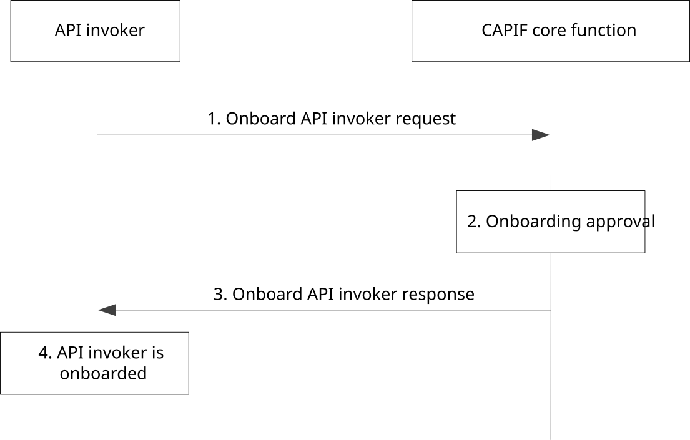

# 8.1 Onboarding the API invoker to the CAPIF

## 8.1.1 General

The procedure in this subclause corresponds to the architectural requirements for onboarding the API invoker to the CAPIF. The CAPIF enables a one time onboarding process that enrolls the API invoker as a recognized user of the CAPIF, which may be triggered by the API invoker via CAPIF-1 or CAPIF-1e, or may be based on provisioning.

## 8.1.2 Information flows

### 8.1.2.1 Onboard API invoker request

Table 8.1.2.1-1 describes the information flow onboard API invoker request from the API invoker to the CAPIF core function.

Table 8.1.2.1-1: Onboard API invoker request

|                           |        |                                                                                                                                                                                                                      |
|---------------------------|--------|----------------------------------------------------------------------------------------------------------------------------------------------------------------------------------------------------------------------|
| Information element       | Status | Description                                                                                                                                                                                                          |
| Onboarding information    | M      | The information of the API invoker including enrolment details, required for onboarding                                                                                                                              |
| \> Onboarding criteria    | O      | Indicates that the API Invoker wishes to on board itself to the CCF only if the CCF supports the features mentioned in criteria information.                                                                         |
| \>\> Criteria information | M      | This information includes at least one of the criteria listed (supported security methods, supported security methods for given AEFs / service APIs/ Service API categories) for the CCF to onboard the API invoker. |
| APIs for enrollment       | O      | List of APIs being enrolled for.                                                                                                                                                                                     |
| Proposed expiration time  | O      | Proposed expiration time for the onboarding.                                                                                                                                                                         |

### 8.1.2.2 Onboard API invoker response

Table 8.1.2.2-1 describes the information flow onboard API invoker response from the CAPIF core function to the API invoker.

Table 8.1.2.2-1: Onboard API invoker response

<table>
<colgroup>
<col style="width: 33%" />
<col style="width: 16%" />
<col style="width: 50%" />
</colgroup>
<tbody>
<tr class="odd">
<td>Information element</td>
<td>Status</td>
<td>Description</td>
</tr>
<tr class="even">
<td>Onboarding status</td>
<td>M</td>
<td>The result of onboarding request i.e., success indication is included if the API invoker is granted permission otherwise failure.</td>
</tr>
<tr class="odd">
<td>Enrolled information</td>
<td>
O

(see NOTE 1)
</td>
<td>Information from the provisioned API invoker profile which includes information to allow the API invoker to be authenticated and to obtain authorization for service APIs, containing the unique API invoker identity associated to the onboarded API invoker profile.</td>
</tr>
<tr class="even">
<td>Service API information</td>
<td>
O

(see NOTE 2)
</td>
<td>The service API information as specified in Table 8.7.2.2-1.</td>
</tr>
<tr class="odd">
<td>Reason</td>
<td>
O

(see NOTE 3)
</td>
<td>This element indicates the reason when onboarding status is failure.</td>
</tr>
<tr class="even">
<td>Expiration time</td>
<td>O</td>
<td>Indicates the expiration time of the onboarding. At expiration, CCF cancels the enrollment of the API invoker from CAPIF. If omitted, it indicates the onboarding does not expire.</td>
</tr>
<tr class="odd">
<td colspan="3">
NOTE 1: Information element shall be present when onboarding status is successful.

NOTE 2: Information element may be present when onboarding status is successful.

NOTE 3: Information element shall be present when onboarding status is failure.
</td>
</tr>
</tbody>
</table>

## 8.1.3 Procedure

Figure 8.1.3-1 illustrates the procedure for onboarding the API invoker to the CAPIF. The security aspects of this procedure are specified in subclause 6.1 of 3GPP TS 33.122 \[12\].

Pre-conditions:

1\. The API invoker is not a recognized user of the CAPIF.

2\. The API invoker has visibility to APIs information (e.g., API catalogue or dashboard - central place for the API provider to manage which APIs are displayed, giving API invokers the ability to enroll for).

Figure 8.1.3-1: Procedure for onboarding the API invoker to the CAPIF

1\. For enrolment of the API invoker to be a recognized user of the CAPIF, the API invoker triggers onboard API invoker request towards the CAPIF core function, providing the information as required for the API management and criteria information as required to onboard the API invoker.

2\. The CAPIF core function begins the onboarding process by verifying whether all the necessary information has been provided to onboard the API invoker, and further initiates a grant process. If the onboard API invoker request message includes onboard criteria information, then the CCF verifies whether the CCF can support the onboard criteria information. The CCF further proceeds with API invoker onboarding procedure, only if the CCF supports the onboard criteria information from the API Invoker. Successful onboarding results in provisioning API invoker profile which includes identity for the API invoker. The authorization information and the list of APIs and the categories of APIs that the API invoker can access subsequent to successful onboarding may also be created, considering the network slice information, if applicable. The CAPIF core function may create access control policy (see Table E-1) for the onboarded API invoker considering the network slice information.

NOTE 1: Completion of onboarding process can require explicit grant by the CAPIF administrator or the API management, which is left out-of-scope of this solution. CAPIF can handle the grant process internally without the need of explicit grant by the CAPIF administrator.

NOTE 2: The API invoker profile consists of at least the identity information for the API invoker, information required for the authentication and authorization by the CAPIF (e.g., application service information such as application service provider and application identifier) and the CAPIF identity information.

3\. If the API invoker has triggered the onboard API invoker request and is granted permission, the onboard API invoker response provides success indication including information from the provisioned API invoker profile which may include information to allow the API invoker to be authenticated and to obtain authorization for service APIs.

4\. As a result of successful onboarding process, the CAPIF core function is able to authenticate and authorize the API invoker.
