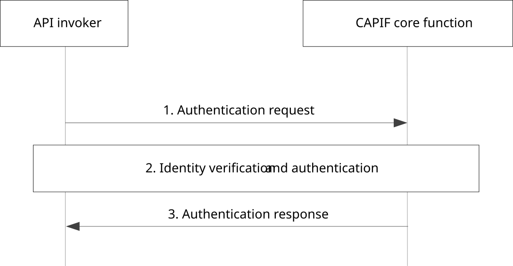

# 8.10 Authentication between the API invoker and the CAPIF core function

## 8.10.1 General

The procedure in this subclause corresponds to the architectural requirements for authentication between the API invoker and the CAPIF core function.

## 8.10.2 Information flows

NOTE: The security aspects of this procedure are specified in subclause 6.2 and subclause 6.3.1 of 3GPP TS 33.122 \[12\].

## 8.10.3 Procedure

Figure 8.10.3-1 illustrates the procedure for authentication between the API invoker and the CAPIF core function.

Pre-conditions:

1\. The API invoker is onboarded with the CAPIF core function and the API invoker profile is created.

Figure 8.10.3-1: Procedure for authentication between the API invoker and the CAPIF core function

1\. The API invoker triggers authentication to the CAPIF core function, including the identity confirmed after successful onboarding.

2\. Upon receiving the authentication request, the CAPIF core function verifies the identity with the API invoker profile and authenticates the API invoker.

NOTE: The authentication process is specified in subclause 6.2 and subclause 6.3.1 of 3GPP TS 33.122 \[12\].

3\. The CAPIF core function returns the result of the API invoker identity verification in the authentication response.
