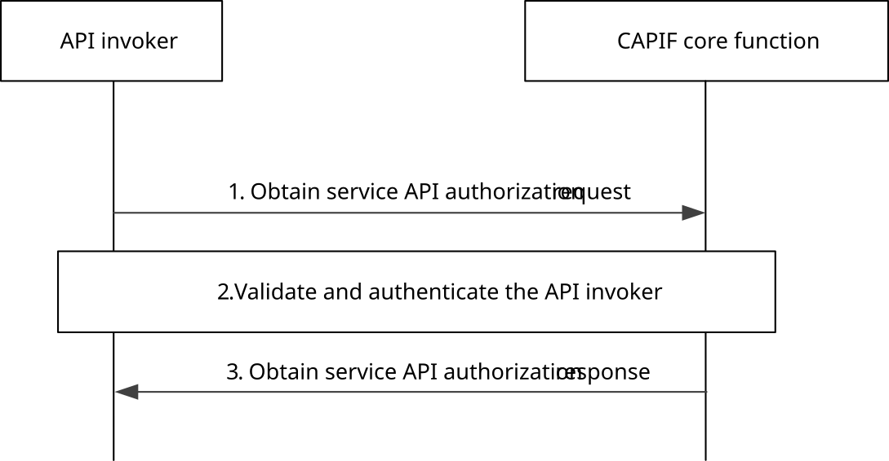

# 8.11 API invoker obtaining authorization to access service API

## 8.11.1 General

The API invoker requires to execute this procedure when it needs to obtain or re-obtain (e.g. upon expiry of the authorization information) the authorization to access the service API. Once the API invoker receives the authorization to access the service API, the API invoker can perform one or multiple service API invocations as per the permission limit. This procedure may be performed during the API invoker onboarding process.

## 8.11.2 Information flows

NOTE: The security aspects of this procedure are specified in subclause 6.4 and subclause 6.5.2 of 3GPP TS 33.122 \[12\].

## 8.11.3 Procedure

Figure 8.11.3-1 illustrates the procedure for obtaining authorization to access the service API.

Pre-condition:

1\. The API invoker is onboarded and has received an API invoker identity.

Figure 8.11.3-1: Procedure for the API invoker obtaining authorization for service API access

1\. The API invoker sends an obtain service API authorization request to the CAPIF core function for obtaining permission to access the service API by including the API invoker information required for authorization, the information identifying the service API, and any information required for authentication of the API invoker. The request may include desired Network Slice Info of the service API. In addition to the information identifying the service API, the request may include finer granularity level for service API authorization e.g., service API operation and resource.

2\. The CAPIF core function validates the authentication of the API invoker (using authentication information) and checks whether the API invoker is permitted to access the requested service API, considering also service API operation(s) and resource(s) restrictions locally configured, if available. The CAPIF core function may additionally verify the Network Slice Info, e.g., check that the authorized Network Slice Info for the API invoker is included in the supported Network Slice Info for the indicated service API.

NOTE 1: The authorization of Network Slice Info is performed by the CAPIF core function within the PLMN trust domain.

NOTE 2: The authentication process is specified in subclause 6.5.2 of 3GPP TS 33.122 \[12\].

3\. Based on the API invoker's subscription information available in the CCF, the authorization information to access the service APIs, which may include access authorization per service operation, resource, optionally including access authorization per service operation and, optionally, resource, is sent to the API invoker in the obtain service API authorization response.

NOTE 3: How the finer service API authorization granularity is indicated in the request from API invoker and is returned to the API invoker in the CCF authorization reply is specified in 3GPP TS 33.122 \[12\].

NOTE 4: The mechanism for distribution of the authorization information for the API invoker to the API exposing function over CAPIF-3 reference point is specified in subclause 6.5.2 of 3GPP TS 33.122 \[12\].
