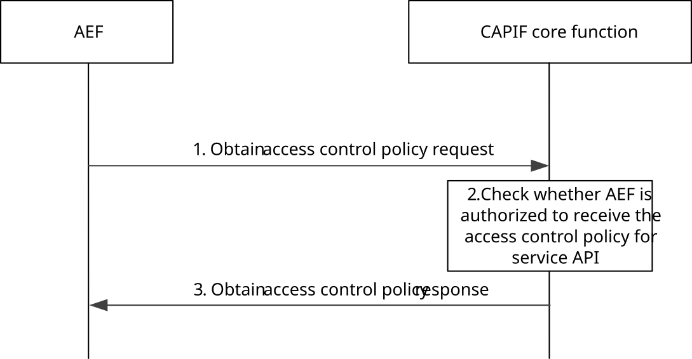

# 8.12 AEF obtaining service API access control policy

## 8.12.1 General

The CAPIF core function is the central repository of all the policies related to service APIs. The AEF executes this procedure when it needs to obtain the policy to perform access control on the service API invocations (e.g. when policy for performing access control on service API is unavailable at the AEF). The AEF can be within PLMN trust domain or within 3rd party trust domain.

## 8.12.2 Information flows

### 8.12.2.1 Obtain access control policy request

Table 8.12.2.1-1 describes the information flow obtain access control policy request from the AEF to the CAPIF core function.

Table 8.12.2.1-1: Obtain access control policy request

|                            |        |                                                                                                           |
|----------------------------|--------|-----------------------------------------------------------------------------------------------------------|
| Information element        | Status | Description                                                                                               |
| AEF Identity information   | M      | Identity information of the entity requesting the access control policy.                                  |
| Service API identification | M      | The identification information of the service API for which the access control policy is being requested. |

### 8.12.2.2 Obtain access control policy response

Table 8.12.2.2-1 describes the information flow obtain access control policy response from the CAPIF core function to the AEF.

Table 8.12.2.2-1: Obtain access control policy response

|                                                                                                                                                                                                     |              |                                                                                                   |
|-----------------------------------------------------------------------------------------------------------------------------------------------------------------------------------------------------|--------------|---------------------------------------------------------------------------------------------------|
| Information element                                                                                                                                                                                 | Status       | Description                                                                                       |
| Result                                                                                                                                                                                              | M            | Indicates the success or failure of the obtain access control policy operation                    |
| Access control policy information                                                                                                                                                                   | O (see NOTE) | The access control policy information corresponding to the requested service API. (See Table E-1) |
| NOTE: Shall be present if the Result information element indicates that the obtain access control policy operation is successful. Otherwise access control policy information shall not be present. |              |                                                                                                   |

## 8.12.3 Procedure

Figure 8.12.3-1 illustrates the procedure for obtaining policy to perform access control on the service API invocations.

Pre-conditions:

1\. The AEF is hosting the service API but the policy to perform access control is not available with AEF.

2\. The CAPIF core function is configured with the access control policies corresponding to one or more service APIs.

3\. Authorization details of the AEF are available with the CAPIF core function.

Figure 8.12.3-1: Procedure for the AEF obtaining service API access control policy

1\. The AEF sends an obtain access control policy request to the CAPIF core function for obtaining the policy to perform the access control on service API invocations by including the details of the hosted service API.

2\. The CAPIF core function checks whether the AEF is authorized to receive the access control policy corresponding to the service APIs requested.

3\. If authorization check is successful, the AEF is provided the access control policy for the service API via an obtain access control policy response. If authorization check is not successful, the AEF is provided with a failure indication via a obtain access control policy response. The AEF enforces the access control policy for the service API and API invoker.

NOTE: To maintain synchronization between the AEF and the CAPIF core function for the policy cached at AEF, the AEF can subscribe to the policy update event at CAPIF core function according to the procedure in subclause 8.8.3 and receive notifications about any updated policy at CAPIF core function according to the procedure in subclause 8.8.4.
