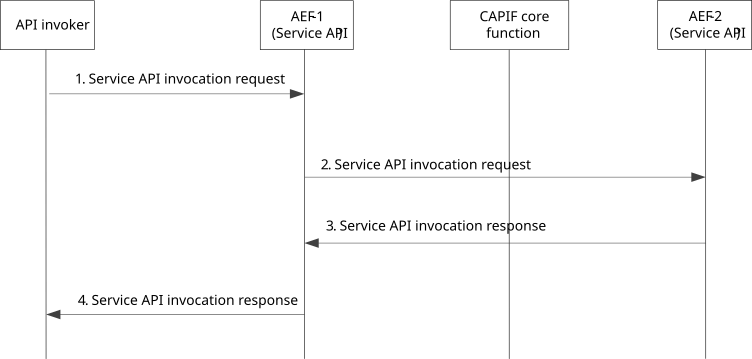

# 8.13 Topology hiding

## 8.13.1 General

The procedure in this subclause corresponds to the architectural requirements for hiding the topology of the PLMN trust domain from the API invokers accessing the service APIs from outside the PLMN trust domain.

## 8.13.2 Information flows

### 8.13.2.1 Service API invocation request (API invoker – AEF-1)

The information flow service API invocation request from the API invoker to AEF-1 (AEF acting as service communication entry point) is service API specific and the complete detail of the service API invocation request is out of scope of the present document. Table 8.17.2.1-1 describes the CAPIF related information elements which are included in the service API invocation request.

### 8.13.2.2 Service API invocation request (AEF-1 – AEF-2)

The information flow service API invocation request from AEF-1 (AEF acting as service communication entry point) to AEF-2 (destination AEF for handling service API) is service API specific and the complete detail of the service API invocation request is out of scope of the present document. Table 8.17.2.1-1 describes the CAPIF related information elements which are included in the service API invocation request.

### 8.13.2.3 Service API invocation response (AEF-2 – AEF-1)

The information flow service API invocation response from AEF-2 (destination AEF for handling service API) to AEF-1 (AEF acting as service communication entry point) is service API specific and the complete detail of the service API invocation response is out of scope of the present document. Table 8.17.2.2-1 describes the CAPIF related information elements which are included in the service API invocation response.

### 8.13.2.4 Service API invocation response (AEF-1 – API invoker)

The information flow service API invocation response from AEF-1 (AEF acting as service communication entry point) to the API invoker is service API specific and the complete detail of the service API invocation response is out of scope of the present document. Table 8.17.2.2-1 describes the CAPIF related information elements which are included in the service API invocation response.

## 8.13.3 Procedure

Figure 8.13.3-1 illustrates the procedure for CAPIF topology hiding.

Pre-conditions:

1\. The API invoker has performed the service discovery and received the details of the service API which includes the information about the service communication entry point of the AEF-1 in the CAPIF.

2\. The API invoker is authenticated and authorized to use the service API.

3\. The AEF-1 in the CAPIF is configured with a policy for topology hiding including the entry point address of the service API (provided via AEF-2).

Figure 8.13.3-1: Procedure for CAPIF topology hiding

1\. The API invoker performs service API invocation according to the interface of the service API by sending a service API invocation request towards the AEF-1 which exposes the service API towards the API invoker, and acts as topology hiding entity.

2\. The AEF-1 further resolves the actual destination service API address information according to the topology hiding policy and forwards the incoming service API invocation request to the service API of the related AEF-2.

3\. The AEF-1 receives a response request for service API invocation from service API provided by AEF-2.

4\. The AEF-1 resolves the destination API invoker address and also modifies the source address information of the AEF-2 within the response request as per topology hiding policy and forwards the response request to the API invoker.
