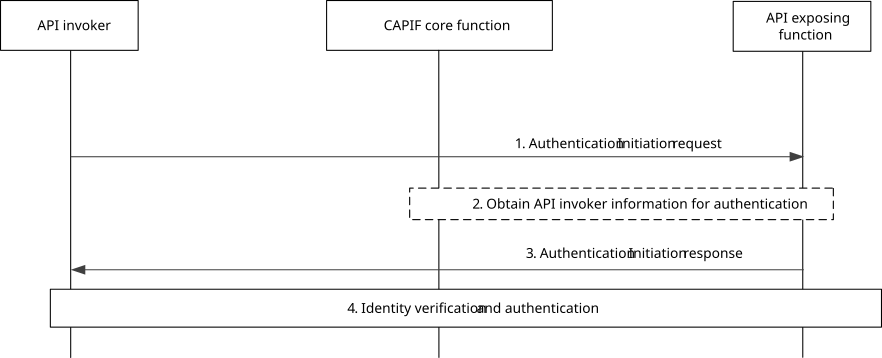

# 8.14 Authentication between the API invoker and the AEF prior to service API invocation

## 8.14.1 General

The procedure in this subclause corresponds to the architectural requirements for authentication of the API invoker by the AEF.

To reduce latency during API invocation, the API invoker associated authentication information can be made available at the AEF after authentication between the API invoker and the CAPIF core function.

## 8.14.2 Information flows

NOTE: The security aspects of this procedure are specified in subclause 6.4 and subclause 6.5.2 of 3GPP TS 33.122 \[12\].

## 8.14.3 Procedure

Figure 8.14.3-1 illustrates the procedure for authentication between the API invoker and the AEF.

Pre-conditions:

1\. Optionally, the CAPIF core function has shared the information required for authentication of the API invoker with the AEF.

Figure 8.14.3-1: Procedure for authentication between the API invoker and the AEF prior to service API invocation

1\. The API invoker triggers authentication initiation to the AEF, including the API invoker identity.

2\. The AEF obtains the API invoker information required for authentication by the AEF, if not available.

3\. The AEF returns the result of authentication initiation in the authentication initiation response.

4\. The AEF verifies the identity of the API invoker and authenticates the API invoker.

NOTE 1: The authentication process is specified in subclause 6.4 and subclause 6.5.2 of 3GPP TS 33.122 \[12\].

NOTE 2: The authentication is terminated at the AEF acting as the service communication entry point when topology hiding is enabled for the service API.
