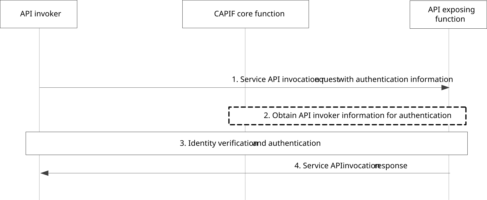

# 8.15 Authentication between the API invoker and the AEF upon the service API invocation

## 8.15.1 General

The procedure in this subclause corresponds to the architectural requirements for authentication of the API invoker by the AEF upon the service API invocation.

To reduce latency during API invocation, the API invoker associated authentication information can be made available at the AEF after authentication between the API invoker and the CAPIF core function.

## 8.15.2 Information flows

NOTE: The security aspects of this procedure are specified in subclause 6.4 and subclause 6.5.2 of 3GPP TS 33.122 \[12\].

### 8.15.2.1 Service API invocation request with authentication information

The information flow service API invocation request with authentication information from the API invoker to the AEF is service API specific and the complete detail of the service API invocation request is out of scope of the present document. Table 8.15.2.1-1 describes only the CAPIF related information elements which are included in the service API invocation request.

Table 8.15.2.1-1: Service API invocation request with authentication information

<table>
<colgroup>
<col style="width: 33%" />
<col style="width: 16%" />
<col style="width: 50%" />
</colgroup>
<tbody>
<tr class="odd">
<td>Information element</td>
<td>Status</td>
<td>Description</td>
</tr>
<tr class="even">
<td>API invoker identity information</td>
<td>M</td>
<td>The information that determines the identity of the API invoker</td>
</tr>
<tr class="odd">
<td>Authentication information</td>
<td>
M

(see NOTE)
</td>
<td>The authentication information obtained before initiating the service API invocation request</td>
</tr>
<tr class="even">
<td>Service API identification</td>
<td>M</td>
<td>The identification information of the service API for which invocation is requested. The service API identification is part of the specific service API invocation request.</td>
</tr>
<tr class="odd">
<td colspan="3">NOTE: The specific security information of this information element is specified in subclause 6.5.2 of 3GPP TS 33.122 [12].</td>
</tr>
</tbody>
</table>

### 8.15.2.2 Service API invocation response

The information flow service API invocation response from the AEF to the API invoker is service API specific and the complete detail of the service API invocation response is out of scope of the present document. Table 8.15.2.2-1 describes only the CAPIF related information elements which are included in the service API invocation response.

Table 8.15.2.2-1: Service API invocation response

|                     |        |                                                             |
|---------------------|--------|-------------------------------------------------------------|
| Information element | Status | Description                                                 |
| Result              | M      | Indicates the success or failure of service API invocation. |
| Cause               | O      | The cause for the request failure.                          |

## 8.15.3 Procedure

Figure 8.15.3-1 illustrates the procedure for authentication of the API invoker by the AEF, where the authentication information is carried in the API invocation request.

Pre-conditions:

1\. Optionally, the CAPIF core function has shared the information required for authentication of the API invoker with the AEF.

Figure 8.15.3-1: Procedure for authentication between the API invoker and the AEF upon the service API invocation

1\. The API invoker invokes a service API invocation request with authentication information to the AEF, and includes in this request authentication information, including the API invoker identity.

2\. The AEF obtains the API invoker information required for authentication by the AEF, if not available.

3\. The AEF verifies the identity of the API invoker and authenticates the API invoker.

NOTE 1: The authentication process is specified in subclause 6.5.2 of 3GPP TS 33.122 \[12\].

4\. If the verification was successful, the AEF returns the result of the service API invocation in the Service API invocation response.

NOTE 2: The authentication is terminated at the AEF acting as the service communication entry point when topology hiding is enabled for the service API.
