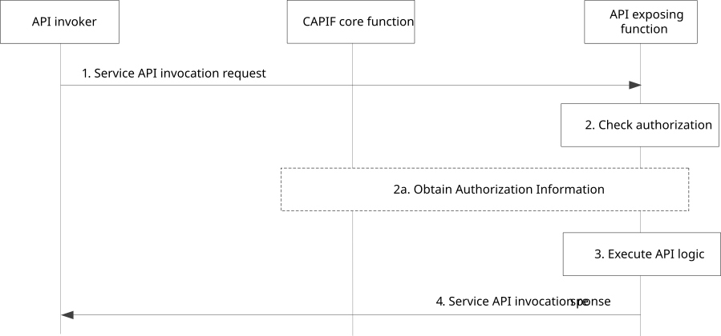

# 8.16 Service API invocation with AEF authorization

## 8.16.1 General

The procedure in this subclause corresponds to the architectural requirements to validate authorization of API invokers upon the service API invocation.

To reduce latency during API invocation, the API invoker associated authorization information can be made available at the AEF after authentication between the API invoker and the CAPIF core function.

NOTE: The security aspects of service API invocation are specified in TS 33.122 \[12\] clause 6.4 (CAPIF-2) and 6.5 (CAPIF-2e).

## 8.16.2 Information flows

### 8.16.2.1 Service API invocation request

The information flow service API invocation request from the API invoker to the AEF is service API specific and the complete detail of the service API invocation request is out of scope of the present document. Table 8.16.2.1-1 describes only the CAPIF related information elements which are included in the service API invocation request.

Table 8.16.2.1-1: Service API invocation request

<table>
<colgroup>
<col style="width: 33%" />
<col style="width: 16%" />
<col style="width: 50%" />
</colgroup>
<tbody>
<tr class="odd">
<td>Information element</td>
<td>Status</td>
<td>Description</td>
</tr>
<tr class="even">
<td>API invoker identity information</td>
<td>M</td>
<td>The information that determines the identity of the API invoker</td>
</tr>
<tr class="odd">
<td>Authorization information</td>
<td>
O

(see NOTE)
</td>
<td>The authorization information obtained before initiating the service API invocation request</td>
</tr>
<tr class="even">
<td>Network Slice Info</td>
<td>
O

(see NOTE)
</td>
<td>The desired network slice information of the service API</td>
</tr>
<tr class="odd">
<td>Service API identification</td>
<td>M</td>
<td>The identification information of the service API for which invocation is requested. The service API identification is part of the specific service API invocation request.</td>
</tr>
<tr class="even">
<td colspan="3">NOTE: The inclusion of this information element depends on the chosen solution for authorization.</td>
</tr>
</tbody>
</table>

### 8.16.2.2 Service API invocation response

The information flow service API invocation response from the AEF to the API invoker is service API specific and the complete detail of the service API invocation response is out of scope of the present document. Table 8.16.2.2-1 describes only the CAPIF related information elements which are included in the service API invocation response.

Table 8.16.2.2-1: Service API invocation response

|                                                        |        |                                                                                                                                                            |
|--------------------------------------------------------|--------|------------------------------------------------------------------------------------------------------------------------------------------------------------|
| Information element                                    | Status | Description                                                                                                                                                |
| Result                                                 | M      | Indicates the success or failure of service API invocation.                                                                                                |
| Authorization information with resource owner required | O      | This information element may be present when the result is failure. Indicates that the required authorization information with resource owner is required. |

### 8.16.2.3 Obtain API invoker information request

Table 8.16.2.3-1 describes the information flows to request security information of the API invoker using the Obtain API Invoker information request from the AEF to the CAPIF Core Function.

Table 8.16.2.3-1: Obtain API invoker information request

<table>
<colgroup>
<col style="width: 33%" />
<col style="width: 16%" />
<col style="width: 50%" />
</colgroup>
<tbody>
<tr class="odd">
<td>Information element</td>
<td>Status</td>
<td>Description</td>
</tr>
<tr class="even">
<td>API invoker identity information</td>
<td>M</td>
<td>The information that determines the identity of the API invoker</td>
</tr>
<tr class="odd">
<td>Authentication indication</td>
<td>
O

(see NOTE)
</td>
<td>Indicates whether the consumer requests API Invoker authentication information.</td>
</tr>
<tr class="even">
<td>Authorization indication</td>
<td>
O

(see NOTE)
</td>
<td>Indicates whether the consumer requests API Invoker authorization information.</td>
</tr>
<tr class="odd">
<td colspan="3">NOTE: Either the authentication indication or the authorization indication shall be included.</td>
</tr>
</tbody>
</table>

### 8.16.2.4 Obtain API invoker information response

Table 8.16.2.3-1 describes only the information flows returned from the CAPIF Core Function to the AEF with the security method(s) information for the API Invoker.

Table 8.16.2.4-1: Obtain API Invoker information response

|                      |        |                                                                                                                                                            |
|----------------------|--------|------------------------------------------------------------------------------------------------------------------------------------------------------------|
| Information element  | Status | Description                                                                                                                                                |
| Result               | M      | Indicates the success or failure of service API invocation.                                                                                                |
| Security Information | O      | This information element shall be present when the result is success. It includes the security information as specified in 3GPP TS 33.122 \[12\].          |
| Failure Cause        | O      | This information element may be present when the result is failure. Indicates that the required authorization information with resource owner is required. |

## 8.16.3 Procedure

Figure 8.16.3-1 illustrates the procedure for API invoker authorization to access service APIs.

Pre-conditions:

1\. The API invoker has been authenticated.

2\. The API invoker associated authorization information is available at AEF.

Figure 8.16.3-1: Procedure for API invoker authorization to access service APIs

1\. The API invoker triggers service API invocation request to the AEF, including the service API to be invoked.

NOTE 1: Authentication can also be performed if not authenticated previously.

NOTE 2: The API invoker can trigger several service API invocations asynchronously.

2\. Upon receiving the service API invocation request, the AEF checks whether the API invoker is authorized to invoke that service API, based on the authorization information.

2a. If the AEF does not have information required to authorize service API invocation, the AEF obtains the authorization information from the CAPIF core function as described in clauses 8.16.2.3 and 8.16.2.4.

3\. The AEF executes the service logic for the invoked service API.

4\. The API invoker receives the service API invocation response as a result of the service API invocation. If in step 2, the AEF determines that the required resource owner authorization information is not available for the requested service API, then the AEF responds to API Invoker with failure status message indicating that the authorization information with resource owner is not available, as specified in Table 8.16.2.2-1.
