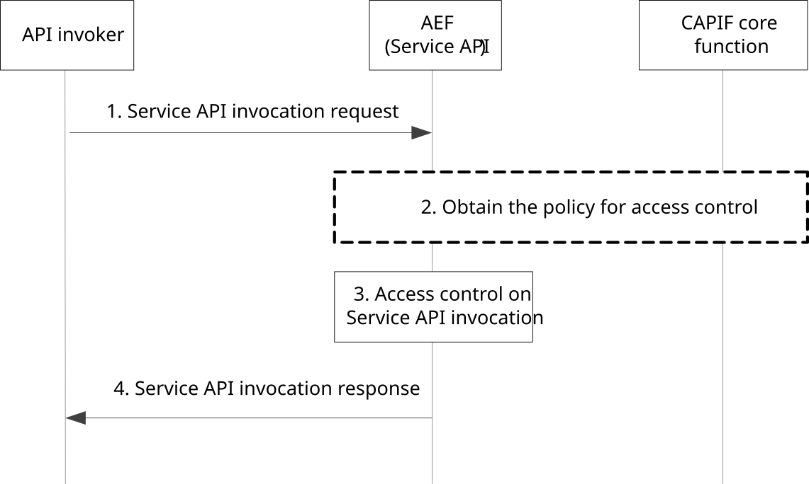

# 8.17 CAPIF access control

## 8.17.1 General

The CAPIF controls the access of service API by the API invoker based on policy or usage limits.

## 8.17.2 Information flows

### 8.17.2.1 Service API invocation request

The information flow service API invocation request from the API invoker to the AEF is service API specific and the complete detail of the service API invocation request is out of scope of the present document. Table 8.17.2.1-1 describes only the CAPIF related information elements which are included in the service API invocation request.

Table 8.17.2.1-1: Service API invocation request

<table>
<colgroup>
<col style="width: 33%" />
<col style="width: 16%" />
<col style="width: 50%" />
</colgroup>
<tbody>
<tr class="odd">
<td>Information element</td>
<td>Status</td>
<td>Description</td>
</tr>
<tr class="even">
<td>API invoker identity information</td>
<td>M</td>
<td>The information that determines the identity of the API invoker</td>
</tr>
<tr class="odd">
<td>Authorization information</td>
<td>
O

(see NOTE)
</td>
<td>The authorization information obtained before initiating the service API invocation request</td>
</tr>
<tr class="even">
<td>Service API identification</td>
<td>M</td>
<td>The identification information of the service API for which invocation is requested. The service API identification is part of the specific service API invocation request.</td>
</tr>
<tr class="odd">
<td colspan="3">NOTE: The inclusion of this information element depends on the chosen solution for authorization.</td>
</tr>
</tbody>
</table>

### 8.17.2.2 Service API invocation response

The information flow service API invocation response from the AEF to the API invoker is service API specific and the complete detail of the service API invocation response is out of scope of the present document. Table 8.17.2.2-1 describes only the CAPIF related information elements which are included in the service API invocation response.

Table 8.17.2.2-1: Service API invocation response

|                     |        |                                                             |
|---------------------|--------|-------------------------------------------------------------|
| Information element | Status | Description                                                 |
| Result              | M      | Indicates the success or failure of service API invocation. |
| Cause               | O      | The cause for the request failure.                          |

## 8.17.3 Procedure

Figure 8.17.3-1 illustrates the procedure for service API access control.

Pre-conditions:

1\. The API invoker has performed the service API discovery and received the details of the service API which includes the information about the service communication entry point of the AEF in the CAPIF.

2\. The API invoker is authenticated and authorized to use the service API.

3\. The AEF in the CAPIF is configured with at least one access policy to be applied to the service API invocation corresponding to the API invoker and service API.

Figure 8.17.3-1: Procedure for service API access control

1\. The API invoker performs service API invocation according to the interface of the service API by sending a service API invocation request towards the AEF which exposes the service API towards the API invoker. The AEF acts as an access control entity.

2\. If the access control policy is not configured with AEF, then the AEF may obtain the access control policy configuration from the CAPIF core function as described in clause 8.12.3.

3\. Upon receiving the service API invocation request from the API invoker, the AEF checks for configuration for access control. As per the configuration for access control, the AEF performs access control on the service API invocation request as per the operator policy.

4\. The API invoker receives a service API invocation response for service API invocation from the AEF providing the service API.
