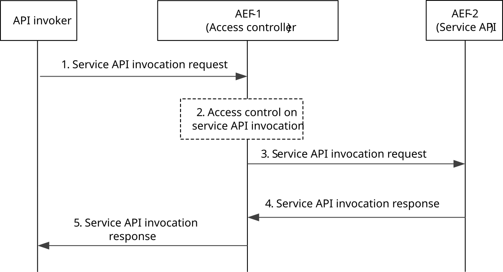

# 8.18 CAPIF access control with cascaded AEFs

## 8.18.1 General

The procedure in this subclause corresponds to the architectural requirements related to some common access control requirements for service API invocations. It provides access control, based on two cascaded API Exposing Function (AEF) instances. While one AEF instance provides the entry point for the service API and acts as access controller, further AEF instances deliver the functionality of the actual service APIs.

## 8.18.2 Information flows

### 8.18.2.1 Service API invocation request

The information flow service API invocation request from the API invoker to the AEF and between AEFs is service API specific and the complete detail of the service API invocation request is out of scope of the present document. Table 8.17.2.1-1 describes the CAPIF related information elements which are included in the service API invocation request.

### 8.18.2.2 Service API invocation response

The information flow service API invocation response from the AEF to the API invoker and between AEFs is service API specific and the complete detail of the service API invocation response is out of scope of the present document. Table 8.17.2.2-1 describes the CAPIF related information elements which are included in the service API invocation response.

## 8.18.3 Procedure

Figure 8.18.3-1 illustrates the procedure for CAPIF access control.

Pre-conditions:

1\. The API invoker has performed the service discovery and received the details of the service API which includes the information about the service communication entry point of the AEF-1 in the CAPIF.

2\. The API invoker is authenticated and authorized to use the service API.

3\. The AEF-1 in the CAPIF is configured with at least one access policy to be applied to the service API invocation corresponding to the API invoker and service API.

Figure 8.18.3-1: Procedure for CAPIF access control with cascaded AEFs

1\. The API invoker performs service API invocation according to the interface of the service API by sending a service API invocation request towards the AEF-1 which exposes the service API towards the API invoker, and acts as access control entity.

2\. Upon receiving the service API invocation request from the API invoker, the AEF-1 checks for configuration for access control as described in clause 8.12.3. As per the configuration for access control, the AEF-1 performs access control on the service API invocation as per the operator policy.

3\. The AEF-1 forwards the incoming service API invocation request to the service API provided by AEF-2.

4\. The AEF-1 receives a service API invocation response for service API invocation from AEF-2.

5\. The AEF-1 resolves the destination API invoker address and modifies the source address information of AEF-2 within the service API invocation response and forwards the service API invocation response to the API invoker.
