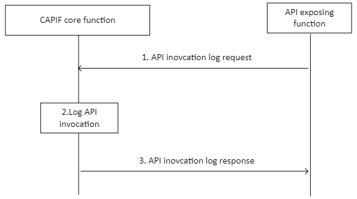

# 8.19 Logging service API invocations

## 8.19.1 General

The procedure in this subclause corresponds to the architectural requirements for logging service API invocations at AEF. The AEF can be within PLMN trust domain or within 3rd party trust domain.

## 8.19.2 Information flows

### 8.19.2.1 API invocation log request

Table 8.19.2.1-1 describes the information flow API invocation log request from the API exposing function to the CAPIF core function.

Table 8.19.2.1-1: API invocation log request

|                                   |        |                                                                                                                                                                                                                                                                                                                                                          |
|-----------------------------------|--------|----------------------------------------------------------------------------------------------------------------------------------------------------------------------------------------------------------------------------------------------------------------------------------------------------------------------------------------------------------|
| Information element               | Status | Description                                                                                                                                                                                                                                                                                                                                              |
| API exposing identity information | M      | Identity information of the AEF logging service API(s) invocations                                                                                                                                                                                                                                                                                       |
| API invocation log information    | M      | API invocation log information such as API invoker's ID, IP address, service API name, version, invoked operation, input parameters, invocation result, time stamp information, Network Slice Info, invocation latency (the time interval between the reception of the API invocation request and the sending of the API invocation response at the AEF) |

### 8.19.2.2 API invocation log response

Table 8.19.2.2-1 describes the information flow API invocation log response from the CAPIF core function to the API exposing function.

Table 8.19.2.2-1: API invocation log response

|                     |        |                                                                   |
|---------------------|--------|-------------------------------------------------------------------|
| Information element | Status | Description                                                       |
| Result              | M      | Indicates the success or failure of API(s) invocation log request |
| Cause               | O      | The cause for the request failure.                                |

## 8.19.3 Procedure

Figure 8.19.3-1 illustrates the procedure for logging service API invocations at AEF.

Pre-conditions:

1\. The API invoker(s) has invoked certain service API(s).

2\. Authorization details of the AEF are available with the CAPIF core function.

Figure 8.19.3-1: Procedure for logging service API invocations

1\. Upon invocation of service API(s) from one more API invokers, the AEF triggers API invocation log request towards the CAPIF core function.

NOTE 1: The AEF can collect the log information associated to several API invocations before triggering API invocation log request asynchronously.

2\. The CAPIF core function makes a log entry and stores the information e.g. for monitoring purposes, for access by authorized users and entities.

NOTE 2: API invocation log is stored for a configured duration.

3\. AEF receives the API invocation log response from the CAPIF core function.
