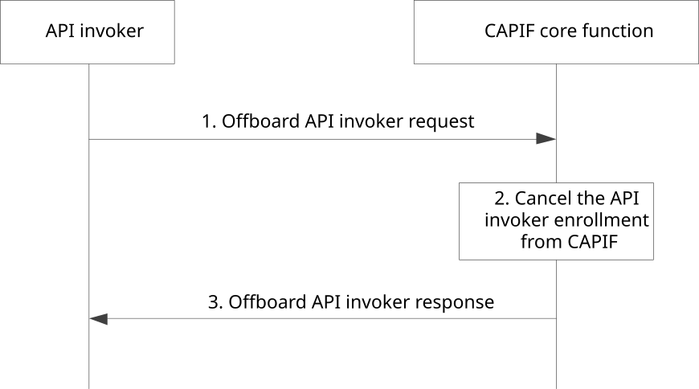

# 8.2 Offboarding the API invoker from the CAPIF

## 8.2.1 General

This subclause defines the procedure for offboarding the API invoker from the CAPIF. The offboarding process makes the API invoker no longer a recognized user of the CAPIF. The procedure is triggered by the API invoker over CAPIF-1 or CAPIF-1e.

## 8.2.2 Information flows

This subclause describes the information flows for the API invoker offboarding.

### 8.2.2.1 Offboard API invoker request

Table 8.2.2.1-1 describes the information flow offboard API invoker request from the API invoker to the CAPIF core function.

Table 8.2.2.1-1: Offboard API invoker request

|                                  |        |                                                                |
|----------------------------------|--------|----------------------------------------------------------------|
| Information element              | Status | Description                                                    |
| API invoker identity information | M      | Identity information of the API invoker requesting offboarding |
| Reason                           | O      | Indicate the reason of offboarding                             |

### 8.2.2.2 Offboard API invoker response

Table 8.2.2.2-1 describes the information flow offboard API invoker response from the CAPIF core function to the API invoker.

Table 8.2.2.2-1: Offboard API invoker response

|                     |        |                                                               |
|---------------------|--------|---------------------------------------------------------------|
| Information element | Status | Description                                                   |
| Result              | M      | Indicates the success or failure of the offboarding operation |

## 8.2.3 Procedure

Figure 8.2.3-1 illustrates the procedure for offboarding the API invoker from the CAPIF, triggered by the API invoker. The security aspects of this procedure are specified in subclause 6.8 of 3GPP TS 33.122 \[12\].

Pre-conditions:

1\. The API invoker has been onboarded as a recognized user of the CAPIF.

Figure 8.2.3-1: Procedure for offboarding the API invoker from the CAPIF

1\. The API invoker triggers offboard API invoker request to the CAPIF core function, providing the information as required for the API management.

2\. The CAPIF core function cancels the enrollment of the API invoker from CAPIF. The API invoker ceases to be a recognized user of the CAPIF. All the authorizations corresponding to the API invoker are revoked from CAPIF. Optionally, the information of the API invoker may be retained at the CAPIF core function as per the operator policy.

NOTE: Completion of offboarding process can require explicit notification to the CAPIF administrator or the API management, which is left out-of-scope of this solution. CAPIF can handle the de-provisioning process internally without the need of explicit grant by the CAPIF administrator.

3\. The CAPIF core function returns the offboard API invoker response providing successful offboarding indication.
