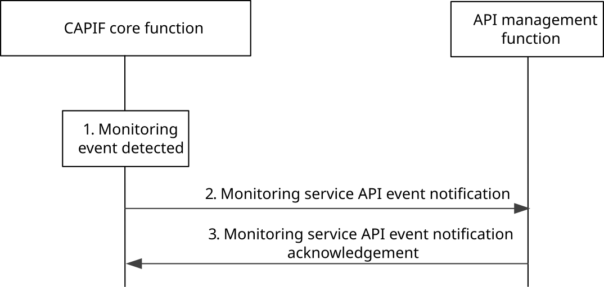

# 8.21 Monitoring service API invocation

## 8.21.1 General

The procedure in this subclause corresponds to the architectural requirements for monitoring service API invocation.

## 8.21.2 Information flows

### 8.21.2.1 Monitoring service API event notification

The information flow for the monitoring service API event notification from the CAPIF core function to the API management function is same as the event notification from the CAPIF core function to the subscribing entity. Table 8.8.2.3-1 describes the information elements which are included in the monitoring service API event notification.

### 8.21.2.2 Monitoring service API event notification acknowledgement

The information flow for the monitoring service API event notification acknowledgement from the API management function to the CAPIF core function is same as the event notification acknowledgement from subscribing entity to the CAPIF core function. Table 8.8.2.4-1 describes the information elements which are included in the monitoring service API event notification acknowledgement.

## 8.21.3 Procedure

Figure 8.21.3-1 illustrates the procedure for monitoring service API invocation.

Pre-conditions:

1\. The API management function has subscribed to monitoring event including filters such as invoker's ID and IP address, service API name and version, input parameters, and invocation result.

Figure 8.21.3-1: Procedure for monitoring service API invocation

1\. The CAPIF core function monitors the service API invocations applying the monitoring filters specified before.

2\. Detection of a monitoring event by the CAPIF core function triggers notification to the API management function with the details of the monitored event.

NOTE: API provider action subsequent to monitoring service API notification is out-of-scope of this specification.

3\. The API management function sends a monitoring service API event notification acknowledgement to the CAPIF core function for the notification received.
