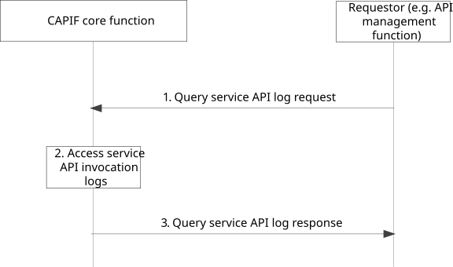

# 8.22 Auditing service API invocation

## 8.22.1 General

The procedure in this subclause corresponds to the architectural requirements for auditing service API invocation. This procedure can be used for auditing of other CAPIF interactions i.e. service API invocation events, API invoker onboarding events and API invoker interactions with the CAPIF (e.g. authentication, authorization, discover service APIs) as well. The API management function can be within PLMN trust domain or within 3rd party trust domain.

## 8.22.2 Information flows

### 8.22.2.1 Query service API log request

Table 8.22.2.1-1 describes the information flow query service API log request from the API management function to the CAPIF core function.

Table 8.22.2.1-1: Query service API log request

|                        |     |        |     |                                                                                                                                                       |     |
|------------------------|-----|--------|-----|-------------------------------------------------------------------------------------------------------------------------------------------------------|-----|
| Information element    |     | Status |     | Description                                                                                                                                           |     |
| Identity information   |     | M      |     | Identity information of the entity querying service API log request                                                                                   |     |
| Query information      |     | M      |     | List of query filters such as invoker's ID and IP address, service API name and version, input parameters, and invocation result                      |     |
| Preference Information |     | O      |     | List of preferred API provider domain’s service API invocation logs information.                                                                      |     |
| \>preference value     |     | M      |     | Preference value: “Allowed”, “Not Allowed”.                                                                                                           |     |
| \>target identities    |     | O      |     | Identities (e.g., API provider name, identities of the API provider functions, as specified in clause 8.28) for which the “preference value” applies. |     |

### 8.22.2.2 Query service API log response

Table 8.22.2.2-1 describes the information flow query service API log response from the CAPIF core function to the API management function.

Table 8.22.2.2-1: Query service API log response

<table>
<colgroup>
<col style="width: 33%" />
<col style="width: 16%" />
<col style="width: 50%" />
</colgroup>
<tbody>
<tr class="odd">
<td>Information element</td>
<td>Status</td>
<td>Description</td>
</tr>
<tr class="even">
<td>Result</td>
<td>M</td>
<td>Indicates the success or failure of query service API log request</td>
</tr>
<tr class="odd">
<td>API invocation log information</td>
<td>
O

(see NOTE)
</td>
<td>API invocation log information such as API invoker's ID, IP address, service API name, version, invoked operation, input parameters, invocation result, time stamp information, Network Slice Info</td>
</tr>
<tr class="even">
<td>Usage Information</td>
<td>O</td>
<td>Information related to the usage of API invocation log information.</td>
</tr>
<tr class="odd">
<td>&gt;usage value</td>
<td>M</td>
<td>Usage issued: “Allowed”, “Not Allowed”.</td>
</tr>
<tr class="even">
<td>&gt;target identities</td>
<td>O</td>
<td>List of identities of the entities (e.g., other API provider name, identities of the other API provider functions, as specified in clause 8.28) for which the “usage value” applies.</td>
</tr>
<tr class="odd">
<td colspan="3">NOTE: Information element shall be present when result indicates success.</td>
</tr>
</tbody>
</table>

## 8.22.3 Procedure

Figure 8.22.3-1 illustrates the procedure for auditing service API invocation.

Pre-conditions:

1\. Service API invocation logs are available at the CAPIF core function.

2\. Authorization details of the AMF are available with the CAPIF core function.

Figure 8.22.3-1: Procedure for auditing service API invocation

1\. For auditing service API invocations, the requestor (e.g. API management function, ADAES) triggers query service API log request to the CAPIF core function.

2\. Upon receiving the query service API log request, the CAPIF core function checks whether requestor is authorized or not, and if authorized, the CCF accesses the necessary service API log information for auditing purposes. Based on the usage information of the service APIs and the preference information available at CCF, the CCF filters the service API log information.

If the requester is ADAES, based on authorization the CCF can send logs related to multiple API providers.

3\. The CAPIF core function returns the log information to the requestor (e.g. API management function, ADAES) in the query service API log response.

NOTE: The API management function detecting abuse of the service API invocation and actions, subsequent to query service API log response, are out-of-scope of this specification.
